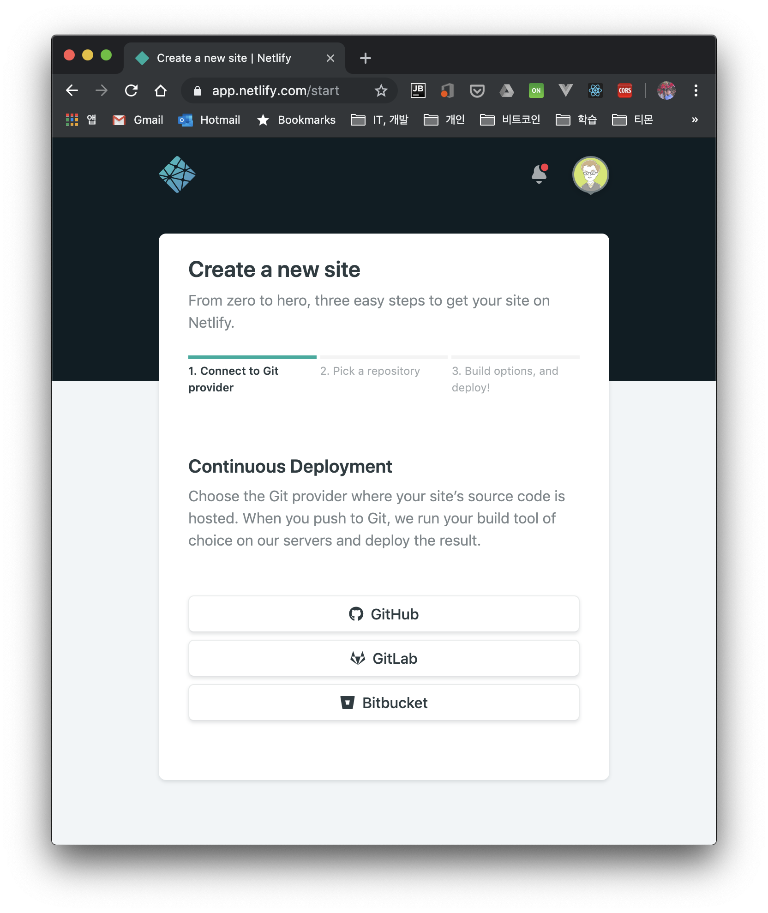
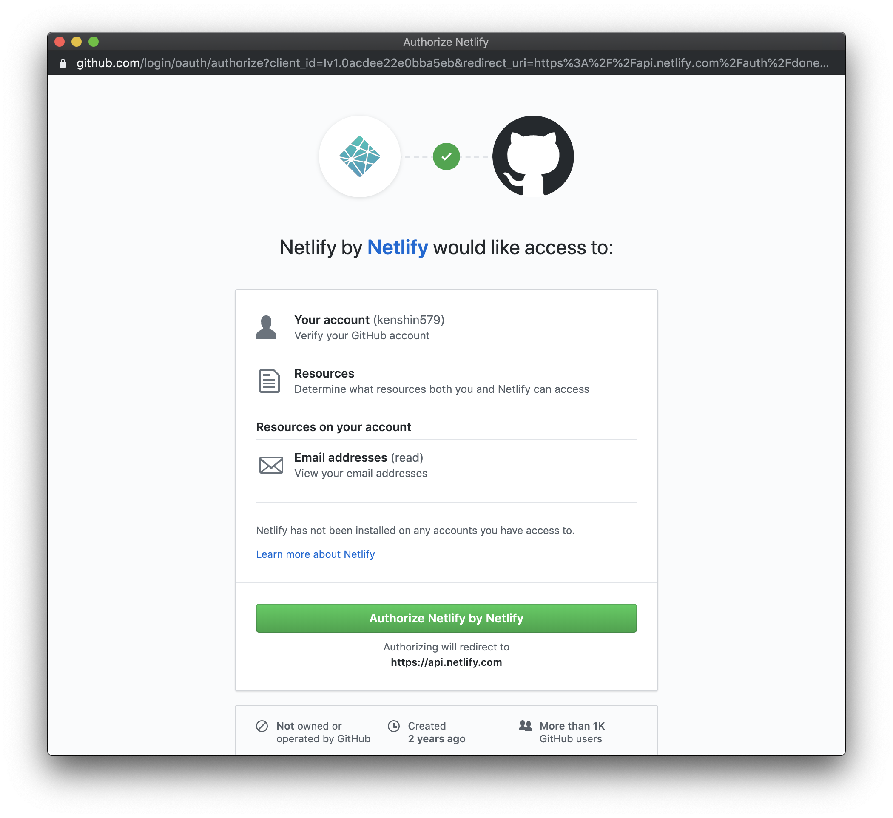
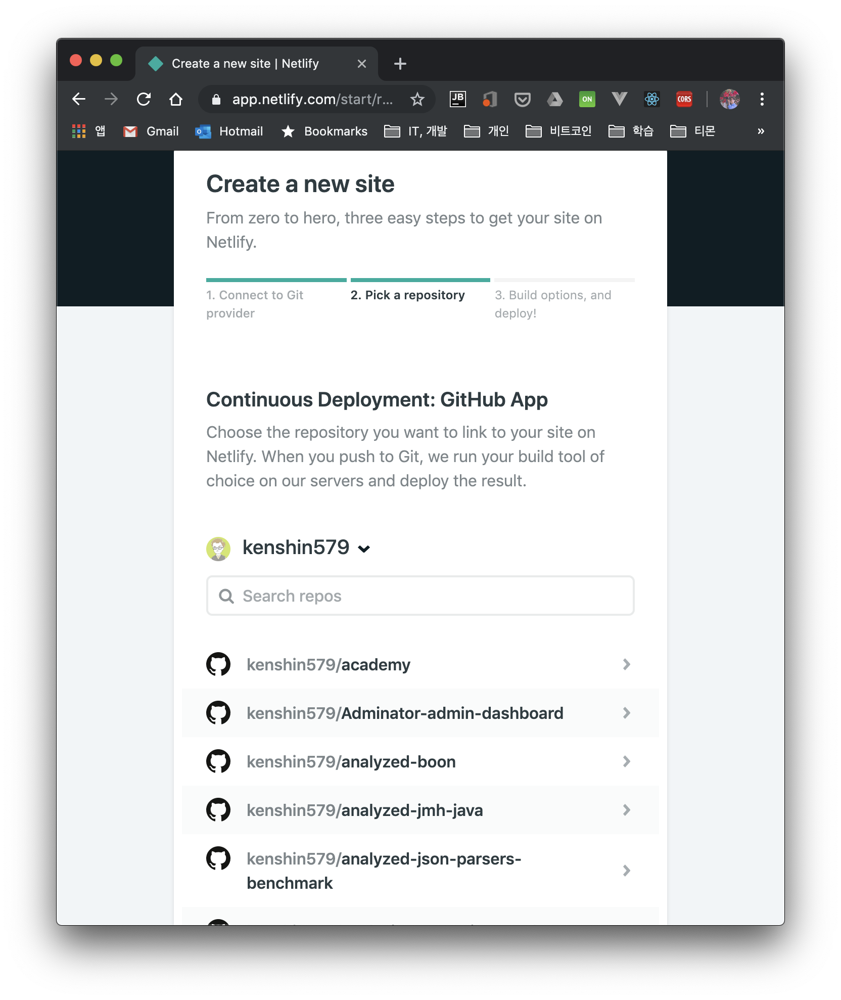

* 들어가며
  * 마이그레이션한 동기
  * 요구사항
    * Git 저장소
    * 정적 사이트 생성기
  * Gatsy 설치
* 개발 환경
* 블로그 마이그레이션
* 참고

**코멘트**

- [ ] 기본 tistory 블로그를 어떻게 migration 할 것인가/?

- [ ] github에 가장 쉽게 편하게 관리할 수 있는 프레임워크?가 좋을까?

- [ ] github 페이지에 도메인 이름 연결하기

- [ ] jekyll 대신 사용할 수 있는 건?
* hugo
* hexo
* gatsby <— 이걸로 선택함

[9. 도전기 IT 블로그 재시작](evernote:///view/838797/s7/332fde73-909f-438b-9046-195bcb86cab6/332fde73-909f-438b-9046-195bcb86cab6/)
[Jekyll Blog](evernote:///view/838797/s7/c93ead75-ce73-475a-add5-2e5f8244bd2e/c93ead75-ce73-475a-add5-2e5f8244bd2e/)

[https://docs.netlify.com/domains-https/custom-domains/](https://docs.netlify.com/domains-https/custom-domains/)
[https://serverless-stack.com/chapters/ko/custom-domain-in-netlify.html](https://serverless-stack.com/chapters/ko/custom-domain-in-netlify.html)
[https://gist.github.com/hhsnopek/356791d3b70a853cb5ef54ff8c3bc18e](https://gist.github.com/hhsnopek/356791d3b70a853cb5ef54ff8c3bc18e)
[https://heropy.blog/2018/01/10/netlify/](https://heropy.blog/2018/01/10/netlify/)
[https://levelup.gitconnected.com/how-to-host-domain-to-netlify-site-for-free-step-by-step-guide-45d0c2102db3](https://levelup.gitconnected.com/how-to-host-domain-to-netlify-site-for-free-step-by-step-guide-45d0c2102db3)
[https://velog.io/@godori/netlify-branch-sub-domain](https://velog.io/@godori/netlify-branch-sub-domain)

# 1. 들어가며

티스토리에서 Gatsby 블로그로 갈아타게 되었습니다.  

1.1 이전한 이유

1.2 새로운 곳에서 요구사항

블로그를 대학때부터 티스토리를 사용했었습니다. Evernote에 작성하고 Evernote 플러그인을 사용해서 블로깅을 잘 했었는데요. 

티스토리 Editor가 변경되고 나서 Evernote에서 작성한 블로그를 가져오면 style이 그대로 유지되지 않는 경우가 자주 발생하고 직접 tag을 수정을 해도 제대로 반영이 안되는 경우가 많이 있습니다.

Evernote에서 블로그를 작성하고 다시 티스토리에서 수정하는 작업이 너무 시간 낭비라서 Github로 블로그를 옮기기로 결정을 했습니다. 본격적으로? 블로그를 하기 위해서 새로운 도메인으로 시작했습니다. 많이 놀러와주세요. 감사합니다. 

[개발 블로그](http://advenoh.tistory.com)는 에버노트를 사용해서 작성을 했었습니다. 티스토리에 에버노트 플러그인이 있어서 에버노트에서 작성한 노트를 쉽게 티스토리 블로그로 import해서 포스팅을 할 수 있었습니다. 하지만, 티스토리에서 새로 Editor를 

예전처럼 매끄럽게 import가 안되는 문제가 있어서 매번 import하고 나서 HTML 태그를 많이 수정을 했어야 했고 수정해도 잘 반영이 안되는 이슈들이 많이 발생하여 

- Github page를 이용하기
- 개인 도메인 적용하기
- Evernote에서 작성한 블로그 마크다운 포멧으로 변환하기
- TOC
- Comments ()
- 구글 GA
- 구글 광고
- Tags
- RSS

# 2. 개발 환경

* OS : Mac OS
* IDE: WebStorm
* Source code : [github](https://github.com/kenshin579/advenoh.pe.kr)
* 

# 3. 사용법

-github pages에 upload
>#
"scripts": {
"deploy": "gatsby build && gh-pages -d public -b master -r https://github.com/funnystyle/funnystyle.github.io"
},

# 4. 마무리

ㄴㅇㄹ

# 5. 참고

* 블로그 마이그레이션
	* [https://blog.benelog.net/migration-to-static-site.html](https://blog.benelog.net/migration-to-static-site.html)
	* [https://suitee.me/getting-started-gatsby/](https://suitee.me/getting-started-gatsby/)
	* [https://velog.io/@iamchanii/build-a-blog-with-gatsby-and-typescript-part-4](https://velog.io/@iamchanii/build-a-blog-with-gatsby-and-typescript-part-4)
* Github Page
	* [https://github.com/Integerous/Integerous.github.io](https://github.com/Integerous/Integerous.github.io)
* Dev IT Blog 모음
	* [https://github.com/sarojaba/awesome-devblog](https://github.com/sarojaba/awesome-devblog)
* Hexo vs. Hugo vs Jekyll
	* [http://open-but-closed.com/hexo-as-a-platform-for-blogging/](http://open-but-closed.com/hexo-as-a-platform-for-blogging/)
	* [https://stackshare.io/stackups/hexo-vs-hugo-vs-jekyll](https://stackshare.io/stackups/hexo-vs-hugo-vs-jekyll)
* Gatsby
	* [https://jbee.io/etc/intro-new-blog/](https://jbee.io/etc/intro-new-blog/)
	* [https://rinae.dev/posts/creating-new-blog-with-gatsby](https://rinae.dev/posts/creating-new-blog-with-gatsby)
	* [https://dennytek.com/blog/personal-site-with-gatsby-part-3](https://dennytek.com/blog/personal-site-with-gatsby-part-3)
	* [https://scotch.io/tutorials/zero-to-deploy-a-practical-guide-to-static-sites-with-gatsbyjs](https://scotch.io/tutorials/zero-to-deploy-a-practical-guide-to-static-sites-with-gatsbyjs)
	* [https://justinformentin.com/guide-to-building-a-gatsby-site](https://justinformentin.com/guide-to-building-a-gatsby-site)
* Gatsby와 Github 연동
	* [https://www.gatsbyjs.org/docs/how-gatsby-works-with-github-pages/](https://www.gatsbyjs.org/docs/how-gatsby-works-with-github-pages/)
	* [https://dev.to/flexdinesh/deploy-gatsby-sites-to-github-pages-eed](https://dev.to/flexdinesh/deploy-gatsby-sites-to-github-pages-eed)
	* [http://jarednielsen.com/deploy-gatsbyjs-github-pages-user/](http://jarednielsen.com/deploy-gatsbyjs-github-pages-user/)
* Gatsby Theme
	* [https://gatsby-starter-hero-blog.greglobinski.com](https://gatsby-starter-hero-blog.greglobinski.com/)
	* [https://www.gatsbyjs.org/starters/JaeYeopHan/gatsby-starter-bee/](https://www.gatsbyjs.org/starters/JaeYeopHan/gatsby-starter-bee/)
	* [https://www.gatsbyjs.org/starters/willjw3/gatsby-starter-developer-diary/](https://www.gatsbyjs.org/starters/willjw3/gatsby-starter-developer-diary/)
	* [http://demo.nagui.me/](http://demo.nagui.me/)
	* [https://delivan.dev](https://delivan.dev/)
* Netlify
	* [https://velog.io/@godori/netlify-branch-sub-domain](https://velog.io/@godori/netlify-branch-sub-domain)
	* [https://css-tricks.com/using-your-domain-with-a-netlify-hosted-site/](https://css-tricks.com/using-your-domain-with-a-netlify-hosted-site/)
	* [https://velog.io/@funnystyle/gatsby-로-blog-만들기-간략-정리](https://velog.io/@funnystyle/gatsby-%EB%A1%9C-blog-%EB%A7%8C%EB%93%A4%EA%B8%B0-%EA%B0%84%EB%9E%B5-%EC%A0%95%EB%A6%AC)
* DNS
	* [https://thomaskim.io/2017/06/13/using-custom-domain-to-github/](https://thomaskim.io/2017/06/13/using-custom-domain-to-github/)
* Evernote migration
	* [http://www.markwk.com/migrate-evernote-plaintext.html](http://www.markwk.com/migrate-evernote-plaintext.html)

