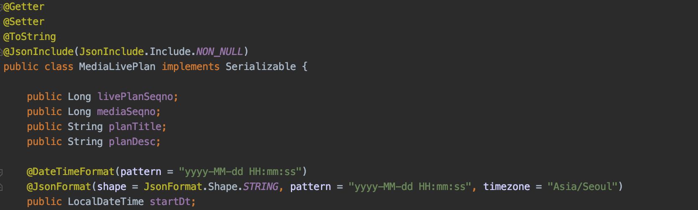
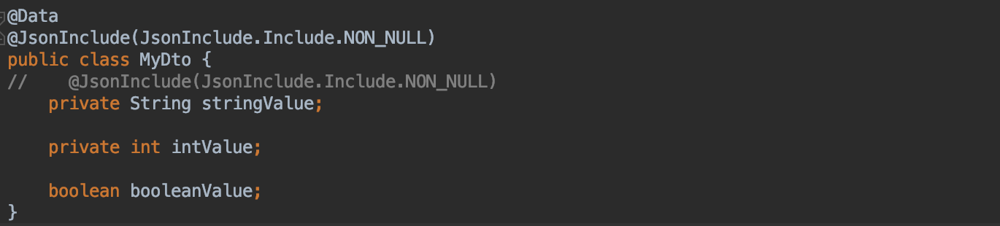

개인적으로 모르는 부분 적어두고 알게 되는 부분에 대해서 간단하게 정리해둔 자료입니다.
미 답변중에 알고 계신 부분 있으면 코멘트 달아주세요. 감사합니다.

[Q&A 전체 목록](https://blog.advenoh.pe.kr/java/20190320_Q&A_%EA%B0%9C%EB%B0%9C%EA%B4%80%EB%A0%A8_%EC%A7%88%EB%AC%B8_%EB%AA%A8%EC%9D%8C/)

### [미 답변 질문]

#### - @DateTimeFormat vs @JsonFormat의 차이점은?
* DateTimeFormat : DateTimeFormat
* JsonFormat : jackson

#### - @JsonTypInfo, @JsonSubTypes?

참고
* [https://www.slipp.net/questions/442](https://www.slipp.net/questions/442)
* [https://seongtak-yoon.tistory.com/70](https://seongtak-yoon.tistory.com/70)

#### - @JsonManagedReference
#### - @JsonBackReference

#### - @JsonIdentityInfo, @JsonIdentityReference란?

- @OneToMany, @ManyToOne로 연결된 엔터티에서 데이터를 조회하면 Infinite recursion JsonMappingException이 발생함
- 해결방법
    * Jackson 1/6+
	    * @JsonManagedReference, @JsonBackReference를 이용함
    * Jackson 2.0+
	    * @JsonIdentityInfo를 사용함

- - - -

### [답변완료]

### 1. @JsonInclude(Include.NON_NULL)?

이 어노테이션은 클래스 필드에서 null이 되는 필드는 JSON으로 serialize할 때 제외하도록 하는 어노테이션입니다. 위 코드에서는 stringValue 변수는 JSON으로 저장되지 않습니다.

용어
* 자바 객체를 JSON 으로 변환하는 작업을 serialize 라고 표현하고 JSON -> 객체는 deserialize이라고 한다

참고
* [http://multifrontgarden.tistory.com/172](http://multifrontgarden.tistory.com/172)

### 2. @JsonIgnore?

직렬화시 해당 필드를 포함시키지 않고 싶을 때 변수위에 선언하는 어노테이션입니다. 이 예제에서는 JPA를 통해 domain 객체를 얻어올 때 암호가 있으면 안되기 때문에 @JsonIgnore 어노테이션을 적용하였습니다.

참고

* [http://eglowc.tistory.com/28](http://eglowc.tistory.com/28)

### 3. @JsonIgnoreProperties(ignoreUnknown = true)?

객체에는 속성이 없지만, JSON에 포함되면 Exception이 발생하는데 무시하도록 하는 어노테이션이빈다.

참고
* [https://www.javacodegeeks.com/2018/01/ignore-unknown-properties-parsing-json-java-jackson-jsonignoreproperties-annotation-example.html](https://www.javacodegeeks.com/2018/01/ignore-unknown-properties-parsing-json-java-jackson-jsonignoreproperties-annotation-example.html)

### 4. @JsonIgnoreProperties에서 allowGetters를 true로 세팅하면 어떻게 되나?

@JsonIgnoreProperties로 무시하려는 프로퍼티를 지정할 때 allowGetters를 true로 해주면, JSON serialization (Object -> JSON)으로는 지정한 필드는 적용이 되지만, deserialization (JSON -> Object)에서는 제외된다는 의미입니다.

참고
* [https://www.concretepage.com/jackson-api/jackson-jsonignore-jsonignoreproperties-and-jsonignoretype#allowGetters](https://www.concretepage.com/jackson-api/jackson-jsonignore-jsonignoreproperties-and-jsonignoretype#allowGetters)
