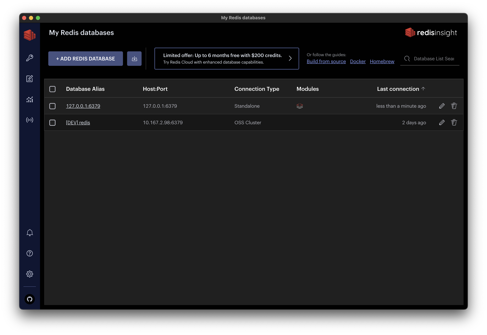

RedisDB는 개발시 caching 용도로도 자주 사용되고 현재 in memory 나와 있는 DB중에 거의 de facto로 선택되는 DB이다. CLI도 제공하지만, 더 원활한 사용을 위해 여러 곳에서 GUI(ex. [Medis](https://getmedis.com/))를 제공하고 있다. 최근에 알게 된 RedisInsight GUI에 대해서 소개하려고 한다.

# RedisInsight

Redis 단체에서 2021년 11월부터 첫 Preview 버전을 릴리스를 시작하였고 현재는 2.18 버전이 최신 버전이다. 개인적으로 지금까지 사용했던 Redis GUI 보다는 확실히 더 괜찮다는 생각이 많이 든 도구이다. 



## Feature

- 여러 운용체제(Mac, Linux, Windows)를 지원
- Redis에 저장된 데이터를 쉽게 browse, filter, visualize, CRUD를 제공
- Workbench - 고급 기능을 제공하는 CLI
- Redis Module에서 지원하는 다양한 데이터 모델(ex. JSON, Time Series)도 RedisInsight에서 쉽게 다를 수 있다
- Redis Streams, Pub/Sub를 위한 Visualization 제공
- Log 분석 (slow command)및 명령어 프로파일링


## 1.설치

맥 사용자인 경우에는 간단하게 `brew` 명령어로 설치하면 된다. 

```bash
$ brew install --cask redisinsight
```


## 2.RedisInsight 살펴보기


- Browser 메뉴
  - 현재 저장된 
  - 추가, 수정, 삭제, 필터, 편집도 가능하다
- CLI
  - 기본 CLI
  - Workbench 
    - 문서화도 잘되어 있다
    - 데이터를 더 쉽게 visualiztion을 제공한다
- Redis Module (graph)
  - 
- Pub/Sub
- 


# 참고

- https://retool.com/blog/top-redis-guis/
- https://redis.com/redis-enterprise/redis-insight/
