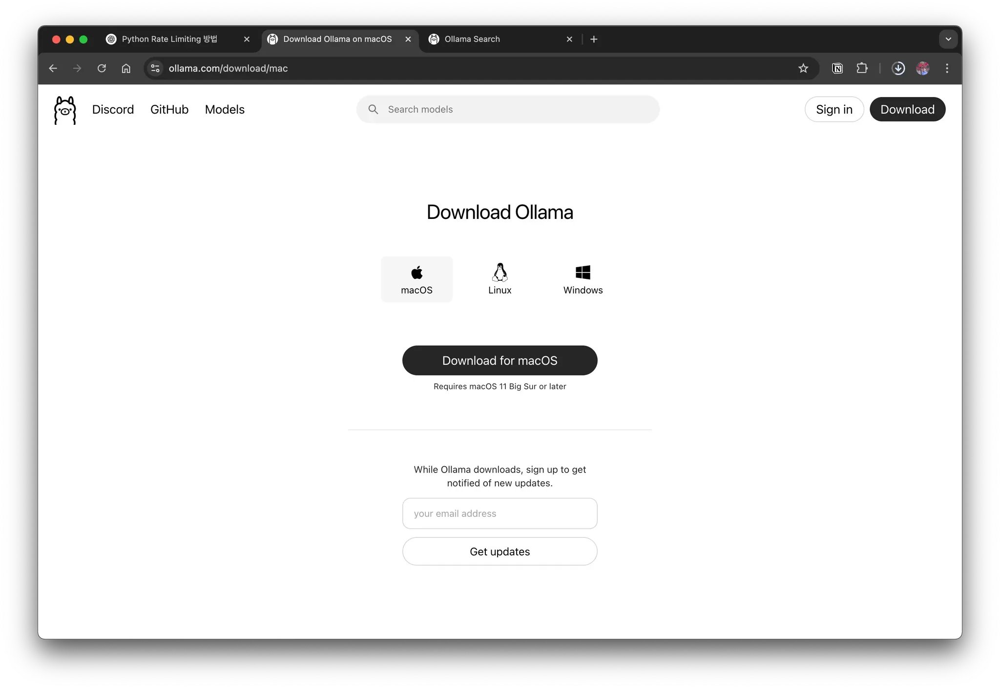
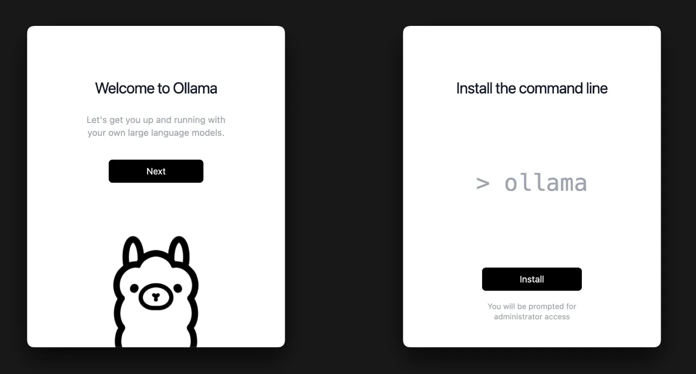
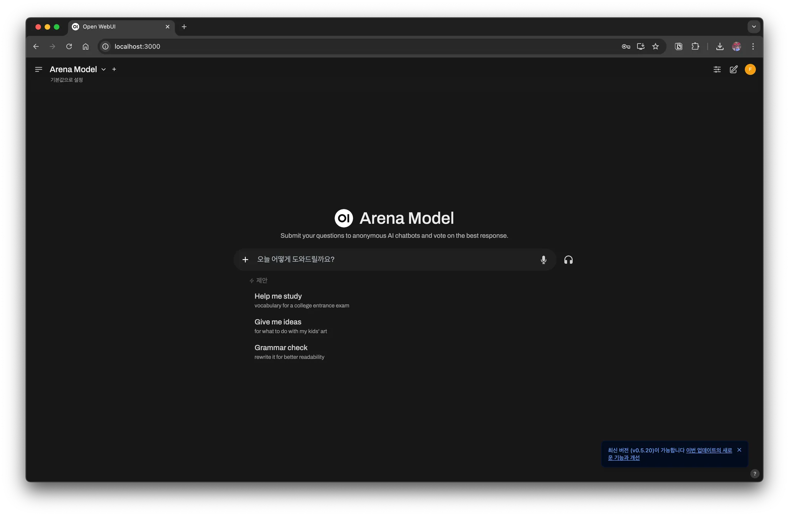
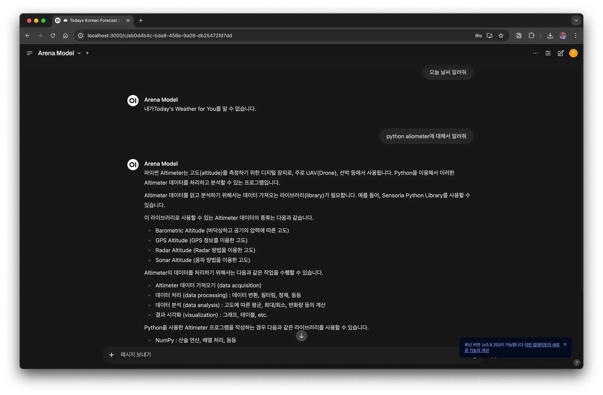

## 1. 개요

최근 AI 관련 서비스를 많이 사용하면서 비용 부담이 커지는 경우가 많다. 이에 따라 로컬 환경에서 직접 `LLM`을 구축하여 활용하는 방법을 소개하고자 한다. 이번 글에서는 macOS에서 `LLM`을 설치하고 활용하는 방법을 다룬다.

## 2. `LLM` 설치

### 2.1 `Ollama` 설치 및 확인

우선 `Ollama`를 설치한다. `Ollama`는 로컬에서 손쉽게 `LLM`을 실행할 수 있도록 도와주는 도구이다.

#### **설치 방법**

웹 사이트에 가서 원하는 OS에 맞게 다운로드해서 설치를 진행하면 된다.





터미널에서 명령어로 설치하고 싶은 경우에는 `brew`로 설치하면 된다.

```bash
> brew install --cask ollama
```

설치가 완료되면 올바르게 설치되었는지 확인한다.

```bash
> ollama -v
ollama version is 0.6.2
Warning: client version is 0.4.7
```

#### Ollama 구동해보기

설치가 완료되면 이제 모델을 다운로드하여 실행할 수 있다.

```bash
> ollama run llama3.2
pulling manifest
pulling dde5aa3fc5ff... 100% ▕█████████████████████████████████████████▏ 2.0 GB
pulling 966de95ca8a6... 100% ▕█████████████████████████████████████████▏ 1.4 KB
pulling fcc5a6bec9da... 100% ▕█████████████████████████████████████████▏ 7.7 KB
pulling a70ff7e570d9... 100% ▕█████████████████████████████████████████▏ 6.0 KB
pulling 56bb8bd477a5... 100% ▕█████████████████████████████████████████▏   96 B
pulling 34bb5ab01051... 100% ▕█████████████████████████████████████████▏  561 B
verifying sha256 digest
writing manifest
success
>>> Send a message (/? for help)
```

`>>>` `LLM` prompt에서 원하는 내용을 입력하면 답변을 주는 것을 볼 수 있다.

```bash
>>> hi
How can I help you today?
```

## 3. `LLM` 사용해보기

### 3.1 Open WebUI

CLI 환경에서만 사용하면 불편할 수 있으므로 Open WebUI를 활용할 수도 있다. Open WebUI는 `Ollama`를 쉽게 사용할 수 있는 웹 기반 UI이다.

#### **설치 방법**

여러 방법이 있지만, 간단하게 도커로 실행해본다.

```bash
# 도커에서 사용할 volume 폴더를 생성한다
> docker run -d -p 3000:8080 --add-host=host.docker.internal:host-gateway -v open-webui:/app/backend/data --name open-webui --restart always ghcr.io/open-webui/open-webui:main
```

이제 웹 브라우저에서 [http://localhost:3000](http://localhost:3000)에 접속하면 `Ollama`를 웹 UI에서 사용할 수 있다.



ChatGPT 웹 인터페이스와 비슷하고 잘 동작하는 걸 볼 수 있다.



### 3.2 API로 호출

Ollama는 API를 제공하므로, curl을 사용하여 직접 호출할 수도 있다.

```bash
> curl -X POST "http://localhost:11434/api/generate" \
     -H "Content-Type: application/json" \
     -d '{"model": "llama3.2", "prompt": "Hello, what is AI?"}'
```

### 3.3 Python으로 호출해보기

Python 에서는 langchain library를 제공하고 있어서 이걸 이요해서 `LLM`을 사용할 수 있다.

```python
from unittest import TestCase

from langchain.llms import Ollama
from langchain.chains import LLMChain
from langchain.prompts import PromptTemplate
from langchain.callbacks.manager import CallbackManager
from langchain.callbacks.streaming_stdout import StreamingStdOutCallbackHandler

class Test(TestCase):
    def test_ollam_example(self):
        # Ollama 모델 초기화 (기본 모델은 llama3.2, 다른 모델도 지정 가능)
        llm = Ollama(
            model="llama3.2",  # 사용할 모델 지정 (예: llama3.2, mistral, gemma 등)
            callback_manager=CallbackManager([StreamingStdOutCallbackHandler()]),
        )

        # 간단한 프롬프트로 모델 호출
        response = llm("파이썬이란 무엇인가요?")
        print(f"\\n완성된 응답: {response}")
```


## 4. Ollama 명령어 모음

`ollama` 명령어는 다양한 명령어를 제공하고 자주 사용하는 명령어은 다음과 같다.

- 모델 리스트 확인

  ```bash
  > ollama list
  NAME               ID              SIZE      MODIFIED
  llama3.2:latest    a80c4f17acd5    2.0 GB    6 hours ago
  mistral:latest     f974a74358d6    4.1 GB    3 months ago
  ```

- 새 모델 추가

  - 다운로드 가능한 모델은 [library](https://ollama.com/library) 사이트에서 확인할 수 있다.

  ```bash
  > ollama pull gemma
  ```

- 모델 삭제

  ```bash
  > ollama rm mistral
  ```

- 로컬에서 직접 모델 실행

  ```bash
  > ollama run mistral
  ```

## 5. 마무리

이제 macOS 환경에서 `LLM`을 구축하고 활용하는 방법을 배웠다. `Ollama`와 Open WebUI를 활용하면 로컬에서 효율적으로 AI 모델을 운영할 수 있으므로 직접 활용해보는 것을 추천한다.

## 6. 참고

- [LLM을 local에서 돌려보자](https://devocean.sk.com/blog/techBoardDetail.do?ID=165686&boardType=techBlog)
- [Ollama 를 활용해서 개인형 LLM 서버 구성하기](https://devocean.sk.com/blog/techBoardDetail.do?ID=165685&boardType=techBlog)
- [오픈소스 LLM 활용](https://wikidocs.net/232980)
- https://github.com/open-webui/open-webui
- https://github.com/ollama/ollama
