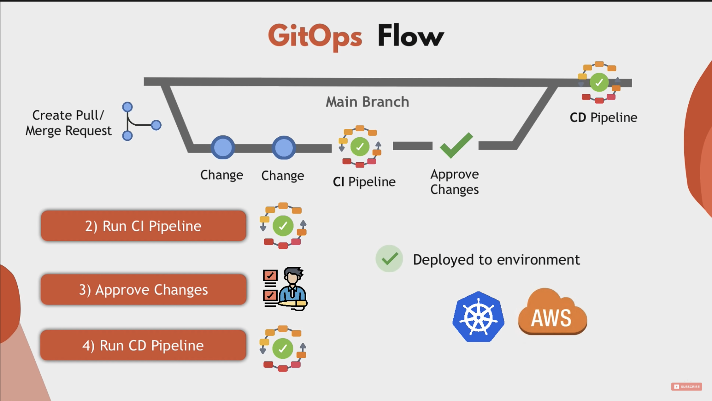

Argo Projects 그전 발표내용은 [여기](https://blog.advenoh.pe.kr/argo-projects/)를 참고해주세요.

## Argo CD?

### What?

Argo CD는 GitOps 기반의 CD 도구이고 다음과 같은 여러 기능을 제공하고 있다


### Feature

- 타겟 환경(Git 저장소에 지정된 대로)에 application 자동 배포 지원
- 쿠버네티스 manifest 파일을 생성해주는 여러 템플릿 포맷을 지원
    - `Kustomize, Helm charts, plain-YAML, Ksonnet, Jsonnet`
- Pull deployment 방식를 지원
    - Argo CD는 k8s manifest의 변경을 pull하는 방식
- 여러 클러스터를 관리하고 배포하는 기능
- SSO 통합 인증 지원 (OIDC, OAuth2, LDAP, SAML 2.0, GitHub, GitLab, Microsoft, LinkedIn)
- Application 자원의 Health 상태 지원
- Web UI, CLI 지원
- 웹훅 통합 지원 (GitHub, BitBucket, GitLab)
- 복잡한 응용 프로그램 Rollout을 지원하기 위한 Presync, Sync, Postsync hook도 지원

### Architecture


Argo CD는 **3가지 컨포넌트**로 이루어져 있다. Argo CD가 하는 역할은 다음과 같다.

- 실행 중인 애플리케이션을 **지속적으로 모니터링**
- **현재 라이브 상태를 원하는 대상 상태(Git 저장소에 지정된 대로)와 비교**를 주기적으로 한다
    - 라이브 상태가 대상 상태와 다른 배포된 애플리케이션은 **OutOfSync**로 간주한다
- Argo CD는 이런 차이점을 보고 **UI 시각화**
- 라이브 상태를 원하는 대상 상태로 자동 또는 수동으로 다시 동기화 하는 기능을 제공


- **API Server**
    - API 서버는 Web UI, CLI 및 외부에서 사용할 수 있도록 gRPC와 REST API를 제공한다
- Repository Server
    - Application manifest 파일을 가지고 있는 Git 저장소의 로컬 캐시를 유지 관리한다
    - Git 저장소에 저장된 manifest 파일을 생성하는 역할을 한다
- **Application Controller**
    - 애플리케이션 컨트롤러는 실행중인 응용 프로그램을 지속적으로 모니터링
    - live state와 target state를 비교해서 UI 상으로 알려준다 (OutOfSync)

참고

- https://argo-cd.readthedocs.io/en/stable/operator-manual/architecture/
- https://landscape.cncf.io/card-mode?project=incubating&selected=argo

## When?

- CD (Continuous Delivery) 도구로써 쿠너베티스 환경에 application을 자동 배포하는데 적합한 도구이다

## Why?

기존 Jenkins와 Argo CD를 비교해보면서 쿠버네티스 환경에서는 어떤 도구가 더 적합한지 각자 판단해보세요.

- Jenkins
    - `kubectl`를 jenkins 서버에 직접 설치해야 한다
    - k8s cluster 접근하려면 credentials도 설정 필요하다
    - 한번 배포되면 배포된 상태 값에 대해서 알 수 없다 (모니터링 기능 없음)
    - Push deployment

- Argo CD
    - 대상 상태(Git 저장소)와 현재 라이브 상태를 주기적으로 모니터링하고 있어 배포가 필요한 application을 쉽게 알 수 있다
    - 배포이후에 잘 배포가 되었는 지도 확인이 가능하다
    - Pull deployment

## How?

Argo CD를 설치하고 사용하려면 아래와 같은 절차로 진행하면 된다. 본 예제는 Argo CD [공식 문서](https://argo-cd.readthedocs.io/en/stable/)를 참고하여 작성하였다.

- k8s 클러스터에 Argo CD를 설치
- Argo CD Application 생성
    - Argo CLI
    - ArgoCD Web UI
    - kubernetes CRD

- Docker 이미지를 버전업 시켜 Argo로 동기화 해보기

### 1.로컬환경에서 Argo CD 설치하기

로컬환경에서 `argo`를 설치하기 위해 `minikube`을 실행한다. 명령어가 없는 경우에는 `brew install minikube`로 설치하세요.

```bash
$ minikube start
```

`argocd namespace`를 생성한 이후 Argo CD 프로그램을 설치한다.

```bash
$ kubectl create namespace argocd
$ kubectl apply -n argocd -f https://raw.githubusercontent.com/argoproj/argo-cd/stable/manifests/install.yaml
```

#### 1.1 Argo CD Web 접속하기

쿠버네티스 서비스를 노출하지 않고 port forwarding하여 Web 서버에 접속해보자.

```bash
$ kubectl port-forward svc/argocd-server -n argocd 8080:443
```


admin 계정의 초기 암호는 자동으로 생성되어 `argocd-initial-admin-secret` 시크린에서 base64 값으로 저장되어 있다. `kubectl` 명령어 사용하여 간단하게 암호를 확인한다.

```bash
kubectl -n argocd get secret argocd-initial-admin-secret -o jsonpath="{.data.password}" | base64 -d; echo
HDzPVO0HOyGIDJD7
```


### 2.Argo CD Application을 생성하기

#### 2.1 Argo CLI으로 생성하기

Argo CLI로 application을 생성하려면 Argo CD CLI 설치가 필요하다.

##### 2.1.1 Argo CD CLI 설치하기

CLI로 Argo를 생성하거나 조회 삭제도 할 수 있다.

```bash
$ brew install argocd
```

먼저 `argocd login`으로 로그인을 한다. Web UI에서 로그인시 입력한 같은 id/password을 사용한다.

```bash
$ argocd login :8080
WARNING: server certificate had error: tls: either ServerName or InsecureSkipVerify must be specified in the tls.Config. Proceed insecurely (y/n)? y
Username: admin
Password:
'admin:login' logged in successfully
Context ':8080' updated

$ argocd app create guestbook --port-forward-namespace argocd --repo https://github.com/kenshin579/analyzing-argocd-example-apps --path guestbook --dest-server https://kubernetes.default.svc --dest-namespace argotest
```

> Argo 테스트하기 위해 Git 저장소에 파일을 수정하고 push하기 위해서 Argo 문서에서 제공하는 argocd-example-apps repository를 fork 하였습니다.
>
> https://github.com/kenshin579/analyzing-argocd-example-apps
>

- repo
    - Argo CD에서 관리할 repository를 지정한다
- path
    - Repository에서 path로 application directory를 지정한다
- dest-server
    - 대상이 되는 쿠버네티이스 클러스터 URL를 지정한다
- dest-namespace
    - application을 생성할 대상 네이스페이스를 지정한다


##### 2.1.1 Argo Application 확인

```bash
$ argocd app get guestbook

Name:               guestbook
Project:            default
Server:             https://kubernetes.default.svc
Namespace:          argotest
URL:                https://:8080/applications/guestbook
Repo:               https://github.com/kenshin579/analyzing-argocd-example-apps
Target:
Path:               guestbook
SyncWindow:         Sync Allowed
Sync Policy:        <none>
Sync Status:        OutOfSync from  (79a0b1e)
Health Status:      Missing

GROUP  KIND        NAMESPACE  NAME          STATUS     HEALTH   HOOK  MESSAGE
       Service     argotest   guestbook-ui  OutOfSync  Missing
apps   Deployment  argotest   guestbook-ui  OutOfSync  Missing
```

##### 2.1.2 Sync Application

OutOfSync인 경우 명령어로도 동기화를 할 수 있다

```bash
$ argocd app sync guestbook
```

`argotest namespace`가 없어서 동기화 실패가 떨어졌다. 간단하게 해결하는 방법은 `argotest namespace`를 생성하고 다시 동기화 시키면 된다.

```bash
TIMESTAMP                  GROUP        KIND   NAMESPACE                  NAME    STATUS    HEALTH        HOOK  MESSAGE
...(생략)...
2022-03-06T15:28:22+09:00   apps  Deployment    argotest          guestbook-ui  OutOfSync  Missing              namespaces "argotest" not found

...(생략)...
Phase:              Failed
Message:            one or more objects failed to apply, reason: namespaces "argotest" not found

GROUP  KIND        NAMESPACE  NAME          STATUS     HEALTH   HOOK  MESSAGE
       Service     argotest   guestbook-ui  OutOfSync  Missing        namespaces "argotest" not found
apps   Deployment  argotest   guestbook-ui  OutOfSync  Missing        namespaces "argotest" not found
FATA[0000] Operation has completed with phase: Failed
```

Application 배포시 원하는 namespace를 자동으로 생성해주는 옵션도 존재를 한다. App Details 에서 Auto-Create Namespace 옵션을 클릭해서 저장후 Sync하면 argotest namespace에 k8s object 들이 생성된 것을 확인할 수 있다.


#### 2.2 Web UI에서 생성하기

Applications > New App 버튼 클릭해서 생성할 수 있다.

#### 2.3 kubenetes manifest 파일로 생성하기

```bash
$ cat applcation.yaml

apiVersion: argoproj.io/v1alpha1
kind: Application
metadata:
  name: myapp-argo-application
  namespace: argocd
spec:
  project: default
  source:
    repoURL: 'https://github.com/kenshin579/analyzing-argocd-example-apps'
    path: guestbook
  destination:
    server: 'https://kubernetes.default.svc'
    namespace: argotest
  syncPolicy:
    syncOptions:
      - CreateNamespace=true

$ kubectl -n argotest application.yaml
```


### 3.Docker 이미지를 버전 업시켜 Argo로 동기화 해보기

Application 개발이후 새로운 도커 이미지를 생성했다면, Argo CD로 배포를 해보자.

#### 3.1 Kubernetes config 설정 파일 수정

Git 저장소에서 쿠버네티스 설정 파일를 수정한다. 도커 이미지의 버전을 올려서 푸쉬를 하고 Argo CD에서 확인해보자.

```bash
$ vim guestbook/guestbook-ui-deployment.yaml

apiVersion: apps/v1
kind: Deployment
metadata:
  name: guestbook-ui
spec:
  replicas: 2
  revisionHistoryLimit: 3
  selector:
    matchLabels:
      app: guestbook-ui
  template:
    metadata:
      labels:
        app: guestbook-ui
    spec:
      containers:
      - image: gcr.io/heptio-images/ks-guestbook-demo:0.2
        name: guestbook-ui
        ports:
        - containerPort: 80

```


#### 3.2 Argo CD Web UI에서 동기화하기

Argo CD는 Git 저장소를 실시간으로 모니터링하지 않고 주기적으로 확인하기 때문에 UI 상에서는 바로  OutOfSync를 표시해주지 않는다. 바로 확인해고 싶은 경우 Refresh 버튼을 클릭하면 된다. Sync 버튼을 클릭하면 동기화 시킬 수 있다.


## FAQ

1. **GitOps 기반의 다른 CD 도구는 뭐가 있나?**

FluxCD, JenkinsX

참고

- https://harness.io/blog/argo-cd-alternatives/
- https://blog.container-solutions.com/fluxcd-argocd-jenkins-x-gitops-tools

2. **Application 저장소에 Config 설정을 같이 관리하면 안되나?**

App과 config는 용도와 생명 주기가 다르기 때문에 Git 저장소를 분리하여 저장하는 걸 Best Practices로 추천하고 있다

참고

- https://kangwoo.kr/tag/argocd/
- https://argo-cd.readthedocs.io/en/stable/user-guide/best_practices/

### Reference

- https://argo-cd.readthedocs.io/en/stable/
- https://ithub.tistory.com/345
- https://blog.wonizz.tk/2020/06/08/kubernetes-deploy-tool-argocd/


### Terms

- CI (Continous Integration)
- 개발자를 위한 자동화 프로세스인 지속적인 통합을 의미한다
    - 지속적인 통합은 모든 개발을 완료한 뒤에 품질 관리를 적용하는 고전적인 방법을 대체하는 방법으로서 소프트웨어의 질적 향상과 소프트웨어를 배포하는데 걸리는 시간을 줄이는데 초점이 맞추어져 있다.
    - ex. Jenkins, Github Action
- CD (Continous Deployment)
    - 개발자의 변경 사항을 리포지토리에서 고객이 사용 가능한 프로덕션 환경까지 자동으로 릴리스하는 것을 의미한다
    - ex. Jenkins, Argo CD

- CR (Custom Resource)
    - 쿠버네티스에서 기본으로 제공하는 Object (ex. Service, Secret) 종류외에 사용자가 원하는 리소스를 정의해 사용할 수 있다
    - 사용자가 정의한 CRD 기반으로 동작하는 custom controller 개발도 쉽게 할 수 있도록 쿠버네티스에서 인터페이스를 제공한다

- CRD (Custom Resource Definition)
    - CRD는 CR의 데이터에 어떠한 항목이 정의되어 있는지 등을 선언한 Metadata Object이다
    - 기존 쿠버네티스 manifest 파일처럼 YAML로 파일을 작성한다

- GitOps
    - GitOps라는 개념은 Weaveworks가 처음 만든 용어이다
    - Git을 통해 개발자에게 익숙한 방식으로 인프라 또는 어플리케이션의 선언적인 설정파일을 관리하고 배포하는 일련의 프로세스이다




#### 참고

- CR/CRD
    - https://blog.naver.com/PostView.naver?blogId=alice_k106&logNo=221579974362&redirect=Dlog&widgetTypeCall=true&directAccess=false
- CI/CD
    - https://kangwoo.kr/tag/argocd/
    - https://www.redhat.com/ko/topics/devops/what-is-ci-cd
- GitOps
    - https://www.samsungsds.com/kr/insights/gitops.html
    - https://coffeewhale.com/kubernetes/gitops/argocd/2020/02/10/gitops-argocd/
    - https://www.youtube.com/watch?v=MeU5_k9ssrs&t=2s
    - https://gruuuuu.github.io/cloud/argocd-gitops/
    - https://kangwoo.kr/tag/argocd/

### Note

> 본 내용은 저희 Platform Engineering 팀내 CNCF 스터디를 위해 준비한 자료입니다. 저희가 하는 로봇 플랫폼 개발에 관심이 있는 분들은 아래 링크를 참고해주시고 도전적이고 열정적으로 같이 일하실 분은 많이 지원해주세요.
>
> - 네이버는 왜 제2사옥 1784를 지었을 까요?  https://www.youtube.com/watch?v=WG7JHLfClEo
> - 네이버 랩스 - https://www.naverlabs.com/
