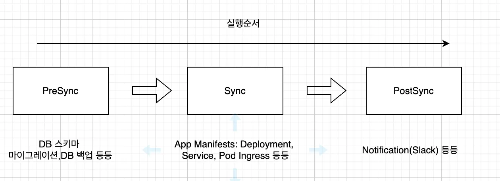
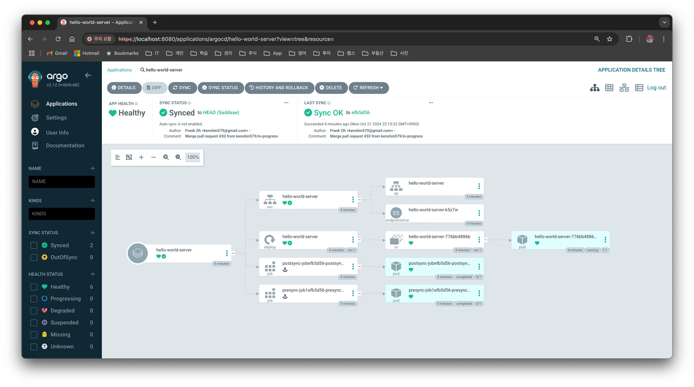
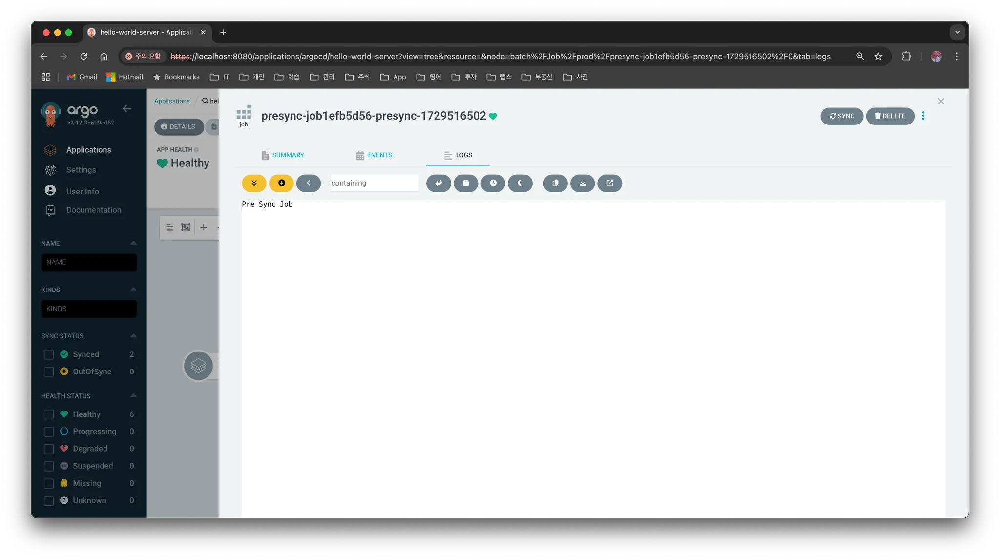
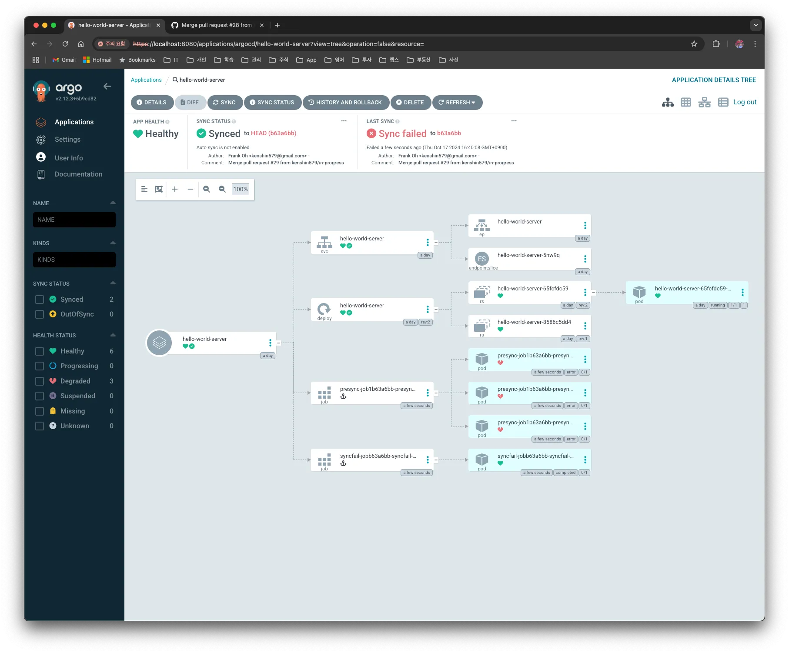
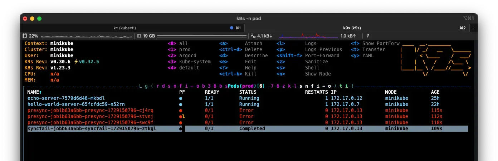
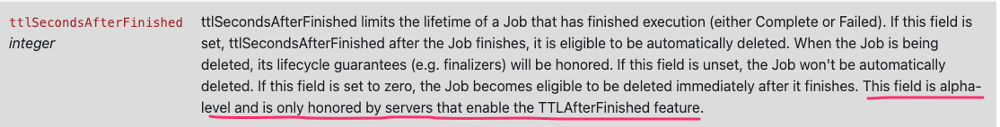
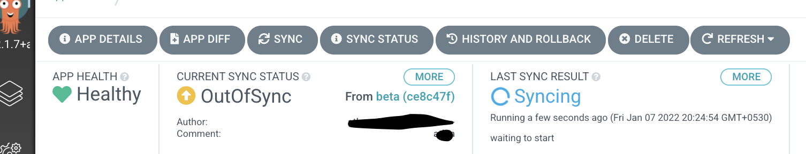
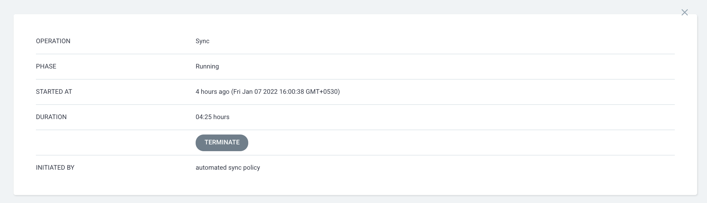

## 1. 개요

> [ArgoCD](https://blog.advenoh.pe.kr/argo-cd/) 란? 여기는 참고해주세요.

이번 포스팅에서는 ArgoCD Resource Hooks에 대해서 알아보자.

Argo CD에서는 Sync 는 Git 리포지토리의 선언된 상태와 Kubernetes 클러스터의 실제 상태를 동기화하는 과정이다. 여기서 Resource Hook은 이러한 배포 프로세스 중 특정 시점에 추가적인 작업(`PreSync`, Sync, `PostSync` 등)을 실행하는 기능을 ArgoCD에서 제공을 해준다. 이를 통해 배포 전에 준비 작업 (ex. DB 스키마 마이그레이션)을 하거나 배포 후 검증 작업 (ex. notification)을 수행할 수 있다.



ArgoCD에서 제공하는 Resource Hook은 다음과 같다.

| Hook         | 설명                                                         |
| ------------ | ------------------------------------------------------------ |
| `PreSync`    | 매니페스트 적용 전에 실행된다                                |
| `Sync`       | 모든 `PreSync` 훅이 완료되고 성공한 후, 매니페스트 적용과 동시에 실행된다 |
| `Skip`       | Argo CD에서 해당 매니페스트의 적용을 건너뛰도록 지정한다     |
| `PostSync`   | 모든 `Sync` 훅이 완료되고 성공한 후, 성공적인 매니페스트 적용과 모든 리소스가 Healthy 상태인 경우에 실행된다 |
| `SyncFail`   | 동기화 작업이 실패했을 때 실행된다                           |
| `PostDelete` | 모든 애플리케이션 리소스가 삭제된 후 실행된다 (v2.10 버전부터 사용 가능) |

## 2. Resource Hook 설정하는 방법

### 2.1 Resource Hooks 설정하기

어플리케이션에 Resource Hook 을 어떻게 적용할 수 있는지 알아보자.

Resource Hook을 설정하는 방법은 간단한 어노테이션을 추가하면 된다. 다음은 `PreSync`에서 echo 명령어로 화면에 메시지를 출력하는 예제이다.

```yaml
---
apiVersion: batch/v1
kind: Job
metadata:
  generateName: presync-job
  annotations:
    argocd.argoproj.io/hook: PreSync
    argocd.argoproj.io/hook-delete-policy: HookSucceeded
spec:
  template:
    spec:
      containers:
        - name: presync-job
          image: ubuntu
          command:
            - /bin/bash
            - -c
            - |
              echo "Pre Sync Job"
      restartPolicy: Never
  backoffLimit: 2
```

위 `yaml` 파일은 배포하려는 Application `charts/template` 폴더에 Job Resource로 작성하면 된다.

```bash
❯ tree .
.
├── Chart.yaml
├── templates
│   ├── deployment.yaml
│   ├── pre-post-sync.yaml
│   └── service.yaml
└── values.yaml
```

`PostSync` 설정하는 방법도 유사하게 `yaml`을 작성하면 된다.

```yaml
apiVersion: batch/v1
kind: Job
metadata:
  generateName: postsync-job
  annotations:
    argocd.argoproj.io/hook: PostSync
    argocd.argoproj.io/hook-delete-policy: HookSucceeded
spec:
  template:
    spec:
      containers:
        - name: postsync-job
          image: ubuntu
          command:
            - /bin/bash
            - -c
            - |
              echo "Post Sync Job"
      restartPolicy: Never
  backoffLimit: 2
```

아래 예제는 동기화가 실패 되었을 때 실행되는 `SyncFail` Hook이다.

```yaml
apiVersion: batch/v1
kind: Job
metadata:
  generateName: syncfail-job
  annotations:
    argocd.argoproj.io/hook: SyncFail
    argocd.argoproj.io/hook-delete-policy: HookSucceeded
spec:
  template:
    spec:
      containers:
        - name: syncfail-job
          image: curlimages/curl
          command:
            - "curl"
            - "-X"
            - "POST"
            - "-H"
            - "Content-Type: application/json"
            - "-d"
            - "payload={\\"status\\": \\"Failed\\"}"
            - "<http://echo-server:8080/echo>"
      restartPolicy: Never
  backoffLimit: 2
```

> `backOffLimit`이란? 
>
> Kubernetes Job에서 실패한 작업을 재시도하는 횟수를 지정하는 속성이다. Job의 컨테이너가 실패할 경우, 지정된 `backoffLimit` 값에 따라 재시도하며, 재시도 횟수가 이 값을 초과하면 Job은 실패한 것으로 간주된다.
>
> `backoffLimit: 2`: 실패 시 두 번까지 재시도 하겠다는 의미이다


#### 2.1.1 Hook 삭제 정책

`argocd.argoproj.io/hook-delete-policy` 어노테이션에 의해서 Hook이 어떻게 삭제될지 정할 수 있다. ArgoCD에서 제공하는 삭제 정책은 다음과 같다. 어노테이션을 지정하지 않은 경우에는 기본적으로 `BeforeHookCreation`로 지정이 된다.

| 정책                 | 설명                                                         |
| -------------------- | ------------------------------------------------------------ |
| `HookSucceeded`      | 훅 리소스가 성공한 후 삭제된다 (예: Job/Workflow가 성공적으로 완료된 경우) |
| `HookFailed`         | 훅 리소스가 실패한 후 삭제된다                               |
| `BeforeHookCreation` | 새로운 훅이 생성되기 전에 기존 훅 리소스가 삭제된다 (v1.3 버전부터 사용 가능). 이는 `/metadata/name`과 함께 사용하도록 설계된다 |

#### 2.1.2 ArgoCD 실행 화면

실제 Sync를 실행하면 ArgoCD UI 화면에서는 아래와 같이 표시된다. `Anchor` 표시가 있는 블록이 생성이 되었고 클릭하고 LOGS에서 프로그램 화면에 출력된 값도 확인할 수 있다.





`PreSync`, `PostSync`로 실행된 Pod는 `hook-delete-policy`가 설정이 안되어서 삭제가 안되었다. `HookSucceeded`로 설명하면 실행후 ArgoCD나 Pod가 살아지기 때문에 실제 결과를 UI 상에서 확인할수가 없어서 삭제 정책 없이 실행하였다.


### 2.2 Sync Wave란?

Sync Wave는 여러 리소스를 동기화할 때 실행 순서를 제어하는 기능이다. 예를 들어, 네트워크 설정 리소스가 먼저 적용된 후 애플리케이션이 배포되기를 원할 때, 각 리소스에 Sync Wave 값을 설정해 순차적으로 실행되게 할 수 있다.

- 각 리소스는 기본적으로 `sync-wave: “0”` 을 가진다
- Wave 번호가 낮은 리소스가 먼저 실행된다

> 여러 개의 Pre Job이 있는 경우

여러 개의 `PreSync` Job을 정의하는 경우, 각각의 Job에 대해 `SyncWave`를 설정해 순서를 지정할 수 있다. 만약 동일한 Wave 값을 가진 Job이 여러 개 있으면, 병렬로 실행된다. 예를 들어 다음과 같이 설정할 수 있다.

```bash
apiVersion: batch/v1
kind: Job
metadata:
  name: pre-sync-job-1
  annotations:
    argocd.argoproj.io/hook: PreSync
    argocd.argoproj.io/sync-wave: "0"
---
apiVersion: batch/v1
kind: Job
metadata:
  name: pre-sync-job-2
  annotations:
    argocd.argoproj.io/hook: PreSync
    argocd.argoproj.io/sync-wave: "1"
```

위의 설정에서는 `pre-sync-job-1`이 먼저 실행되고, 그 이후에 `pre-sync-job-2`가 실행된다.

## 3. FAQ

#### 3.1 `PreSync`가 실패가 되면 다음 Hook은 실행되지 않나?

`PreSync`가 실패하면 다음 Phase로 넘어가지 않고 멈춘다. 실제로 아래와 같이 강제로 실패가 떨어지게 하고 실행해 보면 `Sync`, `PostSync`도 실행이 안 되는 것을 확인할 수 있다.

```bash
---
apiVersion: batch/v1
kind: Job
metadata:
  generateName: presync-job
  annotations:
    argocd.argoproj.io/hook: PreSync
spec:
  template:
    spec:
      containers:
        - name: presync-job
          image: ubuntu
          command:
            - /bin/bash
            - -c
            - |
              echo "Pre Sync Job 1 - Fail" ; exit 1
      restartPolicy: Never
  backoffLimit: 2
```

ArgoCD에서도 PreSync, PostSync가 실패로 표시되고, 마지막으로 SyncFail Hook이 실행된 것을 확인할 수 있다.





#### 3.2 `HookSucceeded` 삭제 정책으로 지정을 하면 실행후 바로 삭제가 되어 결과를 확인할 수 없는데, 5분?뒤에 삭제할 방법은 없나?

`hook-delete-policy` 어노테이션을 지정하지 않고 `ttlSecondsAfterFinished: 600` 값으로 지정을 하면 600초 뒤에 삭제가 된다.

> `ttlSecondAfterFinished` 란? 
> `ttlSecondsAfterFinished`는 Kubernetes의 Job이나 CronJob에서 사용되는 필드로, 작업이 완료된 후 해당 리소스가 삭제되기 전까지 남아있는 시간을 초 단위로 설정하는 옵션이다.
>
> 만약 `ttlSecondsAfterFinished` 필드를 설정하지 않으면, Job은 수동으로 삭제해야 하며 클러스터에 계속 남아있게 된다.

```yaml
---
apiVersion: batch/v1
kind: Job
metadata:
  generateName: presync-job
  annotations:
    argocd.argoproj.io/hook: PreSync
spec:
  ttlSecondsAfterFinished: 600
  template:
    spec:
      containers:
        - name: presync-job
          image: ubuntu
          command:
            - /bin/bash
            - -c
            - |
              echo "Pre Sync Job"
      restartPolicy: Never
  backoffLimit: 2
```


> `ttlSecondAfterFinished`를 적용했는데 삭제가 되지 않는 경우는?
>
> Kubernetes 버전에 따라서 동작하지 않을 수도 있다. 버전이 낮거나 기능 활성화되지 않아 동작하지 않을 수 있다.
>
> 
> 참고: [JobSpec v1 batch (kubernetes v1.18)](https://k8s-dev-ko.netlify.app/docs/reference/generated/kubernetes-api/v1.18/)

#### 3.3 실제 App 버전은 같아서 배포가 필요 없지만, 수동으로 `PreSync`, `PostSync`를 할수는 없나?

`Sync` 버튼을 누르면 무조건 `PreSync` → `Sync` → `PostSync`를 실행하게 되어 있어서 실제로 Hook이 실행이 된다

#### 3.4 Presync가 실패가 되었는데, Deployment는 배포를 하는 경우에는 어떻게 하면 되나?

Presync 실행 시 오류가 발생해서 Pod가 배포가 안된 경우에는 ArgoCD에서 deployment 블록을 선택해서 수동으로 시작하면 Pod를 배포할 수 있다. 

#### 3.5 무한 Syncing/Terminating을 계속 하고 있는 경우 강제로 terminate하는 방법은 없나?





Application을 선택하고 `TERMINATE` 버튼을 클릭해서 강제로 종료시킬 수 있다. 


## 4. 마무리

Argo CD의 Resource Hook은 배포 과정에서 유연한 작업을 설정할 수 있는 강력한 도구이다다. 이를 통해 배포 이전, 배포 중, 배포 이후의 작업을 체계적으로 관리할 수 있으며, 복잡한 환경에서도 안정적인 배포를 구현할 수 있다.

Hook과 Sync Wave를 적절히 활용하면 배포의 순서를 세밀하게 제어할 수 있으며, 이를 통해 팀 전체의 배포 속도와 안정성을 높일 수 있다.

> 본 포스팅에서 작성한 내용은 [argocd-charts-sample](https://github.com/kenshin579/argocd-charts-sample) 여기에서 확인할 수 있다

## 5. 참고

- [ArgoCD Resource Hooks – Explained](https://foxutech.com/argocd-resource-hooks-explained/)
- [ArgoCD Phases](https://sungwook-choi.gitbook.io/argocd/sync-lifecycle/phases)
- [ArgoCD - Resource Hooks](https://argo-cd.readthedocs.io/en/stable/user-guide/resource_hooks/)
- [Argo CD — Resource Hooks (PreSync, PostSync, Sync, and SyncFail) and Sync Waves](https://medium.com/@raosharadhi11/argo-cd-resource-hooks-presync-postsync-sync-and-syncfail-and-sync-waves-e753c6f02d85)
