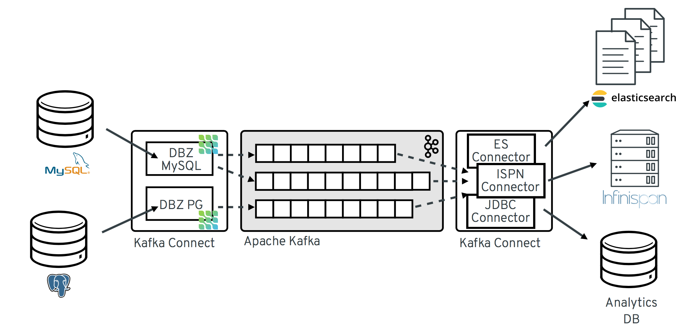
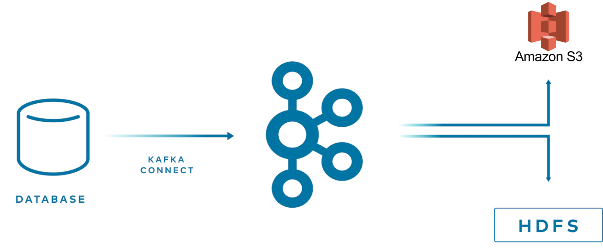
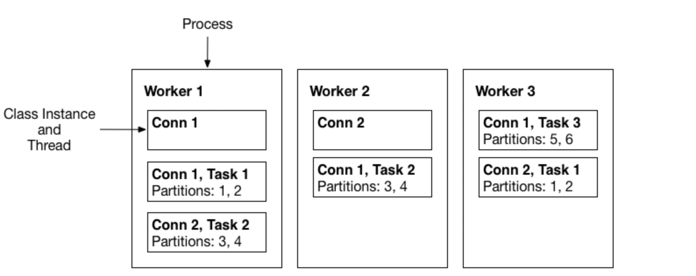

## 1. Kafka Connect 소개

Kafka Connect를 사용하려고 고려하고 있다면 Kafka에 대해서는 이미 잘 알고 찾아봤을 거라고 생각해서 Kafka는 간단하게 언급만 하고 바로 Kafka Connect에 대해서 소개한다.

> 아파치 카프카(Apache Kafka)는 아파치 소프트웨어 재단이 스칼라로 개발한 **오픈 소스 메시지 브로커** 프로젝트이다. ...
> 요컨대 분산 트랜잭션 로그로 구성된, 상당히 확장 가능한 **pub/sub 메시지 큐로 정의할 수 있으며, 스트리밍 데이터를 처리하기 위한 기업 인프라를 위한 고부가 가치 기능**이다.
>
> From [Wikipedia](https://ko.wikipedia.org/wiki/%EC%95%84%ED%8C%8C%EC%B9%98_%EC%B9%B4%ED%94%84%EC%B9%B4)

Kafka는 메시지 브로커 프로젝트 중에 하나이고 다른 프로젝트와 같이 pub-sub 모델을 지원하는 분산 메시지 큐 시스템이다. 처음 [LinkedIn](https://www.linkedin.com/feed/)에서 개발되어 2011년 초에 오픈소스화 되어 공개되고 2014년 말에는 Kafka를 개발하던 개발자들이 Confluent라는 새로운 회사를 창립하여 Kafka 개발에 집중하고 있다.

Kafka Connect는 Kafka 생태계에서 어떤 역할을 하고 있는지 알아보자.

### 1.1 Kafka Connect

Kafka Connect는 Kafka를 사용하여 다른 시스템과 데이터를 주고 받기 위한 오픈소스 프레임워크이다. Kafka Connect에는 기존 시스템에 연결하여 Kafka와 데이터를 주고 받는 데 도움이 되는 다양한 내장 Connector(ex. mongo)를 제공해주고 있다. Kafka Connect의 특징과 장점은 다음과 같다.

- 반복적인 파이프라인 생성 작업시 매번 프로듀서 컨슈머 어플리케이션을 개발하고 배포, 운영 하는것은 비효율적이다
- Connector를 이용하면 특정한 작업 형태를 템플릿으로 만들어 놓은 Connector를 실행함으로써 반복작업을 줄일 수 있다
    - Business 로직에만 집중할 수 있고, 내부 시스템 코드도 더욱 단순화되는 장점이 있다
- Connector는 2가지 타입이 존재한다
    - Source Connector는 외부 시스템에서 Kafka로 데이터를 넣어주는 Connector이다 (External System -> Kafka)

    - Sink Connector는 Kafka에서 데이터를 꺼내 외부 시스템에 데이터를 넣어주는 Connector이다. (Kafka -> External System)
- 다양한 Connector들이 존재 (ex. 오픈소스, 유료)하고 개발자들도 직접 원하는 Connector를 개발할 수 있다
    - MongoDB, JDBC, Redis, HTTP, S3, Elasticsearch, AWS Lambda, etc
    - [Connector 목록](https://www.confluent.io/product/connectors/?utm_medium=sem&utm_source=google&utm_campaign=ch.sem_br.nonbrand_tp.prs_tgt.kafka-connectors_mt.mbm_rgn.apac_lng.eng_dv.all_con.kafka-connectors&utm_term=%2Bkafka+%2Bconnector&placement=&device=c&creative=&gclid=CjwKCAjwopWSBhB6EiwAjxmqDQK_IP1BwHGk2QuxnbEMBpLSzpELe-SxeCH5U_kd8VdmaM22beSGTBoC4yEQAvD_BwE)
    - [Confluent Hub](https://www.confluent.io/hub/?_ga=2.105942858.818878415.1648561146-1727219079.1644563166&_gac=1.183425876.1648562015.Cj0KCQjw3IqSBhCoARIsAMBkTb3IVhJSR686GZrLNaiMPSNYbde-qKWCTOL8TR0_Hdew4qqm6MDPY4saAv1kEALw_wcB) - Connector App Store

### 1.2 Kafka Connect Usecase

다른 시스템에서 Kafka로 Kafka에서 다른 시스템으로 데이터를 스트리밍할 방법은 여러 가지가 있겠지만, 직접 개발하기보다는 Kafka Connect로 쉽게 해결될 수 있는지 첫 번째로 고려해보면 좋을 것이다. 몇 가지 사례를 통해서 어떻게 다양하게 사용될 수 있는지 알아보자.

#### 1.2.1 멀티 타겟 시스템에 스트리밍하기개

Kafka Connect를 사용하면 이미 여러 타겟 시스템 대상으로 connector가 제공되어 있어서 Kafka에 저장된 데이터를 쉽게 스트리밍이 가능하다. 비즈니스 요구에 맞게 새로운 타겟 시스템이 필요할 수 있고 Kafka Connect로 인해서 빠르게 개발 단계로 이어질 수가 있다.

- kafka -> (kafka connect) -> multiple targets (s3, hdfs)

#### 1.2.2 다양한 외부 시스템에서 다른 곳으로 데이터 전달이 필요한 경우

한 컨포넌트에서 다른 컨포넌트로 전달할 수 있는 방법은 여러 가지가 있다.

- A component -> db (ex. mysql) -> (mysql sink connect) -> kafka -> B component (consume)

    - 어드민 성격의 component에서 설정 값을 mysql에 저장한다.
    - 이 값을 다른 component에서 사용할 필요가 있는 경우에는 mysql source connector를 등록해서 사용하면 쉽게 다른 component로 전달할 수 있다

- A component (http API 노출) -> (http source connect) -> kafka -> (mongo sink connector) -> db (ex.mongo) -> B component

    - B component는 mongodb로 read/write 할 수 있는 application이지만, A component의 역할과 domain에 따라서 직접 db에 접근하는 건 부절적한 경우가 있어 kafka를 이용해서 event 기반으로 개발한다

    - A component에서 직접 kafka로 write 할 수도 있지만, http API로 노출해서 http source connector를 이용해서 kafka로 전달하고 mongo sink connector를 이용해서 db에 넣으면 각 component에서 추가 개발 없이도 B component로 데이터를 전달할 수 있다

#### 1.2.3 새로운 어플리케이션으로 마이그레이션 작업

- db(ex. mysql) -> (mysql sink connect) -> kafka -> new application (consume)

새로운 애플리케이션 개발할 때 기존의 애플리케이션에는 영향을 주지 않기 위해 Kafka Connect를 사용하면 더 쉽게 마이그레이션이 가능할 수 있다. Mysql이나 MongoDB는 Change Data Capture (CDC) 기능을 지원하고 있어서 해당 sink connector를 사용하면 스키마 변경, INSERT, UPDATE, DELETE 모두에 대한 변경은 포착해서 Kafka로 데이터를 스트리밍할 수 있다. 이렇게 되면 기존 애플리케이션에는 전혀 수정하지 않고 새로운 애플리케이션을 개발할 수 있다.

## 2.내부 구성요소 및 동작 원리

Kafka Connect는 크게 5가지 요소로 되어 있다.

- Worker
    - Connector와 task를 실행하는 프로세스이다
    - Worker는 REST API 요청에 대한 처리를 담당한다
        - Connector 등록, 설정, 시작, 종료등의 처리를 해준다
    - 2가지 모드를 지원한다
        - standalone : 하나의 process가 connector와 task 실행을 시킨다
        - distributed
            - 분사 모드는 kafka connect의 확장성과 자동 결함 허용 기능을 제공한다
            - 여러 worker 프로세스로 실행시킬 수 있다
- Connector
    - Connector는 파이프라인에 대한 추상 객체이고 Task들을 관리하는 역할을 한다
        - 실행할 작업 수를 결정하고 Task 간의 작업을 나누는 작업
        - Worker로부터 Task를 위한 설정 값을 가져오고 Task에게 전달하는 작업
    - 실제 Worker가 Task를 구동시킨다
- Task
    - Kafka로부터 데이터를 가져오고나 넣는 작업을 하고 실제 파이프라인 동작 요소이다
    - Source Task는 source system으로 부터 데이터를 poll하고 worker는 가져온 데이터를 Kafka topic으로 보낸다
    - Sink Task는 Kafka로부터 Worker를 통해 record를 가져오고 sink system에 record를 쓴다
    - Task Rebalancing 기능도 제공한다
- Converter
    - Worker가 데이터를 수신하면 converter를 사용하여 데이터를 적절한 형식으로 변환한다
- Transform
    - Connector를 통해 흘러가는 각 메시지에 대해 변환하는 역할을 한다

### 2.1 Kafka가 데이터를 스트리밍하는 과정

다음 Sink Conector는 Kafka에서 외부 시스템으로 데이터를 스트리밍할 때의 흐름을 보여준다. Source Connector는 반대로 외부 시스템에서 Kafka로 스트리밍하는 차이가 있지만, 기본 데이터를 스트리밍하는 과정이 비슷하다.

1. Plugin은 각 worker에 배포되는 connector와 task의 구현 아티팩트를 제공한다
2. Worker는 connector 인스턴스를 시작시킨다
3. Connector는 데이터 처리를 위해 task를 생성한다
4. Task는 Kafka를 polling 하기 위해 병렬로 실행되고 record를 반환한다
5. Converter는 외부 시스템에 적합한 형식으로 레코드를 변환한다
6. Transform은 record를 정의된 변환 설정에 따라서 filtering, renaming 등의 변환 작업을 한다

이미 위에서 언급된 내용도 있지만, 각 구성 요소와 요소 간의 관계, 역할을 쉽게 이해하는 데 도움이 되는 다이어그램이다.

- 하나 이상의 Worker는 서버에서 실행된다
- Worker는 하나 이상의 Connector Plugin을 가지고 있다
    - 각 plugin은 connector와 task를 가지고 있다
- Worker는 topic과 task 간의 데이터를 이동시킨다
- Worker는 connector와 task를 시작시킨다

### 2.1 Task Rebalancing

Task rebalancing은 새로운 worker가 추가되거나 worker가 강제 종료된 경우에 worker 간의 작업을 다시 나누기 위해 task 재조정이 발생한다. Task rebalancing이 일어나는 경우는 다음과 같다.

1. 클러스터에 새로운 connector가 등록하는 경우
    - 전체 connector와 task를 각 worker에서 같은 양의 task을 가지도록 재조정을 한다
2. Tasks의 rebalancing은 task의 수 설정을 변경하거나 connector 설정 값을 변경하는 경우
3. 하나의 worker 가 failure 되는 경우
    - Fail task는 활성화된 worker에 다시 할당되지만, 실패된 task는 자동으로 재시작되지 않고 수동으로 API로 restart 시켜줘야 한다

Worker 2가 프로세스가 죽게 되어 실행하던 T2, T3 작업을 남아 있는 worker로 재조정이 되었다.

### 2.2 Workers

Worker는 connector와 task를 실행하는 프로세스이고 2가지 모드로 실행시킬 수 있다.

- Standalone Mode
    - 하나의 프로세스가 connector와 task를 실행시킨다
    - 주로 로컬머신에서 개발이나 테스트시 사용된다
    - Fault tolerance은 지원하지 않음
- Distributed Mode
    - 여러 프로세스로 실행 시킬 수 있어 분산 모드에서는 기본적으로 scalability와 fault tolerance를 지원한다
    - 주로 운영 시스템에서 사용한다
    - 동일한 `group.id`로 시작되어 사용 가능한 모든 worker 간에 connector와 task을 잘 조정하여 자동으로 실행 시킨다

### 2.3 Converters

Kafka에서 write, read 할 때 특정 데이터 형식을 지원하기 위해서 여러 converter를 제공한다. Task는 converter를 사용해서 bytes 데이터 형식을 connect 내부 데이터 형식으로 변경해서 사용한다.

- AvroConverter
    - `io.confluent.connect.avro.AvroConverter`:  Schema Registry 사용 O
- ProtobufConverter
    - `io.confluent.connect.protobuf.ProtobufConverter`: Schema Registry 사용 O
- JsonSchemaConverter
    - `io.confluent.connect.json.JsonSchemaConverter`: Schema Registry 사용 O
- JsonConverter
    - `org.apache.kafka.connect.json.JsonConverter` (Schema Registry 사용 X): Json 데이터
- StringConverter
    - `org.apache.kafka.connect.storage.StringConverter`: string 데이터
- ByteArrayConverter
    - `org.apache.kafka.connect.converters.ByteArrayConverter`: 변환 없은 옵션을 제공

### 2.4 Transforms

Transform은 Kafka <-> 외부 시스템에서 데이터를 가져오고 넣는 과정에서 기존 데이터를 변환해주는 기능이다. Connector 등록 시 어떻게 변환할지 같이 설정하여 사용한다. Transform은 단순 변환 작업으로 하나의 record를 입력받아 수정된 record를 결과값으로 반환한다. 여러 transform이 있으면 파이프라인으로 실행한다.

기본적으로 많이 사용되는 transform은 이미 Kafka Connect에 포함되어 있지만, 사용자가 직접 transform 구현체를 만들어 사용할 수도 있다.

- 필드 이름을 변경,
- 필드를 삭제, 새로운 필드를 추가
- 다른 값으로 변경 (ex. id -> _id)

기본적으로 Transform은 단일 메시지를 처리하고 단순 변환에 사용된다. 조금 더 복잡한 변환이나 다중 메시지처리는 [ksqlDB](https://docs.confluent.io/platform/current/ksqldb/index.html#ksql-home)나 [Kafka Streams](https://docs.confluent.io/platform/current/streams/index.html#kafka-streams)을 사용하는 걸 추천한다.

## 3. 정리

Kafka Connect를 사용하면 애플리케이션에서 반복적으로 개발해야 하는 부분들을 많이 제거할 수 있고 이로 인해서 자연스럽게 비지니스 로직에 집중할 수 있는 장점이 생긴다. Event Driven Architecture를 기반으로 개발하고 있다면, Kafka Connect를 도입하는 걸 추천한다.

본 포스팅에서는 간단하게 구성요소가 어떻게 되고 데이터 스트리밍 처리에 대해서 알아보았다. 다음 포스팅에서는 로컬환경에서 Kafka Conector를 등록하고 Kafka <-> 외부 시스템으로 데이터를 가져오고 넣는 예제를 다루도록 한다.

## 4. 참고

- https://en.wikipedia.org/wiki/Apache_Kafka
- https://www.confluent.io/ko-kr/blog/kafka-connect-deep-dive-error-handling-dead-letter-queues/
- https://www.kai-waehner.de/blog/2020/10/20/apache-kafka-event-streaming-use-cases-architectures-examples-real-world-across-industries/
- https://www.baeldung.com/kafka-connectors-guide
- https://docs.confluent.io/platform/current/connect/index.html
- https://strimzi.io/docs/operators/latest/overview.html
- https://www.confluent.io/blog/kafka-connect-tutorial/
- https://www.instaclustr.com/blog/apache-kafka-connect-architecture-overview/
