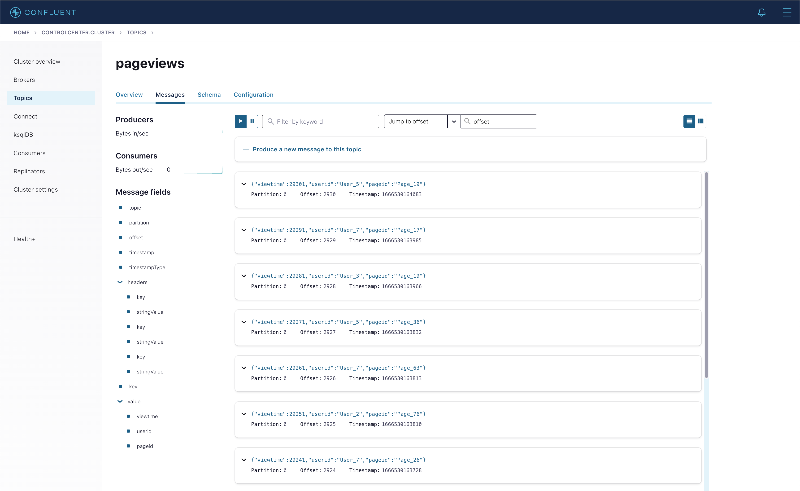

## What

`ksqlDB` (formerly Kafka SQL, KSQL) is a streaming SQL engine for Kafka. It provides an SQL interface that allows developers to easily perform streaming processing in Kafka using familiar SQL syntax. The feature provided by ksqlDB includes:

### 1.1 Feature

- Real-time streaming processing made possible through a familiar and lightweight SQL syntax, similar to accessing relational databases
- ksqlDB is designed to be fault-tolerant and scalable
- ksqlDB provides management functionality for Kafka Connect within the ksqlDB environment
- Support various functions for wide-ranging streaming tasks, including data filtering, transformation, aggregation, joining, windowing, and sessionization
    - e.g. `SUM`, `COUNT`, `UCASE`, `REPLACE`, `TRIM`
- Support user-defined functions for KSQL
    - Also support lambda functions

#### Reference

- https://docs.ksqldb.io/en/latest/developer-guide/ksqldb-reference/functions/
- https://docs.confluent.io/5.4.0/ksql/docs/developer-guide/udf.html
- https://docs.ksqldb.io/en/latest/how-to-guides/use-lambda-functions/


### 1.2 ksqlDB Architecture


**ksqlDB client**

- ksqlDB CLI
    - Provide a command interface (CLI) similar to the console provided by MySQL or PostgreSQL.
- ksqlDB UI
    - Control Center (paid version) is a GUI that allows you to manage and monitor key components including Kafka cluster, broker, topic, connector, and ksqlDB in one place.

**REST Interface**

- ksqlDB client uses REST API to access ksqlDB engine

**ksqlDB Engine**

- Execute KSQL statements and queries
- User defines application logic using KSQL statements, and the engine parses and builds the statements and executes them on the KSQL server
- Each KSQL server runs an instance of the KSQL engine
- The engine uses RocksDB as its internal state store
    - ksqlDB uses RocksDB to store Materialized Views locally on disk
    - RocksDB is a fast embedded key-value store provided as a library

> "RocksDB is an open-source database development project started by Facebook, optimized for large-scale data processing workloads such as server workloads, and optimized for high performance on fast storage, especially flash storage."

##### Reference

- https://docs.confluent.io/5.4.3/ksql/docs/index.html
- https://docs.ksqldb.io/en/latest/operate-and-deploy/how-it-works/
- https://www.confluent.io/blog/ksql-streaming-sql-for-apache-kafka/
- https://docs.ksqldb.io/en/latest/tutorials/event-driven-microservice/
- https://github.com/confluentinc/ksql
- https://docs.ksqldb.io/en/latest/operate-and-deploy/how-it-works/
- https://www.confluent.io/blog/ksqldb-architecture-and-advanced-features/
- https://www.confluent.io/blog/ksqldb-pull-queries-high-availability/?_ga=2.35560801.1998071110.1666397521-1519298907.1666271761
- https://www.confluent.io/blog/how-to-tune-rocksdb-kafka-streams-state-stores-performance/
- https://www.datanami.com/2019/11/20/confluent-reveals-ksqldb-a-streaming-database-built-on-kafka/
- https://meeeejin.gitbooks.io/rocksdb-wiki-kr/content/overview.html
- https://cwiki.apache.org/confluence/display/KAFKA/Kafka+Streams+Internal+Data+Management
- https://stackoverflow.com/questions/58621917/ksql-query-and-tables-storage

## Why

Let's find out why we should use ksqlDB.

### 1.Three Approaches for Processing Kafka Stream


### 2. ksqlDB vs Kafka Streams


- ksqlDB
    - Developed based on the Kafka Streams library
    - Enable interactive streaming processing directly through the KSQL CLI
    - Allow developers to use familiar SQL syntax to perform streaming processing quickly
- Kafka Streams
    - A library that enables streaming processing based on Kafka
    - May be better suited for more complex streaming processing needs
    - Require a higher level of understanding and experience with learning compared to ksqlDB

**Reference**

- https://engineering.linecorp.com/ko/blog/applying-kafka-streams-for-internal-message-delivery-pipeline/
- https://yooloo.tistory.com/m/115
- https://developer.confluent.io/tutorials/transform-a-stream-of-events/kafka.html#create-the-code-that-does-the-transformation
- https://laredoute.io/blog/why-how-and-when-to-use-ksql/
- https://www.slideshare.net/ConfluentInc/ksqldb-253336471


## Who

ksqlDB has been developed by Confluent since 2017.

### History

**Kafka**

- Kafka was developed around 2010 at [LinkedIn](https://www.linkedin.com/)
- Open-sourced as Apache Kafka in 2011
- Confluent was founded in 2014 by one of the Kafka co-founders who left LinkedIn

**Kafka Connect**

- Included in Kafka 0.9.0.0 release in 2015

**Kafka Stream**

- Included in Kafka 0.10.0.0 release in 2016

**ksqlDB**

- Release as KSQl developer preview in 2017
- Renamed to ksqlDB in 2019 from KSQL (Kafka SQL) for rebranding


Reference

- https://docs.ksqldb.io/en/latest/operate-and-deploy/changelog/?_ga=2.211885267.679177078.1665747634-256754440.1665501546&_gac=1.60161119.1665905457.Cj0KCQjw166aBhDEARIsAMEyZh6DZ-g9fEdHzNf4ywXk1Oj2Q93_PLdfgAe_phLu9UaUpztGK_aOoFYaAsqyEALw_wcB
- https://docs.confluent.io/platform/current/installation/versions-interoperability.html#ksqldb
- https://dbdb.io/db/ksqldb
- https://www.buesing.dev/post/kafka-versions/
- https://www.linkedin.com/pulse/kafkas-origin-story-linkedin-tanvir-ahmed/


## Where

Several companies are officially using ksqlDB. In Korea, LINE used ksqlDB to improve its AB Test Report system.

- [Naver LINE](https://line.me/)
    - [AB Test Report](https://velog.io/@anjinwoong/Line-Developer-Day-2021-KSETL%EB%A1%9C-Kafka-%EC%8A%A4%ED%8A%B8%EB%A6%BC-ETL-%EC%8B%9C%EC%8A%A4%ED%85%9C%EC%9D%84-%EB%B9%A0%EB%A5%B4%EA%B2%8C-%EA%B5%AC%EC%84%B1%ED%95%98%EA%B8%B0)
    - The existing system was implemented the AB test report system by creating the join window from fetched the event log which stored in Redis
    - By using ksqlDB, the original architecture got much simplier by just writing ksql (no redis server)
- [ticketmaster](https://www.ticketmaster.com/) - Ticket sales company
- [Nuuly](https://www.nuuly.com/) - Clothing rental and trial service
- [ACERTUS](https://acertusdelivers.com/) - Car pickup/delivery service
- [optimove](https://www.optimove.com/) - A private company that develops and sells CRM marketing software (with AI) as a service
- [Bosch](https://www.bosch.com/) - Leading company in the field of automotive and industrial technology, consumer goods, and building technology
- [Voicebridge](https://voicebridge.io/): voice-based systems for rural populations in developing countries that lack internet access


##### Reference

- https://stackshare.io/ksql
- https://ksqldb.io/
- https://www.confluent.io/ko-kr/product/ksqldb/

## How

### 1. Installation on local-machine

To run multiple Kafka components in a local environment, we are going to use `docker-compose`. First, download the `docker-compose.yml` file.

```bash
$ curl --output docker-compose.yml \
  https://raw.githubusercontent.com/kenshin579/tutorials-go/master/kafka/confluent/docker-compose.yml
```

Start the Confluent Platform server.

```bash
$ docker-compose up -d
```

Start KSQL Interactive CLI by using `ksqldb-cli` docker

```bash
$ docker exec -it ksqldb-cli ksql http://ksqldb-server:8088
OpenJDK 64-Bit Server VM warning: Option UseConcMarkSweepGC was deprecated in version 9.0 and will likely be removed in a future release.

                  ===========================================
                  =       _              _ ____  ____       =
                  =      | | _____  __ _| |  _ \| __ )      =
                  =      | |/ / __|/ _` | | | | |  _ \      =
                  =      |   <\__ \ (_| | | |_| | |_) |     =
                  =      |_|\_\___/\__, |_|____/|____/      =
                  =                   |_|                   =
                  =        The Database purpose-built       =
                  =        for stream processing apps       =
                  ===========================================

Copyright 2017-2022 Confluent Inc.

CLI v7.2.2, Server v7.2.2 located at http://ksqldb-server:8088
Server Status: RUNNING

Having trouble? Type 'help' (case-insensitive) for a rundown of how things work!

ksql>
```


### 2. KSQL Usage

Let's learn more about ksqlDB through some examples.

### 2.1 Collections : Stream vs Table

#### 2.1.1 Stream

- A new stream can be created from a stream, table, or Kafka topic
- Stream is an event collection that streams persistently and unlimitedly
    - Data is managed by partition
- Once a row is created, it cannot be changed (immutable, append-only)
    - Each row is stored in a specific partition
    - Only `INSERT` is possible

```sql
 Creates a stream in an existing kafka topic, or it will be created the topic automatically if no topic exists
ksql> CREATE STREAM riderLocations (profileId VARCHAR, latitude DOUBLE, longitude DOUBLE)
  WITH (kafka_topic='locations', value_format='json', partitions=1);
  
# You can create a new stream from another stream
ksql> CREATE STREAM myCurrentLocation AS
SELECT profileId,
       latitude AS la,
       longitude AS lo
FROM riderlocations
WHERE profileId = 'c2309eec'
    EMIT CHANGES;
```

- `kafka_topic` - Create a stream from an existing Kafka topic or automatically create a topic if there is none
- `value_format` - Specify the encoding of the messages stored in the kafka topic
- `partitions` - Specify the number of partitions in the kafka topic


#### 2.1.2 Table (Materialized view)

- Table data is a mutable event collection and the data has the current latest state
- Rows can be changed and must have a primary key
- `INSERT`, `UPDATE`, `DELETE` are possible
- A new table can be created from a stream, table, or Kakfa Topic


```sql
# Create a materialized view that tracks the latest location of the riders
ksql> CREATE TABLE currentLocation AS
  SELECT profileId,
         LATEST_BY_OFFSET(latitude) AS la,
         LATEST_BY_OFFSET(longitude) AS lo
  FROM riderlocations
  GROUP BY profileId
  EMIT CHANGES;
  
# Create a table that checks how far away a rider is from a given location
ksql> CREATE TABLE ridersNearMountainView AS
SELECT ROUND(GEO_DISTANCE(la, lo, 37.4133, -122.1162), -1) AS distanceInMiles,
       COLLECT_LIST(profileId) AS riders,
       COUNT(*) AS count
  FROM currentLocation
  GROUP BY ROUND(GEO_DISTANCE(la, lo, 37.4133, -122.1162), -1);
```

- `LATEST_BY_OFFSET`
    - It is an aggregate function that returns the latest value of a specific column
- `EMIT CHANGES`
    - Adding the EMIT CHANGES clause allows receiving all changes continuously
- `COLLECT_LIST(col1)`
    - Return an array containing all values of col1

##### Reference

- https://www.slideshare.net/ConfluentInc/ksqldb
- https://devidea.tistory.com/73


### 2.2 Query

#### 2.2.1 Push Query (Continous Query)

- Push queries subscribes to real-time changing results
- The `EMIT` clause continuously executes the query persistently
- To terminate a push query started from the CLI, press `ctrl+C`

```sql
# Data in the Stream is continuously retrieved and queries are continuously executed
ksql> SELECT * FROM riderLocations
WHERE GEO_DISTANCE(latitude, longitude, 37.4133, -122.1162) <= 5 EMIT CHANGES;

# Data in the table is continuously retrieved and queries are continuously executed
ksql> SELECT * FROM currentLocation EMIT CHANGES;
```

Let's insert actual data into ksqlDB. The following inserts into the `riderLocations` stream, which is equivalent to publishing to a kafka topic associated with `riderLocations`.

```sql
ksql> INSERT INTO riderLocations (profileId, latitude, longitude) VALUES ('c2309eec', 37.7877, -122.4205);
INSERT INTO riderLocations (profileId, latitude, longitude) VALUES ('18f4ea86', 37.3903, -122.0643);
INSERT INTO riderLocations (profileId, latitude, longitude) VALUES ('4ab5cbad', 37.3952, -122.0813);
INSERT INTO riderLocations (profileId, latitude, longitude) VALUES ('8b6eae59', 37.3944, -122.0813);
INSERT INTO riderLocations (profileId, latitude, longitude) VALUES ('4a7c7b41', 37.4049, -122.0822);
INSERT INTO riderLocations (profileId, latitude, longitude) VALUES ('4ddad000', 37.7857, -122.4011);
```

You can also publish with Kafka CLI commands.

```bash
$ kafka-console-producer.sh --bootstrap-server localhost:9092 --topic locations
> {"profileId": "c2309ee5", "latitude": 42.7877, "longitude": -122.4205}
```


#### 2.2.2 Pull Query (Classic Query)

- Pull Query retrieves the current state of a table

```sql
# Search for all riders currently within 10 miles of Mountain View
ksql> SELECT * from ridersNearMountainView WHERE distanceInMiles <= 10;
```

##### Reference
- https://www.rittmanmead.com/blog/2017/10/ksql-streaming-sql-for-apache-kafka/
- https://docs.ksqldb.io/en/latest/concepts/time-and-windows-in-ksqldb-queries/


### 2. Control Center

So far, we have only used ksqlDB in the CLI, but let's use the Control Center web UI. Go to [http://localhost:9021](http://localhost:9021/).

### 2.1 Datagen Source Connector

Datagen Source Connector is a connector that generates mock data for development and testing. Depending on the configured values, it periodically generates data, allowing for continuous simulation of receiving data.

#### 2.1.1 Generate Mock Data

Let's generate mock data for `pageviews` and `users`.

After clicking **Connect > Add Connector > DatagenConnector**, enter the following information.

```json
# generate pageviews mock data
{
  "name": "datagen-pageviews",
  "config": {
    "name": "datagen-pageviews",
    "connector.class": "io.confluent.kafka.connect.datagen.DatagenConnector",
    "key.converter": "org.apache.kafka.connect.storage.StringConverter",
    "kafka.topic": "pageviews",
    "max.interval": "100",
    "quickstart": "pageviews"
  }
}

# generate users mock data
{
  "name": "datagen-users",
  "config": {
    "name": "datagen-users",
    "connector.class": "io.confluent.kafka.connect.datagen.DatagenConnector",
    "key.converter": "org.apache.kafka.connect.storage.StringConverter",
    "kafka.topic": "users",
    "max.interval": "1000",
    "quickstart": "users"
  }
}
```

Click **Topics > pageviews > Messages Tab**. We can see the data is being published in real-time to the `pageviews` topic.



##### Reference

- https://docs.confluent.io/kafka-connectors/datagen/current/index.html#datagen-source-connector-for-cp
- https://always-kimkim.tistory.com/entry/kafka-develop-kafka-connect-datagen
- https://www.confluent.io/blog/easy-ways-generate-test-data-kafka/
- https://github.com/confluentinc/kafka-connect-datagen/tree/master/src/main/resources


### 2.2 Joins Collections

The `Join` in ksqlDB and `Join` in traditional relational databases are similar in that they combine two or more sets of data. You can use the `Join` syntax to merge streams events that occur in real-time.

```sql
# 1.create stream
ksql> CREATE STREAM pageviews_stream
  WITH (KAFKA_TOPIC='pageviews', VALUE_FORMAT='AVRO');

# 2. create table
ksql> CREATE TABLE users_table (id VARCHAR PRIMARY KEY)
    WITH (KAFKA_TOPIC='users', VALUE_FORMAT='AVRO');
```

Joining the `pageviews` stream and the `users` table creates the `user_pageviews`.

```sql
# user_pageviews stream creates a USER_PAGEVIEWS topic
ksql> CREATE STREAM user_pageviews
  AS SELECT users_table.id AS userid, pageid, regionid, gender
     FROM pageviews_stream
              LEFT JOIN users_table ON pageviews_stream.userid = users_table.id
         EMIT CHANGES;

# Create separate pageviews with regionId ending in 8, 9 from the user_pageviews stream
ksql> CREATE STREAM pageviews_region_like_89
  WITH (KAFKA_TOPIC='pageviews_filtered_r8_r9', VALUE_FORMAT='AVRO')
    AS SELECT * FROM user_pageviews
       WHERE regionid LIKE '%_8' OR regionid LIKE '%_9'
           EMIT CHANGES;
```


## 2.4 Windows

#### 2.4.1 Time


- Each record contains a timestamp
- The timestamp is set by the producer application or the Kafka broker
- The timestamp is used for time-dependent operations such as aggregation and join

#### 2.4.2 Window


- ksqlDB provides Window queries that use streams to aggregate events within a specific period (Window) and send them as output
- The period is represented by a Duration, which can be expressed as `WINDOWSTART`/`WINDOWEND`
- `WINDOWSTART`/`WINDOWEND` can be declared in the SELECT clause when creating a Window query

#### 2.4.1 Window Types

There are three ways to define Time Windows in KSQL:

- Tumbling
    - Time-based
    - Fixed-duration, non-overlapping, gap-less windows
    - ex. `WINDOW TUMBLING (SIZE 1 HOUR)`
- Hopping
    - Time-based
    - Fixed-duration, overlapping windows
    - ex. `WINDOW HOPPING (SIZE 30 SECONDS, ADVANCE BY 10 SECONDS)`
- Session
    - Session-based
    - Dynamically-sized, non-overlapping, data-driven windows
    - Session Windows are created based on the inactivity gap, separating active periods.
    - Session Windows are particularly useful for analyzing user behavior (e.g., number of visitors).
    - ex. `WINDOW SESSION (60 SECONDS)`


```sql
# Create a Table named pageviews_per_region_89 that counts the number of pageviews for regions 8 and 9 in a tumbling window of 30 seconds
ksql> CREATE TABLE pageviews_per_region_89 WITH (KEY_FORMAT='JSON')
  AS SELECT userid, gender, regionid, COUNT(*) AS numusers
    FROM pageviews_region_like_89
    WINDOW TUMBLING (SIZE 30 SECOND)
    GROUP BY userid, gender, regionid
    HAVING COUNT(*) > 1
EMIT CHANGES;
```


```sql
ksql> SELECT * FROM pageviews_per_region_89 EMIT CHANGES;
```

`Reference`

- https://ojt90902.tistory.com/1117?category=1007571

### 3. REST API

```bash
$ curl --location --request POST 'http://localhost:8088/ksql' \
--header 'Content-Type: application/json' \
--data-raw '{
  "ksql": "show streams;",
  "streamProperties":{}
}'

[
  {
    "@type": "streams",
    "statementText": "show streams;",
    "streams": [
      {
        "type": "STREAM",
        "name": "RIDERLOCATIONS",
        "topic": "locations",
        "keyFormat": "KAFKA",
        "valueFormat": "JSON",
        "isWindowed": false
      },
      ...생략...
      {
        "type": "STREAM",
        "name": "USER_PAGEVIEWS",
        "topic": "USER_PAGEVIEWS",
        "keyFormat": "KAFKA",
        "valueFormat": "AVRO",
        "isWindowed": false
      }
    ],
    "warnings": []
  }
]

```

The ksqlDB server provides a REST API, and the full API documentation is available at the link below.

- https://rmoff.net/2019/01/17/ksql-rest-api-cheatsheet/
- https://docs.ksqldb.io/en/latest/developer-guide/api/

### 4. Connector Management

ksqlDB can run connectors in two modes, which determine how and where the connectors are executed.

- Embedded
    - In Embedded mode, ksqlDB runs the connectors directly on the server
- External
    - This mode communicates with an external Kafka Connect cluster


```sql
ksql> CREATE SINK CONNECTOR `mongodb-test-sink-connector` WITH (
   "connector.class"='com.mongodb.kafka.connect.MongoSinkConnector',
   "key.converter"='org.apache.kafka.connect.json.JsonConverter',
   "value.converter"='org.apache.kafka.connect.json.JsonConverter',
   "key.converter.schemas.enable"='false',
   "value.converter.schemas.enable"='false',
   "tasks.max"='1',
   "connection.uri"='mongodb://MongoDBIPv4Address:27017/admin?readPreference=primary&appname=ksqldbConnect&ssl=false',
   "database"='local',
   "collection"='mongodb-connect',
   "topics"='test.topic'
);
```

##### Reference

- https://medium.com/@rt.raviteja95/mongodb-connector-with-ksqldb-with-confluent-kafka-2a3b18dc4c25
- https://docs.ksqldb.io/en/latest/how-to-guides/use-connector-management/


### 5. KSQL Library

- golang
    - https://github.com/VinGarcia/ksql
    - https://github.com/rmoff/ksqldb-go
- java
    - https://www.baeldung.com/ksqldb
    - https://docs.ksqldb.io/en/latest/developer-guide/ksqldb-clients/java-client/

## When

ksqlDB is used where real-time transformation, integration, and analysis of data are immediately required as it is based on Kafka for processing data. It can be used in various fields as follows:

- Anomaly detection and fraud detection
- Real-time analysis
- Predictive analysis
- Logistics and IoT management
- Real-time alerts and notifications
- Sensor data and IoT
- Cybersecurity

##### Reference

- https://developer.confluent.io/tutorials/
- https://blog.voidmainvoid.net/227
- https://github.com/confluentinc/ksql/tree/0.1.x/docs#ksql-documentation
- https://www.confluent.io/blog/stream-processing-vs-batch-processing/

## FAQ

Refer to the link below for various ksqlDB FAQs.

- https://docs.ksqldb.io/en/latest/faq/

### 1. Is ksqlDB Apache License 2.0?

- No, it is not.
- ksqlDB is licensed under the Confluent Community License and is managed as a Confluent company product.

### 2. Is there any constraints for Confluent Community License?


- It seems that ksqlDB can be used as long as the similar kind of ksqlDB service provided.
    - KSQL cannot be offered as a SaaS product itself.
    - If you want to use it for an internal company project, it is recommended to review the license before using it.
- https://www.confluent.io/confluent-community-license-faq/
- https://www.confluent.io/ko-kr/blog/license-changes-confluent-platform/

## Wrap up

ksqlDB helps us easily process streaming data on Kafka with SQL syntax that we are already familiar with.

For a few stream and table creations, it is sufficient to create and use them in Control Center or CLI. However, when multiple pipelines between streams are required, it is recommended to use the [Stream Designer](https://www.confluent.io/product/stream-designer/) UI, which allows for easier use.

- Visual Builder for Streaming Data Pipeline
- Available on Confluent Cloud
- https://www.confluent.io/blog/building-streaming-data-pipelines-visually

## Reference

- ksql syntax
    - https://docs.ksqldb.io/en/latest/developer-guide/ksqldb-reference/show-streams/

- ksql
    - https://ksqldb.io/quickstart.html?utm_source=thenewstack&utm_medium=website&utm_content=inline-mention&utm_campaign=platform
    - https://always-kimkim.tistory.com/entry/kafka101-ksql
    - https://www.rittmanmead.com/blog/2017/10/ksql-streaming-sql-for-apache-kafka/
    - https://www.confluent.io/blog/intro-to-ksqldb-sql-database-streaming/
    - https://docs.confluent.io/platform/current/platform-quickstart.html#ce-quickstart?utm_source=github&utm_medium=demo&utm_campaign=ch.examples_type.community_content.cp-quickstart
    - https://github.com/confluentinc/demo-scene/blob/master/introduction-to-ksqldb/demo_introduction_to_ksqldb_01.adoc
    - https://www.confluent.io/blog/guide-to-stream-processing-and-ksqldb-fundamentals/
    - https://hevodata.com/learn/kafka-ksql-streaming-sql-for-kafka/
