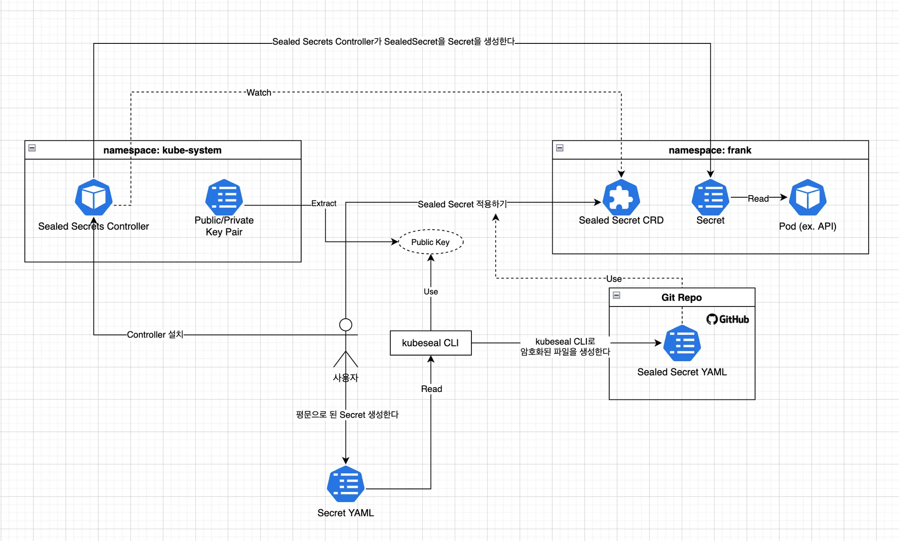
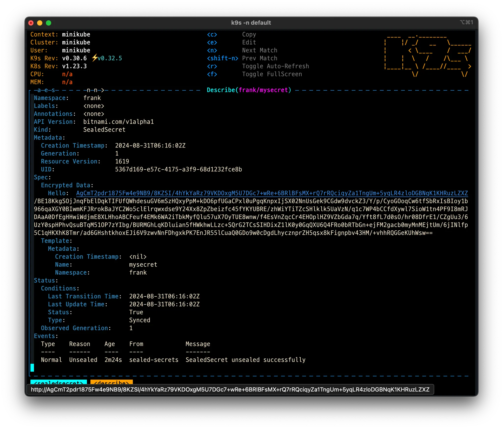
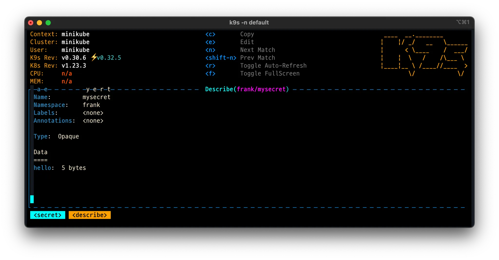
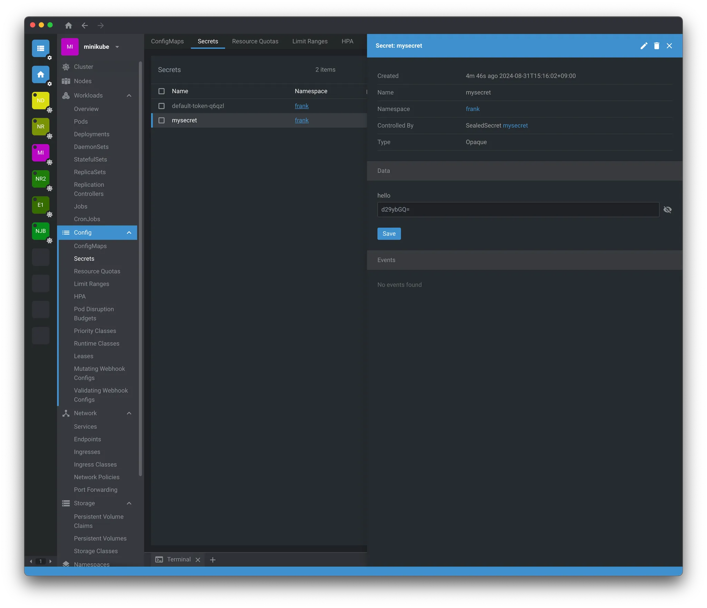

# 1. 개요

개발한 애플리케이션을 쿠버네티스에 배포하기 위해 helm charts로 애플리케이션에 필요한 설정을 저장한다. Git 저장소에 id와 password와 같은 민감한 정보를 저장하므로 Git 접근 권한이 있는 사용자에게 그대로 노출이 되는 보안 이슈가 있다.

이런 해결하기 위해 Sealed Secrets에 대해서 알아보자.

## 1.1 동작 원리

Sealed Secrets는 다음과 같은 방식으로 동작한다.

- 사용자는 평문으로 된 비밀 데이터를 생성한다
- `kubeseal` CLI 도구를 사용해 이 데이터를 암호화된 Sealed Secret 리소스로 변환한다
- SealedSecret 리소스를 쿠버네티스 클러스터에 적용하면, Sealed Secrets 컨트롤러가 이를 복호화하여 일반 Secret 리소스로 변환해준다
- 복호화 과정은 클러스터 내에서만 이루어지며, 외부에서는 복호화할 수 없다



# 2. Sealed Secrets 설치하기

> 로컬환경에서 쿠버네티스를 실행할 거라서 minikube를 사용한다

```bash
> minikube start
```

Sealed Secrets를 설치하는 과정은 kubeseal CLI 도구와 Sealed Secrets 컨트롤러를 설치하는 과정으로 나뉜다.

## 2.1 kubeseal 설치하기

kubeseal CLI는 사용자가 비밀 데이터를 암호화하는 데 사용된다. 설치 방법은 다음과 같다

> 설치는 맥 기준으로 설명한다

```bash
> brew install kubeseal
```

## 2.2 Sealed Secrets Controller 설치하기

Sealed Secrets 컨트롤러는 Kubernetes 클러스터 내에서 SealedSecret 리소스를 복호화하는 역할을 한다. 설치는 여러 방식 (ex. helm, kubectl)이 있지만, 여기서는 helm으로 설치한다.

Helm을 사용하여 Sealed Secrets 컨트롤러를 설치한다.

```bash
# sealed-secrets helm repo 추가
> helm repo add sealed-secrets <https://bitnami-labs.github.io/sealed-secrets>
> helm repo update
```

아래 명령어로 설치가 잘 되었는지 확인한다.

```bash
> kubectl get pods -n kube-system -l app.kubernetes.io/name=sealed-secrets
NAME                              READY   STATUS    RESTARTS   AGE
sealed-secrets-697689447c-f6dkv   1/1     Running   0          93s
```

## 3. Secret 생성하고 암호화하기

Sealed Secrets를 사용하여 비밀 데이터를 생성하고 암호화하는 방법을 알아보자.

## 3.1 샘플 Secret YAML 생성하기

먼저 평문 비밀 데이터를 포함한 YAML 파일을 생성한다.

```bash
# 샘플 Secret 파일을 생성한다
> kubectl create -n frank secret generic mysecret --from-literal hello=world --dry-run=client -oyaml > mysecret.yaml
```

위 명령어는 아래 `yaml`을 생성해주고 `hello`의 `value` 값은 `base64`로 암호화된 값이다.

```yaml
apiVersion: v1
data:
  hello: d29ybGQ= # base64로 인코딩된 값
kind: Secret
metadata:
  creationTimestamp: null
  name: mysecret
  namespace: frank
```

`yaml`을 수동을 작성할 때 암호로 표시해야 하는 값은 base64로 엔코딩이 되어야 sealed secret를 생성할 수 있다. base64로 엔코딩할 때 꼭 `-n` 옵션 추가해서 실행을 해야 한다. 없이 실행하면 newline이 추가가 된다는 것을 기억하자.

> `-n` 옵션으로 실행해야 newline 없이 추가된다
>
> ```bash
> echo -n "string" | base64
> ```

## 3.2 Secrets 암호화하기

kubeseal CLI 도구를 사용하여 Secret을 암호화된 SealedSecret으로 변환한다.

```bash
# kubeseal 명령어로 secret 파일에서 sealed-secret을 생성한다
> kubeseal --controller-name=sealed-secrets \\
 --controller-namespace=kube-system --format yaml < mysecret.yaml > mysealed_secret.yaml
---
apiVersion: bitnami.com/v1alpha1
kind: SealedSecret
metadata:
  creationTimestamp: null
  name: mysecret
  namespace: frank
spec:
  encryptedData:
    hello: AgCmT2pdr1875Fw4e9NB9/8KZSI/4hYkYaRz79VKDOxgM5U7DGc7+wRe+6BRlBFsMX+rQ7rRQciqyZa1TngUm+5yqLR4zloDGBNqK1KHRuzLZXZ/BE18KkgSOjJnqFbElDqkTIFUfQWhdesuGV6mSzHQxyPpM+kDO6pfUGaCPxl0uPgqKnpxIjSX02NnUsGek9CGdw9dvckZ3/Y/p/CyoGOoqCw6tfSbRxIsBIoy1b966qaXGY0BIwmKFJRrokBaJYC2Wo5clElrqwxdse9Y24Xx8ZpZbeizfc45fYKYUBRE/zhWiYTiTZcSHlklk5UaVzN/q1c7WP4bCCfdXywl7SioW1tn4PF9I8mRJDAaA0DfEgHHwiWdjmE8XLHhoABCFeuf4EMk6WA2iTbkMyfQlu57uX7OyTUE8wnw/f4EsVnZqcCr4EHOplHZ9VZbGda7q/Yft8fL7d0sO/hr08DfrE1/CZgUu3/6UzY0spHPhvQsuBTqM51OP7zYIbg/BURMGhLqKDluian5fHWkhwLLzc+SQrG2TCsSIHDixZ1lK0y0GqQXU6Q4FRo0bRTbGn+ejFM2gacb0myMnMEjtUm/6jINlfp5C1qHKXhK8Tmr/ad6GHshtkhoxEJi6V9zwvNnFDhgxkPK7EnJR55lCuaQ0GDo9w0cDgdLhycznprZH5qsx8kFignpbv43HM/+vhhRQGGeKUhWsw==
  template:
    metadata:
      creationTimestamp: null
      name: mysecret
      namespace: frank
```

## 3.3  쿠버네티스에 Sealed Secrets 적용하기

암호화된 SealedSecret을 Kubernetes 클러스터에 적용한다.

```bash
> kubectl create ns frank
namespace/frank created

> kubectl -n frank apply -f mysealed_secret.yaml
sealedsecret.bitnami.com/mysecret created
```

## 3.4 적용 잘 되었는지 확인해보기

`kubectl` 명령어로 `secrets`이 잘 생성이 되었는지 확인할 수 있다.

```bash
> kubectl get sealedsecrets
NAME       STATUS   SYNCED   AGE
mysecret            True     3m8s

> kubectl get secrets
NAME                  TYPE                                  DATA   AGE
default-token-q6qzl   kubernetes.io/service-account-token   3      3m25s
mysecret              Opaque                                1      3m20s
```

> `k9s`로도 쉽게 확인할 수 있다





> OpenLens로 확인하면 실제 decrypt 된 값도 확인할 수 있다.




# 4. 참고

- [How to create an actually safe secrets for GitOps](https://jaehong21.com/posts/k3s/06-sealed-secrets/)
- [Managing secrets deployment in Kubernetes using Sealed Secrets](https://aws.amazon.com/ko/blogs/opensource/managing-secrets-deployment-in-kubernetes-using-sealed-secrets/)
- [How to Encrypt Kubernetes Secrets Using Sealed Secrets in DOKS](https://www.digitalocean.com/community/developer-center/how-to-encrypt-kubernetes-secrets-using-sealed-secrets-in-doks)
