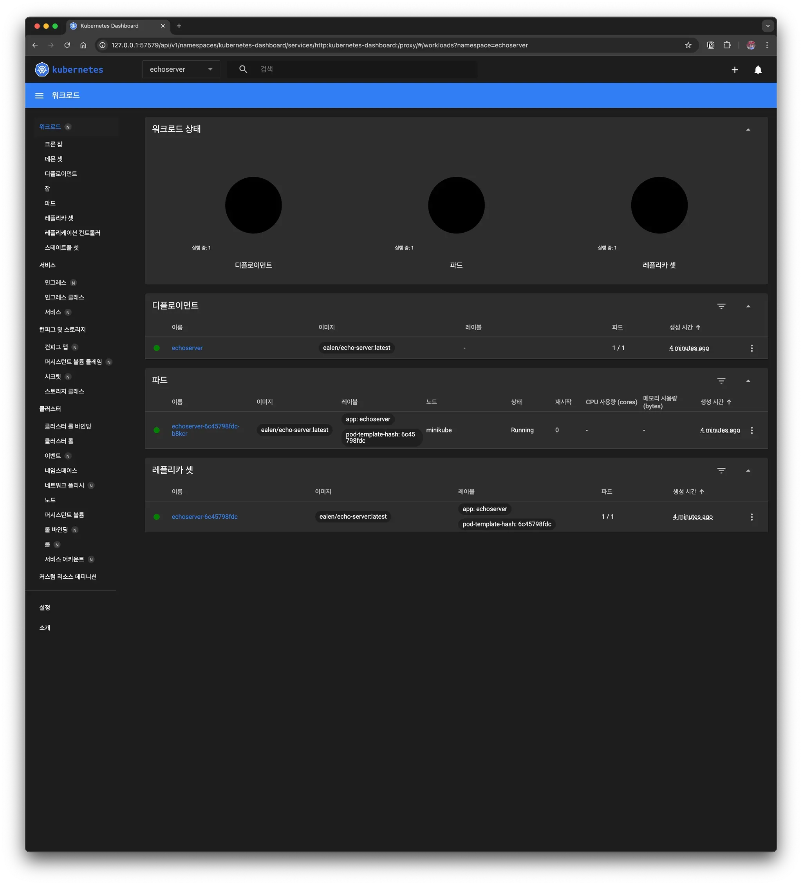
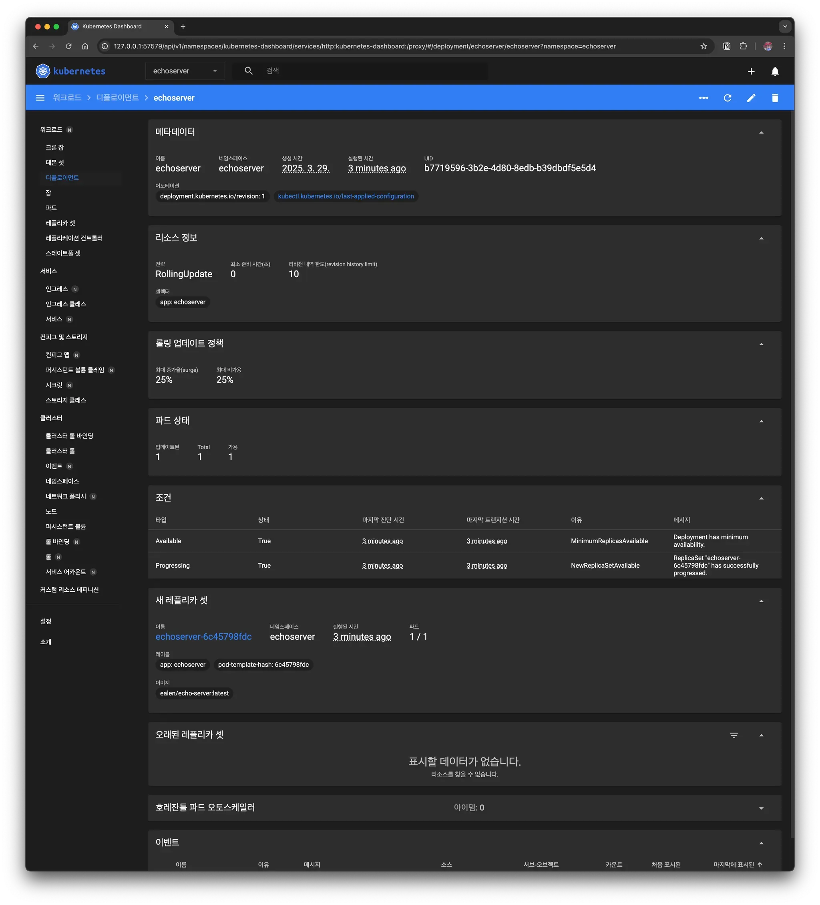

## 1. 개요

#### Minikube란?

`Minikube`는 로컬 환경에서 가볍게 `Kubernetes` 클러스터를 실행할 수 있는 도구이다. `Kubernetes`를 실습하거나 개발 환경에서 테스트할 때 유용하다. Mac, Linux, Windows에서 실행할 수 있으며, 가상화 기술을 이용해 클러스터를 구성한다. 

#### Kubernetes 클러스터 실행 방식 비교

`Kubernetes` 클러스터를 실행하는 방법은 여러 가지가 있으며, 각각 장단점이 있다. 

| 항목 | Kind | Minikube | Docker Desktop Kubernetes | Rancher Desktop |
| --- | --- | --- | --- | --- |
| 실행 방식 | Docker 컨테이너 기반 | 가상화 기반 (Docker, VirtualBox 등 지원) | Docker 내장 K8s 기능 활용 | 여러 K8s 배포판 선택 가능 |
| 성능 | 가볍고 빠름 | 다양한 환경 지원, 다소 무거움 | Mac/Windows에서 최적화됨 | 다소 무거움 |
| LoadBalancer 지원 | 기본적으로 미지원 (추가 설정 필요) | 기본적으로 미지원 (추가 설정 필요) | 기본 제공 | 기본 제공 |
| 사용 용도 | 개발 및 테스트 환경 | 개발 및 로컬 테스트 환경 | 로컬 개발 및 간단한 테스트 | 다양한 K8s 환경 실습 |
| 설치 난이도 | 간단함 | 비교적 쉬움 | 기본적으로 포함됨 | 다소 설정 필요 |

minikube의 경우에는 k8s 구축하는 게 제일 쉽기도 하고 간단한 pod 올리고 테스트할 때 많이 사용되기도 해서 어떻게 사용하는지 알아보자. 

---

## 2. 맥에서 Minikube로 클러스터 구축하기

### 2.1 Minikube 설치

Mac에서는 `Homebrew`를 사용하여 간단히 `Minikube`를 설치할 수 있다. 

```bash
> brew install minikube
```

설치가 완료되었는지 확인한다. 

```bash
> minikube version
minikube version: v1.34.0
commit: 210b148df93a80eb872ecbeb7e35281b3c582c61
```

### 2.2 Minikube 시작

`Minikube`를 실행하기 전에 **Docker Desktop**이 실행 중인지 확인해야 한다. `Minikube`는 기본적으로 `Docker`를 사용하여 `Kubernetes` 클러스터를 구동한다. 

```bash
> docker ps  # Docker가 실행 중인지 확인
```

`Minikube` 클러스터를 시작한다. 

```bash
> minikube start
😄  Darwin 15.3.2 (arm64) 의 minikube v1.34.0
    ▪ KUBECONFIG=/Users/user/.kube/config
🎉  minikube 1.35.0 이 사용가능합니다! 다음 경로에서 다운받으세요: https://github.com/kubernetes/minikube/releases/tag/v1.35.0
💡  해당 알림을 비활성화하려면 다음 명령어를 실행하세요. 'minikube config set WantUpdateNotification false'
✨  자동적으로 docker 드라이버가 선택되었습니다. 다른 드라이버 목록: parallels, ssh
📌  Using Docker Desktop driver with root privileges
👍  Starting "minikube" primary control-plane node in "minikube" cluster
🚜  Pulling base image v0.0.45 ...
🔥  Creating docker container (CPUs=2, Memory=7789MB) ...
🐳  쿠버네티스 v1.31.0 을 Docker 27.2.0 런타임으로 설치하는 중
    ▪ 인증서 및 키를 생성하는 중 ...
    ▪ 컨트롤 플레인을 부팅하는 중 ...
    ▪ RBAC 규칙을 구성하는 중 ...
🔗  bridge CNI (Container Networking Interface) 를 구성하는 중 ...
🔎  Kubernetes 구성 요소를 확인...
    ▪ Using image gcr.io/k8s-minikube/storage-provisioner:v5
🌟  애드온 활성화 : storage-provisioner, default-storageclass
🏄  끝났습니다! kubectl이 "minikube" 클러스터와 "default" 네임스페이스를 기본적으로 사용하도록 구성되었습니다.
```

> 개인적으로는 `minikube`가 명령어가 길어서 shell `alias` 설정해서 사용하고 있다.
> 

```bash
> echo 'alias mk=minikube' >> ~/.zshrc
> source ~/.zshrc

# minikube start
> mk start
```

### 2.3 애플리케이션 배포하기

간단한 테스트를 위해 Echo Server 애플리케이션을 `Kubernetes` 클러스터에 배포해보자. 

```yaml
apiVersion: v1
kind: Namespace
metadata:
  name: echoserver
---
apiVersion: apps/v1
kind: Deployment
metadata:
  name: echoserver
  namespace: echoserver
spec:
  replicas: 1
  selector:
    matchLabels:
      app: echoserver
  template:
    metadata:
      labels:
        app: echoserver
    spec:
      containers:
      - image: ealen/echo-server:latest
        imagePullPolicy: IfNotPresent
        name: echoserver
        ports:
        - containerPort: 80
        env:
        - name: PORT
          value: "80"
---
apiVersion: v1
kind: Service
metadata:
  name: echoserver
  namespace: echoserver
spec:
  ports:
    - port: 80
      targetPort: 80
      protocol: TCP
  type: ClusterIP
  selector:
    app: echoserver

```

[tutorial-go repo](https://github.com/kenshin579/tutorials-go/tree/master/cloud/kubernetes/echo-server)에 이미 echo-server `k8s` `yaml`이 생성되어 있어서 아래 명령어로 실행한다. 

```bash
> cd /Users/user/GolandProjects/tutorials-go/cloud/kubernetes/echo-server
> kc --namespace=echoserver apply -f echo.kube.yaml
namespace/echoserver unchanged
deployment.apps/echoserver created
service/echoserver created

```

배포가 정상적으로 이루어졌는지 확인한다. 

```bash
> kc get pod -o wide
NAME                          READY   STATUS    RESTARTS   AGE   IP           NODE       NOMINATED NODE   READINESS GATES
echoserver-6c45798fdc-b8kcr   1/1     Running   0          36s   10.244.0.3   minikube   <none>           <none>

```

### 2.4 외부에서 접속해보기

#### Minikube Service 명령어로 외부로 노출하는 방법

`Minikube`는 기본적으로 `LoadBalancer`를 지원하지 않으므로, `minikube service` 명령어를 이용해 외부에서 접근할 수 있도록 한다. 

```bash
> minikube -n echoserver service echoserver --url
😿  service echoserver/echoserver has no node port
❗  Services [echoserver/echoserver] have type "ClusterIP" not meant to be exposed, however for local development minikube allows you to access this !
http://127.0.0.1:59333
❗  darwin 에서 Docker 드라이버를 사용하고 있기 때문에, 터미널을 열어야 실행할 수 있습니다

```

출력되는 URL을 확인한 후, 해당 주소로 `curl` 요청을 보내서 잘 동작하는지 확인한다. 

```bash
> curl http://localhost:59333
{"host":{"hostname":"localhost","ip":"::ffff:10.244.0.1","ips":[]},"http":{"method":"GET","baseUrl":"","originalUrl":"/","protocol":"http"},"request":{"params":{"0":"/"},"query":{},"cookies":{},"body":{},"headers":{"host":"localhost:59333","user-agent":"curl/8.7.1","accept":"*/*"}},"environment":{"PATH":"/usr/local/sbin:/usr/local/bin:/usr/sbin:/usr/bin:/sbin:/bin","HOSTNAME":"echoserver-6c45798fdc-qm9br","PORT":"80","KUBERNETES_PORT":"tcp://10.96.0.1:443","ECHOSERVER_PORT_80_TCP_PROTO":"tcp","KUBERNETES_SERVICE_PORT_HTTPS":"443","KUBERNETES_PORT_443_TCP_PORT":"443","KUBERNETES_PORT_443_TCP_PROTO":"tcp","ECHOSERVER_PORT_80_TCP_PORT":"80","ECHOSERVER_PORT_80_TCP_ADDR":"10.104.239.11","KUBERNETES_SERVICE_PORT":"443","KUBERNETES_PORT_443_TCP":"tcp://10.96.0.1:443","ECHOSERVER_SERVICE_HOST":"10.104.239.11","ECHOSERVER_SERVICE_PORT":"80","ECHOSERVER_PORT":"tcp://10.104.239.11:80","ECHOSERVER_PORT_80_TCP":"tcp://10.104.239.11:80","KUBERNETES_SERVICE_HOST":"10.96.0.1","KUBERNETES_PORT_443_TCP_ADDR":"10.96.0.1","NODE_VERSION":"20.11.0","YARN_VERSION":"1.22.19","HOME":"/root"}}
```

#### Port Forwarding 하는 방법

port forwarding으로 특정 포트를 외부에 노출할 수 있다. 

```bash
> kubectl port-forward svc/echoserver 8080:80
Forwarding from 127.0.0.1:8080 -> 80
Forwarding from [::1]:8080 -> 80
```

### 2.5 Minikube Dashboard

`Minikube`는 기본적으로 `Kubernetes` 대시보드를 포함하고 있다. 실행하려면 다음 명령어를 입력한다. 

```bash
> minikube dashboard
🔌  대시보드를 활성화하는 중 ...
    ▪ Using image docker.io/kubernetesui/dashboard:v2.7.0
    ▪ Using image docker.io/kubernetesui/metrics-scraper:v1.0.8
💡  Some dashboard features require the metrics-server addon. To enable all features please run:

	minikube addons enable metrics-server

🤔  Dashboard 의 상태를 확인 중입니다 ...
🚀  프록시를 시작하는 중 ...
🤔  Proxy 의 상태를 확인 중입니다 ...
🎉  Opening http://127.0.0.1:57579/api/v1/namespaces/kubernetes-dashboard/services/http:kubernetes-dashboard:/proxy/ in your default browser...

```

브라우저가 열리면서 `Kubernetes` 클러스터 상태를 시각적으로 확인할 수 있다. 





### 2.6 Minikube 중지 및 삭제

#### Minikube 중지

Minikube `stop`으로 `minikube`를 중지시킬 수 있다. 

```bash
> minikube stop
✋  "minikube" 노드를 중지하는 중 ...
🛑  "minikube"를 SSH로 전원을 끕니다 ...
🛑  1개의 노드가 중지되었습니다.
```

#### Minikube 삭제

`Minikube` 클러스터를 완전히 삭제하려면 다음 명령어를 실행한다. 

```bash
> minikube delete
🔥  docker 의 "minikube" 를 삭제하는 중 ...
🔥  Deleting container "minikube" ...
🔥  /Users/user/.minikube/machines/minikube 제거 중 ...
💀  "minikube" 클러스터 관련 정보가 모두 삭제되었습니다

```

---

## 3. 마무리

이번 포스트에서는 Mac 환경에서 `Minikube`를 사용하여 `Kubernetes` 클러스터를 구성하는 방법을 살펴보았다. `Minikube`는 로컬환경에서 가장 쉽게 `k8s` 클러스터를 구축하기 테스트하기 좋아서 가장 선호하는 도구중에 하나이다. 

## 4. 참고

- [[Kubernetes] Mac OS에 minikube로 Cluster 설치하기](https://wanbaep.tistory.com/19)
- [MacOS 에서 Minikube 로 Kubernetes 입문하기](https://devocean.sk.com/blog/techBoardDetail.do?ID=163679)