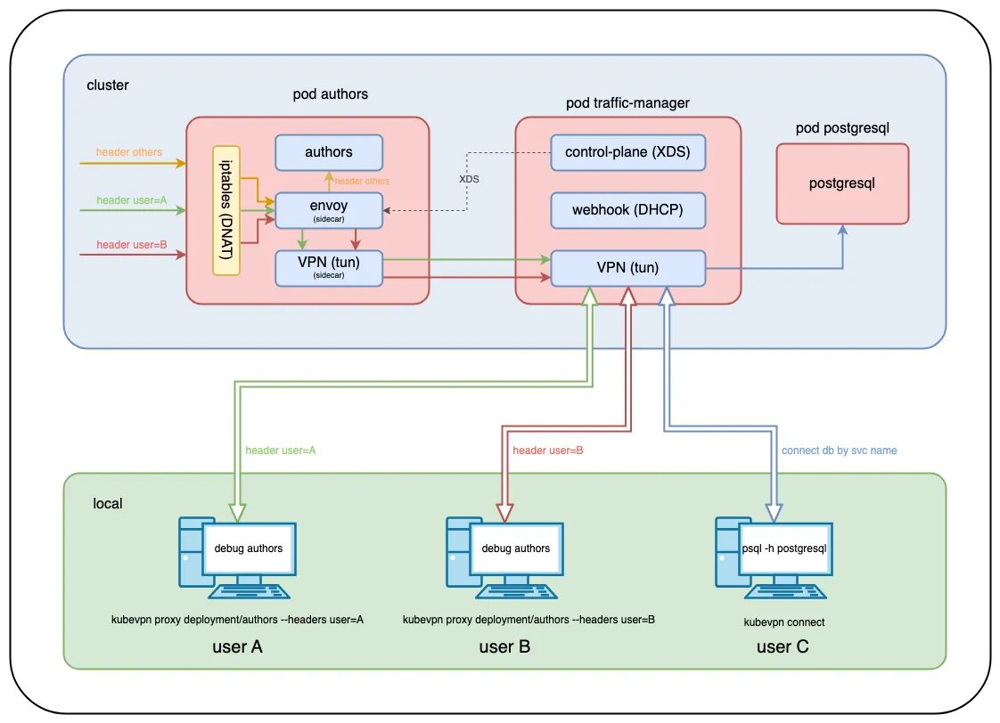

## 1. 개요

#### KubeVPN 란?

`KubeVPN`은 `Kubernetes` 클러스터와 로컬 환경 간의 원활한 네트워크 연결을 제공하는 도구이다. 기존의 port forwarding 방식과는 다음과 같은 차이점이 있다.

| 방식                | 설명                                                         |
| ------------------- | ------------------------------------------------------------ |
| **Port Forwarding** | 특정 포트를 로컬로 전달하여 단일 서비스에 접근 가능하지만, 여러 포트나 복잡한 네트워크 설정이 필요할 경우 불편함 |
| **KubeVPN**         | 전체 네트워크를 클러스터 내부처럼 확장하여 Pod IP 및 네이티브 DNS를 직접 사용 가능 |

#### KubeVPN의 Technical Architecture



`KubeVPN`의 아키텍처는 클러스터 내부와 로컬 환경을 VPN 터널을 통해 연결하여 원활한 통신이 가능하도록 구성된다. 주요 구성 요소는 다음과 같다.

- **Proxy Pod**: 클러스터 내부에서 네트워크 터널링 역할 수행
- **VPN Client**: 로컬 머신에서 클러스터 네트워크로 접근할 수 있도록 설정
- **Traffic Routing**: HTTP 헤더 조건 등을 기반으로 로컬 환경으로 트래픽을 리디렉션

### 1.1 KubeVPN의 주요 특징

1. Direct Cluster Networking

- Pod IP 주소로 직접 통신 가능: 클러스터 내부처럼 Pod 간 네트워크 통신 가능
- Native Kubernetes DNS Resolution: 클러스터에서 제공하는 DNS를 그대로 활용 가능

2. Route Traffic from Cluster to Local Machine

- HTTP 요청 헤더 조건에 따라 트래픽을 로컬 환경으로 리디렉션 가능
- 원활한 디버깅 및 개발을 위한 로컬 환경과 클러스터 간의 네트워크 연결 지원

3. Multi-Cluster 연결 지원

- 여러 개의 `Kubernetes` 클러스터를 동시에 연결하여 통합 네트워크 환경 구성 가능

------

## 2. KubeVPN 사용하는 방법

> `KubeVPN` 사용해보기 위해 로컬환경에서 Minikube로 k8s 클러스터를 실행한다. 
> 참고: [맥에서 Minikube로 로컬 Kubernetes 클러스터 쉽게 구축하기](https://blog.advenoh.pe.kr/맥에서-minikube로-로컬-kubernetes-클러스터-쉽게-구축하기/)

테스트를 위해 샘플 애플리케이션을 배포한다.

```bash
> kubectl apply -f <https://raw.githubusercontent.com/kubenetworks/kubevpn/master/samples/bookinfo.yaml>
```

### 2.1 KubeVPN 설치하기

`Homebrew`를 사용하여 간편하게 설치할 수 있다.

```bash
> brew install kubevpn
```

잘 설치 되었는지 버전을 확인한다.

```bash
> kubevpn version
KubeVPN: CLI
    Version: v2.3.13
    Daemon: unknown
    Image: docker.io/naison/kubevpn:v2.3.13
    Branch: master
    Git commit: brew
    Built time: 2025-02-23 13:42:21
    Built OS/Arch: darwin/arm64
    Built Go version: go1.24.0
```

> 💡 Tip: Alias 설정하기 `KubeVPN` 명령어가 길게 느껴진다면 아래와 같이 `alias`를 설정하면 편리하다.

```bash
> echo 'alias kv="kubevpn"' >> ~/.zshrc
> source ~/.zshrc
> kv version
```

### 2.2 KubeVPN으로 Kubernetes 클러스터 연결하기

`k8s` 클러스터에 연결하려면 다음 명령어를 실행하면 된다.

```bash
> kubevpn connect
Starting connect
Getting network CIDR from cluster info...
Getting network CIDR from CNI...
Getting network CIDR from services...
Labeling Namespace default
Creating ServiceAccount kubevpn-traffic-manager
Creating Roles kubevpn-traffic-manager
Creating RoleBinding kubevpn-traffic-manager
Creating Service kubevpn-traffic-manager
Creating MutatingWebhookConfiguration kubevpn-traffic-manager
Creating Deployment kubevpn-traffic-manager

Pod kubevpn-traffic-manager-75dc49c46f-bpr5b is Pending...
Container     Reason            Message
control-plane ContainerCreating 
vpn           ContainerCreating 
webhook       ContainerCreating 

Pod kubevpn-traffic-manager-75dc49c46f-bpr5b is Running...
Container     Reason           Message
control-plane ContainerRunning 
vpn           ContainerRunning 
webhook       ContainerRunning 

Forwarding port...
Connected tunnel
Adding route...
Configuring DNS service...
Configured DNS service
+----------------------------------------------------------+
| Now you can access resources in the kubernetes cluster ! |
+----------------------------------------------------------+
```

`kubevpn status`로 연결 상태를 확인한다.

```bash
> kubevpn status
ID    Mode   Cluster    Kubeconfig                 Namespace   Status      Netif
0     full   minikube   /Users/user/.kube/config   default     Connected   utun7
```

### 2.3 네트워크 상태 테스트

Pod의 IP 주소를 확인하고 `ping`으로 네트워크 상태를 확인한다.

```bash
> kubectl get pod -o wide
NAME                                       READY   STATUS    RESTARTS   AGE     IP           NODE       NOMINATED NODE   READINESS GATES
authors-54bf85cb9c-qcfww                   2/2     Running   0          2m10s   10.244.0.7   minikube   <none>           <none>
details-7ff4648765-b575k                   1/1     Running   0          2m10s   10.244.0.3   minikube   <none>           <none>
kubevpn-traffic-manager-75dc49c46f-8svpd   3/3     Running   0          19s     10.244.0.9   minikube   <none>           <none>
productpage-84bb8d95cc-clvst               1/1     Running   0          2m10s   10.244.0.6   minikube   <none>           <none>
ratings-dbb78b449-tnzzl                    1/1     Running   0          2m10s   10.244.0.4   minikube   <none>           <none>
reviews-56bf74fbdc-8g5q8                   1/1     Running   0          2m10s   10.244.0.5   minikube   <none>           <none>

> ping 10.244.0.3
PING 10.244.0.3 (10.244.0.3): 56 data bytes
64 bytes from 10.244.0.3: icmp_seq=0 ttl=63 time=4.274 ms
64 bytes from 10.244.0.3: icmp_seq=1 ttl=63 time=9.553 ms
```

서비스 IP 주소로 접근이 안되는 경우에는 `--netstack gvisor` 옵션으로 연결을 해줘야 한다. `k8s` 클러스터 kube-proxy가 `ipvs` 모드를 사용하고 있는 경우 서비스 IP로 접근이 안될 수 있어서 위 옵션으로 연결해서 `gVisor`를 사용하도록 하면 된다.

```bash
> kubevpn connect --netstack gvisor
```

참고

- [Can not access Service IP or Service name, but can access Pod IP?](https://kubevpn.dev/docs/faq/5)

## 3. 마무리

여러 pod에 연결하려면 매번 port forwarding을 해줘야해지만, `KubeVPN` 을 활용하면서 클러스터에 전체 pod에 접속할 수 있어서 원활한 개발 및 디버깅이 가능해졌다

## 4. 참고

- [QuickStart - KubeVPN](https://kubevpn.dev/docs/quickstart/)
- [Using port-forward too often? KubeVPN Can help!](https://www.kubeblogs.com/kubevpn-revolutionizing-kubernetes-local-development/)
- [kubevpn github](https://github.com/kubenetworks/kubevpn)

