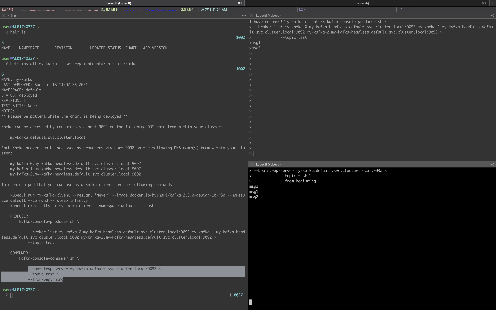

## 1.들어가며

로컬환경에서 헬름으로 Kafka를 설치하는 방법에 대해서 알아보겠습니다.

## 2.Kafka 설치

### 2.1 Helm repo 추가 및 helm으로 설치

Helm Repository에 Bitnami가 없은 경우 아래 명령어로 repository를 추가한다. `helm install` 명령어로 kafka를 설치하면 간단하게 설치가 끝난다.

```bash
$ helm repo add bitnami https://charts.bitnami.com/bitnami

# kafka 설치하기
$ helm install my-kafka bitnami/kafka
```


> 추가 옵션 없이 설치하면 기본적으로 1개의 broker만 생성이 된다. Broker의 개수를 늘리려면 `replicateCount` 옵션에 개수를 입력해서 여러 브로커로 Kakfa를 설치한다.

```bash
$ helm install my-kafka --set replicaCount=3 bitnami/kafka
```

설치 이후 `kubectl`로 설치된 kafka를 확인해보면 잘 되는 것을 볼 수 있다.

```bash
$ kubectl get all
NAME                       READY   STATUS    RESTARTS   AGE
pod/my-kafka-0             1/1     Running   2          4h11m
pod/my-kafka-zookeeper-0   1/1     Running   1          4h11m

NAME                                  TYPE        CLUSTER-IP      EXTERNAL-IP   PORT(S)                      AGE
service/kubernetes                    ClusterIP   10.96.0.1       <none>        443/TCP                      4d22h
service/my-kafka                      ClusterIP   10.98.229.159   <none>        9092/TCP                     4h11m
service/my-kafka-headless             ClusterIP   None            <none>        9092/TCP,9093/TCP            4h11m
service/my-kafka-zookeeper            ClusterIP   10.107.53.255   <none>        2181/TCP,2888/TCP,3888/TCP   4h11m
service/my-kafka-zookeeper-headless   ClusterIP   None            <none>        2181/TCP,2888/TCP,3888/TCP   4h11m

NAME                                  READY   AGE
statefulset.apps/my-kafka             1/1     4h11m
statefulset.apps/my-kafka-zookeeper   1/1     4h11m
```

## 3.Kafka 테스트해보기

Kafka 설치 이후 정상적으로 동작하는지는 간단하게 브로커 서버에 메시지를 보내고 브로커로부터 메시지를 잘 받는지 확인해서 테스트해보자.

### 3.1 Producer - 브로커에 메시지 보내기

헬름으로 Kafka를 설치하면 설치 이후 kafka 브로커에 접속하고 테스트할 방법도 친절하게 터미널에서 알려준다. 가이드받은 내용으로 동일하게 테스트를 한다.

```bash
# Kafka client 용 pod를 실행한다
$ kubectl run my-kafka-client --restart='Never' --image docker.io/bitnami/kafka:2.7.0-debian-10-r109 --namespace default --command -- sleep infinity

# kafka client pod에 접속한다
$ kubectl exec --tty -i my-kafka-client --namespace default -- bash
```

`kafka-console-producer.sh` 스크립트를 실행하면 `test` 토픽에 메시지를 계속 쓸 수가 있다. 메시지는 broker에 계속 쌓이게 된다.

```bash
$ kafka-console-producer.sh \
--broker-list my-kafka-0.my-kafka-headless.default.svc.cluster.local:9092 \
--topic test

hello
world
```


### 3.2 Consumer - 브로커로부터 메시지 받기

브로커로부터 메시지를 받기 위해서 별도 터머널에서 kafka client pod에 접속한다.

```bash
$ kubectl exec --tty -i my-kafka-client --namespace default -- bash
```

지금까지 kafka에 저장된 메시지를 모두 받으려면 `--from-beginning` 옵션 사용해서 확인한다.

```bash
$ kafka-console-consumer.sh \
--bootstrap-server my-kafka.default.svc.cluster.local:9092 \
--topic test \
--from-beginning
```

## 4. 정리

본 포스팅에서는 헬름 차트로 쉽게 Kafka를 설치해보고 kafka client pod에 포함된 여러 script를 사용해서 메시지를 보내고 받는 테스트까지 해보았습니다. 다음 시간에 `kafkacat` utility 명령어로도 동일하게 아래와 같이 테스트가 가능합니다. `kafkacat`에 대한 사용 방법은 다음 포스팅에서 기다려주세요.

```bash
$ kafkacat -b my-kafka.default.svc.cluster.local:9092 -t test -C
```

> bitnami/kafka 이미지는 non-root 도커 이미지라서 root 권한으로 다른 패키지를 설치를 할 수 없는 듯하다. (혹시 방법을 아시는 분은 댓글 부탁드립니다)
>
> 참고로 저는 다른 도커 이미지를 사용해서 kafkacat를 설치했습니다.
>
> $ kubectl run -i --tty ubuntu --image=ubuntu:16.04 --restart=Never -- bash -il
>
> $ apt-get update && apt-get install kafkacat

테스트해보았던 화면으로 마무리하겠습니다. 오늘도 수고하셨습니다 :)



## 5. 참고

- https://artifacthub.io/packages/helm/bitnami/kafka

