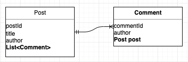

## 1. 들어가며

JPA 연관관계 매핑에 대한 내용은 [JPA 연관관계 매핑 정리](https://blog.advenoh.pe.kr/jpa-연관관계-매핑-정리/) 포스팅을 참고해주세요. 이번 포스팅에서는 JPA에서 가장 자주 사용하는 다대일(N:1)과 그 반대 방향인 일대다(1:N) 연관관계에 대해서 알아보겠습니다.

> - Post (일)
> - Comment (다)
    >   - 테이블에서는 다쪽에 외래 키가 존재한다
>   - 양방향 관계에서는 다쪽이 연관관계의 주인이 된다
>


## 2. 개발 환경

작성한 샘플 코드는 아래 깃허브 링크를 참고해주세요.

* OS : Mac OS
* IDE: Intellij
* Java : JDK 1.8
* Source code : github
    * [단방향](https://github.com/kenshin579/tutorials-java/tree/master/springboot-jpa-many-to-one-unidirectional)
    * [양방향](https://github.com/kenshin579/tutorials-java/tree/master/springboot-jpa-many-to-one-bidirectional)
* Software management tool : Maven

## 3. 다대일 (N:1) 연관관계

### 3.1 다대일 연관관계

#### 3.1.1 다대일 단방향

Post와 Comment 코드를 보면서 알아보겠습니다.


Post 엔티티에는 연관관계 관련 어노테이션은 없습니다.

```java
@Getter
@Setter
@Entity
@NoArgsConstructor
@Table(name = "post")
public class Post extends DateAudit {
    @Id
    @GeneratedValue(strategy = GenerationType.IDENTITY)
    @Column(name = "post_id")
    private Long postId;

    private String title;
		...(생략)...
     
    @Lob
    private String content;
		...(생략)...
}
```

```java
@Getter
@Setter
@Entity
@NoArgsConstructor
@Table(name = "comment")
public class Comment extends DateAudit {
    @Id
    @GeneratedValue(strategy = GenerationType.IDENTITY)
    @Column(name = "comment_id")
    private Long commentId;
		...(생략)...

    //연관관계 매팽
    @ManyToOne
    @JoinColumn(name = "post_id")
    private Post post;
  	...(생략)...
}
```

Comment 엔티티에만 Post 필드가 있어서 @ManyToOne 어노테이션으로 단방향으로 관계를 맺습니다.

- @ManyToOne
    - 다대일 관계로 설정한다
- @JoinColumn
    - 외래 키인 post_id를 지정한다

JoinColumn과 ManyToOne 옵션 설정에 대한 설명은 다음과 같습니다.

##### 3.1.1.1 @JoinColumn의 속성

@JoinColumn 어노테이션은 외래 키를 매핑할 때 사용하는 어노테이션이고 기본 속성은 다음과 같습니다.

| 속성                                                         | 설명                                                         |
| ------------------------------------------------------------ | ------------------------------------------------------------ |
| name                                                         | 매핑할 외래 키의 이름을 지정할 때 사용한다<br />기본 값 : 필드명 + _ + 참조하는 테이블의 컬럼명 (ex. post_post_id) |
| referenceColumnName                                          | 외래 키가 참조하는 대상 테이블의 컬럼명을 의미한다<br />기본 값 : 테이블의 기본 키 컬럼명(ex. post_id) |
| unique<br />nullable<br />insertable<br />updatable<br />columnDefinition<br />table | @Column의 속성과 같다                                        |

##### 3.1.1.2 @ManyToOne의 속성

@ManyToOne 어노테이션은 다대일 연관관계로 매핑할 때 사용되고 속성에 따라서 쿼리 구문 생성이 조금씩 다르게 생성됩니다. 조회하는 경우에는 쿼리가 어떻게 생성이 되는지 로그로 확인할 필요가 있습니다.

| 속성         | 설명                                                         |
| ------------ | ------------------------------------------------------------ |
| optional     | true이면 해당 객체에 null이 들어갈 수 있다는 의미이다. <br />참고로 @Column 어노테이션에서도 nullable=true로 세팅해도 null이 들어갈 수 있다<br />기본 값 : true<br />옵션 설정에 따라 select 구문 쿼리 어떻게 생성되는지 [FAQ 4.3](https://blog.advenoh.pe.kr/jpa-다대일-many-to-one-연관관계/#43-ManyToOne-옵션-중에-optional-속성이-true-false인-경우에-쿼리-구문이-어떻게-다르게-생성이-되나)을 참고해주세요<br /> |
| fetch        | fetchType이 EAGER이면 연관된 엔티티를 바로 로딩한다. <br />fetchType이 LAZY이면 연관된 엔티티를 바로 로딩하지 않고 실제로 해당 객체를 조회할 때 해당 엔티티를 로딩한다<br />기본값 <br />@ManyToOne=FetchType.EAGER<br />@OneToMany=FetchType.LAZY |
| cascade      | 영속성 전이 설정을 할 수 있다. 설정 값은 아래 cascadeType을 참고해주세요. |
| targetEntity | 연관된 언테티의 타입 정보를 설정하는데 거의 사용하지 않는다. |

##### 3.1.1.3 CascadeType의 값

> Post(부모) -> Comment(자식)

Cascade 옵션은 부모 엔터티를 영속 상태로 만들 때 연관관계로 맺어진 자식 엔터티도 함께 영속 상태로 만들어 주고 싶을 때 설정할 수 있는 기능입니다. 여러 값은 다음과 같이 설정할 수 있습니다.

Post와 Comment관계에서는 별도로 cascade 설정은 하지 않았습니다. Post를 생성할 때 Comment는 없을 수 있으니까요.

| 속성 값 | 설명                                                         |
| ------- | ------------------------------------------------------------ |
| PERSIST | 부모 엔티티를 저장할 때 자식 엔터티도 같이 저장된다.         |
| REMOVE  | 부모 엔티티를 삭제하면 자식 엔터티도 같이 삭제된다.          |
| DETACH  | 부모 엔티티가 detach 상태로 되면 자식 엔터티도 같이 detach 되어 변경사항이 반영되지 않는다. |
| REFRESH | 부모 엔터티가 DB로부터 데이터를 다시 로드하면 자식 엔터티도 DB로부터 데이터를 다시 로딩한다 |
| MERGE   | 부모 엔티티가 detach 상태에서 자식 엔터티를 추가/변경한 이후에 부모 엔티티가 merge를 수행하면 자식 엔터티도 변경사항이 적용된다. |
| ALL     | 모두 cascade 옵셕이 전용된다.                                |

지금까지 ManyToOne 어노테이션에서 적용할 수 있는 여러 옵션을 알아보았습니다. 다대일로 설계한 엔터티가 제대로 저장/조회가 잘되는지 Unit Test에서 확인합니다.

Post 객체를 하나를 생성하고 저장이 잘되었는지 조회해서 실제 저장 값을 확인합니다.

```java
@Slf4j
@RunWith(SpringRunner.class)
@DataJpaTest
public class PostRepositoryTest {
    @Autowired
    private PostRepository postRepository;

    @Test
    public void save_post_확인() {
        postRepository.save(Post.builder()
                .title("title1")
                .author("frank")
                .likeCount(5)
                .content("content").build());
        List<Post> posts = postRepository.findAll();
        assertThat(posts.get(0).getTitle()).isEqualTo("title1");
    }
}
```

Comment 엔티티도 저장하고 조회해보겠습니다. Post 객체도 생성해서 저장합니다.

```java

@Slf4j
@RunWith(SpringRunner.class)
@DataJpaTest
public class CommentRepositoryTest {
    @Autowired
    private CommentRepository commentRepository;

    @Autowired
    private PostRepository postRepository;

    @Test
    public void save_post_comment_확인() {
        Post post = postRepository.save(Post.builder()
                .title("title")
                .author("postAuthor")
                .likeCount(5)
                .build());

        Comment comment = Comment.builder()
                .author("frank")
                .content("content").build();
        comment.setPost(post);

        commentRepository.save(comment);
        List<Comment> comments = commentRepository.findAll();

        assertThat(comments.get(0).getAuthor()).isEqualTo("frank");
        assertThat(comments.get(0).getPost().getAuthor()).isEqualTo("postAuthor");
    }
}
```

#### 3.1.2 다대일 양방향

다대일 양방향은 Post와 Comment 엔터티에 서로를 참조하는 필드가 존재합니다.



Post와 Comment 코드를 보면서 양방향인 경우에는 코드가 어떻게 달라지는 지 알아보겠습니다.

```java
@ToString(exclude = "post")
@Entity
@Table(name = "comment")
public class Comment extends DateAudit {
    @Id
    @GeneratedValue(strategy = GenerationType.IDENTITY)
    @Column(name = "comment_id")
    private Long commentId;
		...(생략)...

    //연관관계 매팽
    @ManyToOne
    @JoinColumn(name = "post_id", nullable = false)
    private Post post; //연관관계의 주인이 된다
		...(생략)...
}
```

Comment 엔티티는 기존과 같습니다.

```java
@Entity
@Table(name = "post")
public class Post extends DateAudit {
    @Id
    @GeneratedValue(strategy = GenerationType.IDENTITY)
    @Column(name = "post_id")
    private Long postId;
  	...(생략)...

    //양방향 연관관계 설정
    @JsonIgnore //JSON 변환시 무한 루프 방지용
    @OneToMany(mappedBy = "post", fetch = FetchType.LAZY)
    private List<Comment> comments = new ArrayList<>();
		...(생략)...
}
```
Post -> Comment는 일대다인 관계로 @OneToMany 어노테이션을 사용했고 List<Comment> comments 컬렉션으로 선언하였습니다.

##### 3.1.2.1 연관관계 주인

테이블은 외래 키 하나만 존재하는 반면에 객체를 양방향으로 설정하면 외래 키를 관리하는 곳이 2곳이 생깁니다. 한쪽에서만 관리하도록 하기 위해서 연관관계 주인을 설정할 필요가 있습니다.

다대일에서는 다 쪽이 연관관계 주인이 되므로 @OneToMany에서 mappedBy 속성의 값으로 연관관계 주인을 지정해줘야 합니다. 코드에서는 comments는 연관관계 주인이 아니므로 mappedBy로 Comment 엔티티에 있는 post가 연관관계의 주인이라고 선언하여 알려줍니다.

- 연관관계 주인 (ex. Comment.post)
    - 여기서만 연관관계를 설정할 수 있다.
        - new Comment().setPost(new Post())
    - 엔티티 매니저는 연관관계 주인 (ex. Comment.post)를 통해서만 외래 키를 관리한다
    - DB에 반영이 된다
- 연관관계 주인 아님 (ex. Post.comments)
    - 순수한 객체에서만 관리되도록 한다
        - post.getComments().add(new Comment())
    - DB에 반영이 안된다

##### 3.1.2.2 연관관계 편의 메서드

```java
comment.setPost(post); //(1) 코멘트 -> 포스트
post.getComments().add(comment); //(2) 포스트 -> 코멘트 - 저장시 사용되지 않는다
```

양방양으로 설정하여 DB뿐만이 아니라 객체 저장/조회 시에도 제대로 반영하기 위해서 위와 같은 코드를 작성해줘야 합니다. 하지만, 실수로 post.*getComments*().add(commnet)를 호출하지 않아 양방향이 깨질 수 도 있습니다. 이를 방지 하기 위해서 연관관계 설정 시 실수 없이 설정하도록 편의 메서드를 작성하는 게 좋습니다.

```java
public class Comment extends DateAudit {
	public void setPost(Post post) {
    if (this.post != null) { //기존 포스트 관계를 제거함
			this.post.getComments().remove(this);
    }
    this.post = post;
    post.getComments().add(this);
  }
}
```


> 편의 메서드는 한 곳에만 작성하거나 양쪽 다 작성할 수 있다. 하지만, 양쪽에 다 작성하는 경우에는 무한루프에 빠지지 않도록 체크 조건문을 작성하도록 하자.

```java
public class Comment extends DateAudit {
  	...(생략)...
    public void setPost(Post post) {
        this.post = post;
        //무한루프에 빠지지 않도록 체크
        if (!post.getComments().contains(this)) {
            post.getComments().add(this);
        }
    }
}
```

```java
public class Post extends DateAudit {
    ...(생략)...
    public void addComment(Comment comment) {
        this.comments.add(comment);
        //무한루프에 빠지지 않도록 체크
        if (comment.getPost() != this) {
            comment.setPost(this);
        }
    }
}
```


### 3.2 주의사항

#### 3.2.1 무한 루프에 빠지는 경우

영방향 매핑때에는 무한 루프에 빠질 수 있어서 주의가 필요합니다. 예를 들어 Comment.toString()에서 getPost()를 호출하게 되면 무한 루프에 빠질 수 있습니다.

- 엔티티를 JSON으로 변환하는 경우
    - [Jackson에서 Infinite Recursion에 해결하는 방법](https://blog.advenoh.pe.kr/jackson에서-infinite-recursion-이슈-해결방법/)을 참고해주세요
- toString() 사용시
    - Lombok 라이브러리 사용시에도 발생할 수 있어 toString(exclude={##, ##})으로 제외시킨다

## 4. FAQ

### 4.1 언제 양반향, 단방향을 사용해야 하나?

비지니스 로직에 따라서 무엇을 사용할 지 결정하면 됩니다.

- 단반향

    - ex. 주문상품(고객이 주문한 상품 정보) -> 상품 (상품에 대한 정보)
    - 주문상품에서 상품에 대한 정보를 참조할 일은 많지만, 상품이 주문상품에 대해서 참조할 일은 거의 없어서 단반향으로 설정할 수 있다

- 양반향

    - ex. 부서 -> 직원, 직원 -> 부서
    - 직원이 어느 부서에서 근무하는 지를 알기 위해서 알고 싶고 또한 한 부서에 어떤 직원이 있는지 도 알고 싶은 경우에는 양반향으로 설정할 수 있다

어느 것을 사용할지 확실하지 않을 때는 우선 단방향으로 매핑을 사용하고 반대 반향으로 객체 그래프 탐색이 필요한 경우에는 양방향으로 변경해서 사용하면 됩니다.

### 4.2 fetch = FetchType.LAZY로 설정하면 언제 데이터를 로딩해서 가져오게 되는가?

- 즉시 로딩
    - 연관관계 맺어진 엔티티를 무조건 즉시 조회한다. JOIN을 사용해서 한번에 조회한다.
- 지연 로딩
    - 연관관계 맺어진 엔티티를 프록시를 통해서 나중에 조회한다. 실제 연관 엔티티를 사용할 때 프록시를 초기화 하면서 데이터베이스에서 조회한다.

##### 4.2.1 즉시 로딩

@ManyToOne 어노테이션은 fetch 옵션 FetchType.EAGER 기본값으로 설정되어 Comment 엔티티 조회 시 무조건 Post 객체를 가져옵니다.

```java
@Table(name = "comment")
public class Comment extends DateAudit {
		...(생략)...   
    @ManyToOne
    @JoinColumn(name = "post_id")
    private Post post;
}
```


```java
@Test
public void save_post_comment_확인_eager_loading() throws JsonProcessingException {
  Post post = postRepository.save(Post.builder()
                                  .title("title")
                                  .author("postAuthor")
                                  .likeCount(5)
                                  .build());

  Comment comment = Comment.builder()
    .author("frank")
    .content("content").build();
  comment.setPost(post);

  commentRepository.save(comment);

  Comment foundComment = commentRepository.findById(1L).get(); //이때 JOIN해서 Post 객체도 가져온다.
  assertThat(foundComment.getAuthor()).isEqualTo("frank");

  assertThat(foundComment.getPost().getAuthor()).isEqualTo("postAuthor");
}
```

findById() 메서드 실행시 Comment와 Post를 JOIN해서 데이터를 가져오는 것을 확인할 수 있습니다.

```sql
select comment0_.comment_id as comment_1_0_0_, comment0_.create_dt as create_d2_0_0_, comment0_.updated_dt as updated_3_0_0_, comment0_.author as author4_0_0_, comment0_.content as content5_0_0_, comment0_.post_id as post_id6_0_0_, post1_.post_id as post_id1_1_1_, post1_.create_dt as create_d2_1_1_, post1_.updated_dt as updated_3_1_1_, post1_.author as author4_1_1_, post1_.content as content5_1_1_, post1_.like_count as like_cou6_1_1_, post1_.title as title7_1_1_ from comment comment0_ inner join post post1_ on comment0_.post_id=post1_.post_id where comment0_.comment_id=?
```


#### 4.2.2 지연 로딩

fetch 옵션에 FetchType.LAZY로 설정하면 Comment 엔터티 조회시 바로 DB에서 Post 엔티티를 조회하지 않습니다.

```java
@Table(name = "comment")
public class Comment extends DateAudit {
		...(생략)...   
    @ManyToOne(fetch=FetchType.LAZY)
    @JoinColumn(name = "post_id")
    private Post post;
}
```

```java
@Transactional
@Test
public void save_post_comment_확인_lazy_loading_test() throws JsonProcessingException {
  Post post = postRepository.save(Post.builder()
                                  .title("title")
                                  .author("postAuthor")
                                  .likeCount(5)
                                  .build());

  Comment comment = Comment.builder()
    .author("frank")
    .content("content").build();
  comment.setPost(post);

  commentRepository.save(comment);

  Comment foundComment = commentRepository.findById(1L).get();
  assertThat(foundComment.getAuthor()).isEqualTo("frank");

  Post foundPost = foundComment.getPost(); //(1) 객체 그래프 탐색
  String author = foundPost.getAuthor(); //(2) 팀 객체 실제 사용
  assertThat(author).isEqualTo("postAuthor");
}
```

(1)에서 Post 엔티티를 가져올 때 조회되지 않고 Post 객체를 실제 사용하는 getAuthor() 메서드가 호출될 때 DB에서 오게 됩니다.

> (2)를 호출하면 select 구문은 실행되지 않지만, author를 잘 가져오는 것을 확인할 수 있습니다. 조회 대상이 영속 컨텍스트에 이미 존재 하기 때문에 프록시로 DB를 호출하여 반환하지 않고 객체를 바로 반환해주고 있습니다.

### 4.3 @ManyToOne 옵션 중에 optional 속성이 true, false인 경우에 쿼리 구문이 어떻게 다르게 생성이 되나?

#### 4.3.1 @ManyToOne (optional=true)인 경우 - 선택적인 관계

기본값이 optional=true이기 때문에 Post 객체는 null이 될 수 있습니다. @JoinColumn의 nullable=true(기본값) 속성인 경우에도 null로 저장될 수 있다는 의미이기도 합니다.

```java
@Table(name = "comment")
public class Comment extends DateAudit {
		...(생략)...   
    @ManyToOne
    @JoinColumn(name = "post_id")
    private Post post;
}
```

```java
Comment foundComment = commentRepository.findById(1L).get();
```

select 구문으로 조회하면 null을 포함될 수 있어서 아래와 같이 LEFT OUTER JOIN으로 생성됩니다.

```sql
Hibernate: select comment0_.comment_id as comment_1_0_0_, comment0_.create_dt as create_d2_0_0_, comment0_.updated_dt as updated_3_0_0_, comment0_.author as author4_0_0_, comment0_.content as content5_0_0_, comment0_.post_id as post_id6_0_0_, post1_.post_id as post_id1_1_1_, post1_.create_dt as create_d2_1_1_, post1_.updated_dt as updated_3_1_1_, post1_.author as author4_1_1_, post1_.content as content5_1_1_, post1_.like_count as like_cou6_1_1_, post1_.title as title7_1_1_ from comment comment0_ left outer join post post1_ on comment0_.post_id=post1_.post_id where comment0_.comment_id=?
```


#### 4.3.2 @ManyToOne(optional=false) 인 경우 - 필수적인 관계

optional=true로 지정하면 Post 객체는 null이 될 수 없기 때문에 필수적으로 포함되어야 합니다. @JoinColumn(nullable=false) 어노테이션 사용하는 경우에도 같습니다.

```java
@Table(name = "comment")
public class Comment extends DateAudit {
		...(생략)...   
    @ManyToOne(optional=false)
    @JoinColumn(name = "post_id")
    private Post post;
}
```
select 쿼리 구문을 보면 INNER JOIN으로 생성이 됩니다.

```sql
select comment0_.comment_id as comment_1_0_0_, comment0_.create_dt as create_d2_0_0_, comment0_.updated_dt as updated_3_0_0_, comment0_.author as author4_0_0_, comment0_.content as content5_0_0_, comment0_.post_id as post_id6_0_0_, post1_.post_id as post_id1_1_1_, post1_.create_dt as create_d2_1_1_, post1_.updated_dt as updated_3_1_1_, post1_.author as author4_1_1_, post1_.content as content5_1_1_, post1_.like_count as like_cou6_1_1_, post1_.title as title7_1_1_ from comment comment0_ inner join post post1_ on comment0_.post_id=post1_.post_id where comment0_.comment_id=?
```

엔티티의 속성 구성후 쿼리 구문을 로그로 확인하면서 원하는 쿼리인 지 확인하는 습관이 필요합니다.

## 5. 정리

JPA 연관관계에서 가장 기본이 되는 다대일 관계에 대해서 알아보았습니다. 이외에도 일대일 그리고 다대다 관계도 익숙해질 수 있도록 시리즈 포스팅에서 알아보겠습니다.

## 6. 참고

- JPA - one-to-many mapping
    - [https://www.callicoder.com/hibernate-spring-boot-jpa-one-to-many-mapping-example/](https://www.callicoder.com/hibernate-spring-boot-jpa-one-to-many-mapping-example/)
    - [https://www.baeldung.com/hibernate-one-to-many](https://www.baeldung.com/hibernate-one-to-many)
    - [https://jdm.kr/blog/141](https://jdm.kr/blog/141)
- ManyToOne 옵션
    - fetch
        - https://victorydntmd.tistory.com/210
    - optional
        - https://feco.tistory.com/102
        - https://whiteship.tistory.com/1152
    - cascade
        - [http://chomman.github.io/blog/java/jpa/programming/jpa-cascadetype-%EC%A2%85%EB%A5%98/](http://chomman.github.io/blog/java/jpa/programming/jpa-cascadetype-종류/)
- LazyInitializationException
    - [https://bebong.tistory.com/entry/JPA-Lazy-Evaluation-LazyInitializationException-could-not-initialize-proxy-%E2%80%93-no-Session](https://bebong.tistory.com/entry/JPA-Lazy-Evaluation-LazyInitializationException-could-not-initialize-proxy-–-no-Session)
- H2 옵션
    - [https://www.h2database.com/javadoc/org/h2/engine/DbSettings.html](https://www.h2database.com/javadoc/org/h2/engine/DbSettings.html)
- 책 : 자바 ORM 표준 JPA 프로그래맹
    - <a href="http://www.yes24.com/Product/Goods/19040233?scode=032&OzSrank=2"></a>
- 책 : JPA 프로그래밍 입문
    - <a href="http://www.yes24.com/Product/Goods/41787023?scode=029"></a>
