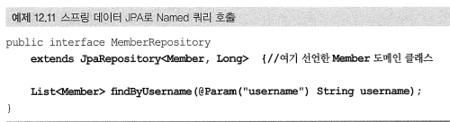

개인적으로 모르는 부분 적어두고 알게 되는 부분에 대해서 간단하게 정리해둔 자료입니다.
미 답변중에 알고 계신 부분 있으면 코멘트 달아주세요. 감사합니다.

## Q&A 전체 목록

### [답변완료]

### 1. @EntityListeners 이란?

엔티티를 DB에 적용하기 전후로 Custom 콜백을 요청할 수 있는 어노테이션입니다.

참고
* [http://clearpal7.blogspot.com/2017/03/entitylisteners.html](http://clearpal7.blogspot.com/2017/03/entitylisteners.html)

### 2. @PostLoad

@PostLoad 어노테이션은 엔티티를 로딩한 후에 호출 할 메서드를 설정하는 어노테이션입니다.

참고
* [https://docs.jboss.org/hibernate/orm/4.0/hem/en-US/html/listeners.html](https://docs.jboss.org/hibernate/orm/4.0/hem/en-US/html/listeners.html)
* [https://docs.jboss.org/hibernate/orm/4.0/hem/en-US/html/listeners.html](https://docs.jboss.org/hibernate/orm/4.0/hem/en-US/html/listeners.html)

### 3. 자동으로 schema 생성하려면 설정을 어떻게 바꿔야 하나?

persistence.xml 파일에서 hibernate 설정에 hiberate.hbm2ddl.auto 속성을 아래와 같이 추가하면 됩니다.
* value
    * create : 매번 실행할 때마다 table을 삭제하고 다시 생성한다
    * update : 테이블 없는 경우에는 테이블을 생성한다

### 4. JPA에서 객체를 수정하면 기본으로 모든 필드 값을 포함해서 UPDATE SQL 문구가 생성되는데, 수정한 속성만 업데이트하려면 어떻게 설정을 해야 하나?

저장할 필드가 너무 많은 경우에는 수정된 데이터만 포함해서 UPDATE SQL 문구를 생성하려면 @DynamicUpdate 어노테이션을 클래스에 선언하면 됩니다.

추가로 @DynamicInsert는 필드 값이 존재하는 필드(null이 아닌)만 포함해서 INSERT SQL 구문을 생성 할 때 사용됩니다.

### 5. @Transactional

클래스나 메서드에 어노테이션을 선언하면 외부에서 클래스의 메서드를 호출 할때 트랜잭션을 시작하고 메서드 실행이 끝나면 트랜잭션을 커밋해주는 어노테이션입니다.

@Transactional은 Unchecked Exception(ex. RuntimeException 하위 예외)인 겨우에만 rollback을 하고 Checked Exception 예외에도 롤백을 적용하려면 @Transactional(rollbackFor = Exception.class) 처럼 rollback을 직접 지정해줘야 합니다.

@Transactional 어노테이션은 보통 비지니스 로직이 있는 서비스 계층에서 사용합니다. 이 어노테이션을 유닛테스트 작성시 사용하면 각각의 테스트를 실행 할 때마다 트랜잭션을 시작하고 테스트가 끝나면 트랜잭션을 강제로 롤백합니다.

참고
* Checked Exception vs Unchecked(Runtime) Exception
    * [http://www.nextree.co.kr/p3239/](http://www.nextree.co.kr/p3239/)

### 6. @Convert란

JPA에서 convertor를 사용해서 엔티티의 데이터를 변환해서 DB에 저장하고 저장한 데이터를 조회할 때도 convertor를 통해서 변환해서 값을 가져올 수 있습니다.

아래 예를 보면 MediaInfoLive 엔티티의 movieRatioTp 필드에 @Convert 어노테이션을 적용해서 DB에 저장되기 직전에 LiveMovieRatioConvertor 클래스가 동작하도록 선언하였습니다. 필드뿐만이 아니라 클래스나 글로벌하게도 적용 가능합니다.

* convertToDatabaseColumn() : 조금 더 작성이 필요함
* convertToEntityAttributes() : 조금 더 작성이 필요함

### 7. findOne이 호출이 안될 때가 있는 것 같은데 왜 그런가?

스프링부트 1.5.x에서 2.0.x로 넘어가면서 JPA의 `findOne()` 호출은 `findById()`나 `getOne()` 메서드를 사용해서 호출해야 합니다.

참고

- [https://hspmuse.tistory.com/entry/springboot-15x-%EC%97%90%EC%84%9C-springboot-20x-%EB%84%98%EC%96%B4%EA%B0%80%EB%A9%B4%EC%84%9C-%EC%83%9D%EA%B8%B4%EC%9D%BC](https://hspmuse.tistory.com/entry/springboot-15x-에서-springboot-20x-넘어가면서-생긴일)
- https://stackoverflow.com/questions/49316751/spring-data-jpa-findone-change-to-optional-how-to-use-this/49317013

- - - -

### [미 답변 질문]

#### -  @Modifying란
- DML (삭제, 수정)인 경우에는 @Modifying 어노테이션을 추가해야 함. 하지않으면 Not Supported for DML operation 오류가 발생함

* [https://winmargo.tistory.com/208](https://winmargo.tistory.com/208)
* [https://www.baeldung.com/spring-data-jpa-modifying-annotation](https://www.baeldung.com/spring-data-jpa-modifying-annotation)

#### -  @Param란?

- 이름기반 파라미터를 바인디할 때 사용하는 어노테이션임?

#### -  객체의 연관관계를 매핑하려면 객체에서 양쪽 방향을 모두 관리해야 함… 왜 그런가?
- 객체의 양방향 연관관계는 양쪽 모든 관계를 맺어줘야 하는데 왜 그런가?
- 연관관계 편의 메서드…

#### -  @NotFound(action = NotFoundAction.IGNORE)은 언제 사용하나?

참고

* [http://javafreakers.com/notfoundactionnotfoundaction-ignore-annotation-example/](http://javafreakers.com/notfoundactionnotfoundaction-ignore-annotation-example/)
* [https://lyb1495.tistory.com/91](https://lyb1495.tistory.com/91)

#### - referencedColumnName는 언제 사용하나?

비식별자 연관관계 일때 사용한다. 아래 예제어서는 media_info_live 테이블에서 live_seqno(PK) 대신 media_seqno로 join하기 위해서 추가했다.

참고

- [https://larva.tistory.com/entry/JPA%EC%97%90%EC%84%9C-ManyToOne-%EA%B4%80%EA%B3%84%EC%97%90%EC%84%9C-%EB%B9%84%EC%8B%9D%EB%B3%84%EC%BB%AC%EB%9F%BC%EA%B3%BC-%EA%B4%80%EA%B3%84%EC%8B%9C-%EB%A7%B5%ED%95%91](https://larva.tistory.com/entry/JPA에서-ManyToOne-관계에서-비식별컬럼과-관계시-맵핑)

