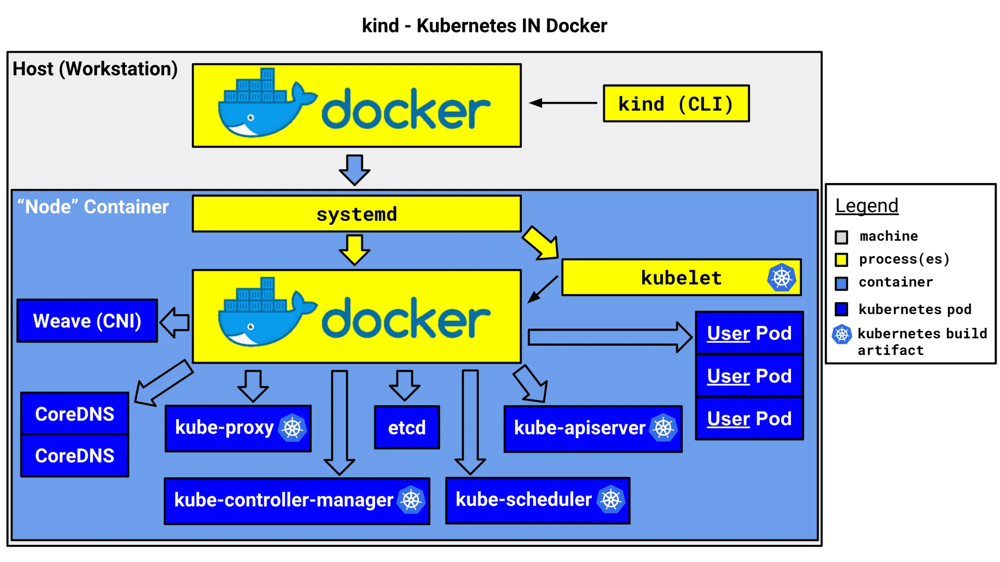

# 1. 개요

### Kind란?

`Kind`(Kubernetes in Docker)는 Docker 컨테이너 내에서 `Kubernetes` 클러스터를 실행할 수 있도록 도와주는 도구이다. 로컬 환경에서 빠르게 `Kubernetes` 클러스터를 실행하고 테스트하는 데 유용하다.

### Kind의 아키텍처 구조

`Kind`는 `Kubernetes` 노드를 `Docker` 컨테이너로 실행하는 방식으로 동작한다. 다음은 `Kind`의 기본 아키텍처 구조이다.



- 각 노드는 Docker 컨테이너로 실행되며, 내부에서 `kubelet`, `kube-proxy`, `etcd`, `kube-apiserver` 등의 핵심 Kubernetes 컴포넌트를 구동한다
- CNI를 사용하여 네트워크를 구성하고, CoreDNS를 활용하여 DNS를 제공하낟
- 이 방식은 로컬 개발 환경에서 가벼운 Kubernetes 클러스터를 실행하기에 적합하며, CI/CD 테스트 환경으로도 많이 활용된다

### 다른 Kubernetes 도구와의 차이점

| 항목              | `Kind`                             | `Minikube`                               | `Docker Desktop Kubernetes` | `Rancher Desktop`         |
| ----------------- | ---------------------------------- | ---------------------------------------- | --------------------------- | ------------------------- |
| 실행 방식         | Docker 컨테이너 기반               | 가상화 기반 (Docker, VirtualBox 등 지원) | Docker 내장 K8s 기능 활용   | 여러 K8s 배포판 선택 가능 |
| 성능              | 가볍고 빠름                        | 다양한 환경 지원, 다소 무거움            | Mac/Windows에서 최적화됨    | 다소 무거움               |
| LoadBalancer 지원 | 기본적으로 미지원 (추가 설정 필요) | 기본적으로 미지원 (추가 설정 필요)       | 기본 제공                   | 기본 제공                 |
| 사용 용도         | 개발 및 테스트 환경                | 개발 및 로컬 테스트 환경                 | 로컬 개발 및 간단한 테스트  | 다양한 K8s 환경 실습      |
| 설치 난이도       | 간단함                             | 비교적 쉬움                              | 기본적으로 포함됨           | 다소 설정 필요            |

# 2. 맥 로컬환경에서 `Kind`로 `Kubernetes` 클러스터 구성하기

이제 실제로 `Kind`를 사용하여 `Kubernetes` 클러스터를 구축하고, Echo Server를 배포한 후 외부에서 접근해보보자. 개인적으로 집에서 Mac Mini에 `Kubernetes` 클러스터 구성하고 여러 애플리케이션을 포트 기반으로 접근하고 있다.

## 2.1 필요 조건 및 Kind 설치

`Kind`는 macOS 환경에서도 실행할 수 있으며, Homebrew를 사용하여 쉽게 설치할 수 있다.

```bash
> brew install kind
> kind version
kind v0.27.0 go1.24.0 darwin/arm64
```

## 2.2 Kubernetes 클러스터 생성

다음과 같은 Kind 설정 파일(`kind-config.yaml`)을 생성하여 **외부에서 접근할 포트**를 설정한다.

```yaml
kind: Cluster
apiVersion: kind.x-k8s.io/v1alpha4
nodes:
  - role: control-plane
    extraPortMappings:
      - containerPort: 30028
        hostPort: 30028
        protocol: TCP
      - containerPort: 30029
        hostPort: 30029
        protocol: TCP
      - containerPort: 30030
        hostPort: 30030
        protocol: TCP
```


`Kiind`로 `Kubernetes` 클러스터 구성시 `Docker`가 필수적으로 필요하다. 이제 클러스터를 생성해보자.

```bash
# Docker Desktop 실행
> open /Applications/Docker.app

# cluster 생성
> kind create cluster --config kind-config-nodeport.yaml
Creating cluster "kind" ...
 ✓ Ensuring node image (kindest/node:v1.32.2) 🖼
 ✓ Preparing nodes 📦
 ✓ Writing configuration 📜
 ✓ Starting control-plane 🕹️
 ✓ Installing CNI 🔌
 ✓ Installing StorageClass 💾
Set kubectl context to "kind-kind"
You can now use your cluster with:

kubectl cluster-info --context kind-kind

Have a nice day! 👋
```

클러스터가 잘 생성이 되었는지 확인한다.

```bash
> kc cluster-info --context kind-kind                                                                                                              ✔  1341  10:32:22
Kubernetes control plane is running at <https://127.0.0.1:53837>

To further debug and diagnose cluster problems, use 'kubectl cluster-info dump'.

> kc get nodes                                                                                                                                     ✔  1344  10:44:31
NAME                 STATUS   ROLES           AGE   VERSION
kind-control-plane   Ready    control-plane   12m   v1.32.2
```

## 2.3 Echo Server 애플리케이션 배포

클러스터에 Echo Server를 배포해서 외부에서 잘 접근되는지 확인해본다. Echo Server를 배포하는 `Kubernetes` YAML 파일(`echo-server.yaml`)이다.

```yaml
apiVersion: apps/v1
kind: Deployment
metadata:
  name: echo-server
spec:
  replicas: 1
  selector:
    matchLabels:
      app: echo-server
  template:
    metadata:
      labels:
        app: echo-server
    spec:
      containers:
      - name: echo-server
        image: ealen/echo-server
        ports:
        - containerPort: 80
---
apiVersion: v1
kind: Service
metadata:
  name: echo-server
spec:
  type: NodePort
  selector:
    app: echo-server
  ports:
    - protocol: TCP
      port: 80
      targetPort: 80
      nodePort: 30028
```

`kubectl apply` 명령어로 manifest로 서버를 생성한다.

```bash
> kubectl apply -f echo-server-nodeport.yaml
deployment.apps/echo-server created
service/echo-server created
```

### 외부에서 Echo Server 접근

Echo Server가 정상적으로 배포되었는지 확인한다.

```bash
> kubectl get pods
NAME                           READY   STATUS    RESTARTS   AGE
echo-server-65c776974c-fm654   1/1     Running   0          6d5h

> kubectl get svc echo-server
NAME          TYPE        CLUSTER-IP     EXTERNAL-IP   PORT(S)        AGE
echo-server   NodePort    10.96.81.130   <none>        80:30028/TCP   6d5h
kubernetes    ClusterIP   10.96.0.1      <none>        443/TCP        6d5h
```

Echo Server에 `curl` 로 API를 호출을 해보자.

```bash
> curl <http://localhost:30028>
{"host":{"hostname":"localhost","ip":"::ffff:10.244.0.1","ips":[]},"http":{"method":"GET","baseUrl":"","originalUrl":"/","protocol":"http"},"request":{"params":{"0":"/"},"query":{},"cookies":{},"body":{},"headers":{"host":"localhost:30080","user-agent":"curl/8.7.1","accept":"*/*"}},"environment":{"PATH":"/usr/local/sbin:/usr/local/bin:/usr/sbin:/usr/bin:/sbin:/bin","HOSTNAME":"echo-server-65c776974c-fm654","NODE_VERSION":"20.11.0","YARN_VERSION":"1.22.19","KUBERNETES_SERVICE_HOST":"10.96.0.1","KUBERNETES_SERVICE_PORT":"443","KUBERNETES_PORT":"tcp://10.96.0.1:443","KUBERNETES_PORT_443_TCP_PROTO":"tcp","ECHO_SERVER_SERVICE_PORT":"80","ECHO_SERVER_PORT_80_TCP_ADDR":"10.96.81.130","KUBERNETES_PORT_443_TCP":"tcp://10.96.0.1:443","KUBERNETES_PORT_443_TCP_PORT":"443","ECHO_SERVER_PORT":"tcp://10.96.81.130:80","ECHO_SERVER_PORT_80_TCP_PROTO":"tcp","KUBERNETES_PORT_443_TCP_ADDR":"10.96.0.1","ECHO_SERVER_PORT_80_TCP":"tcp://10.96.81.130:80","ECHO_SERVER_PORT_80_TCP_PORT":"80","KUBERNETES_SERVICE_PORT_HTTPS":"443","ECHO_SERVER_SERVICE_HOST":"10.96.81.130","HOME":"/root"}}
```

------

# 3. 마무리

이번 글에서는 `Kind`를 이용하여 Mac에서 `Kubernetes` 클러스터를 구성하고, Echo Server를 배포하여 외부에서 접근하는 방법을 다뤘다. 다른 Kubernetes 도구와 비슷하게 매우 쉽게 클러스터 생성하고 애플리케이션 배포도 쉽다는 것을 확인할 수 있었다.

이제 Kind를 활용하여 다양한 `Kubernetes` 애플리케이션을 테스트해보세요! 🚀

# 4. 참고

- [로컬 Kubernetes 클러스터 - kind 설치](https://kmaster.tistory.com/26)
- [kind](https://kind.sigs.k8s.io/)
