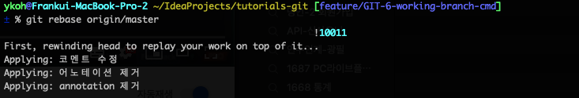

## 1. 들어가며

Git Rebase 하는 방법에 대해서 알아보겠습니다. Merge와 다르게 Rebase는 한 브랜치에 커밋된 여러 commit을 그래도 다른 브랜치에 병합할 수 있는 방식입니다. 아래와 같은 시나리오는 개발하면서 자주 하게됩니다. 새로 업데이트된 master 브랜치의 여러 커밋 내용을 현재 작업 중인 브랜치로 가져와서 개발을 계속하는 경우가 종종 있지요.

**Rebase 시나리오**

1. 개발자1
    1. master에서 새로운 작업 브랜치 (feature/GIT-7-working-branch)를 생성한다
    2. feature/GIT-7-working-branch에서 코드을 수정한다
2. 개발자2
    1. master에서 새로운 작업 브랜치(feature/GIT-8)를 생성한다
    2. 코드를 수정하고 master로 merge를 한다
3. 개발자1
    1. 최신 코드를 master로 부터 받아서 개발을 하도록 rebase를 진행한다

Git Client 프로그램 중에서 개인적으로 자주 사용하는 [GitKraken](https://www.gitkraken.com/) 으로 Rebase를 해보고 또한 실제 git 명령어로도 같이 알아보겠습니다.

## 2. 개발 환경

* OS : Mac OS
* GUI
    * IDE : Intellij
    * Git Client : [Gitkraken](https://www.gitkraken.com/)
* Source code : [github](https://github.com/kenshin579/tutorials-git)

## 3. Rebase 하기

먼저 GitKraken를 사용해서 rebase를 해보고 git 명령어로도 터미널에서 직접 rebase를 해보도록 하겠습니다.

### 3.1 Git Kraken로 rebase 방식으로 병합하기

#### 3.1.1 기능별로 브랜치를 생성하기

Frank 개발자는 master로부터 feature/GIT-6-working-branch 이름의 새로운 브랜치를 생성하고 기능 개발을 시작합니다. 새로운 브랜치는 아래 스텝으로 브랜치를 생성합니다.

_master 브랜치를 선택 > 오른쪽 클릭 > Create branch here 선택 > feature/GIT-6-working-branch 브랜치 이름 입력_

#### 3.1.1.1 Frank 개발자 코드 수정후 commt하기

Frank 개발자는 체크아웃 이후에 코드 수정 후 3개의 커밋을 push합니다.


##### 3.1.1.2 Joe 개발자 코드 수정후 commit하기

Joe 개발자도 다른 기능을 개발을 위해서 master로부터 새로운 브랜치 (feature/GIT-7)을 생성합니다.

코드 수정이후 3가지를 커밋을 했어요.


변경된 코드를 master에 반영하기 위해서 pull request (pr)를 생성합니다. GitKraken에서 아래 메뉴에서 pr을 생성할 수 있습니다.

_master 브랜치 선택 > 오른쪽 클릭 > Start a pull request to origin_master from origin_feature/GIT-7 클릭 > pr 내용 입력 (ex. 제목, 내용등등)_


Pull request을 생성하면 Github 사이트로 바로 갈 수 있는 링크가 생성이 되어 링크버튼을 클릭하여 Github 사이트로 들어갑니다. Merge pull request 버튼을 클릭하여 병합을 진행합니다.


코드상 Conflict가 없어서 merge 하면 바로 성공 메시지가 뜹니다.


Joe가 커밋한 내용(feature/GIT-7)은 master에 잘 반영되었네요.


#### 3.1.2 Rebase로 최신 master로 rebase로 합병하기

Joe 개발자에 의해 커밋된 최신 코드를 현재 Frank 개발자가 개발 중인 feature/GIT-6-working-branch로 가져와 보도록 할게요.

_master 브랜치 선택 후 > 오른쪽 클릭 > 아래 둘중에 하나를 선택_

* Rebase feature/GIT-6-working-branch onto master 클릭
* Interactive Rebase feature/GIT-6-working-branch onto master 클릭
    * 이 메뉴를 선택하면 여러 커밋을 선택적으로 Rebase 시킬 수 있다 (참고 : 3.1.3)


Rebase를 하면 feature/GIT-6-working-branch 커밋 내용이 master 브랜치에 커밋 내용 다음에 오는 것을 볼 수 있습니다.


master 브랜치에 가져올 내용이 3개가 있고 pull로 커밋을 가져온 이후 push를 하면 병합이 완료됩니다.


remote/GIT-6-working-branch로 push한 결과입니다. GIT-6-working-branch에서 작업한 내용 (ex. annotation 제거, 어노테이션 제거, 코멘트 수정)이 master 브랜치 커밋 내용 다음으로 커밋되었네요.


#### 3.1.3 Interactive 하게 Rebase 하기

같은 상황에서 여러 방식으로 rebase를 테스트해보기 위해 같은 지점에서 여러 브랜치(ex. GIT-6-working-branch-*)를 미리 생성해 두었어요.


Rebase를 interactive하게 진행하면 아래와 같이 커밋한 내용을 선택적으로 포함시킬지 시키지 않을 지 rebase 시점에 결정할 수 있습니다. 이 예제에서는 Start Rebase 버튼을 클릭해서 전체 커밋을 포함해서 rebase 시킵니다.


일반적인 방식으로 rebase한 결과와 같습니다.


### 3.2 Git Command로 직접 rebase해보기

Git Client를 사용하면 쉽게 브랜치를 생성하고 병합할 수 있지만, Git 명령어도 같이 알아보겠습니다.

#### 3.2.1 작업 브랜치로 전환하기

작업 브랜치로 전환합니다.

```bash
$ git checkout GIT-6-working-branch-cmd
```


#### 3.2.2 Rebase 하기

아래 명령어로 현재 작업 브랜치를 master로 rebase 시킵니다. 매우 간단하죠?

```bash
$ git rebase origin/master
```



Git Kraken에서 rebase한 내용을 보면 결과가 같은 것을 확인할 수 있습니다.


### 3.3 Merge로 병합하기

Rebase를 하면 지금까지 커밋한 여러 내용이 유지가 되어 history가 남게 되는 반면에 Merge로 병합을 하는 경우에는 여러 커밋이 하나의 커밋 내용으로 병합되기 때문에 커밋 history를 잃어버리게 되는 단점이 있습니다. 결과적으로 어떻게 다른지 GitKraken에서 merge로 병합을 해보겠습니다.

_master 선택후 > 오른쪽 클릭 > Merge master into feature/GIT-6-working-branch-merge-test_


master 브랜치에 커밋된 내용이 통째로 GIT-6-working-branch-merge-test로 merge가 되었습니다.


## 4. 결론

Git Client와 터미널상에서 rebase 병합을 진행해보았습니다. 둘 다 쉽게 rebase를 할 수 있고 개인적인 취향에 맞게 가장 익숙한 방식으로 진행하면 될 것 같습니다. 추가로 병합 시 merge와 rebase의 차이점도 간단하게 알아보았는데요. master의 커밋 history를 남기는 상태에서 병합하고 싶은 경우에는 merge 대신에 같이 알아보았던 rebase 방식으로 병합을 하면 되겠습니다.

## 5. 참고

* Rebase란
    * [https://git-scm.com/book/ko/v1/Git-브랜치-Rebase하기](https://git-scm.com/book/ko/v1/Git-%EB%B8%8C%EB%9E%9C%EC%B9%98-Rebase%ED%95%98%EA%B8%B0)
* Rebase vs Merge
    * [https://elegantcoder.com/git-merge-or-rebase/](https://elegantcoder.com/git-merge-or-rebase/)
* Rebase in GitKaren
    * [https://blog.axosoft.com/rebasing-gitkraken-vs-cli/](https://blog.axosoft.com/rebasing-gitkraken-vs-cli/)
* Rebase는 언제 해야 하나?
    * [http://dogfeet.github.io/articles/2012/git-merge-rebase.html](http://dogfeet.github.io/articles/2012/git-merge-rebase.html)
* 명령어로 직접 rebase하기
    * [https://git-scm.com/book/ko/v1/Git-브랜치-Rebase하기](https://git-scm.com/book/ko/v1/Git-%EB%B8%8C%EB%9E%9C%EC%B9%98-Rebase%ED%95%98%EA%B8%B0)
