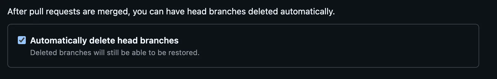

# 개요

`Git`을 사용하여 코드 버전 관리를 하다 보면, 작업을 위해 새로운 브랜치를 생성하고 작업한 후 `Merge` 한 뒤에도 로컬에 사용되지 않는 브랜치들이 계속 남아 있게 된다.

원격(Remote) 브랜치의 경우, GitHub의 설정에서 `Automatically delete head branches` 옵션을 활성화하면 자동으로 삭제할 수 있다



하지만 로컬(Local) 브랜치는 자동으로 삭제되지 않으며, 매번 수동으로 해야 한다. 번거로움을 덜어주기 위해서 간단하게 스크립트를 작성해본다.

> 스크립트 작성은 `ChatGPT`의 도움을 받았다. 요세 요구사항만 잘 전달해주면 완벽한 스크립틀 작성해주고 있어서 너무 잘 사용하고 있다.

# Usage

### 명령어 사용법

- `-i` 옵션이 있는 경우에는 `interactive` 하게 실행하도록 되어 있어 로컬 브랜치를 삭제하기전에 `confirm` 확인을 받고 삭제하도록 되어 있다

```bash
> cleanup_prune_local_branches.sh -h
/Users/user/bin/cleanup_prune_local_branches.sh: 잘못된 옵션 -- h
Usage: cleanup_prune_local_branches.sh [-i]
-i: Enable interactive mode with confirmation prompt for each branch deletion
```

### 실행 예제

```bash
> cleanup_prune_local_branches.sh -i 

Deleting local branch: chore/throttle
=======[WARN] Are you sure you want to delete unused branch ? [y/N] y
Delete branch...chore/throttle...
Deleted branch chore/throttle (was 696ca70ec).

Deleting local branch: dev-tmp
=======[WARN] Are you sure you want to delete unused branch ? [y/N] y
Delete branch...dev-tmp...
Deleted branch dev-tmp (was a615ec3d6).

Deleting local branch: feat/#1987-integration
=======[WARN] Are you sure you want to delete unused branch ? [y/N] n
cancelled.

Deleting local branch: feat/#1987-robot-path-order
=======[WARN] Are you sure you want to delete unused branch ? [y/N]
```

## Source Code

다음은 해당 스크립트의 전체 소스 코드이다.

```bash
#!/usr/bin/env bash

IGNORE_BRANCHES=("chores")
INTERACTIVE_MODE=false

# 명령줄 옵션 파싱
while getopts "i" opt; do
  case $opt in
    i)
      INTERACTIVE_MODE=true
      ;;
    *)
      echo "Usage: $(basename "$0") [-i]"
      echo "-i: Enable interactive mode with confirmation prompt for each branch deletion"
      exit 1
      ;;
  esac
done

confirm() {
  local branch=$1
  read -r -p "=======[WARN] Are you sure you want to delete unused branch $branch? [y/N] " response
  case "$response" in
    [yY][eE][sS]|[yY])
      echo "Delete branch...$branch..."
      git branch -D "$branch"
      ;;
    *)
      echo "Skipping branch '$branch'..."
      return 1
      ;;
  esac
}

# 최신 원격 브랜치 목록 가져오기
git fetch --prune

# 현재 체크아웃된 브랜치 확인
current_branch=$(git symbolic-ref --short HEAD)

# 로컬 브랜치 목록 순회
for branch in $(git branch --format '%(refname:short)'); do
    # 현재 브랜치는 건너뛰기
    if [[ "$branch" == "$current_branch" ]]; then
        continue
    fi

    # 제외할 브랜치 확인
    skip_branch=false
    for ignore in "${IGNORE_BRANCHES[@]}"; do
        if [[ "$branch" == "$ignore" ]]; then
            echo "Skipping ignored branch: $branch"
            skip_branch=true
            break
        fi
    done

    if [[ "$skip_branch" == true ]]; then
        continue
    fi

    # 원격에 없는 브랜치 삭제
    if ! git show-ref --quiet "refs/remotes/origin/$branch"; then
        echo "Found local branch with no remote: $branch"
        if [[ "$INTERACTIVE_MODE" == true ]]; then
            confirm "$branch"
        else
            echo "Deleting branch...$branch..."
            git branch -D "$branch"
        fi
    fi
done
```

이 스크립트를 활용하면 로컬에서 불필요한 Git 브랜치를 효과적으로 정리할 수 있다.
