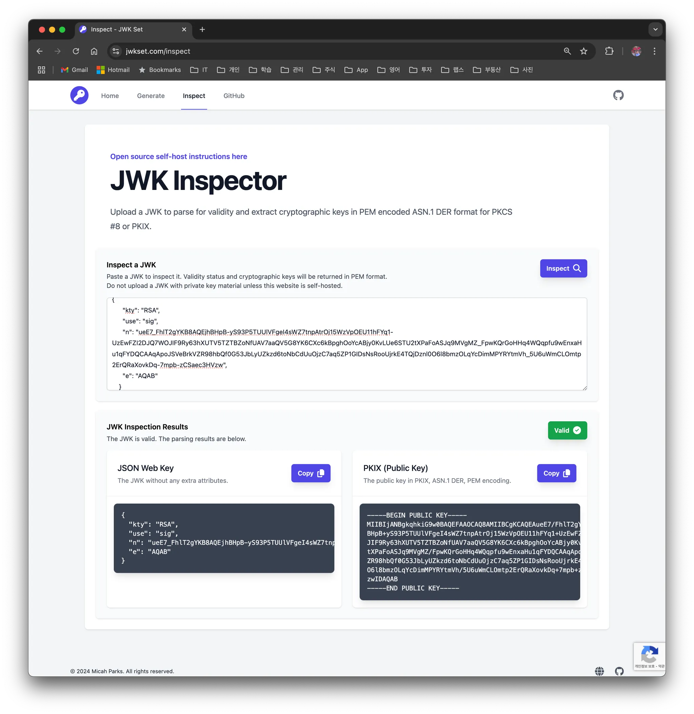

## 1. 개요

`JWT`(JSON Web Token)는 웹 애플리케이션에서 인증 및 정보 교환을 안전하게 수행하기 위해 사용된다. `JWT`는 자체적으로 정보를 담고 있으며, 일반적으로 사용자 식별 및 권한 정보를 포함한다. `JWT`는 보통 사용자 인증, 사용자 정보에 사용되고 웹 애플리케이션에서 안전한 인증을 위해 사용할 수 있는 도구이다.

`JWT`의 핵심은 서명을 통해 토큰의 무결성을 보장하는 것이다. JWT의 서명에는 대칭 암호화(`HMAC`) 와 비대칭 암호화(`RSA`, EC`)` 방식을 사용할 수 있다.

- 대칭 암호화(`HMAC`, 예: `HS256`): 같은 비밀 키(secret key)를 사용하여 서명과 검증을 수행한다
- 비대칭 암호화(`RSA`, `EC`, 예: RS256, ES256): 개인 키로 서명하고 공개 키로 검증한다

비대칭 암호화 방식을 사용할 경우, 클라이언트가 `JWT`의 서명을 검증할 수 있도록 `JWK` Endpoint를 제공하여 공개 키를 공유하기도 한다. 이때 사용되는 것이 `JWKS`(JSON Web Key Set)이다.

`JWKS`는 `JSON` 형식으로 공개 키를 제공하는 표준 규격으로, 클라이언트는 이를 통해 `JWT`의 서명을 검증할 수 있다. 이 글에서는 `JWKS`의 개념, 구조, 구현 방법, 그리고 실전 사용 사례에 대해 살펴본다.

## 2. `JWKS`에 대해서 알아보자

### 2.1 `JWK` vs `JWKS`

- `JWK`  (JSON Web Key)
  - JSON 형식으로 표현된 단일 키(비대칭 키 쌍의 공개 키 또는 대칭 키)이다
  - JWK는 키의 식별자, 키 타입, 알고리즘 등과 같은 메타데이터를 포함한다

- `JWKS` (JSON Web Key Set)
  - JWKS는 JWK를 여러 개 포함한 키의 집합이다
  - 보통 HTTPS를 통해 노출되는 엔드포인트에서 제공되며, 클라이언트는 이를 통해 JWT를 검증한다.

### 2.2 `JWKS` 구조

> 예제. JWKS 응답 구조

```json
{
  "keys": [
    {
      "kty": "EC",
      "crv": "P-256",
      "x": "MKBCTNIcKUSDii11ySs3526iDZ8AiTo7Tu6KPAqv7D4",
      "y": "4Etl6SRW2YiLUrN5vfvVHuhp7x8PxltmWWlbbM4IFyM",
      "use": "enc",
      "kid": "1"
    },
    {
      "kty": "RSA",
      "n": "0vx7agoebGcQSuuPiLJXZptN9nndrQmbXEps2aiAFbWhM78LhWx4cbbfAAtVT86zwu1RK7aPFFxuhDR1L6tSoc_BJECPebWKRXjBZCiFV4n3oknjhMstn64tZ_2W-5JsGY4Hc5n9yBXArwl93lqt7_RN5w6Cf0h4QyQ5v-65YGjQR0_FDW2QvzqY368QQMicAtaSqzs8KJZgnYb9c7d0zgdAZHzu6qMQvRL5hajrn1n91CbOpbISD08qNLyrdkt-bFTWhAI4vMQFh6WeZu0fM4lFd2NcRwr3XPksINHaQ-G_xBniIqbw0Ls1jF44-csFCur-kEgU8awapJzKnqDKgw",
      "e": "AQAB",
      "alg": "RS256",
      "kid": "2011-04-29"
    }
  ]
}
```

`JWKS`는 `JSON` 배열 형태로 `JWK`의 집합을 나타낸다. 각 `JWK` 객체는 다음과 같은 필드를 가질 수 있다.

- `kty` (key type)
  - 이 파라미터는 암호 알고리즘을 식별할 때 사용한다. `RSA`, `EC` 같은 값을 갖는다
  - `REQUIRED`
- `use` (public key use)
  - 이 파라미터는 공개 키(public key) 사용 목적을 식별한다. `sig`(signature), `enc`(encryption) 같은 값을 갖는다
  - `OPTIONAL`
- `alg` (algorithm)
  - 이 파라미터는 키와 함께 사용되는 알고리즘 정보를 식별할 때 사용한
  - `OPTIONAL`
- `kid` (key id)
  - JWKS 객체에 담긴 JWK 객체들은 자신을 구분할 수 있도록 서로 다른 `kid` 값을 가져야 한다
  - `OPTIONAL`
- 추가 속성
  - `kty`과 `alg`에 따라서 추가로 필요한 속성 값이 다르다
  - RSA key type의 경우에는 `n`(public key modulus),`e` (exponent)가 추가로 필요하고 Base64URL로 인코딩된 값이다
  - EC key type인 경우에는 `crv`(curve type), `x`, `y`(coordinates)
  - `OPTIONAL`

### 2.3 JWKS Endpoint

`JWKS`는 보통 `HTTPS`를 통해 제공되며 클라이언트는 이를 활용하여 `JWT`를 검증한다. 일반적으로 `URL` 형식은 다음과 같다.

> JWKS API 주소 포멧
>
> ```
> https://<server_domain>/.well-known/jwks.json
> ```

#### 2.3.1 RSA 공개 키, 개인 키 생성하는 방법

여기서는 비대칭 암호화로 RSA를 사용한다. 공개 키와 개인 키를 생성하기 위해 `openssl` 명령어를 사용한다.

```bash
> openssl genpkey -algorithm RSA -out private.key -pkeyopt rsa_keygen_bits:2048
```

- **파일명**: `private.key`
- **키 크기**: 2048비트 (보안 요구사항에 따라 4096비트로 증가 가능)

개인 키가 생성이 되었고 개인 키에서 다음 명령어로 공개 키를 추출한다.

```bash
> openssl rsa -pubout -in private.key -out public.key
```

- **파일명**: `public.key`
- 개인 키로부터 공개 키를 추출하여 파일에 저장한다

#### 2.3.2 JWKS 생성하기

JWKS 생성은 [JWKSet (MicahParks)](https://github.com/MicahParks/jwkset) 라이브러리를 사용하면 쉽게 구현이 가능하다. 실제로 API endpoint로 구현은 하지 안호 간단한 예제로 unit test 형식으로 작성했다.

```bash
func (suite *jwksTestSuite) generateJWKS() (jwkset.JWKSMarshal, error) {
	pubKey, err := parsePublicKey(suite.publicKey)
	if err != nil {
		return jwkset.JWKSMarshal{}, err
	}

	jwk, err := jwkset.NewJWKFromKey(pubKey, jwkset.JWKOptions{
		Marshal: jwkset.JWKMarshalOptions{
			Private: false,
		},
		Metadata: jwkset.JWKMetadataOptions{
			USE: jwkset.UseSig,
		},
	})
	if err != nil {
		return jwkset.JWKSMarshal{}, err
	}

	if err := suite.jwkCache.KeyWrite(suite.ctx, jwk); err != nil {
		return jwkset.JWKSMarshal{}, err
	}

	jwkMarshal, err := suite.jwkCache.Marshal(suite.ctx)
	if err != nil {
		return jwkset.JWKSMarshal{}, err
	}
	return jwkMarshal, nil
}
```

파싱된 공개 키로부터 `jwkset.NewJWKFromKey` 함수를 사용하여 `JWK`를 생성한다. 생성된 `JWKS`를 메모리 내 JWK cache에 저장하고 `marshal` 하여 데이터를 반환하는 코드이다.

```json
{
  "keys": [
    {
      "kty": "RSA",
      "use": "sig",
      "n": "ueE7_FhlT2gYKB8AQEjhBHpB-yS93P5TUUlVFgeI4sWZ7tnpAtrOj15WzVpOEU11hFYq1-UzEwFZI2DJQ7WOJIF9Ry63hXUTV5TZTBZoNfUAV7aaQV5G8YK6CXc6kBpghOoYcABjy0KvLUe6STU2tXPaFoASJq9MVgMZ_FpwKQrGoHHq4WQqpfu9wEnxaHu1qFYDQCAAqApoJSVeBrkVZR98hbQf0G53JbLyUZkzd6toNbCdUuOjzC7aq5ZP1GIDsNsRooUjrkE4TQjDznl0O6l8bmzOLqYcDimMPYRYtmVh_5U6uWmCLOmtp2ErQRaXovkDq-7mpb-zCSaec3HVzw",
      "e": "AQAB"
    }
  ]
}
```

`JWKS` 생성한 데이터를 보면 위와 같이 나온다.

#### 2.3.3 [jwset.com](http://jwset.com) 소개

`JWKSet` 라이브러리를 개발한 개발자가 추가로 만든 사이트이기도 하다. 웹 상에서 `JWKS`를 직접 생성하고 테스트해볼 수 있는 사이트이다.

- JWK Generator
- JWK Inspector



## 3. FAQ

#### 3.1 공개 키와 개인 키는 각각 언제 어떻게 사용되나?

- 서명(Signature)
  - 서명을 생성하려면 개인 키를 사용한다
  - 서명을 검증하려면 공개 키를 사용한다
  - ex. `JWT`도 개인 키로 암호화하고 공개 키로 `JWT`를 검증할 수 있다
- 암호화(Encryption)
  - 데이터를 보낼 때는 공개 키로 암호화한다
  - 데이터를 복호화할 때는 개인 키를 사용한다

## 4. 마무리

`JWS`와 `JWKS`는 `JWT`를 활용한 인증 시스템에서 필수적인 구성 요소이다. 특히 `JWKS`를 통해 키 관리와 서명 검증을 효율적으로 처리할 수 있다. 본 글이 `JWS`와 `JWKS`의 이해와 구현에 도움이 되길 바란다.

## 5. 참고
- [Understanding JWKS: JSON Web Key Set Explained](https://stytch.com/blog/understanding-jwks/)


