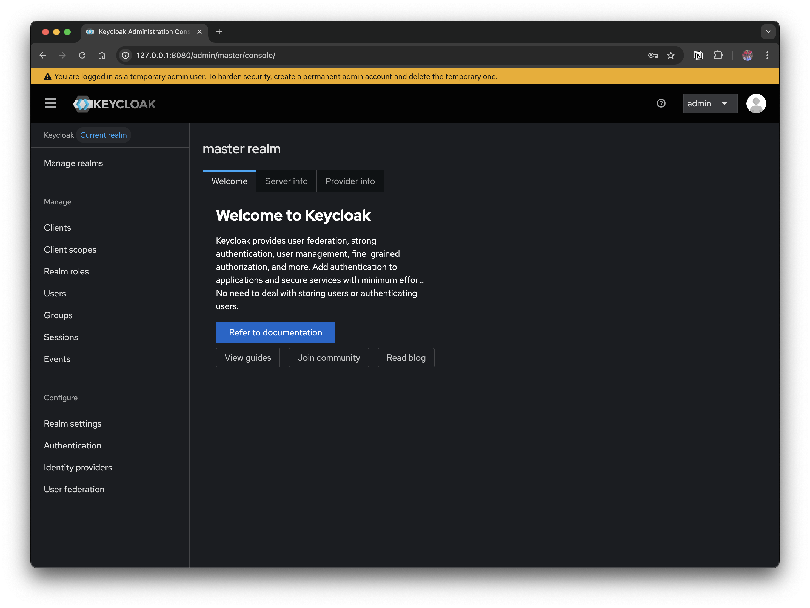

## 1. 개요

회사 내부 서비스에서는 NCP(Naver Cloud Platform) 인증 서버를 사용해 왔지만, 다른 해외 사이트에서는 NCP 인증 서버를 사용할 수 없는 환경에 적용을 해야 해서 인증 로직을 구현하거나, 별도의 솔루션을 도입해야 하는 상황이 생겼었다. 이 과정에서 여러 IAM 솔루션중에 오픈소스 기반으로 널리 사용되고 있는 Keycloak 을 도입하게 되었다.

이 과정에서 여러 IAM 솔루션을 검토하다가, 오픈소스 기반으로 널리 사용되고 있는 Keycloak을 접하게 되었고, 실제로 적용해보기 위해 스터디를 진행했다. 이번 글은 그 과정에서 학습한 내용을 정리한 것으로, Keycloak이 무엇인지, 어떤 기능을 제공하며, 어떻게 구성되어 있는지를 살펴보려 한다.

### Keycloak 이란?

Keycloak은 **Red Hat**에서 주도하는 오픈소스 IAM(Identity and Access Management) 솔루션으로, 사용자 인증과 권한 관리를 통합적으로 처리할 수 있는 플랫폼이다. OAuth 2.0, OpenID Connect, SAML 같은 표준 프로토콜을 지원하며, 로그인, 로그아웃, 세션 관리와 같은 복잡한 인증 로직을 애플리케이션에서 직접 구현하지 않고 Keycloak에 위임할 수 있다. 

> 왜 사용해야 하나?

최근 애플리케이션 환경은 다수의 마이크로서비스, 웹/모바일 클라이언트, 외부 API 연동 등으로 점점 복잡해지고 있다. 이때 각 서비스마다 별도의 로그인 기능을 구현하면 보안 및 유지보수 비용이 커지게 된다. Keycloak 을 사용하면 중앙집중식 인증 관리, Single Sign-On(SSO), 소셜 로그인 연동이 가능하여 보안 강화와 개발 효율성을 동시에 얻을 수 있다. 

#### 주요 기능

- **Single Sign-On (SSO)**: 한 번 로그인으로 여러 애플리케이션 접근
- **소셜 로그인**: Google, Facebook, GitHub 등 연동 가능
- **다양한 인증 프로토콜 지원**: OAuth2, OpenID Connect, SAML
- **User Federation**: 외부 사용자 저장소(LDAP, Kerberos)와 연결하여 사용자 인증, 동기화를 제공
- **Admin Console / REST API**: 직관적인 관리 UI와 API를 통한 자동화
- **MFA(다단계 인증)**: OTP, 이메일, SMS 등 다양한 인증 수단 제공
- **사용자/그룹/역할 관리**: 세분화된 권한 제어 가능
- [다양한 DB 지원](https://www.keycloak.org/server/db): mysql, msqql, oracle 등


#### Keycloak 구성 요소

Keycloak은 인증/인가를 처리하기 위해 여러 핵심 구성 요소를 제공한다. 

- **Realm**: 사용자, 클라이언트, 정책 등을 묶어 관리하는 격리된 공간/영역
- **Client**: Keycloak과 연동되는 애플리케이션(웹, 모바일, API 서버 등)
- **User / Group / Role**: 사용자와 권한 구조 정의
- **Authentication Flow**: 로그인 과정에서 어떤 단계를 거칠지 정의 (예: 아이디/비밀번호 + OTP)
- **Protocol Mapper**: 토큰에 사용자 속성/권한 등을 매핑

## 2. 로컬환경에서 Keycloak 인증 서버 구축해보기

로컬환경에서 도커를 활용해 몇 분 안에 Keycloak 인증 서버를 띄워서 어드민 콘솔에 접속해봅니다

### 2.1 Keycloak 설치

Keycloak 서버를 구동하는 방법은 여러 가지가 있다. Keycloak 소스 코드를 다운로드 받아 직접 구동할 수도 있지만, 여기서는 가장 간단한 방법으로 도커로 실행한다. 

#### 2.1.1 Keycloak 도커 실행

```bash
> docker run -p 127.0.0.1:8080:8080 \
   -e KC_BOOTSTRAP_ADMIN_USERNAME=admin \
   -e KC_BOOTSTRAP_ADMIN_PASSWORD=admin \
   quay.io/keycloak/keycloak:26.3.3 start-dev
```

> 옵션에 대한 설명

- `-e KC_BOOTSTRAP_ADMIN_USERNAME`, `KC_BOOTSTRAP_ADMIN_PASSWORD`:
  - Keycloak 관리 콘솔에 로그인할 때 사용할 초기 관리자 계정/비밀번호 지정
- `start-dev`:
  - 개발 모드(dev mode)로 Keycloak을 실행
  - TLS/캐시/클러스터링 같은 운영 환경 설정은 생략되어 빠르게 시작 가능
  - 실습/로컬 테스트 시 가장 적합

참고

- https://www.keycloak.org/getting-started/getting-started-docker

#### 2.1.2 어드민 컨솔에 로그인


http://localhost:8080 에 접속해 `admin` / `admin` 으로 로그인한다.



admin으로 로그인하면 Keycloak 을 설정할 수 있는 어드민 페이지가 로딩된다. 다음 섹션에서 인증 서버로 사용하기 위해 기본적으로 설정해야 하는 부분을 다룬다. 


### 2.2 Keycloak 설정

Keycloak을 인증 서버로 활용하려면 최소한의 기본 설정이 필요하다. 여기서 말하는 기본 설정은 **내 애플리케이션에서 Keycloak 로그인 화면으로 리디렉션** → **로그인 성공 후 토큰 발급** 까지 가능한 상태를 만드는 것을 목표로 한다.

#### 1. Realm 생성

- **Realm**은 Keycloak의 인증 단위이다
  - 사용자, 클라이언트, 정책이 모두 Realm 단위로 관리되므로 프로젝트별, 환경별로 **Realm**을 분리하는 것이 일반적이다
- **Manage realms** → **Create realm** 버튼 클릭해서 myrealm 같은 이름으로 생성한다


#### 2. Client 등록

- **Client**는 `Keycloak`과 연동되는 애플리케이션을 의미한다
  - 웹앱, API 서버 등 `Keycloak`을 통해 인증할 대상이 여기에 해당한다
- **Clients** → **Create client** 버튼을 클릭해서 아래 값으로 클라이언트를 생성한다
  - **Client ID**: `myclient`
  - **Authentication flow**: `Standard flow` (기본 값으로 설정 되어 있음)
  - **Access settings**
    - **Valid redirect URIs**: `http://localhost:3000/*`
    - **Valid post logout redirect URIs**: `http://localhost:3000/*`
    - **Web origins**: `http://localhost:3000`


**Authentication Flow**: 기본적으로 **Standard Flow** 가 활성화되어 있다. 이는 OAuth 2.0의 **Authorization Code Flow** 에 해당하며, 가장 안전하고 널리 사용되는 방식이다.

>  옵션에 대한 설명

- **Client authentication**
  -  클라이언트가 토큰을 요청할 때 **자격 증명(client_id + client_secret)** 을 반드시 사용하도록 할지 여부이다
     -  `Off`: 클라이언트가 공개(Public) 앱일 때 (SPA 등)
     -  `On`: 클라이언트가 Confidential 앱(백엔드 서버)일 때

- **Authorization**
  - Keycloak의 **Authorization Services**(정책 기반 접근 제어, UMA 2.0 지원)를 활성화할지 여부이다. 주로 세밀한 권한 제어가 필요한 경우 사용한다

- **Authentication flow**
  - 클라이언트가 어떤 OAuth2/OIDC 플로우를 사용할지 정의한다. (아래 표 참고)

- **PKCE Method**
  - `PKCE`(Proof Key for Code Exchange)를 어떤 방식으로 사용할지 선택한다
    - 권장: `S256` (SHA-256 해시 기반)

  - Public Client (예: SPA, 모바일 앱)에서는 **필수적으로 PKCE 사용**을 권장한다


#### Authentication flow 옵션 정리

| 옵션                                     | OAuth2 대응                                 | 설명                                                         | 사용 사례                       |
| ---------------------------------------- | ------------------------------------------- | ------------------------------------------------------------ | ------------------------------- |
| **Standard flow**                        | Authorization Code Flow                     | 가장 안전하고 권장되는 방식. Authorization Code → Token 교환 과정에서 서버가 관여 | 웹 앱(React, Vue) + 백엔드 서버 |
| **Implicit flow**                        | Implicit Flow (Deprecated)                  | 브라우저에서 토큰을 직접 받는 방식. 토큰 노출 위험으로 최신 앱에서는 권장되지 않음 | 구형 SPA, 테스트 용도           |
| **Direct access grants**                 | Resource Owner Password Credentials         | 사용자가 앱에 직접 ID/PW 입력 → 앱이 토큰 요청. 보안상 위험  | CLI 툴, 레거시 환경             |
| **Service accounts roles**               | Client Credentials Flow                     | 사용자 없이 클라이언트(앱) 자체가 인증. 주로 B2B API 통신에서 사용 | 마이크로서비스 간 통신          |
| **Standard Token Exchange**              | Token Exchange (RFC 8693)                   | 받은 토큰을 다른 토큰으로 교환. 마이크로서비스 간 권한 위임 시 유용 | 게이트웨이/프록시 토큰 변환     |
| **OAuth 2.0 Device Authorization Grant** | Device Code Flow                            | 디바이스(스마트 TV 등)에서 브라우저 없는 환경에서 인증 시 사용 | IoT 기기, TV 앱                 |
| **OIDC CIBA Grant**                      | Client Initiated Backchannel Authentication | 백채널로 사용자 인증을 요청하는 플로우. 금융/보안 특화 환경  | Open Banking, 고보안 인증       |


**Access settings**에서 반드시 설정해야 할 값이다. 

- **Valid Redirect URIs**
  - 로그인 후 토큰 교환이 완료되면 사용자를 돌려보낼 수 있는 URI 목록이다 (ex. `http://localhost:3000/*`)
  - 등록된 URI와 일치하지 않으면 `invalid redirect_uri` 오류 발생
- **Valid post logout redirect URIs**
  - 사용자가 로그아웃을 마친 뒤 리디렉션될 수 있는 URI 목록이다 (ex. `http://localhost:3000/*`)
  - 이 값이 비어 있으면 로그아웃 후 Keycloak의 기본 로그인 화면으로 돌아오며, 애플리케이션으로 자동 리디렉션되지 않는다
- **Web Origins**
  - 브라우저 기반 애플리케이션(CORS 요청)에서 허용할 도메인이다 (ex. `http://localhost:3000`)


#### 3. 사용자(User) 생성

인증 테스트를 위해 최소 한 명의 사용자가 필요하다. 새로운 사용자를 생성한 이후 암호를 설정하면 된다. 

- **Users** → **Create new user** 버튼을 클릭한다
  - Username: `myuser`
  - Email, First, Last Name을 입력한다
- 사용자 생성 후 **Credentials 탭**에서 비밀번호 설정한다


사용자 생성 후 **Credentials 탭**에서 비밀번호를 직접 설정해야 로그인 가능하다. 초기에는 `Temporary` 옵션을 꺼 두는 게 편하다. (켜두면 첫 로그인 시 비밀번호 변경을 요구한다)

## 2.3 Keycloak 인증 예제 샘플 코드

여기까지 하면 **Realm + Client + User** 가 준비된 상태가 된다. 이제 클라이언트 애플리케이션에서 `Keycloak` 로그인 화면으로 리디렉션하고, 사용자가 로그인하면 토큰을 받아 인증 플로우를 이어갈 수 있다. 

예제 코드의 기본 흐름은 다음과 같다.

1. **로그인 시작**: 사용자가 "Keycloak으로 로그인" 버튼 클릭
2. **리다이렉트**: Keycloak 인증 서버로 자동 리다이렉트
3. **콜백 처리**: 라우트에서 Authorization Code 수신 `/callback`
4. **토큰 교환**: Code를 Access Token + Refresh Token으로 교환
5. **사용자 정보 획득**: Keycloak UserInfo API 호출
6. **프로필 페이지**: 인증 완료 후 로 이동 `/profile`

전체 샘플 코드는 GitHub에서 확인할 수 있다.

- [Keycloak 예제 코드 (Go)](https://github.com/kenshin579/tutorials-go/tree/master/keycloak)

## 4. FAQ

#### 4.1 OAuth 2.0 vs OpenID Connect

#### OAuth 2.0

- **무엇인가?** → **인가(Authorization) 프레임워크**

  - 리소스 소유자(사용자)가 클라이언트 앱에 대해, 보호된 리소스(API)에 접근할 수 있도록 권한을 위임하는 메커니즘이다.

- **목적:** "이 앱이 내 데이터를 대신 사용할 수 있게 허용할까?"를 해결

- **결과:** → 액세스 토큰(Access Token) 발급

  (API 호출 시 "이 사용자가 승인한 요청"임을 증명)

- **한계:** 사용자 **누구인지(identity)** 에 대한 정보는 제공하지 않음.

  - 즉, "이 토큰은 구글 캘린더를 쓸 수 있다"까지는 알 수 있어도, **사용자가 누구인지**는 알 수 없음

#### OpenID Connect (OIDC)

- **무엇인가?** → OAuth 2.0을 기반으로 만든 **인증(Authentication) 프로토콜**

  OAuth의 인가에 더해, 사용자 식별(로그인)을 표준화한다.

- **목적:** "이 사람이 누구인지 확인하고, 인증된 사용자 정보(ID)를 전달할까?"

- **결과:** → Access Token + **ID Token(JWT)** 발급

  (ID Token에는 사용자 ID, 이메일, 이름 등 클레임이 포함)

- **추가 기능**

  - UserInfo Endpoint로 프로필 조회 가능
  - 표준화된 `scope` (`openid`, `profile`, `email`) 제공

| 구분             | OAuth 2.0                                     | OpenID Connect (OIDC)                       |
| ---------------- | --------------------------------------------- | ------------------------------------------- |
| 초점             | 인가(Authorization)                           | 인증(Authentication) + 인가                 |
| 주요 산출물      | Access Token                                  | Access Token + **ID Token**                 |
| 사용자 정보 제공 | 없음 (단순 권한 위임)                         | 있음 (sub, email, name 등 Claims)           |
| 사용 시나리오    | 앱이 대신 API 호출할 때 (예: 구글 캘린더 API) | 로그인/Single Sign-On (예: “구글로 로그인”) |
| 표준 범위        | 정의 없음                                     | `openid`, `profile`, `email`, `address` 등  |

- OAuth 2.0 = 권한 위임(Authorization)
- OIDC = OAuth 2.0 + 인증(Authentication)

그래서 Keycloak 같은 IdP를 로그인 서버로 쓸 때는 **항상 OAuth 2.0 위에 OIDC를 얹어서** 쓰는 게 일반적이에요.

#### 4.2 Identity Brokering vs Identity Provider

#### **Identity Provider (IdP)**

- **정의**: 사용자의 인증(Authentication)을 실제로 수행하는 외부 서비스
- **Keycloak 관점에서의 IdP**
  - Keycloak이 다른 서비스와 연동할 때 “연결 대상”이 되는 쪽
  - 예: Google, GitHub, Facebook, Kakao, 또 다른 Keycloak, SAML 기반 기업 IdP
- **역할**: “이 사용자가 누구인지”를 확인하고, 성공/실패 결과 및 사용자 프로필 정보를 Keycloak에 전달

#### **Identity Brokering**

- **정의**: Keycloak이 여러 **IdP를 중개(broker)** 하여, 클라이언트 애플리케이션이 외부 IdP와 직접 통신하지 않고 Keycloak을 통해 인증을 수행하도록 하는 기능
- **흐름**
  1. 사용자가 Keycloak 로그인 화면 진입
  2. “Google로 로그인” 같은 버튼 선택
  3. Keycloak이 Google(IdP)로 인증 요청을 전달
  4. Google이 인증 성공 → Keycloak으로 리디렉션
  5. Keycloak이 최종적으로 Access Token, ID Token을 발급하여 클라이언트에게 전달
- **핵심 포인트**: Keycloak이 “중개자(broker)”가 되어, 외부 IdP와 클라이언트 간 인증을 매끄럽게 연결해줌

------

### **⚖️ 차이점 요약**

| **구분**            | **Identity Provider (IdP)**            | **Identity Brokering**                                   |      |
| ------------------- | -------------------------------------- | -------------------------------------------------------- | ---- |
| **정의**            | 인증을 수행하는 외부 서비스            | Keycloak이 여러 IdP와 연결을 중개하는 기능               |      |
| **Keycloak의 위치** | IdP 자체가 Keycloak 외부에 존재        | Keycloak 내부 기능 (클라이언트와 IdP 사이 중개자 역할)   |      |
| **예시**            | Google, GitHub, LDAP, 또 다른 Keycloak | Keycloak 로그인 화면에서 “Google로 로그인” 버튼 기능     |      |
| **역할**            | 사용자 인증 결과와 프로필 제공         | 외부 IdP 인증을 받아 최종적으로 토큰을 클라이언트에 발급 |      |

쉽게 말해, **IdP는 인증을 해주는 주체**이고, **Identity Brokering은 Keycloak이 여러 IdP를 연결해주는 기능**이다.

#### 4.3 Keycloak에 Events는 무슨 기능인가?

Keycloak에서 발생하는 중요한 활동을 기록하는 기능이다. 운영/보안 측면에서 매우 유용하다.

- Keycloak 내에서 발생하는 **인증/인가 관련 이벤트**와 **관리(관리자) 이벤트**를 로그로 기록하는 기능
- 예를 들어 누군가 로그인에 성공/실패하거나, 관리자가 사용자를 추가/삭제할 때 이벤트가 남음
- 이벤트는 **실시간 확인**, **DB 저장**, **외부 로깅 시스템 연동**이 가능

## 5. 참고

- [SKT Enterprise](https://www.sktenterprise.com/bizInsight/blogDetail/dev/5710)
- [Keycloak 이해하기](https://adjh54.tistory.com/645)
- [Keycloak docs](https://www.keycloak.org/guides)
- [Keycloak 활용한 SSO 구현 : #3 Keycloak 설치부터 설정까지: SSO를 위한 첫걸음](https://devocean.sk.com/blog/techBoardDetail.do?ID=166983&boardType=techBlog&searchData=&searchDataMain=&page=&subIndex=&searchText=keycloak&techType=&searchDataSub=&comment=&p=BLOG)
