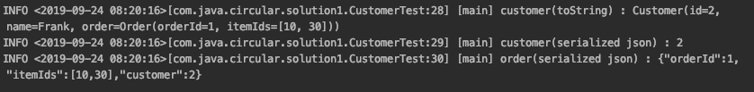

## 1. 들어가며

Jackson에서 양방향 관계 (Bidirectional Relationship)로 맺어진 객체는 무한 재귀가 발생하는 문제가 있습니다. 구체적인 예를 들어 어떤 상황에서 발생하는 지 살펴보고 어떤 방법으로 해결 가능한지도 알아보겠습니다.

### 1.1 무한 재귀

Customer와 Order 두 객체는 서로 순환 참조 (Circular Reference)를 하고 있습니다. Customer 객체가 Order 객체를 가지고 있고 Order 객체가 Customer 객체를 가지고 있는 경우입니다.

```java
@Setter
@Getter
@ToString
public class Customer {
    private int id;
    private String name;
    private Order order; //Customer 객체가 Order 객체를 가지고 있다
}
 
@Setter
@Getter
@ToString(exclude = "customer")
public class Order {
    private int orderId;
    private List<Integer> itemIds;
    private Customer customer; //Order 객체도 Customer 객체를 가지고 있다
}
```

Customer 객체를 Jackson에서 직렬화(serialization) 할 경우 JsonMappingException 예외가 발생하게 됩니다.

```java
@Test(expected = JsonMappingException.class)
public void infinite_recursion_이슈_발생() throws JsonProcessingException {
    Order order = new Order();
    order.setOrderId(1);
    order.setItemIds(List.of(10, 30));
 
    Customer customer = new Customer();
    customer.setId(2);
    customer.setName("Frank");
    customer.setOrder(order);
    order.setCustomer(customer);
 
    log.info("customer(toString) : {}", customer);
    log.info("customer(serialized json) : {}", objectMapper.writeValueAsString(customer)); //JsonMappingException이 발생한다
}
```

JsonMappingException 예외 오류 메시지입니다.


## 2. 개발 환경

이 포스팅에서 작성한 코드는 아래 github를 참조해주세요.

* OS : Mac OS
* IDE: Intellij
* Java : JDK 12
* Source code : [github](https://github.com/kenshin579/tutorials-java/tree/master/json-jackson)
* Software management tool : Maven

## 3. 해결책

### 3.1 @JsonManagedReference와 @JsonBackReference 어노테이션 사용

Jackson 2.0 버전 이전에 순환 참조를 해결하기 위해서 사용했던 어노테이션입니다.

* @JsonManagedReference
    * 양방향 관계에서 정방향 참조할 변수에 어노테이션을 추가하면 직렬화에 포함된다
* @JsonBackReference
    * 양방향 관계에서 역방향 참조로 어노테이션을 추가하면 직렬화에서 제외된다

Customer 객체에서 Order 객체에 @JsonManagedReference를 추가하고 Order에서는 Customer 객체에 @JsonBackReference 어노테이션을 추가하여 직렬화에서 Customer 객체를 제외 시켰습니다.

```java
@Setter
@Getter
@ToString
public class Customer {
    private int id;
    private String name;
    @JsonManagedReference //serialized될 때 포함됨
    private Order order;
}
 
@Setter
@Getter
@ToString(exclude = "customer”) //toString() 실행시에도 무한 재귀가 발생하여 제외시킨다
public class Order {
    private int orderId;
    private List<Integer> itemIds;
    @JsonBackReference //serialization에서 제외된다
    private Customer customer;
}
 
@Test
public void infinite_recursion_해결책_JsonManagedReference_JsonBackReference() throws JsonProcessingException {
    Order order = new Order();
    order.setOrderId(1);
    order.setItemIds(List.of(10, 30));
 
    Customer customer = new Customer();
    customer.setId(2);
    customer.setName("Frank");
    customer.setOrder(order);
    order.setCustomer(customer);
 
    log.info("customer(toString) : {}", customer);
    log.info("customer(serialized json) : {}", objectMapper.writeValueAsString(customer));
    log.info("order(serialized json) : {}", objectMapper.writeValueAsString(order)); //customer정보는 제외된다
}
```

**실행 화면**

@JsonBackReference 어노테이션 선언으로 Order 객체에서 Customer 객체에 대한 정보는 빠져 있어요.


### 3.2 @JsonIdentityInfo - 추천방식

Jackson 2.0 이후부터 새롭게 추가된 어노테이션입니다. @JsonIdentityInfo 어노테이션을 추가해서 직렬화에 포함 시킬 속성 값을 ‘property’ 속성에 지정합니다.

* @JsonIdentityInfo(generator = ObjectIdGenerators.PropertyGenerator.class)
    * generator = ObjectIdGenerators.PropertyGenerator.class 클래스는 순환 참조시 사용할 Id를 생성하는데 사용되는 클래스이다
* @JsonIdentityInfo(property = “id")
    * property 속성은 해당 클래스의 속성 이름을 지정한다
    * 예제에서는 id는 Customer#id를 가리키고 직렬화/역직렬화할 때 Order#customer의 역참조로 사용된다

@JsonIdentityReference 어노테이션은 @JsonIdentityInfo과 같이 자주 사용되는데, 이것에 대한 설명은 다음 섹션에서 알아볼께요.

```java
@Setter
@Getter
@ToString
@JsonIdentityInfo(generator = ObjectIdGenerators.PropertyGenerator.class,
        property = "id”) 
@JsonIdentityReference(alwaysAsId = true) //직렬화시 id로만 출력된다
public class Customer {
    private int id;
    private String name;
    private Order order;
}
 
@Test
public void infinite_recursion_해결책_JsonIdentityReference() throws JsonProcessingException {
    Order order = new Order();
    order.setOrderId(1);
    order.setItemIds(List.of(10, 30));
 
    Customer customer = new Customer();
    customer.setId(2);
    customer.setName("Frank");
    customer.setOrder(order);
    order.setCustomer(customer);
 
    log.info("customer(toString) : {}", customer);
    log.info("customer(serialized json) : {}", objectMapper.writeValueAsString(customer)); //id로만 출력된다
    log.info("order(serialized json) : {}", objectMapper.writeValueAsString(order));
}
```

**실행 화면**



#### 3.2.1 @JsonIdentityReference 란?

@JsonIdentityReference 어노테이션은 객체를 직렬화할 때 전체 POJO로 처리하는 대신 단순히 객체 ID로만 노출되도록 해줍니다.

```java
@Setter
@Getter
@ToString
@JsonIdentityInfo(generator = ObjectIdGenerators.PropertyGenerator.class,
        property = "id")
@JsonIdentityReference(alwaysAsId = true)
public class Customer {
    private int id;
    private String name;
    private Order order;
}
```

@JsonIdentityReference 어노테이션을 사용하지 않을 경우에는 아래와 같이 객체의 전체 내용을 직렬화 합니다.

```java
@Test
public void JsonIdentityReferenceAnnotation이_없는_경우() throws JsonProcessingException {
    CustomerWithoutIdentityReference customer = new CustomerWithoutIdentityReference();
    customer.setId(1);
    customer.setName("Frank");
    String jsonOutput = objectMapper.writeValueAsString(customer);
    log.info("jsonOutput :{}", jsonOutput);
    assertThat(jsonOutput).isEqualTo("{\"id\":1,\"name\":\"Frank\",\"order\":null}");
}
```

**실행 화면**


하지만, @JsonIdentityReference 어노테이션을 사용하는 경우에는 직렬화시 객체 ID로만 직렬화 합니다.

```java
@Test
 public void JsonIdentityReferenceAnnotation이_있는_경우() throws JsonProcessingException {
     Customer customer = new Customer();
     customer.setId(1);
     customer.setName("Frank");
     String jsonOutput = objectMapper.writeValueAsString(customer);
     log.info("jsonOutput :{}", jsonOutput);
     assertThat(jsonOutput).isEqualTo("1");
 }
```

**실행 화면**


### 3.3 @JsonIgnore 어노테이션 사용

마지막으로 제일 간단하게 해결할 수 있는 방법은 직렬화 할때 순환 참조 되는 속성에 @JsonIgnore 어노테이션을 추가하여 직렬화에서 제외시키는 방법입니다.

```java
@Setter
@Getter
@ToString(exclude = "customer")
public class Order {
    private int orderId;
    private List<Integer> itemIds;
    @JsonIgnore
    private Customer customer; //직렬화시 무시된다
}
 
@Slf4j
public class CustomerTest {
    private ObjectMapper objectMapper = new ObjectMapper();
 
    @Test
    public void infinite_recursion_해결책_JsonIgnore() throws JsonProcessingException {
        Order order = new Order();
        order.setOrderId(1);
        order.setItemIds(List.of(10, 30));
 
        Customer customer = new Customer();
        customer.setId(2);
        customer.setName("Frank");
        customer.setOrder(order);
        order.setCustomer(customer);
 
        log.info("customer(toString) : {}", customer);
        log.info("customer(serialized json) : {}", objectMapper.writeValueAsString(customer));
        log.info("order(serialized json) : {}", objectMapper.writeValueAsString(order)); //customer 정보는 제외된다
    }
}
```

**실행 화면**

Unit Test을 실행해보면 customer 정보는 Order 객체에서 제외된 것을 확인할 수 있습니다.


## 4. 정리

웹 어플리케이션에서 데이터 전송시 일반적으로 JSON 포멧을 사용하고 있고 서버단에서를 JSON 처리를 위해 Jackson 라이브러리를 많이 사용하고 있습니다. 객체 간에 서로 참조하여 순환 참조가 발생하게 되면 무한 재귀로 StackOverflowError가 발생합니다. 이를 해결 하기 위해 3가지 방법을 알아보았습니다.

## 5. 참고

* Jackson Infinite Recursion
    * [https://www.baeldung.com/jackson-bidirectional-relationships-and-infinite-recursion](https://www.baeldung.com/jackson-bidirectional-relationships-and-infinite-recursion)
    * [https://www.logicbig.com/tutorials/misc/jackson/json-identity-reference.html](https://www.logicbig.com/tutorials/misc/jackson/json-identity-reference.html)
    * [http://www.appsdeveloperblog.com/infinite-recursion-in-objects-with-bidirectional-relationships/](http://www.appsdeveloperblog.com/infinite-recursion-in-objects-with-bidirectional-relationships/)
    * [http://springquay.blogspot.com/2016/01/new-approach-to-solve-json-recursive.html](http://springquay.blogspot.com/2016/01/new-approach-to-solve-json-recursive.html)
    * [https://www.logicbig.com/tutorials/misc/jackson/json-identity-info-annotation.html](https://www.logicbig.com/tutorials/misc/jackson/json-identity-info-annotation.html)
* @JsonIdentityReference란
    * [https://www.baeldung.com/jackson-advanced-annotations](https://www.baeldung.com/jackson-advanced-annotations)

