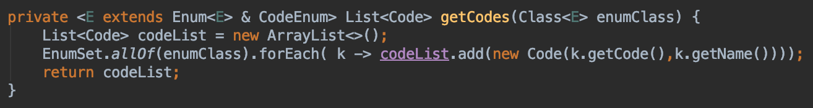

개인적으로 모르는 부분 적어두고 알게 되는 부분에 대해서 간단하게 정리해둔 자료입니다.
미 답변중에 알고 계신 부분 있으면 코멘트 달아주세요. 감사합니다.

## Q&A 전체 목록

### [미 답변 질문]

### - java8 에서 mapToInt(ToIntFunction mapper)는 뭔가?
- Intermediate operation으로 스트림의 각 요소에 mapper를 실행하고 IntStream을 반환한다

참고

* [https://www.geeksforgeeks.org/stream-maptoint-java-examples/](https://www.geeksforgeeks.org/stream-maptoint-java-examples/)

### - bridge 메서드는 무엇인가?

### - 이거의 의미는 뭔가?
- JobKey가 상속받을 수 있는 걸 제한하는 건가?

### - facade 패턴이란?
### - strateggy 패턴이란?

### - @Constraint(validateBy…?)

#### 참고

- [https://dzone.com/articles/create-your-own-constraint-with-bean-validation-20](https://dzone.com/articles/create-your-own-constraint-with-bean-validation-20)

---

### [답변완료]

### 1. 왜 Constants 값을 인터페이스에 정의하나? final class에 하지 않나?

인터페이스에도 Constants 값을 지정할 수 있습니다. 이런 방식은 비추천하는 방식으로 언급되는데요. 찾아보면 오픈소스에서도 인터페이스에 정의하는 프로젝트도 종종 찾을 수 있습니다.

참고

* [http://www.javapractices.com/topic/TopicAction.do?Id=32](http://www.javapractices.com/topic/TopicAction.do?Id=32)
* [https://stackoverflow.com/questions/40990356/interface-constants-vs-class-constants-variables](https://stackoverflow.com/questions/40990356/interface-constants-vs-class-constants-variables)
* [https://veerasundar.com/blog/2012/04/java-constants-using-class-interface-static-imports/](https://veerasundar.com/blog/2012/04/java-constants-using-class-interface-static-imports/)

### 2. 메서드에서 제너릭으로 선언을 할 때 & 가 의미하는 건 뭔가?

인자로 들어오는 게 Enum 타입이여야 하고 인터페이스 CodeEnum을 구현하는 타입이여야 한다는 의미입니다. 결국 둘 다 만족하는 타입이어야 한다는 의미입니다.

참고

* [https://stackoverflow.com/questions/21142467/generics-ambiguity-with-the-operator-and-order](https://stackoverflow.com/questions/21142467/generics-ambiguity-with-the-operator-and-order)
* [https://stackoverflow.com/questions/745756/java-generics-wildcarding-with-multiple-classes](https://stackoverflow.com/questions/745756/java-generics-wildcarding-with-multiple-classes)

### 3. ExecutorService에서 submit와 execute()의 차이점은?

- submit : task을 실행하고 실행된 결과를 Future 객체로 받아 cancel(), get()을 호출하여 추후 task 관리를 할 수 있게 해준다.
- execute : task을 실행하고 결과를 따로 받지 못한다

참고

* [https://stackoverflow.com/questions/18730290/what-is-the-difference-between-executorservice-submit-and-executorservice-execut](https://stackoverflow.com/questions/18730290/what-is-the-difference-between-executorservice-submit-and-executorservice-execut)

### 4. 언제 Collections.singleton() 메서드를 사용하나?

singleton() 메서드는 인자로 넘겨진 오브젝트 하나로 immutable한 set를 반환하는 메서드입니다. 리시트의 removeAll()와 같이 컬렉션 인터페이스를 인자로 받는 경우에 하나의 요소만을 전달할 때 사용합니다. 일일이 컬렉션 생성, 요소 추가등을 할 필요없이 singleton(값) 메서드 호출로 객체를 반환하여 쉽게 사용할 수 있습니다.

List<Integer> list = Arrays.asList(1, 2, 3, 4, 4);
live.removeAll(Collections.singleton(4);

- Set : Collections.singleton(T o)
- List : Collections.singleList(T o)
- Map : Collections.singleMap(K, V)

#### 참고

* [https://java2free.tistory.com/entry/%EC%9E%90%EB%B0%94-Collection](https://java2free.tistory.com/entry/%EC%9E%90%EB%B0%94-Collection)
* [https://www.javatpoint.com/java-collections-singleton-method](https://www.javatpoint.com/java-collections-singleton-method)
* [https://stackoverflow.com/questions/4801794/use-of-javas-collections-singletonlist](https://stackoverflow.com/questions/4801794/use-of-javas-collections-singletonlist)
* [https://stackoverflow.com/questions/4801794/use-of-javas-collections-singletonlist](https://stackoverflow.com/questions/4801794/use-of-javas-collections-singletonlist)
