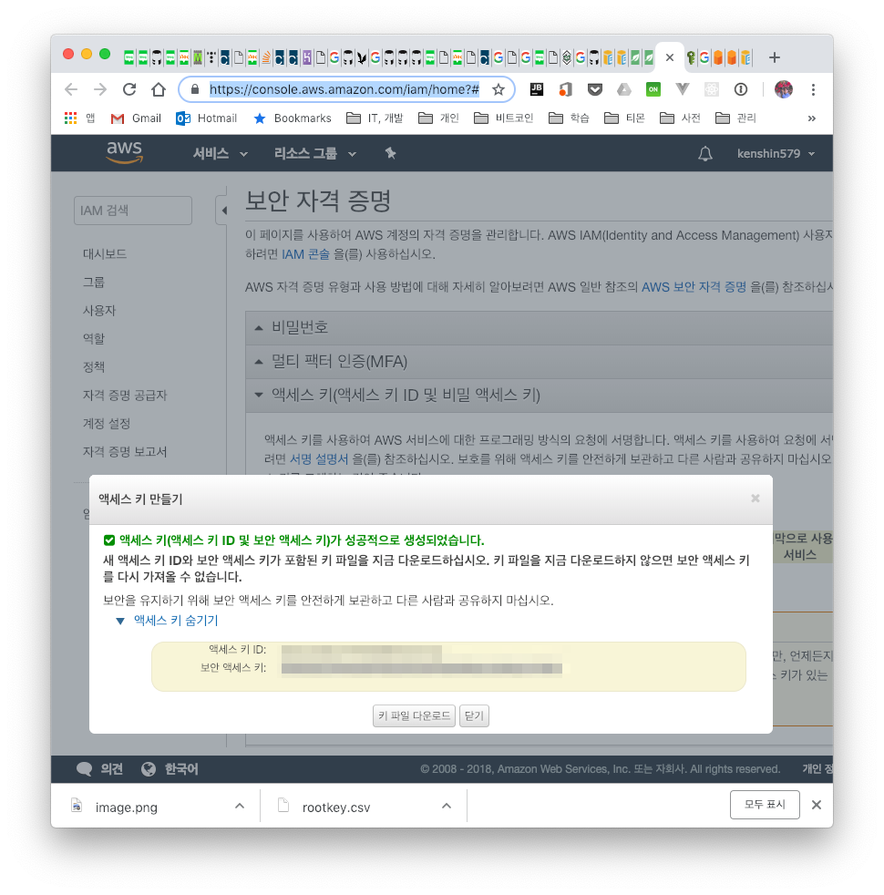

## 1. 들어가며

기업에서도 그렇고 이제 아마존 서비스를 쓰지 않은 곳이 없을 정도로 회사마다 아마존의 서비스를 많이 사용하고 있습니다. 최근에 이직을 한 곳에서도 S3 (Simple Storage Service) 스토리지 서비스를 이용하고 있어 S3 API를 학습할 겸 해서정리를 해봤습니다.

S3는 REST/HTTP 기반으로 파일을 저장하기 위한 스토리지이며 아래와 같은 특징을 가지고 있어 많은 곳에서 S3를 사용하고 있습니다.

- S3 서비스 특징
    - 3 copy 복제를 지원하여 데이터 신뢰도(99.9999%)를 보장한다
    - 용량과 파일 수에 대한 제한이 없다 (ex. 파일당 1B ~ 5TB)
    - 버전 관리 기능을 제공하여 실수로 삭제한 파일도 복원 가능하다
    - 다른 아마존 서비스(ex. CloudFount, Glacier)에 쉽게 연동이 가능하다

- 용어 정리
    - 객체 : S3에서 저장되는 기본 단위로 하나의 파일이라고 생각하면 된다
    - 키 : 버킷 내 객체를 저장하기 위해 사용되는 고유한 식별자이다
        - ex. test.xls, thumbs/main.jpg
    - 버킷 : 디렉토리와 비슷한 개념으로 버킷에 객체를 저장한다
        - 하위 버킷 또는 하위 폴더의 계층 구조는 없지만, 키 이름 접두사와 구분 기호를 이용하여 논리적인 계층 구조를 만들 수 있다 (ex. develop/test.xls)

## 2. 개발 환경 및 S3 기본 설정

소스 코드는 대부분은 [Amazon SDK](https://docs.aws.amazon.com/ko_kr/sdk-for-java/v1/developer-guide/examples-s3.html) 와 [Baeldung](https://www.baeldung.com/aws-s3-java) 에 있는 예제들을 보면서 작성하였습니다.

- OS : Mac OS
- IDE: Intellij
- Java : JDK 1.8
- Source code : [github](https://github.com/kenshin579/tutorials-java-examples/tree/master/amazon-s3)
- Software management tool : Maven

pom.xml 파일에 아마존 SDK 의존성을 추가해줍니다.

```xml
<dependency>
    <groupId>com.amazonaws</groupId>
    <artifactId>aws-java-sdk</artifactId>
    <version>1.11.154</version>
</dependency>
```

### 2.1 S3 기본 설정

AWS SDK를 사용하려면, 아래 3가지는 완료해야 코드상에서 S3에 접속하여 작업을 할 수 있습니다.

- AWS 계정 생성
    - 계정이 없는 경우 [AWS 계정](https://portal.aws.amazon.com/gp/aws/developer/registration/index.html) 을 생성한다
- AWS 보안 자격 증명 (코딩시 이게 필요하다)
    - S3에 접속하려면, 액세스 키 ID와 보안 액세스 키가 필요하다
    - 코드에서 사용할 [보안 자격 증명](https://console.aws.amazon.com/iam/home?#/security_credential) 사이트에 접속하여 아래와 같이 얻어온다
      

- AWS 지역 선택하기
    - 지역마다 S3 가격이 다르기 때문에 가장 가까운 지역을 선택하는것이 좋다

## 3. S3 Bucket에서 파일 다루기

### 3.1 Client Connection

S3 서비스에 접근하기 위한 client connection을 생성해야 합니다. 위에서 생성한 KEY_ID와 SECRET_ACCESS_KEY가 필요합니다.

#### 3.1.1 명시적으로 지정하는 방법

소스코드 안에서 KEY_ID와 SECRET_ACCESS_KEY를 인자로 전달하여 BasicAWSCredentials 객체를 생성하여 client 연결을 얻어오는 방법이 있습니다.

```java
AmazonS3ClientBuilder
      .standard()
      .withCredentials(new AWSStaticCredentialsProvider(new BasicAWSCredentials(
            KEY_ID,
            SECRET_ACCESS_KEY)
      ))
      .withRegion(Regions.AP_NORTHEAST_2)
      .build();
```

```java
public class S3App {
   private static final AWSCredentials credentials;
   private static final String KEY_ID = "<key_id>";


   private static final String SECRET_ACCESS_KEY = "<secret_access_key>";
   private static AmazonS3 s3client;
   static {
      credentials = new BasicAWSCredentials(
            KEY_ID,
            SECRET_ACCESS_KEY
      );
   }

   public static void main(String[] args) throws IOException, URISyntaxException {
      s3client = createConnectionWithCredentials(credentials); 
   }
}

private static AmazonS3 createConnectionWithCredentials(AWSCredentials credentials) {
   return AmazonS3ClientBuilder
         .standard()
         .withCredentials(new AWSStaticCredentialsProvider(credentials)) //#1 - 직접 값을 전달함

         .withRegion(Regions.AP_NORTHEAST_2)
         .build();
}
```

KEY가 외부로 노출이 되면 누구나 아마존 서비스를 사용할 수 있으므로 잘 못 하면 다른 사람들에 의해서 요금 폭탄을 맞을 수 있습니다.

#### 3.1.2 환경 설정으로 지정하는 방법

Client connection을 가져오는 두 번째 방법입니다. 환경설정 파일에 저장된 key 값을 가져오는 방식입니다.

```java
private static AmazonS3 createConnectionWithCredentials() {
   return AmazonS3ClientBuilder
         .standard()
         .withCredentials(new DefaultAWSCredentialsProviderChain()) //#1 - env 환경변수나 ~/.aws에 저장된 값을 읽어드림

         .withRegion(Regions.AP_NORTHEAST_2)
         .build();
}
```

아래와 같이 AWS 자격 증명 설정이 되어 있어야 합니다.

```bash
$ vim ~/.aws/credentials
[default]
aws_access_key_id=EXAMPLEACCESS_KEY
aws_secret_access_key=FSDFSGSDFaZiNOzYxcfQXiKq6jwiLYB6

$ vim ~/.aws/config
[default]
region=ap-northeast-2
```

### 3.2 S3 Bucket에서 파일 다루기

#### 3.2.1 S3 bucket 생성하기

먼저 버킷을 생성해보겠습니다. 간단합니다. createBucket() 메서드를 사용하면 됩니다.

```java
@Test
public void test_버킷_생성하기() {
   String[] bucketList = new String[] { BUCKET_NAME, BUCKET_NAME2 };
   for (String bucketName : bucketList) {
      if (s3client.doesBucketExist(bucketName)) {
         s3client.deleteBucket(bucketName);
      }
      s3client.createBucket(bucketName); //#1 - 버킷 생성

      assertTrue(s3client.doesBucketExist(bucketName));
   }
}
```

위 유닛테스트에서 버킷이 생성되었는지 확인해보겠습니다.

```java
@Test
public void test_buckets_목록_프린트하기() {
   List<Bucket> buckets = s3client.listBuckets();
   for (Bucket b : buckets) {
      System.out.println("* " + b.getName());
   }
}
```

#### 3.2.2 파일 업로드

버킷에 파일을 올리려면 pubObject()를 사용합니다. 인터넷에서 이미지 다운로드해서 S3에 올리는 예제입니다.

```java
@Test
public void test_bucket에_파일_올리기() throws IOException {
   String webImageUrl = "https://images-na.ssl-images-amazon.com/images/I/51ADJwz5bwL._SY355_.png";
   String filename = "/Users/ykoh/Desktop/test.png";
   downloadFileFromURL(webImageUrl, filename);
   
   String bucketKey = "image/test.png";
   s3client.putObject(BUCKET_NAME, bucketKey, new File(filename)); //#1 - 파일을 올리는 메서드임

}

private void downloadFileFromURL(String sourceUrl, String destPath) throws IOException {
   FileUtils.copyURLToFile(new URL(sourceUrl), new File(destPath));
}
```

#### 3.2.3 파일 다운로드

버킷에 올린 파일을 컴퓨터로 다운로드할 수 있습니다. getObject() 메서드로 원하는 파일을 저장합니다.

```java
@Test
public void test_bucket에서_파일_다운로드하기() throws IOException {
   String destFilename = "/Users/ykoh/Desktop/test.png";
   S3Object s3object = s3client.getObject(BUCKET_NAME, "image/test.png”); //#1 - 파일을 다운로드함

   S3ObjectInputStream inputStream = s3object.getObjectContent();
   FileUtils.copyInputStreamToFile(inputStream, new File(destFilename));  //#2 - 스트림을 파일로 저장함

}}
```


#### 3.2.4 파일 삭제

버킷에서 하나의 파일을 삭제할 때는 deleteObject() 메서드를사용하고 여러 파일을 한 번에 삭제하려면 deleteObjects() 메서드를 사용합니다.

```java
@Test
public void test_bucket에서_파일_삭제하기() throws IOException {
   String webImageUrl = "https://images-na.ssl-images-amazon.com/images/I/51ADJwz5bwL._SY355_.png";
   downloadFileFromURL(webImageUrl, "image/test1.png");
   downloadFileFromURL(webImageUrl, "image/test2.png");
   downloadFileFromURL(webImageUrl, "image/test3.png");
   //delete single file
   s3client.putObject(BUCKET_NAME, "image/test1.png", new File("/Users/ykoh/Desktop/test.png"));
   s3client.deleteObject(BUCKET_NAME, "image/test1.png”); //#1 - 파일 하나 삭제


   //delete multiple files
   String objkeyArr[] = {  "image/test2.png", "image/test3.png" };
   DeleteObjectsRequest delObjReq = new DeleteObjectsRequest(BUCKET_NAME).withKeys(objkeyArr);
   s3client.deleteObjects(delObjReq); //#2 - 여러 파일 삭제

}
```

#### 3.2.5 버킷 삭제

버킷을 삭제하려면 버킷 안에 있는 모든 파일과 버전 관리가 되는 객체들도 다 삭제해야만 버킷을 삭제할 수 있습니다.

```java
@Test
public void test_bucket_삭제하기() {
   deleteAllObjectsAndBucket(s3client, BUCKET_NAME);
}

private static void deleteAllObjectsAndBucket(AmazonS3 s3client, final String bucketName) {
   try {
      ObjectListing objectListing = s3client.listObjects(bucketName); //#1 - 버킷안에 있는 모든 객체

      while (true) {
         Iterator<S3ObjectSummary> objIter = objectListing.getObjectSummaries().iterator();
         while (objIter.hasNext()) {
            s3client.deleteObject(bucketName, objIter.next().getKey()); //#2 - 하나씩 삭제함

         }
         if (objectListing.isTruncated()) {
            objectListing = s3client.listNextBatchOfObjects(objectListing);
         } else {
            break;
         }
      }
      VersionListing versionList = s3client.listVersions(new ListVersionsRequest().withBucketName(bucketName)); //#3 - 버전관리되는 객체 리스트

      while (true) {
         Iterator<S3VersionSummary> versionIter = versionList.getVersionSummaries().iterator();
         while (versionIter.hasNext()) {
            S3VersionSummary vs = versionIter.next();
            s3client.deleteVersion(bucketName, vs.getKey(), vs.getVersionId()); //#4 - 버전관리되는 객체도 삭제함

         }
         if (versionList.isTruncated()) {
            versionList = s3client.listNextBatchOfVersions(versionList);
         } else {
            break;
         }
      }
      s3client.deleteBucket(bucketName); //#5 - 버킷 삭제

   } catch (AmazonServiceException e) {
      e.printStackTrace();
   } catch (SdkClientException e) {
      e.printStackTrace();
   }
}
```

## 4. 참고

- Amazon S3
    - [https://www.baeldung.com/aws-s3-java](https://www.baeldung.com/aws-s3-java)
    - [https://aws.amazon.com/ko/sdk-for-java/](https://aws.amazon.com/ko/sdk-for-java/)
    - [http://bcho.tistory.com/693](http://bcho.tistory.com/693)
    - [https://opentutorials.org/course/608/3006](https://opentutorials.org/course/608/3006)
- S3 Credentials 설정 방법
    - [https://dwfox.tistory.com/55](https://dwfox.tistory.com/55)
    - [https://docs.aws.amazon.com/ko_kr/sdk-for-java/v2/developer-guide/setup-credentials.html](https://docs.aws.amazon.com/ko_kr/sdk-for-java/v2/developer-guide/setup-credentials.html)
