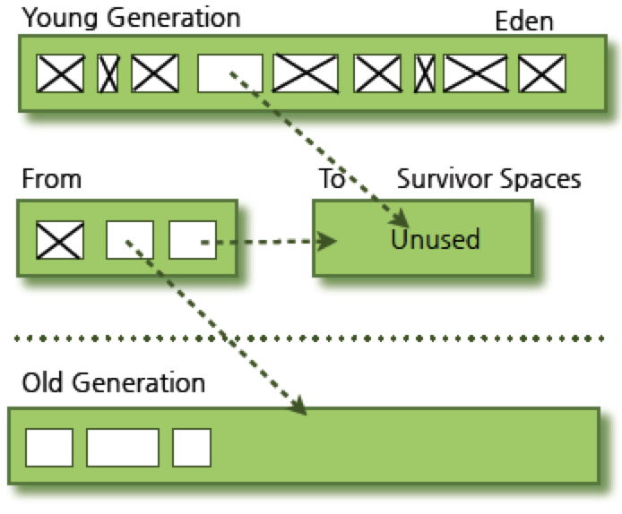

## 1. 가비지 컬랙션이란?

C/C++ 언어와 달리 자바는 개발자가 명시적으로 객체를 해제할 필요가 없습니다. 자바 언어의 큰 장점이기도 합니다. 사용하지 않는 객체는 메모리에서 삭제하는 작업을 Gargabe Collection(GC)라고 부르며 JVM에서 GC를 수행합니다. 기본적으로 JVM의 메모리는 총 5가지 영역(ex. 클래스, 스택, 힙, 네이티브 메서드, PC)으로 나뉘는데, GC는 힙 메모리만 다룹니다.

코드상에서 어떨 때 객체가 가비지 대상이 될까요? 간단하게 생각해보면 프로그램이 실행되면서 코드상에서 참조되지 않는 객체들이 대상이 될 것입니다. 일반적으로 아래 같은 경우에 가비지대상이 됩니다.

- 객체가 null인 경우 (ex. String str = null)
- 블럭 안에서 생성된 객체는 블럭 실행 종료후 대상이 된다
- 부모 객체가 null이 되면, 포함하는 자식 객체들도 자동으로 가비지 대상이 된다

JVM에서 가비지 대상을 어떻게 결정하는지는 링크 #3을 참조해주세요.

### 1.1 Heap 영역의 구조

Heap 영역은 크게 2가지 영역으로 나뉩니다. Permanent Generation 영역은 Heap 영역은 아닙니다.

- Young Generation - 객체 사용 시간이 짧은 객체들
    - 영역의 종류
        - Eden
        - Survivor 2개
    - 새롭게 생성한 객체는 여기에 위치한다
    - 매우 많은 객체가 Young 영역에 생성되었다가 사라진다
    - 이 영역에서 객체가 살아지면 Minor GC가 발생했다고 한다
- Old Generation (Tenured space) - 오래 사용되는 객체들
    - Young 영역에서 살아남은 객체가 여기로 복사된다
    - Young 영역보다 크게 메모리가 크게 할당되어 Young 영역보다 GC는 적게 발생한다
    - 이 영역에서 객체가 살아지면 Major GC (Full GC)가 발생했다고 한다
- (Non-heap) Permanent Generation
    - 이 영역에는 JVM에 의해서 사용하는 클래스와 메서드 객체 정보를 담고 있다
    - JDK8부터는 PermGen은 Metaspace로 교체된다

[https://www.journaldev.com/2856/java-jvm-memory-model-memory-management-in-java](https://www.journaldev.com/2856/java-jvm-memory-model-memory-management-in-java)

일반적으로 객체를 생성하면, Young 영역에 먼저 위치하게 되고 오랫동안 사용되는 객체는 GC 과정을 통해서 Old 영역으로 이동하게 됩니다.

[https://www.oracle.com/technetwork/java/javase/memorymanagement-whitepaper-150215.pdf](https://www.oracle.com/technetwork/java/javase/memorymanagement-whitepaper-150215.pdf)

Heap 영역을 왜 두 가지 영역으로 나뉘서 관리하게 되었을까요? 여러 연구를 진행한 결과 애플리케이션에서 객체가 생성되고 살아지는 패턴은 크게 2가지 특징을 가지게 된다고 합니다.

- 대부분의 생성된 객체는 금방 사용하지 않는다
- 객체들은 대개 (아주) 오랜 시간 동안 남아 있지 않는 것들이다 (객체 짧게 사용됨)

아래 그래프에서 보이는 것처럼 객체의 라이프는 짧게 사용되다가 오랫동안 남은 것들은 계속 쌓이게 되는 것을 볼 수 있습니다. 이런 특징으로 두 영역으로 나뉘어서 관리하고 GC 알고리즘도 이 기반으로 설계되었습니다.

## 2. Garbage Collection 타입

각 영역에 따라서 실행되는 GC는 다릅니다. Minor나 Major GC가 실패하게 되면 Full GC가 발생할 수도 있습니다.

- Minor GC
    - 대상 : Young 영역
    - 트리거 되는 시점 : Eden이 full이 경우에
- Major GC
    - 대상 : Old 영역
    - 트리거 되는 시점 : Minor GC가 실패하는 경우
- Full GC
    - 대상 : 전체 Heap + MetaSpace(Permanent 영역)
    - 트리거 되는 시점 : Minor나 Major GC가 실패하는 경우

## 3. Garbage Collection 알고리즘

GC 알고리즘은 오랫동안 개선됐고 아래와 같이 여러 종류로 발전해 왔습니다. 최근 자바에서 기본적으로 사용되는 GC 알고리즘은 G1 GC를 사용합니다. 각각의 알고리즘이 어떻게 동작하는지 알아보겠습니다.

- Serial
- Parallel
- Parallel Old(Parallel Compacting GC)
    - JDK5u6부터 제공
- Concurrent Mark & Sweep (CMS)
- G1(Garage First)
    - JDK7u4부터 도입
    - JDK9부터 기본 GC로 변경됨

GC에서 자주 사용되는 용어로 stop-the-world가 있습니다. GC를 실행하면 JVM이 애플리케이션 실행을 멈추게 되는데, 이를 stop-the-world라고 합니다. GC가 일어나면 GC를 실행하는 쓰레드를 제외한 나머지 쓰레드는 모두 멈추게 됩니다. 이런 멈추는 시간에 의해 애플리케이션 성능에 많은 영향을 주게 됩니다. 여러 GC 알고리즘에서 이 부분을 개선하려고 큰 노력을 해왔습니다.

### 3.1 Serial (-XX:+UseSerialGC)

Serial collector는 single 쓰레드로 동작하며 Young와 Old를 serial 하게 GC을 합니다. Young과 Old 영역에서 객체가 어떻게 관리되는지는 조금 더 구체적으로 알아보겠습니다.

- Young 영역 (single thread)
    - mark and copy
- Old 영역 (single thread)
    - mark-sweep-compact : 안쓰는 객체를 표시한 이후 삭제하고 한 곳으로 모으는 알고리즘이다

#### Young 영역의 Minor GC 절차 - mark and copy

- 처음에 생성된 객체는 Eden에 쌓인다
- Eden이 어느 정도 쌓이면 GC가 발생하고 살아남은 객체는 Survisor(Empty) 영역으로 이동한다
    - Survisor 영역중에 한 영역은 반드시 비어 있어야 한다
- Survisor 영역이 차게 되면 GC가 발생하고 Eden 영역에 있는 객체와 꽉 찬 Survisor 영역에 있는 객체가 비어 있는 다른 Survisor 영역으로 이동한다
- 이 과정을 반복하다가 계속 살아남아 있는 객체들은 Old 영역으로 이동한다

| GC 전 | GC 이후 |
| ----- | ------- |
| | |

### 3.2 Parallel (-XX:+UseParallelGC)

Parallel collector는 serial collector의 동작과 유사합니다. 다른 점은 GC 속도를 높이기 위해 Young 영역을 multiple 쓰레드로 GC를 수행합니다. 이로 인해 stop-the-world하는 시간이 줄려 애플리이케이션 성능을 개선하였습니다.

- Young 영역 (multi thread)
    - mark and copy
- Old 영역 (single thread)
    - mark-sweep-compact

### 3.3 Parallel Compacting Collector (- XX:+UseParallelOldGC)

Parallel compacting collector는 JDK5u6부터 제공되었으면 JDK7u4부터는 XX:+UseParallelGC 사용 시에도 -XX:+UseParallelOldGC로 설정됩니다. Young과 Old 영역이 병렬로 처리됩니다. 쓰레드 개수는 -XX:ParallelGCThreads=n 옵션으로 조정 가능합니다.

- Young 영역 (multi thread)
    - mark and copy
- Old 영역 (multi thread)
    - mark-summary-compact
    - mark : 살아 있는 객체를 식별하여 표시한다
    - summary : 이전에 GC를 수행하여 컴팩션된 영역에 살아 있는 객체의 위치를 조사한다
    - compact : 쓰레기 객체들을 수거하고 살아있는 객체들을 한곳에 모은다

### 3.4 Concurrent Mark Sweep(CMS) (-XX:+UseConcMarkSweepGC)

CMS collector는 heap 메모리 영역의 크기가 크고 2개 이상의 프로세서를 사용하는 서버에 적합합니다. XX:+CMSIncrementalMode 옵션은 Young 영역의 GC를 더 잘게 쪼개어 서버의 대기 시간을 줄일 수 있지만, 예기치 못한 성능 저하가 발생할 수 있습니다. CMS는 Old 영역에 대한 compact 작업을 하지 않기 때문에 memory fragmentation이 발생할 수 있습니다. CMS collector의 경우에는 추후 릴리스에서 제거되는 거로 결정이 되었습니다. ( [JEP 291](http://openjdk.java.net/jeps/291) )

- Young 영역 (multi thread)

      	* mark and copy

- Old 영역 (multi thread)
    - mark-sweep-remark
    - initial mark (stop-the-world) : 애플리케이스 코드에서 직접/바로 접근 가능한 객체를 판단하고 initial set을 만든다
    - concurrent mark : initial 단계에서 만든 set의 객체에서 transitively 접근 가능한 모든 객체를 체크한다
    - remark (stop-the-world) : concurrent mark 단계에서 변경된 객체를 다시 체크한다
    - concurrent sweep : 표시한 객체들 삭제한다

### 3.5 G1 (-XX:+UseG1GC : JDK9부터 기본으로 설정됨)

G1 (Garbage First) collector는 메모리가 큰 multi core 머신을 타켓으로 설계되었습니다. G1 GC는 JDK7u4부터 도입 되었고 안정화 기간 거쳐 현재 JDK9에서는 기본 GC로 채택 되었습니다. G1에서는 아래 그림과 같이 heap 메모리 영역을 작은 단위의 region으로 나눠서 관리합니다. 기본 region 개수 수치는 2K(2048)개 공간으로 나눕니다. 예를 들면 Heap Size가 8GB로 지정하면, 각 region의 크기는 4MB (ex. 8192MB/2048 = 4096)가 됩니다.

- Young 영역 (multi thread)
    - -XX:ParallelGCThreads로 thread 갯수를 조정할 수 있다
    - 살아 남은 객체들은 survivor region으로 이동(evacuation/compacting)한다
    - 정의된 **aging threshold 값을 넘으면, survivor region의 오래된 객체는 Old 영역 region으로 이동** 한다
    - 매번 Minor GC를 수행할때마다 Eden과 Survivor 영역 크기는 자동으로 계산하여 정해진다
- Old 영역 (multi thread)
    - -XX:ConcGCThreads로 marking 단계에 사용되는 GC 쓰레드 갯수 조정 가능하다
    - 전체 **heap에 대해서 GC를 하지 않고 일부 region에서만 GC** 를 수행한다
    - **Old region 영역의 GC 선택 기준은 liveness(살아 있는 객체/사용하는 객체)를 기준** 으로 판단한다
        - GC 효율을 높이기 위해 liveness가 높은 것은 재사용 될 가능성이 높다고 판단하기에 liveness가 적은 것을 GC하도록 한다. 따라서 **Garbage First, G1이라는 이름** 이 붙었다
    - GC하는 과정
        - initial mark (stop-the-world)
            - Old GC가 필요해지면 Young GC때 함께 실행된다
            - survivor region(root region)에서 Old 영역에 있는 객체를 참조하는 survivor 영역을 표시한다
        - root region scanning
            - 어플리케이션 실행중단없이 첫번째 단계에서 표시한 survivor 영역을 스캔한다
        - concurrent mark
            - 전체 heap 영역에서 사용하는 객체를 표시한다
            - 이 단계에서 young GC가 발생하면 멈출수도 있다
            - region별 live object 비율(재사용이 높은 값)을 계산해둔다
        - remark (stop-the-world)
            - 빈 region들은 삭제(객체를 이동하면서 빈 region이 생김)해서 free로 만든다
            - 전체 region들의 live object 비율이 계산된다
        - copy/cleanup (stop-the-world)
            - 가장 빨리 청소가 가능한 live object 비율이 낮은 region들을 선택한다
            - Young과 Old 영역이 모두 cleanup되고 선택된 region들은 모두 새로운 region으로 compaction되어 위치한다
              

        - after copy/cleanup

    - Full GC
        - Old GC를 통해서도 필요한 Young 영역을 확보하지 못하면, 어쩔수 없이 Full GC를 실행한다

## 4.참고

* Garbage Collection
    * [https://d2.naver.com/helloworld/1329](https://d2.naver.com/helloworld/1329)
    * [http://icednut.github.io/2018/03/25/20180325-about-java-garbage-collection/](http://icednut.github.io/2018/03/25/20180325-about-java-garbage-collection/)
* 자바 메모리
    * [https://www.journaldev.com/2856/java-jvm-memory-model-memory-management-in-java](https://www.journaldev.com/2856/java-jvm-memory-model-memory-management-in-java)
    * [https://www.slipp.net/wiki/pages/viewpage.action?pageId=26641949](https://www.slipp.net/wiki/pages/viewpage.action?pageId=26641949)
* Generation의 차이점
    * [https://stackoverflow.com/questions/2129044/java-heap-terminology-young-old-and-permanent-generations](https://stackoverflow.com/questions/2129044/java-heap-terminology-young-old-and-permanent-generations)
* GC의 대상
    * [https://weicomes.tistory.com/121](https://weicomes.tistory.com/121)
    * [https://d2.naver.com/helloworld/329631](https://d2.naver.com/helloworld/329631)
* GC 알고리즘
    * [https://dzone.com/articles/java-version-upgrades-gc-overview](https://dzone.com/articles/java-version-upgrades-gc-overview)
    * G1 GC
        * [https://docs.oracle.com/javase/9/gctuning/garbage-first-garbage-collector.htm#JSGCT-GUID-0394E76A-1A8F-425E-A0D0-B48A3DC82B42](https://docs.oracle.com/javase/9/gctuning/garbage-first-garbage-collector.htm#JSGCT-GUID-0394E76A-1A8F-425E-A0D0-B48A3DC82B42)
        * [http://kwonnam.pe.kr/wiki/java/g1gc](http://kwonnam.pe.kr/wiki/java/g1gc)
        * [https://www.oracle.com/webfolder/technetwork/tutorials/obe/java/G1GettingStarted/index.html](https://www.oracle.com/webfolder/technetwork/tutorials/obe/java/G1GettingStarted/index.html)
        * [https://logonjava.blogspot.com/2015/08/java-g1-gc-full-gc.html](https://logonjava.blogspot.com/2015/08/java-g1-gc-full-gc.html)
        * [http://initproc.tistory.com/entry/G1-Garbage-Collection](http://initproc.tistory.com/entry/G1-Garbage-Collection)
* ParallelGC와 ParallelOld의 차이점
    * [https://sarc.io/index.php/java/478-gc-useparallelgc-useparalleloldgc](https://sarc.io/index.php/java/478-gc-useparallelgc-useparalleloldgc)
    * [https://docs.oracle.com/javacomponents/jrockit-hotspot/migration-guide/gc-tuning.htm#JRHMG143](https://docs.oracle.com/javacomponents/jrockit-hotspot/migration-guide/gc-tuning.htm#JRHMG143)

