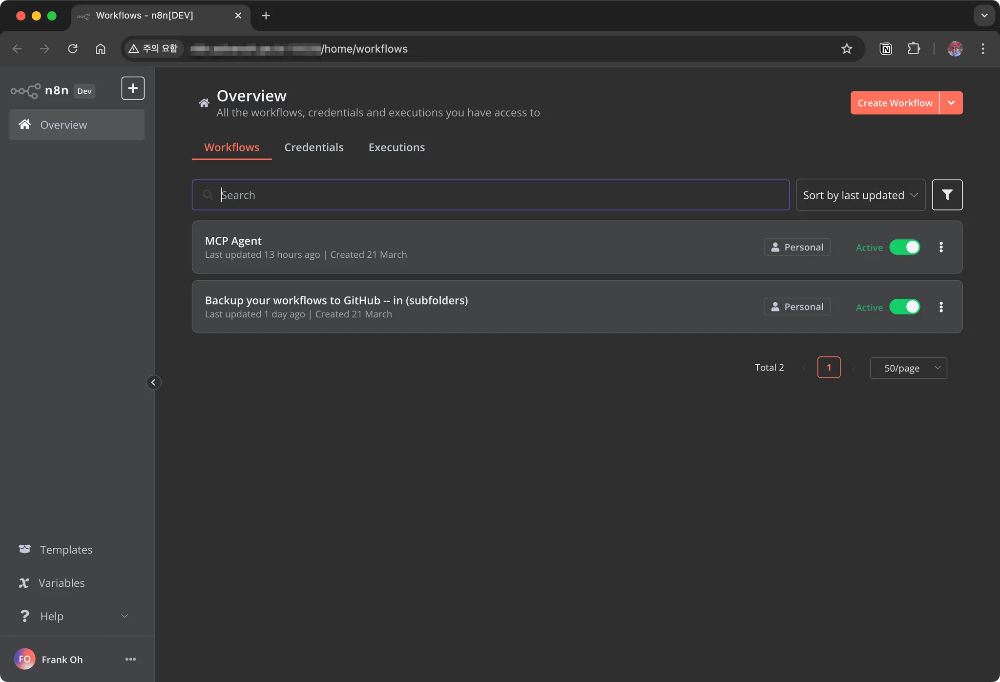

## 1. 개요

직장 동료의 소개로 `n8n`를 접하게 되었고 워크플로우기반의 자동화 도구로 다양한 서비스 특히 AI와 연동해서 자동화하기 좋은 도구이다. 이번 포스팅에서는 라즈베리파이에 `n8n`를 설치하고 구동하는 방법에 대해서 알아본다.

------

## 2. 라즈베리파이에 `n8n` 설치하는 방법

### 2.1 사전 작업

#### 설치된 패키지 최신화

라즈베리파이의 패키지를 최신 상태로 유지하기 위해 다음 명령어를 실행한다.

```bash
> sudo apt update && sudo apt upgrade -y
```

#### Node.js 설치 및 버전 확인

`n8n`은 `Node.js` 기반으로 동작하므로, 최신 버전의 Node.js를 설치해야 한다.

```bash
> curl -fsSL <https://deb.nodesource.com/setup_18.x> | sudo -E bash -
> sudo apt install -y nodejs
```

설치된 `Node.js` 버전을 확인하여 정상적으로 설치되었는지 확인한다.

```bash
> node -v
```

#### `n8n` 설치

이제 npm을 사용하여 `n8n`을 전역(global)으로 설치한다.

```bash
> sudo npm install -g n8n
```

------

### 2.2 `n8n`용 system service 파일 설정

`n8n`을 시스템 서비스로 등록하면 라즈베리파이가 부팅될 때 자동으로 실행된다.

#### 서비스 파일 생성

```bash
sudo vi /etc/systemd/system/n8n.service
```

다음 내용을 추가한다.

```
[Unit]
Description=n8n Automation Tool
After=network.target

[Service]
ExecStart=/usr/bin/n8n
Restart=always
User=pi
Environment=PATH=/usr/bin:/usr/local/bin
Environment=NODE_ENV=production
Environment=N8N_COMMUNITY_PACKAGES_ALLOW_TOOL_USAGE=true
Environment=N8N_BASIC_AUTH_ACTIVE=false
Environment=N8N_SECURE_COOKIE=false
Environment=N8N_LICENSE_ACTIVATION_KEY=ba0ffeb7...생략
WorkingDirectory=/home/pi/

[Install]
WantedBy=multi-user.target
```

- `PATH=/usr/bin:/usr/local/bin` → 실행 가능한 바이너리 경로를 설정하여 `n8n` 실행을 보장
- `NODE_ENV=production` → `n8n`을 프로덕션 환경에서 실행하도록 설정
- `N8N_COMMUNITY_PACKAGES_ALLOW_TOOL_USAGE=true` → 커뮤니티에서 제공하는 패키지를 사용할 수 있도록 허용
- `N8N_BASIC_AUTH_ACTIVE=false` → 기본 인증 기능을 비활성화하여 누구나 접근 가능하도록 설정 (보안이 필요하면 true로 변경 필요)
- `N8N_SECURE_COOKIE=false` → 보안 쿠키 기능을 비활성화 (HTTPS 환경이 아니라면 false로 두는 것이 일반적)
- `N8N_LICENSE_ACTIVATION_KEY` → `n8n`의 라이선스 활성화 키 (유료 플랜 사용 시 필요)

### 2.3 서비스 활성화 및 시작

서비스를 등록하고 활성화한다.

```bash
> sudo systemctl daemon-reload
> sudo systemctl enable n8n
> sudo systemctl start n8n
```

정상적으로 실행되고 있는지 확인한다.

```bash
> sudo systemctl status n8n
```

------

## 2.4 `n8n` 접속하기

`n8n`이 정상적으로 실행되었으면, 웹 브라우저에서 `http://localhost:5678`로 접속하여 확인할 수 있다.



------

## 3. 마무리

`n8n`을 라즈베리파이에 성공적으로 설치하고, 시스템 서비스로 등록하여 안정적으로 운영할 수 있도록 설정했다. 이를 통해 자동화된 워크플로우를 구축하고 활용할 수 있다. 추가적으로 보안이 필요하다면 기본 인증을 활성화하고, HTTPS 설정을 고려해보는 것도 좋다.

> 개인적으로 외부에서도 접근해서 작업하고 싶어 집 iptime 공유기에서 port forwarding 을 설정해서 사용중이다.
