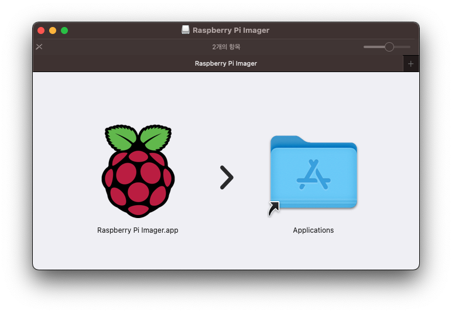

## 1. 들어가며

회사에서 좋은 동료로부터 라즈베리파이4를 선물로 얻게 되어 당분간 나의 개인 Toy로 사용할 수 있을 듯하다. 조금 더 적극적으로 사용하기 위해 개인적으로 운용하고 있는 [명언 서비스](https://quote.advenoh.pe.kr/)를 AWS에서 라즈베리파이로 옮길 계획이다.

자, 라즈베리파이4에 OS를 설치하는 방법에 대해서 알아보자. 모니터로 연결해서 설치할 수도 있지만, 모니터 없이도 간단하게 OS를 설치할 수 있다. 필요한 도구는 다음과 같다.

- 라즈베리파이4
- SD card
- SD card 리더기
- 전원 케이블 (5V, 3000mA)
    - 개인적으로 USB-C 케이블를 사용해서 구동하고 있음

## 2.라즈베리파이 OS 설치

### 2.1 SD card에 라즈베리파이 PI OS 설치하기

OS 설치는 아래 순서대로 진행하면 된다. 맥을 사용하고 있어 맥 기준으로 설명한다.

1. Raspberry Pi image 다운로드 및 설치
2. SD card format
3. SD card에 OS 쓰기

먼저 [라즈베리파이 PI 사이트](https://www.raspberrypi.org/software/)에 접속하여 Raspberry Pi Imager를 다운로드한다. 다운로드한 파일을 더블클릭하고 App 파일을 선택하여 Applications 폴더로 옮겨 파일을 복사하면 설치가 완료된다.



Spotlight로 Raspberry Pi를 검색하여 Application을 구동시키면 다음 화면을 볼 수 있다.


다음은 SD card를 포맷시키기 위해 SD card 리더기에 SD card를 넣고 컴퓨터에 연결한다. 그리고 Raspberry Pi Imager에서 아래 옵션을 선택하여 포맷을 시킨다.

- Storage > 삽입된 SD card를 선택
- Operation System > Choose OS > Erase를 선택

포맷이 완료되면 아래와 같이 옵션 선택 이후 WRITE 버튼을 클릭하면 OS 이미지는 인터넷으로 자동 다운로드되고 SD card에 쓰이게 된다. 쓰기 완료 시점은 SD card의 사양에 따라서 다를 수 있다.

- Operating System > Raspberry PI OS Full (32-BIT) 선택
- Storage > 삽입된 SD card를 선택


### 2.2 로컬 환경에서 라즈베리파이에 접근하기

#### 2.2.1 SSH로 접근하기

ssh로 접근하기 위해서는 SD card에 설정 파일을 생성하면 라즈베리파이 구동 시 바로 SSH로 접근할 수 있다. 필요한 SSH 설정은 다음과 같다. 두 파일 모두 root 폴더에 생성한다.

- ssh empty 파일 생성 (`ssh`)
- wifi 설정 파일 생성 (`wpa_supplicant.conf`)

ssh empty 파일(`ssh`)은 확장명 없이 root에 생성한다. 그리고 `wpa_supplicant.conf`도 SD card root에 생성하고 사용하려는 wifi와 암호 정보를 작성하면 된다.

```
country=US
ctrl_interface=DIR=/var/run/wpa_supplicant GROUP=netdev
update_config=1
network={
    ssid="wifi-name"
    psk="password"
    scan_ssid=1
}
```

SD card 리더기에서 분리하여 라즈베리파이 보드에서 rpi에 넣고 전원 케이블을 연결하여 구동시킨다. 공유기로부터 할당받은 IP 주소를 확인하기 위해 공유기 어드민에 접속하여 확인한다. 내 공유기에서는 `192.168.0.24`로 할당을 받았다.


IP 주소는 변경될 수 있으니 `/etc/hosts` 파일에 도메인 이름을 설정하여 도메인 이름을 사용하는게 좋을 듯하다.

```bash
$ vim /etc/hosts
192.168.0.24 raspberry.local
```

IP 주소나 등록한 도메인이름으로 접속한다.

```bash
$ ssh pi@192.168.0.24
$ ssh pi@raspberry.local
```

> 라즈베리파이 `id/pasword` 기본 값은 `pi/raspberry` 이다.


#### 2.2.2 Remote Desktop으로 접근하기

리눅스 터미널 대신 데스크탑 환경으로 로그인하려면 VNC나 XRDP로 접속할 수 있다. 먼저 VNC 설정을 알아보자.

##### 2.2.2.1 VNC

VNC 설정은 `raspi-config`로 터미널에서 VNC를 손쉽게 설정할 수 있다.

- Interface Options > VNC > Yes를 선택

```bash
$ sudo raspi-config
```

맥에서 VNC로 접속하려면 brew 명령어로 VNC Viewer를 설치한다.

```bash
$ brew install vnc-viewer
```

VNC Viewer를 구동시켜 아래와 같이 Connect 설정후 로그인을 한다.


##### 2.2.2.2 XRDP

XRDP는 `apt`로 필요한 패키지 설치후 리부팅을 시킨다.

```bash
$ sudo apt install xrdp
$ sudo reboot
```

맥에서 Microsoft Remote Desktop가 없은 경우에는 AppStore 찾아 설치하고 Connect 설정을 한다.


XRDP로 로그인한 화면이다.


## 3. 기타 설정

### 3.1 암호 변경하기

기본 암호를 변경하려면 `passwd` 명령어로 변경한다.

```bash
$ sudo passwd pi
```

### 3.2 VNC 구동시 "Cannot currently show the desktop" 오류 발생시 해결책

*"Cannot currently show the desktiop"* 오류가 발생하면 `raspi-config`에서 아래 설정을 변경하면 해결된다.

- Display Options > Resolution > DMT Mode 16 1024 x 728

참고

- https://m.blog.naver.com/elepartsblog/221828692886

## 4. 마무리

모니터없이 Raspberry Pi OS를 설치했다. 다음에는 라즈베리파이에 [명언 서비스](https://quote.advenoh.pe.kr/)를 쿠버네티스로 구동하는 방법에 대해서 다루도록 한다.

## 5. 참고

- https://www.raspberrypi.org/software/
- https://roboticsbackend.com/install-ubuntu-on-raspberry-pi-without-monitor/
- https://linuxhint.com/install_raspberry_pi_os_without_external_monitor/
- https://www.tomshardware.com/reviews/raspberry-pi-headless-setup-how-to,6028.html
