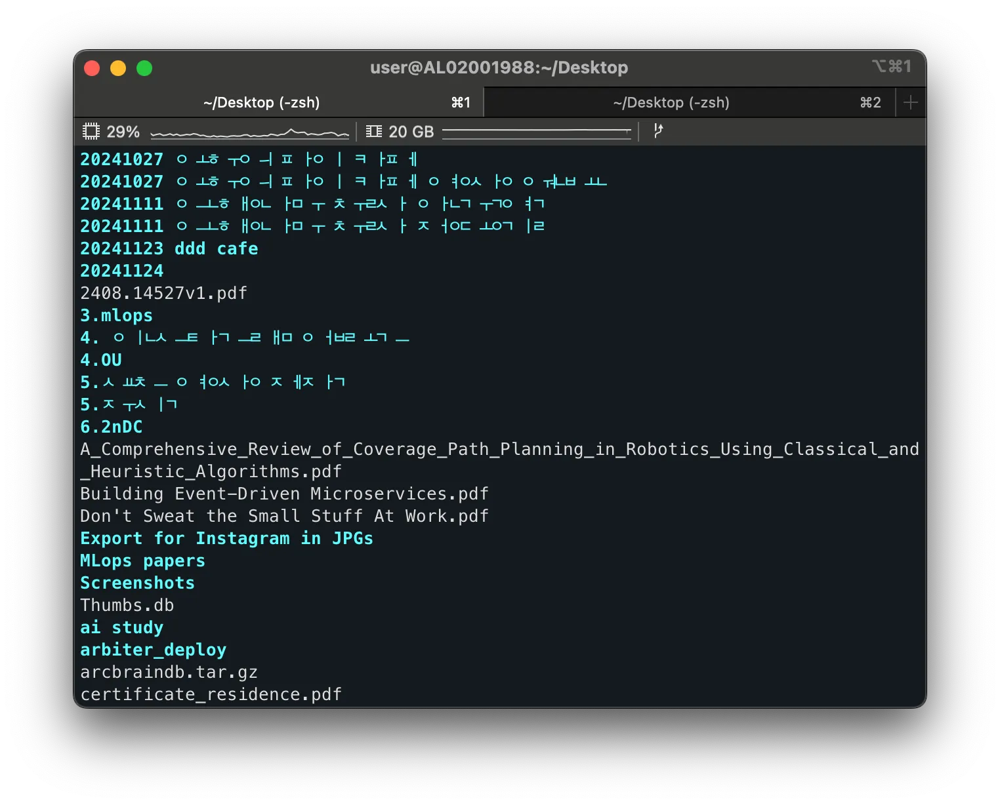
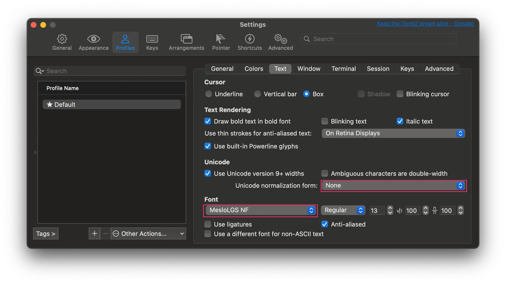

## 1. 개요

최근 맥북을 새로 설치한 후 `iTerm2`를 사용하는 과정에서 한글 폴더 및 파일명이 깨지는 문제가 발생했다. 이번 글에서는 `iTerm2`에서 한글 깨짐 현상을 해결하는 방법을 소개한다.

## 2. 한글 깨지는 현상 - `iTerm2` 설정 변경

Term2에서 한글 깨짐 현상은 주로 두 가지 이유로 발생한다. Unicode Normalization Format 설정과 폰트 선이다. 아래 단계를 따라 설정을 변경하면 문제를 해결할 수 있다.

### 2.1 Unicode Normalization Format 변경

`iTerm2`는 `Unicode Normalization Format` 설정에 따라 문자 인코딩 방식을 다르게 처리한다. 기본 설정이 한글 처리에 적합하지 않기 때문에 이를 수정해야 한다.

`iTerm2` 실행하고 Profiles > Text 탭에서 관련 설정을 변경한다.

- `None` → `NFC`로 변경

> `NFC`(Normalization Form C)는 한글 조합 문자를 처리할 때 적합한 설정으로, 한글 파일명과 폴더명을 올바르게 표시한다.,

### 2.2 Font 변경

`iTerm2`에서 사용하는 폰트도 한글 표시 여부에 영향을 미친다. 한글을 제대로 표시하려면 `MesloLGS NF` 폰트를 사용하는 것이 좋다.

- Font 설정에서 `MesloLGS NF` 선택

> 만약 Font목록에 `MesloLGS NF`가 없을 경우, [이 링크](https://github.com/romkatv/powerlevel10k/?tab=readme-ov-file#manual-font-installation)를 통해 다운로드 및 설치할 수 있다

## 3. 마무리

위 단계를 통해 `iTerm2`에서 발생하던 한글 깨짐 문제를 손쉽게 해결할 수 있었다.

## 4. 참고

- [[MAC] iTerm2 한글 분리 해결 / iTerm2 한글 깨짐 해결](https://passing-story.tistory.com/entry/MAC-iTerm2-%ED%95%9C%EA%B8%80-%EB%B6%84%EB%A6%AC-%ED%95%B4%EA%B2%B0-iTerm2-%ED%95%9C%EA%B8%80-%EA%B9%A8%EC%A7%90-%ED%95%B4%EA%B2%B0)
