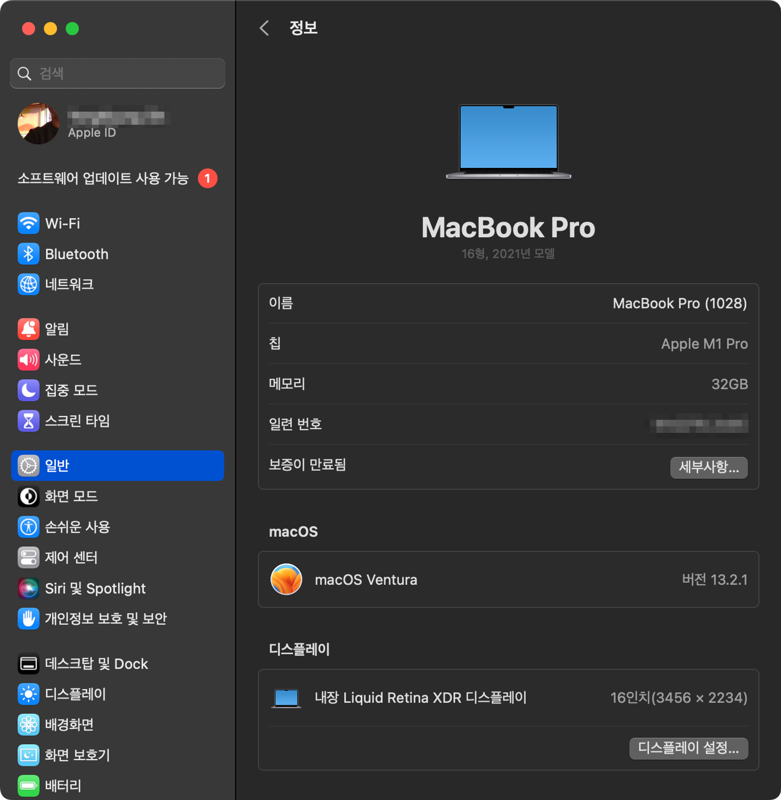
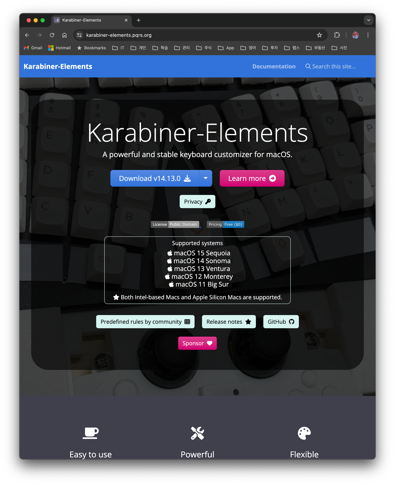
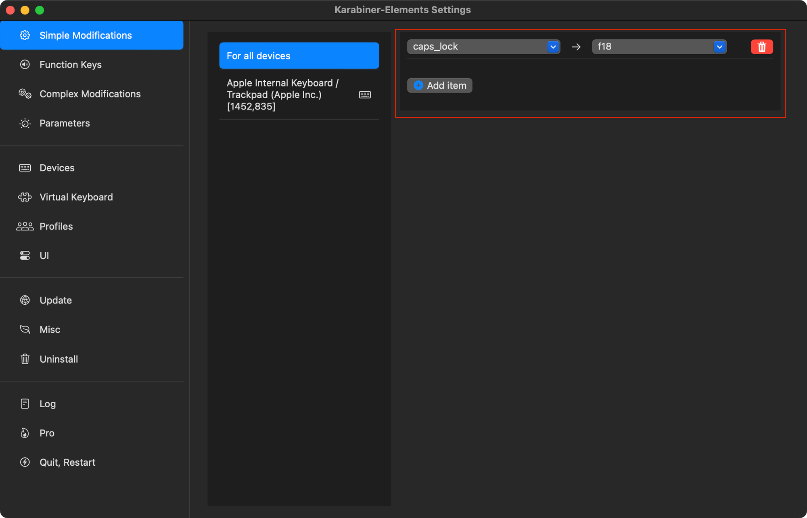

## 1. 개요

맥북을 사용하는 많은 사용자가 한영키 전환 시 버벅임을 경험한다. `Karabiner` 매팅을 통해서 한영키 전환 문제를 해결 했었는데, Ventura 버전 이상으로 업그레이드한 후 다시 버벅임이 발생했다.

맥 OS의 어떤 변화로 다시 안되는지는 모르지만, 결론적으로 최신 `Karabiner` 버전을 업데이트하고 다시 설정해주면 해결이 된다. 기록상 블로그에 남깁니다.

### 1.1 사용하는 맥버전

현재 macOS Ventura 13.2.1을 사용하는 M1 맥북 에어를 사용 중이다.

## 2. Karabiner 설치 밍 설정

### 2.1 Karabiner 설치

`Karabiner`는 강력한 키 매핑 도구로, 맥북의 키보드 동작을 사용자 정의할 수 있다. 오픈소스로 [Karabiner 공식 웹사이트](https://karabiner-elements.pqrs.org/)에 접속해 최신 버전을 다운로드한다.

> 처음 실행 시 시스템 환경설정에서 접근성 권한을 요청한다. 이 권한을 부여해야 정상적으로 작동할 수 있다

`개인정보 보호 및 보안` > `입력 모니터링` 에서 아래 두 개의 모니터링을 허용해준다.

## 2.2 Karabiner 설정 - 한영 전환 버벅임 없애기

`Karabiner-Elements` 를 실행하고 아래와 같이 매팅을 추가한다. 이 설정은 `caps_lock`을 누르면 f18 키를 누른 것과 동일한 결과가 나온다는 의미이다.

맥 `키워도` 설정에서 `입력 소스` > `키보드 단추키…` > `입력 소스` 클릭하고 입력 메뉴에서 다음 소스 선택의 키를 `f18`로 변경한다. `f18`을 눌렸을 때 한영 키를 전환하도록 바꿔주게 된다.

> 이제 `caps_lock`을 눌러보세요. 문제 없이 잘 동작할 거예요.

결론적으로 위 과정을 통해서 사용자가 `caps_lock` 키 누름 → 매팅에 의해서 `f18` 가 눌림 → 한영키가 잘 전환된다.

## 3. 참고

- [[MAC\] Karabiner 한영키 전환 버벅임 없애기](https://www.clien.net/service/board/lecture/18250346)
- [맥 한영전환 딜레이 해결방법 (Karabiner-Elements)](https://blog.naver.com/rkdals530/222385359410)
- [맥북 m1 한영 전환 딜레이 없애는 방법 (Karabiner)](https://change-words.tistory.com/entry/Mac-capslock-conversion-delay)
