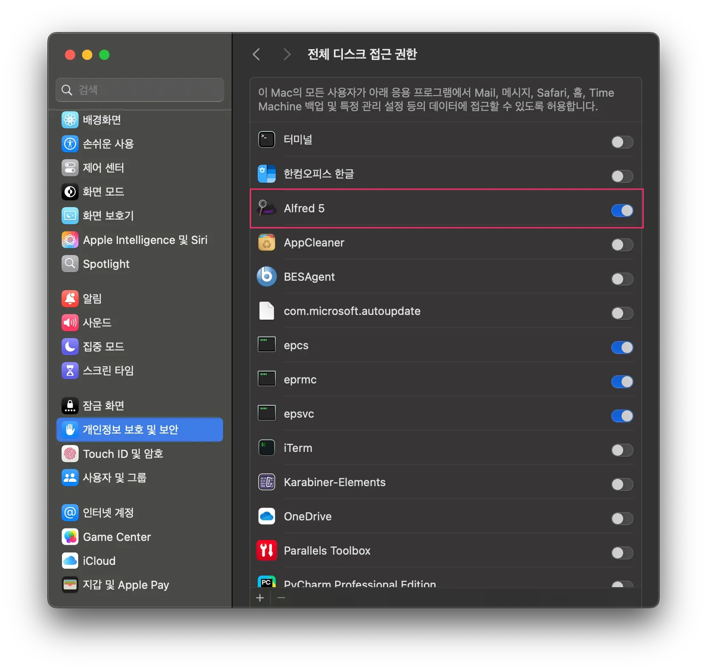
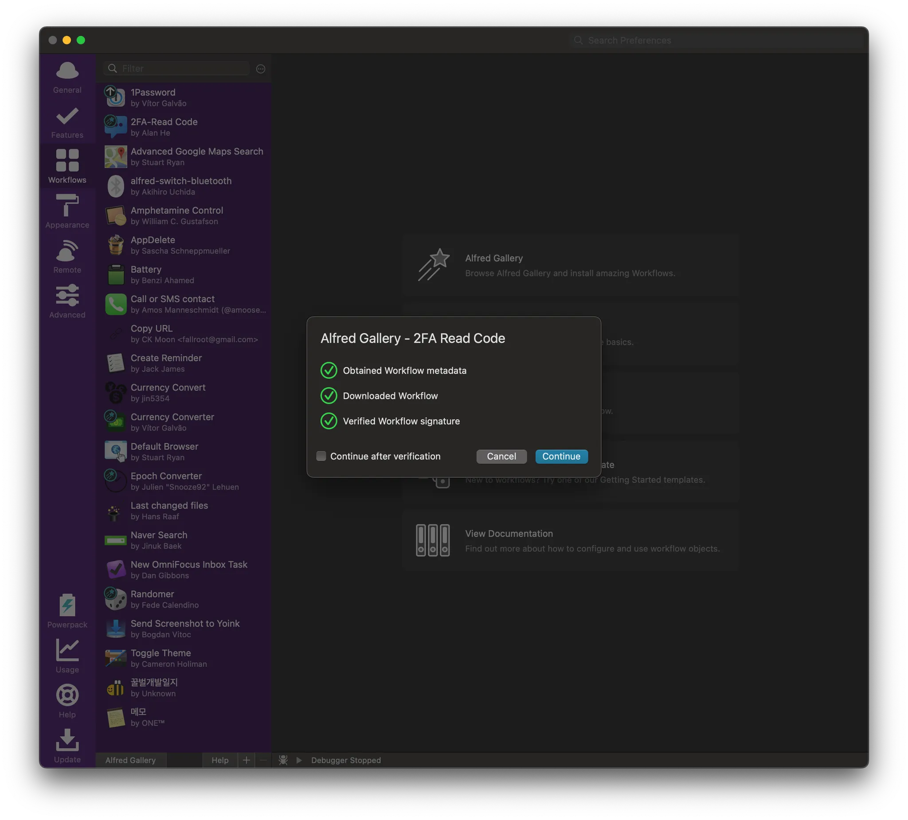
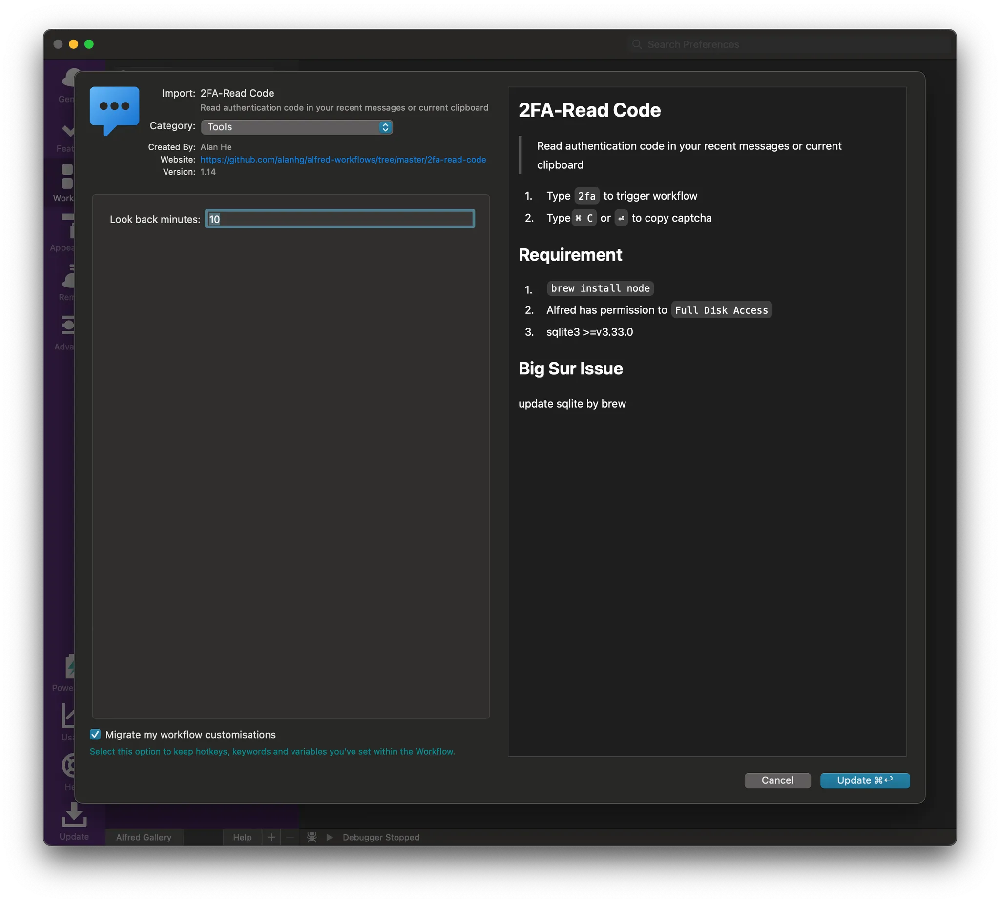
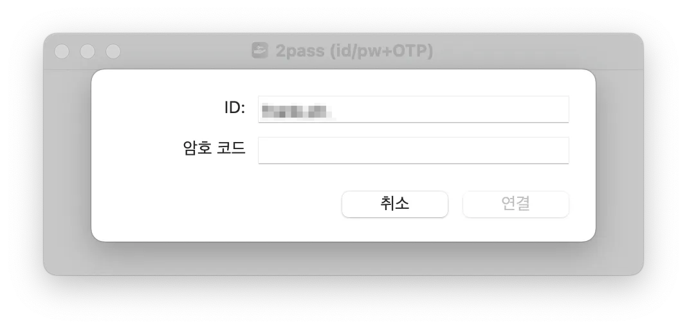
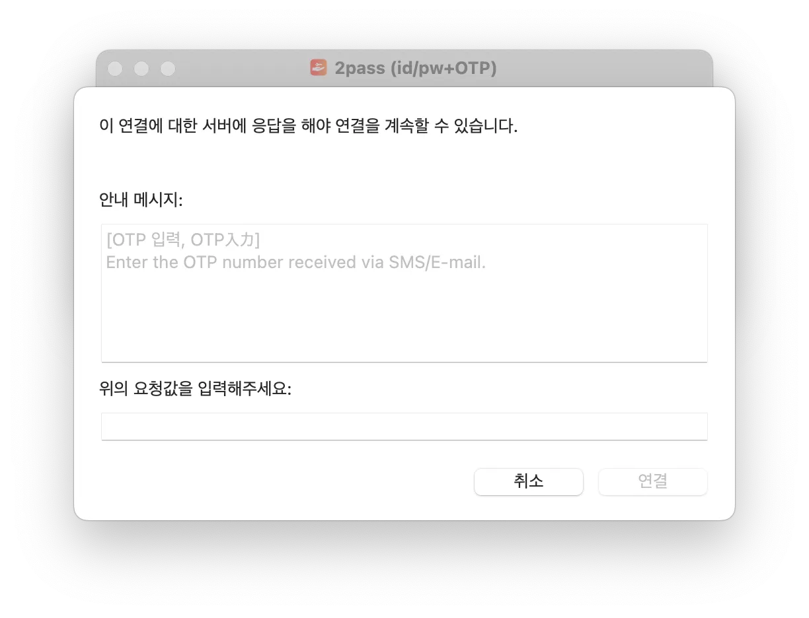
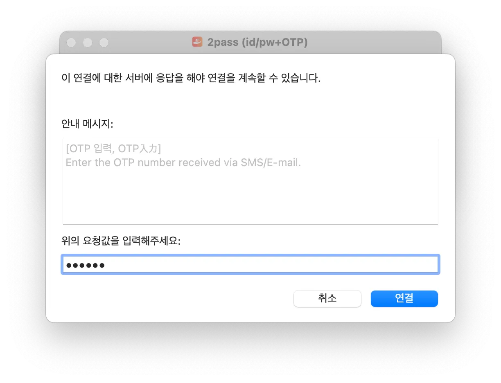

## 1. 개요

회사 VPN에 연결할 때마다 문자로 `OTP`(일회용 비밀번호)를 받고, 이를 수동으로 입력하는 번거로운 작업을 매일 반복하고 있었다. 하지만 회사 동료의 추천으로 Alfred Workflow를 활용하여 이 과정을 자동화하면서 삶이 조금 더 수월해졌다.

자동화 도구로 사용한 Alfred Workflow의 `2FA Read Code`를 소개하고, 이를 활용하여 `iMessage`에서 자동으로 2FA 코드를 추출하고 입력하는 방법을 설명한다.

> Alfred Workflow는 macOS의 생산성을 높여주는 `Alfred` 앱의 강력한 기능 중 하나로, 반복적인 작업을 자동화할 수 있도록 도와준다.

### 2FA Read Code란?

`2FA Read Code`는 Alfred Workflow 중 하나로, `iMessage`에 수신된 `OTP` 코드를 자동으로 찾아 복사할 수 있도록 도와준다. 이를 통해 `VPN` 로그인, 웹사이트 2FA 입력 등에서 손쉽게 인증을 진행할 수 있다.

## 2. `2FA Read Code` 사용하는 방버

### 2.1 필요 조건

이 Workflow를 사용하려면 다음과 같은 조건을 충족해야 한다.

- 아이폰과 맥북을 함께 사용하는 사용자
- `iMessage` 동기화 활성화

이렇게 하면 iPhone에서 받은 2FA 문자 메시지를 Mac에서도 확인할 수 있으며, `가 이를 자동으로 읽을 수 있게 된다.

### 2.2 사용 전 준비사항

`2FA Read Code` Workflow를 사용하려면 Node.js와 SQLite3가 필요하다. `brew`를 이용해 간단히 설치할 수 있다.

#### Homebrew로 Node.js, SQLite3 설치

터미널에서 아래 명령어를 입력한다.

```bash
> brew install node sqlite3
```

설치가 완료되면 `2FA Read Code` Workflow가 정상적으로 작동할 준비가 된다.

#### Alfred 디스크 권한 설정

`2FA Read Code` Workflow는 디스크 권한이 필요해서 아래 설정에서 `Alfred` 에 디스크 접근 권한을 부여한다.



## 2.3 `2FA Read Code` Workflow 설치

`2FA Read Code` Workflow를 설치하는 방법은 다음과 같다.

1. 워크플로우 다운로드
   - [2FA Read Code 다운로드 페이지](https://alfred.app/workflows/alanhe/2fa-read-code/)로 이동해서 사이트에서 `Install in Alfred` 버튼 클릭한다



2. `Alfred`에서 Workflow 설치

- `Alfred`가 실행되면 `설치` 버튼을 클릭하여 워크플로우를 추가한다



이제 `Alfred`에서 `2FA Read Code`를 사용할 준비가 완료되었다.

### 2.4 Workflow 사용법

이제 실제로 `2FA Read Code`를 사용하여 `OTP`를 자동으로 입력하는 방법을 살펴보자.

1. 회사 `VPN` Client 실행
   - `VPN` 클라이언트를 실행하고 아이디/패스워드를 입력한다



`OTP` 입력을 기다리고 있다. 2FA를 사용해보자.



2. `OTP` 입력 단계에서 `Alfred` 실행

- `Alfred`를 실행 (`⌘ + 스페이스` 또는 설정한 단축키) 한다.
- `2fa` 입력 후 `Enter` 키를 누르면 최근 `iMessage`에서 받은 2FA 코드가 자동으로 복사된다


3. 복사된 2FA 코드 붙여넣기

- `VPN` 클라이언트에 OTP 입력창이 나타나면, `⌘ + V`(붙여넣기)로 코드를 입력한다

이제 더 이상 핸드폰을 직접 확인하고 수동으로 OTP를 입력할 필요가 없다!

## 3. 마무리

2FA Read Code Workflow를 활용하면 OTP 코드 입력을 자동화하여 로그인 과정을 훨씬 편리하게 만들 수 있다. 특히 매일 VPN 접속이나 2FA 인증을 해야 하는 사용자라면, 이 간단한 자동화만으로도 업무 속도를 크게 향상시킬 수 있다.

맥북을 사용하면서 생산성을 높이고 싶다면, Alfred Workflow를 적극 활용해 보세요!

> 다시 한번 저에게 소개해주신 회사 동료분께 감사드립니다.

## 4. 참고

- [2FA Read Code](https://alfred.app/workflows/alanhe/2fa-read-code/)
- [Full Disk Access](https://www.alfredapp.com/help/getting-started/permissions/#full-disk)
