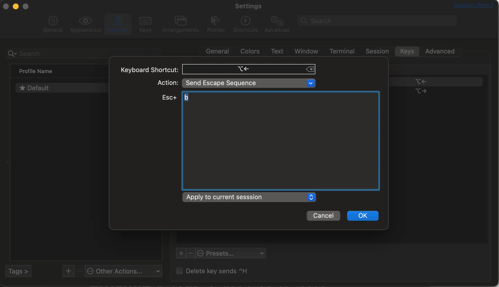
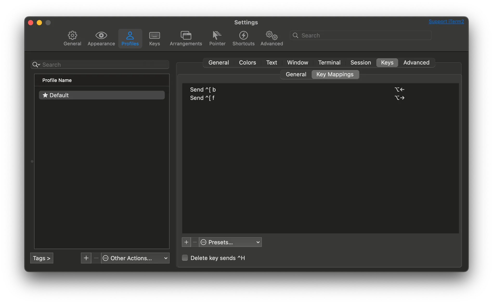

## 1. 개요

리눅스 환경에서 터미널을 사용할 때, Alt 키와 방향키(←, →)를 사용하면 Word 단위로 이동하는 기능이 기본적으로 활성화되어 있어 매우 편리한다. 그러나 맥의 iTerm2에서는 이러한 기능이 기본적으로 설정되어 있지 않으며, 대신 키 입력 시 `^[D` 또는 `^[C` 같은 값이 표시만 된다.

```bash
> helm upgrade --install asynqmon . -f values-dev.yaml -n dev [D[D[C[C
```

맥 환경에서도 이 기능을 사용할 수 있도록 iTerm2에서 Alt 키를 매핑하는 방법을 소개한다.

## 2. iTerm2에서 Alt 키 매핑 설정하는 방법

`Settings` > `Profiles` > `Keys` > `Key Mappings`에서 아래와 같이 새로운 매핑을 추가하면 된다.

- `⌥←` :
  - Action : `Send Escape Sequence` 선택
  - Esc +: `b` 값 입력
- `⌥→` :
  - Action: `Send Escape Sequence` 선택
  - Esc +: `f` 값 입력




최종적으로 아래와 같이 2가지 키 매핑을 추가하면 된다. 



## 3. 참고

- [Making the Alt Key Work in iTerm2](https://www.clairecodes.com/blog/2018-10-15-making-the-alt-key-work-in-iterm2/)
