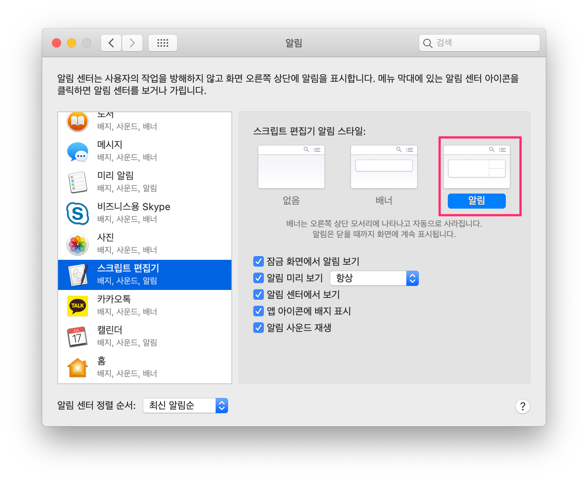

## 1. 들어가며

스터디나 블로그 작성을 시작하려고 노트북을 켜면 바로 스터디나 블로그 작성보다는 먼저 가는 곳이 인터넷 뉴스나 유튜브 동영상을 먼저 보게 됩니다. 그리고 30분 정도 보다 보면 이제 시작해야지 하고 에버노트를 킵니다.

그리고 집중해서 뭔가 시작하려고 하면 10분 정도 하다가도 다시 뉴스나 유튜브 동영상을 보고 있는 저 자신을 보게 됩니다. 스터디했다가 뉴스 봤다가 이걸 반복하다 보면 몇 시간이 훌쩍 지나가 있는 경우가 허다합니다. 그래서 그런지 매주 하나씩 블로그 작성하려고 하는 게 잘 안되는 게 아닌가 싶습니다.

김민식 PD님이 쓰신 <영어 책 한권 외워봤니?> 책을 보면서 뽀모드로(pomodoro) 기법에 대해서 알게 되어 이걸 적용해보기로 했습니다.

여러 책이나 인터넷에서 언급되었던 시간 관리 기법중에 하나입니다. [뽀모드로 기법](https://ko.wikipedia.org/wiki/%EB%BD%80%EB%AA%A8%EB%8F%84%EB%A1%9C_%EA%B8%B0%EB%B2%95) 은 ‘프란체스코 시릴로’가 제안한 방식으로 타이머를 사용해서 25분간 집중해서 일을 한다음 5분간 휴식하는 방식입니다.

앱 스토어나 핸드폰에서도 관련 앱이 많이 있지만, 저는 그냥 맥 터미널에서 동작하기 쉽게 shell script로 작성하였습니다. 그리고 25분이 지나면, 맥환경에서 Popup 형식으로 notification을 받고 효과음도 같이 플레이 하도록 스크립트를 작성하였습니다.

## 2. 실행화면

1분 동안 키운다운후 Pop-up이 실행되는 화면입니다.


## 3. 스크립트 작성 및 시스템 알람 설정

맥 환경에서 작업하였고 zsh shell을 사용하였습니다.

### 3.1 Shell 설정 파일 수정하기

Shell 설정 파일을 텍스트 에디터로 오픈하여 아래 함수를 넣고 저장합니다.

```bash
$ code ~/.zshrc
```

[https://gist.github.com/kenshin579/1b8dc3d9db35b6fee534569ec128e62b](https://gist.github.com/kenshin579/1b8dc3d9db35b6fee534569ec128e62b)

수정한 Shell 설정 파일을 현재 Shell에서 재로딩하려면 source 명령어로 다시 로드하면 됩니다.

```bash
$ source ~/.zshrc
```

### 3.2 효과음 파일 Library 폴더로 복사하기

효과음 파일을 사용자 Library 폴더로 복사합니다.

```bash
$ cp Clock-chimes.mp3 ~\_Library_Sounds
```

<a href='Clock-chimes.mp3'>Clock-chimes.mp3</a>

## 3.3 시스템 알람 설정하기

알람을 별도로 설정하지 않으면 기본으로 **배너 알람 스타일** 이라서 알람이 나왔다가 자동으로 사라집니다. 그래서 다른 화면을 보고 있으면 알람 창이 뜬지도 모르는 경우가 종종 발생합니다. 알람창이 자동으로 사라지지 않고 닫기 버튼을 둘러야 사라지는 알람 스타일로 변경하는 게 좋습니다.

시스템환경 > 알림 > 스트립트 편집기 선택후 아래와 같이 알람 스타일을 변경합니다.



### 3.4 실행하기

1을 입력하면 1분 동안 카운트 다운이 시작되고 1분이 지난 후에는아래와 같이 Popup 창이 뜨게 됩니다.

```bash
$ countdown 1
```


## 4. 참고

- Display Notification from Mac \* [https://code-maven.com/display-notification-from-the-mac-command-line](https://code-maven.com/display-notification-from-the-mac-command-line)
