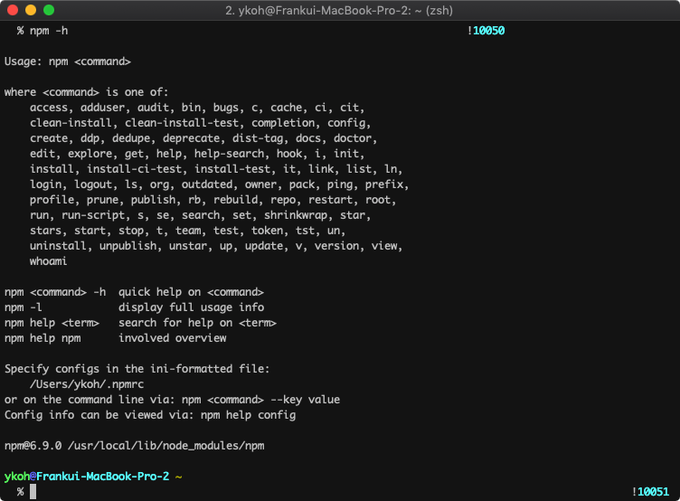

## 1. 들어가며

이번 포스팅에서는 Node.js 모듈을 NPM 저장소에 배포하는 방법에 대해서 알아보겠습니다. NPM은 Node Package Modules 약자로 Node.js 모듈 관리해주는 패키지 관리자입니다.
NPM의 명령어로 쉽게 Node.js 모듈을 설치해서 js 라이브러리를 사용할 수도 있고 또한 개발한 모듈을 다른 이들이 사용할 수 있도록 레지스토리에 배포할 수도 있습니다.

## 2. NPM 저장소에 배포하기

배포과정은 맥 환경으로 설명하겠습니다.

### 2.1 NPM 설치

NPM 명령어는 Node.js 설치 시 같이 설치되는데, 노드가 아직 설치되어 있지 않다면 brew로 설치합니다.

```bash
$ brew instal nodejs
$ npm -h
```



### 2.2 package.json

NPM 리파지토리에 배포하기 위해 간단한 파일 몇 개만 필요합니다. 그중 가장 먼저 작성하게 되는 파일이 package.json 입니다. 프로그램에 대한 기본적인 내용(ex. 이름, 버전)을 포함해서 프로그램에 필요한 dependency 그리고 실행 방법 등을 기술할 수 있습니다.

npm의 init 명령어로 -y 옵션을 주어서 non-interactive 하게 기본 설정으로 package.json을 생성할 수 있습니다.

```bash
$ npm init -y
```


아래는 [app-timer-pomodoro](https://github.com/kenshin579/app-timer-pomodoro) 의 package.json 파일입니다. 기본 값으로 설정한 것보다 더 많은 내용이 있지만, 쉽게 이해할 수 있는 수준입니다.

```json
{
  "name": "timer-pomodoro",
  "version": "0.1.1",
  "description": "Simple counting down console pomodoro program.",
  "preferGlobal": true,
  "bin": {
    "timer-pomodoro": "lib/app.js"
  },
  "scripts": {
    "compile": "babel -d lib/ src/",
    "compile:watch": "babel -w -d lib/ src/",
    "coverage": "nyc npm test",
    "coverage:lcov": "nyc npm test && nyc report --reporter=text-lcov | coveralls",
    "lint": "standard --fix",
    "prepublish": "npm run compile",
    "start": "node lib/app.js",
    "test": "mocha --compilers js:babel-core/register",
    "release:patch": "npm run lint && npm run compile && npm version patch && npm publish"
  },
  "repository": {
    "type": "git",
    "url": "git+https://github.com/kenshin579/app-timer-pomodoro.git"
  },
  "keywords": [
      …(생략)...
    "time management"
  ],
  "author": "Frank Oh <kenshin579@gmail.com>",
  "license": "MIT",
  "bugs": {
    "url": "https://github.com/kenshin579/app-timer-pomodoro/issues"
  },
  "homepage": "https://github.com/kenshin579/app-timer-pomodoro#readme",
  "dependencies": {
    "ascii-numbers": "^1.0.4",
   …(생략)...
}
```

### 2.3 소스 코드

npm init으로 간단하게 생성한 예제에서는 index.js 소스 파일만 생성해서 ‘hello world’를 출력하겠습니다.

```bash
$ code index.js
> console.log('hello world')

$ node index.js
```

### 2.4 첫 배포

NPM 리파지토리에 배포하기 위해서는 NPM 사이트에 계정이 있어야 하고 명령어 창에서 사이트로 로그인 이후에 배포할 수 있습니다.

#### 2.4.1 사용자 등록하기

NPMJS 사이트에 계정이 없는 경우에는 [사이트](https://www.npmjs.com/) 에 접속해서 계정을 생성합니다.

```bash
$ npm login
```


명령어로도 바로 계정을 생성할 수 있습니다.

```bash
$ npm adduser
```

#### 2.4.2 리파지토로에 배포하기

모듈 배포는 간단합니다. npm publish 명령어로 프로젝트 폴더에서 실행하면 됩니다.

npm-publish-test는 이미 존재하는 프로젝트이여서 package.json에서 name을 ykoh-npm-publish-test로 변경한 이후에 다시 publish를 하였습니다.

```bash
$ npm publish
```


이상 없이 배포되면 NPM 사이트에서도 바로 확인할 수 있습니다.

[https://www.npmjs.com/package/ykoh-npm-publish-test](https://www.npmjs.com/package/ykoh-npm-publish-test)


### 2.5 재배포

코드 수정이후에 모듈을 재배포하려면 버전을 업데이트해야 합니다. 버저닝은 npm version 명령어를 사용해서 쉽게 업데이트를 하면 됩니다.

minor 옵션을 주면 package.json 파일에서 version의 minor 숫자를 수정해줍니다.

```bash
$ npm version minor
```

버전에서 patch 부분을 업데이트합니다.

```bash
$ npm version patch
```

소스 수정하고 테스트하고 버저닝 올리고 배포하는 명령어를 일일이 타이팅하기보다는 배포하는 전체 과정을 package.json에서 스크립트화 하면 보다 전체 재배포 과정을 수월하게 진행할 수 있습니다. app-timer-pomodoro의 package.json 파일입니다.

```json
"scripts": {
    "compile": "babel -d lib/ src/",
    "lint": "standard --fix",
    "prepublish": "npm run compile",
    "start": "node lib/app.js",
    "test": "mocha --compilers js:babel-core/register",
    "release:patch": "npm run lint && npm run compile && npm test && npm version patch && npm publish"
  }
```

버저닝 이후에는 다시 npm publish로 배포하면 됩니다.

### 2.6 리파지토리에서 제거하기

이미 publish한 패키지도 unpublish 명령어로 리파지토리에서 제거할 수 있습니다.

```bash
$ npm unpublish
```


### 2.7 기타 사항

#### 2.7.1 .npmignore

.npmignore 파일에 리스트업된 파일이나 폴더는 배포에서 제외됩니다. .npmignore 파일이 없는 경우에는 .gitignore 파일을 대신 참조하여 배포에서 제외합니다.

제외시킬 파일들은 IDE 설정파일, test 관련 파일, log 파일 등이 있습니다.

```bash
$ code .npmignore
_~
_.iml
.coveralls.yml
.eslintignore
.eslintrc.json
.idea
.nyc_output
.travis.yml
node_modules
npm-debug.log
src
test
```

## 3. 참고

- npm
    - [https://blog.outsider.ne.kr/829](https://blog.outsider.ne.kr/829)
    - [https://medium.freecodecamp.org/how-to-create-and-publish-your-npm-package-node-module-in-just-10-minutes-b8ca3a100050](https://medium.freecodecamp.org/how-to-create-and-publish-your-npm-package-node-module-in-just-10-minutes-b8ca3a100050)
    - [https://hackernoon.com/publish-your-own-npm-package-946b19df577e](https://hackernoon.com/publish-your-own-npm-package-946b19df577e)
