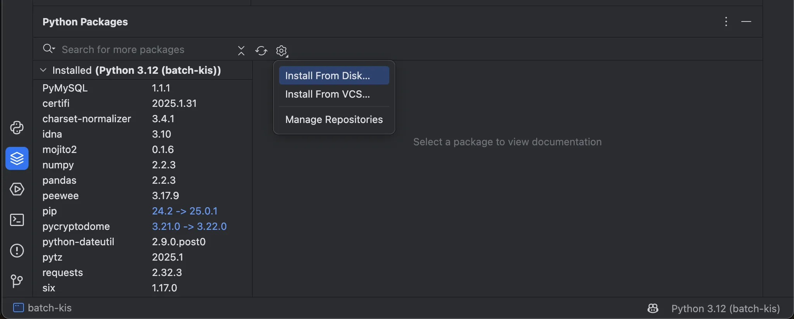
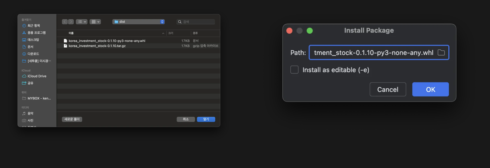
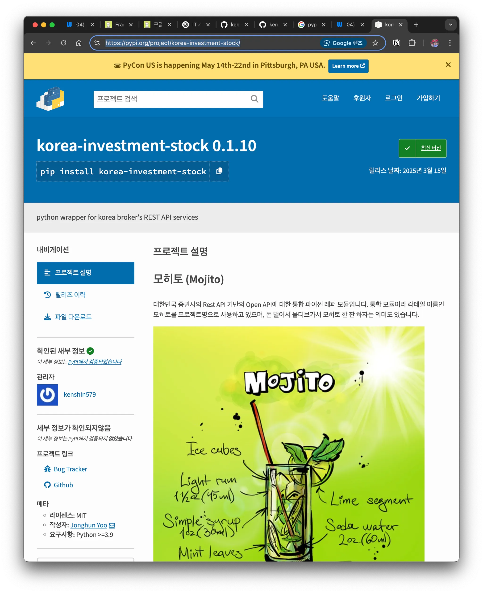
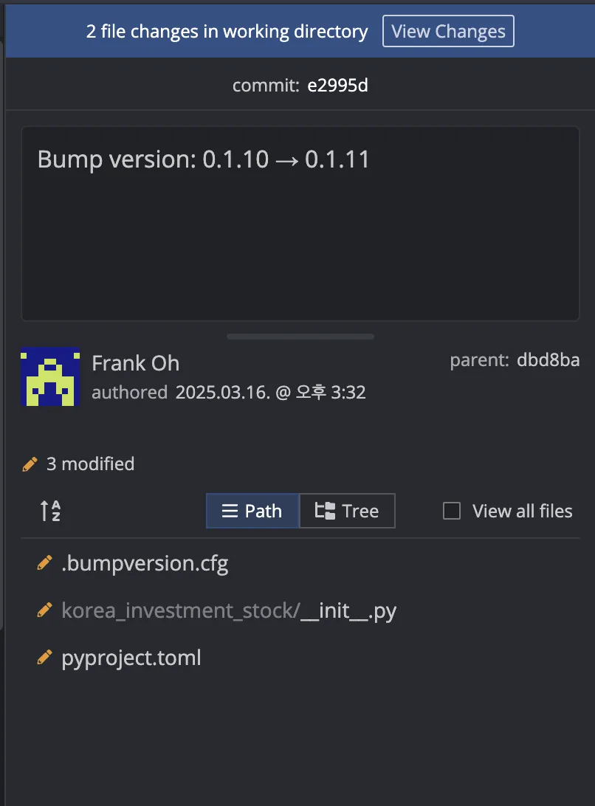

## 1. 개요

Python 패키지를 개발한 후 `PyPi`(Python Package Index)에 업로드하면, `pip install` 명령어만으로 누구나 쉽게 패키지를 설치할 수 있다.

> 주식 투자할 때 개인적으로 구글 시트를 사용해. `GOOGLEFINANCE` 함수로 많은 정보를 얻을 수 있지만, 제공되지 않는 데이터도 있어서 사용자 정의 함수를 구현해서 사용하고 있다.
>
> v1 stock-api에서는 직접 한글투자 API를 호출해서 데이터를 가져왔는데, v2 stock-api에서는 이미 구현된 Python 버전을 사용하면 시간을 절약할 수 있을 것 같아서 그걸로 대체하고 있다.
>
> 참고: [구글 시트에서 사용자 정의 함수 구현하기](https://blog.advenoh.pe.kr/구글-시트에서-사용자-정의-함수-구현하기/)

이 글에서는 `fork` 해서 사용하고 있는 `korea-investment-stock` 모듈을 패키징하고 `PyPi`에 업로드하는 과정을 정리해서 설명한다.

## 2. Python 모듈 패키지화

### 프로젝트 구조 설명

```bash
> tree -L 1
korea_investment_stock/
├── src/
│   └── korea_investment_stock/
│       ├── __init__.py
│       ├── core.py
│       └── utils.py
├── pyproject.toml
├── README.md
└── LICENSE
```

### `pyproject.toml` 파일 작성 (권장)

`pyproject.toml`은 Python 패키지 설정을 정의하는 표준 파일이다. 과거 버전에서는 `setup.py` 파일로 작성을 했지만, 지금은 `toml` 포멧으로 정의를 한다.

```
[build-system]
requires = ["setuptools", "wheel"]
build-backend = "setuptools.build_meta"

[project]
name = "korea-investment-stock"
version = "0.1.10"
description = "python wrapper for korea broker's REST API services"
authors = [
    { name = "Jonghun Yoo", email = "jonghun.yoo@pyquant.co.kr" },
    { name = "Brayden Jo", email = "brayden.jo@pyquant.co.kr" },
    { name = "Frank Oh", email = "kenshin579@gmail.com" }
]
license = { text = "MIT" }
readme = "README.md"
requires-python = ">=3.9"
dependencies = [
    "requests", # 의존성 패키지
    "pandas",
    "websockets",
    "pycryptodome"
]

[project.urls]
"Github" = "<https://github.com/kenshin579/korea-investment-stock>"
"Bug Tracker" = "<https://github.com/kenshin579/korea-investment-stock/issues>"
```

### 패키지 빌드

패키지를 빌드하려면 `build` 모듈을 사용한다.

```bash
> pip install build
> python -m build
> ls -l dist/
total 80
-rw-r--r--@ 1 user  staff  16844 Mar 15 20:30 korea_investment_stock-0.1.10-py3-none-any.whl
-rw-r--r--@ 1 user  staff  17144 Mar 15 20:30 korea_investment_stock-0.1.10.tar.gz
```

빌드가 완료되면 `dist/` 폴더에 `.whl`과 `.tar.gz` 파일이 생성된다.

## 3. Python 모듈 설치하기

### 3.1 로컬에서 패키지 설치 테스트

사용하려면 모듈에서 pip install로 설치한다.

```bash
> cd stock-api/scripts/batch-kis
> pip install dist/*.whl
```

PyCharm IDE에서 설치하려면 아래 왼쪽에 위치한 `Python Packages` 아이콘을 클릭하고 `Setting` > `Install From Disk…` 을 클릭한 다음 빌드한 모듈 위치에서 `whl` 파일을 선택하면 된다.





### 3.2 패키지를 PyPi에 업로드하기

#### 1) 사전 작업

- **PyPi 계정 생성**: https://pypi.org/account/register/

- API 토큰 생성

  : 

  https://pypi.org/manage/account/#api-tokens

  - 참고로 2FA 를 활성화 해야 한다

- `$HOME/.pypirc` 파일에 API 토큰 설정

```
[pypi]
  username = __token__
  password = pypi-AgEIcH... # 발급받은 토큰 입력
 
```

#### 2) `twine`을 이용한 업로드

```bash
> pip install twine
> python -m twine upload dist/*
```

업로드가 성공하면 [PyPi에서 패키지](https://pypi.org/project/korea-investment-stock/)를 확인할 수 있다.



### 업로드 후 패키지 테스트

```bash
> pip install korea-investment-stock

# 잘 설치가 되어 있으면 버전을 출력해준다
> python -c "import korea_investment_stock; print(korea_investment_stock.__version__)"
0.1.10
```

## 4. 배포 및 유지보수

### 패키지 버전 관리 (`bumpversion`)

> `bumpversion`은 Python 패키지의 버전을 자동으로 업데이트하는 도구이다.
>
> 설정된 규칙(예: `major`, `minor`, `patch`)에 따라 버전 번호를 변경하고, 관련 파일(예: `setup.py`, `pyproject.toml`)도 함께 수정해준다. Git 태그와 커밋까지 자동화할 수 있어서 패키지 관리가 편리해져서 사용하기 좋다.


```bash
> pip install bumpversion
> bumpversion patch  # 0.1.0 -> 0.1.1
> bumpversion minor  # 0.1.1 -> 0.2.0
> bumpversion major  # 0.2.0 -> 1.0.0
```

위 명령어를 실행하면 버전 수정이 필요한 파일들에서 버전을 업데이트하고 `commit`까지 만들어준다.



## 5. 마무리

우리가 개발한 Python 모듈을 `PyPi`에 업로드하는 과정에 대해서 알아보았다. 명령어로 업로드를 했지만, GitHub Actions를 이용하면 `git tag`를 푸시할 때 자동으로 `PyPi`에 업로드할 수 있다.

- [github actions 으로 pypi 패키지 배포 자동화하기](https://velog.io/@bailando/github-actions-으로-pypi-패키지-배포-자동화하기)

## 6. 참고

- [pypi 등록하기](https://wikidocs.net/78954)
