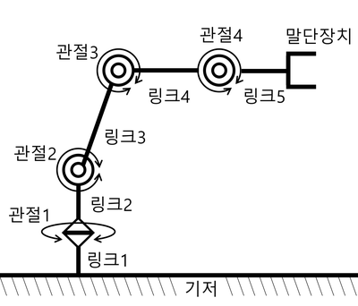
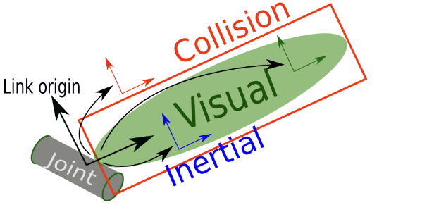
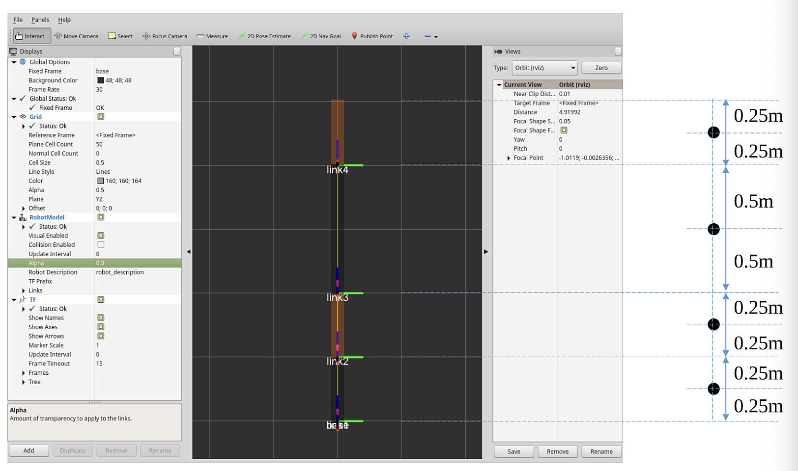
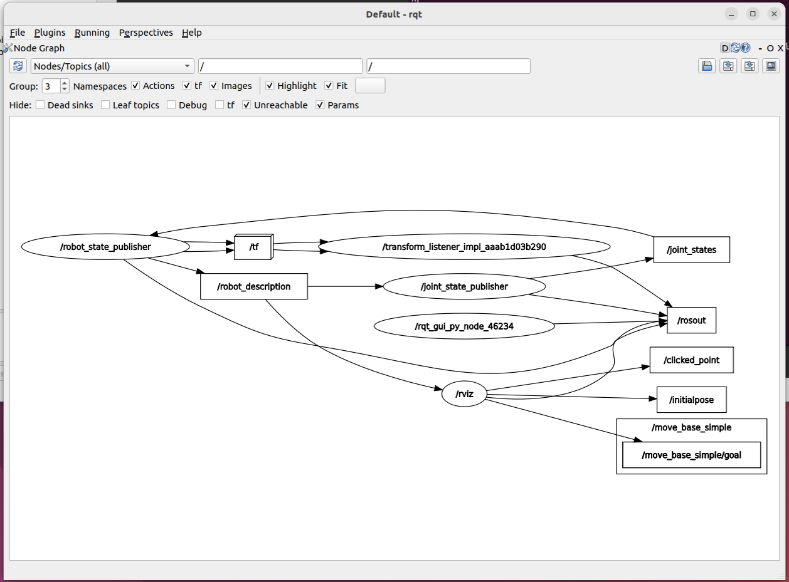
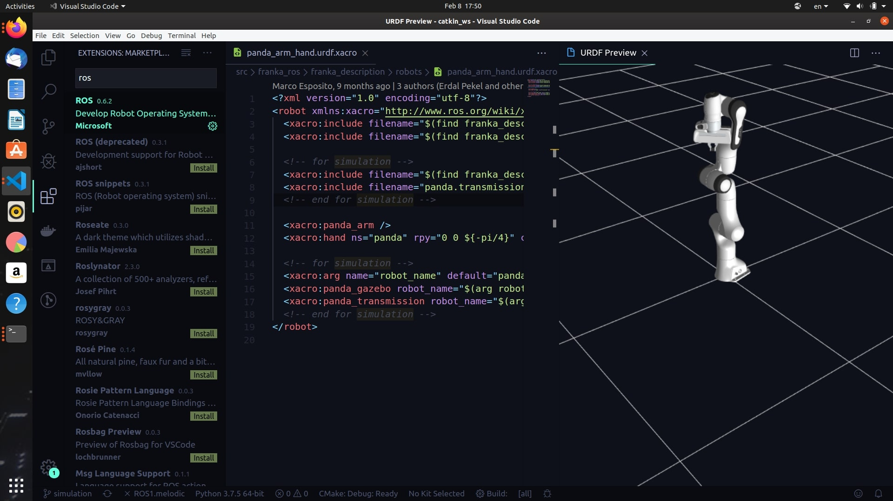
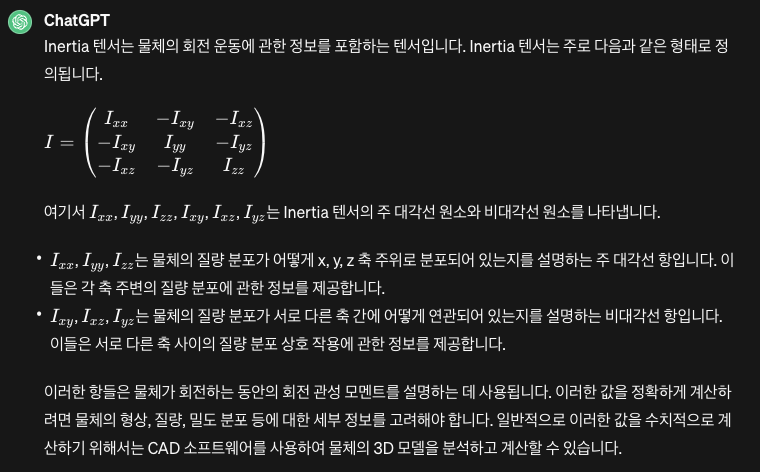

## 1. URDF이란?

`URDF`(Unified Robot Description Format)는 로봇의 원, 타원, 직사각형 따위의 기하학적 모델, 관절, 센서 등의 정보를 정의하는 XML 형식의 파일이다. 이 XML 파일에서 로봇의 부분을 나타내는 링크(link)와 동적인 움직임을 갖는 조인트(joint) 등 정보를 정의해서 로봇을 모델링 한다. 모델링한 정보는 RViz(ROS Visualization), Gazebo와 같은 시각화 프로그램을 사용해서 로봇 모델을 확인하고 시뮬레이션 해볼 수 있다.

로봇의 모델링, 시뮬레이션 및 제어를 위해 `URDF`외에도 아래와 같이 여러 파일 형태가 존재한다.

- [URDF](http://wiki.ros.org/urdf): Unified Robot Description Format
    - 주로 로봇의 모델링 및 시뮬레이션에 사용되고 [RViz](http://wiki.ros.org/rviz) 도구에서 사용된다
- **[SDF](http://sdformat.org/)**: Simulation Description Format
    - `SDF`로봇 시뮬레이션에 사용되는 XML 형식의 파일로, [Gazebo](https://gazebosim.org/home) 와 같은 시뮬레이션 도구에서 사용된다
    - Gazebo 변환 명령어를 이용해서 URDF → SDF 변환도 가능하다
      ```bash
      $ gz sdf -p model.urdf > model.sdf
      ```
- **[SRDF](http://wiki.ros.org/srdf)**: Semantic Robot Description Format
    - `URDF`와 함께 사용되며, 로봇의 그룹, 경로 계획, 충돌 검사 등의 정보를 정의하는 XML 형식의 파일이고 [MoveIt](https://moveit.ros.org/) 에서 사용된다
    - Setup Assistant 프로그램을 통해 URDF → SRDF로 쉽게 변환 가능하다

## 2. 모델링 하려는 로봇 정보  - 매니플레이터

> 매니플레이터(manipulator)는 로봇의 한 유형으로 인간의 팔과 유사한 동작을 하는 로봇이다.
> 

<br>
<br>

URDF 으로 모델링할 로봇은 매니플레이터이다. 매니플레이터의 기본 구조는 다음과 같이 기저, 링크, 조인트, 말단 장치로 구성되어 있다.

#### 매니플레이터의 기본 구조

- 기저(base): 매니퓰레이터가 고정되어 있는 부분
    - 목적에 따라 작업 공간내 바닥이 될 수 있음
    - 동적으로 움직이는 모바일 로봇이 될 수도 있음
- 링크(link) : 기저, 조인트, 말단 장치를 연결해주는 강체 역할
    - \- 쉽게 말해 프레임이라고 보면 됨
- 조인트(joint) : 로봇의 움직임을 만들어내는 부분
    - 회전(revolute) 운동형과 병진(prismatic) 운동형 등의 동적 움직임을 가짐
- 말단 장치 (end effector) : 사람의 손에 해당하는 부분 또는 장비
    - 집거나 흡착하여 들어올리거나 페인트를 분사하는 등 로봇의 목적에 따라 달라짐



구성 요소에서 가장 중요한 부분은 링크와 조인트 부분이다.

- 링크 `<link>`= 링크의 이름, 외형, 무게(mass, kg), 관성 모멘트(Kg.m^2)
    - 외형: 원통, 원뿔, 직육면체등의 간단한 모델을 쓴다. 복잡한 구조는 메쉬 (mesh)을 표현하는 `stl`, `dae`(`collda`) 포맷을 사용한다
- 조인트 `<joint>` = 조인트의 이름, 종류, 운동의 기준 축, 최소, 최대 조인트 값, 조인트에 부여되는 힘 / 속도
    - 조인트는 전/후 링크와의 관계를 기술한다
    - 아래와 같이 여러 조인트 종류로 정의할 수 있다

# 3. Description 패키지 생성하기

위에서 언급한 매니플레이터의 기본 정보를 URDF로 작성해보자. ROS 커뮤니티에서는 로봇의 모델링 정보를 담은 패키지를 `로봇명_description` 라는 이름으로 주로 사용한다.

- [ROS Index](https://index.ros.org/)에서 `description`으로 검색하면 이미 작성된 여러 URDF을 예제로 확인해볼 수 있다

우리가 작성할 `testbot_description`패키지를 생성하자.

```bash
# 로봇의 모델링 정보을 받음 패키지 생성
$ cd ~/robot_ws/src
$ ros2 pkg create testbot_description --build-type ament_cmake --dependencies urdf

# urdf 폴더 생성후 urdf 파일 생성
$ cd testbot_description
$ mkdir urdf
$ cd urdf
$ vim testbot.urdf
```

#### 3.1 전체 URDF 예시

  ```bash
  <?xml version="1.0" ?>
  <robot name="testbot">
  
    <material name="green">
      <color rgba="0 0.6 0 1" />
    </material>
    <material name="orange">
      <color rgba="1.0 0.4 0.0 1.0"/>
    </material>
  
    <link name="base"/>
  
    <link name="link1">
      <inertial>
        <origin xyz="0.0 0.0 0.25" rpy="0.0 0.0 0.0"/>
        <mass value="1.0"/>
        <inertia ixx="1.0" ixy="0.0" ixz="0.0" iyy="1.0" iyz="0.0" izz="1.0"/>
      </inertial>
      <visual>
        <origin xyz="0.0 0.0 0.25" rpy="0.0 0.0 0.0"/>
        <geometry>
          <box size="0.1 0.1 0.5"/>
        </geometry>
        <material name="green"/>
      </visual>
      <collision>
        <origin xyz="0.0 0.0 0.25" rpy="0.0 0.0 0.0"/>
        <geometry>
          <box size="0.1 0.1 0.5"/>
        </geometry>
      </collision>
    </link>
  
    <link name="link2">
      <inertial>
        <origin xyz="0.0 0.0 0.25" rpy="0.0 0.0 0.0"/>
        <mass value="1.0"/>
        <inertia ixx="1.0" ixy="0.0" ixz="0.0" iyy="1.0" iyz="0.0" izz="1.0"/>
      </inertial>
      <visual>
        <origin xyz="0.0 0.0 0.25" rpy="0.0 0.0 0.0"/>
        <geometry>
          <box size="0.1 0.1 0.5"/>
        </geometry>
        <material name="orange"/>
      </visual>
      <collision>
        <origin xyz="0.0 0.0 0.25" rpy="0.0 0.0 0.0"/>
        <geometry>
          <box size="0.1 0.1 0.5"/>
        </geometry>
      </collision>
    </link>
  
    <link name="link3">
      <inertial>
        <origin xyz="0.0 0.0 0.5" rpy="0.0 0.0 0.0"/>
        <mass value="1.0"/>
        <inertia ixx="1.0" ixy="0.0" ixz="0.0" iyy="1.0" iyz="0.0" izz="1.0"/>
      </inertial>
      <visual>
        <origin xyz="0.0 0.0 0.5" rpy="0.0 0.0 0.0"/>
        <geometry>
          <box size="0.1 0.1 1.0"/>
        </geometry>
        <material name="green"/>
      </visual>
      <collision>
        <origin xyz="0.0 0.0 0.5" rpy="0.0 0.0 0.0"/>
        <geometry>
          <box size="0.1 0.1 1.0"/>
        </geometry>
      </collision>
    </link>
  
    <link name="link4">
      <inertial>
        <origin xyz="0.0 0.0 0.25" rpy="0.0 0.0 0.0"/>
        <mass value="1.0"/>
        <inertia ixx="1.0" ixy="0.0" ixz="0.0" iyy="1.0" iyz="0.0" izz="1.0"/>
      </inertial>
      <visual>
        <origin xyz="0.0 0.0 0.25" rpy="0.0 0.0 0.0"/>
        <geometry>
          <box size="0.1 0.1 0.5"/>
        </geometry>
        <material name="orange"/>
      </visual>
      <collision>
        <origin xyz="0.0 0.0 0.25" rpy="0.0 0.0 0.0"/>
        <geometry>
          <box size="0.1 0.1 0.5"/>
        </geometry>
      </collision>
    </link>
  
    <joint name="base_joint" type="fixed">
      <parent link="base"/>
      <child link="link1"/>
    </joint>
  
    <joint name="link1_link2" type="revolute">
      <origin xyz="0.0 0.0 0.5" rpy="0.0 0.0 0.0"/>
      <parent link="link1"/>
      <child link="link2"/>
      <axis xyz="0.0 0.0 1.0"/>
      <limit lower="-2.617" upper="2.617" effort="30.0" velocity="1.571"/>
    </joint>
  
    <joint name="link2_link3" type="revolute">
      <origin xyz="0.0 0.0 0.5" rpy="0.0 0.0 0.0"/>
      <parent link="link2"/>
      <child link="link3"/>
      <axis xyz="0.0 1.0 0.0"/>
      <limit lower="-2.617" upper="2.617" effort="30.0" velocity="1.571"/>
    </joint>
  
    <joint name="link3_link4" type="revolute">
      <origin xyz="0.0 0.0 1.0" rpy="0.0 0.0 0.0"/>
      <parent link="link3"/>
      <child link="link4"/>
      <axis xyz="0.0 1.0 0.0"/>
      <limit lower="-2.617" upper="2.617" effort="30.0" velocity="1.571"/>
    </joint>
  
  </robot>
  ```

#### 3.2 RViz에서 렌더링된 화면


## 4. URDF 작성하기

URDF는 로봇을 설명하기 위한 XML 명세서로 XML 태그를 이용해서 로봇의 각 구성 요소를 기술한다. 이 명세서는 최대한 일반적으로 명시하도록 최대한 설계 되어 있지만, 이 명세서로는 모든 로봇을 설명할 수는 없다. 주요 제약 사항은 트리 구조만 표시할 수 있으며 병렬적으로 동작하는 로봇은 모델이 어렵다. 그리고 로봇이 조인트는 단단한 링크로 구성되어 있다고 가정하며 유연한 요소는 지원하지 않는다.

> URDF XML에 대한 스펙은 ROS 문서에서 확인 할 수 있다. https://wiki.ros.org/urdf/XML

### 4.1 `<robot>`
`<robot>` 태그는 로봇 설명 파일의 `root` 요소로 제일 먼저 선언이 되어야 한다. 로봇에 대한 설명은 링크 요소와 링크를 서로 연결하는 조인트 요소 집합으로 구성된다.

```xml
<?xml version="1.0" ?>
<robot name="testbot">

  <link name="base"/>
  <link name="link1"> ... </link>
  <link name="link2"> ... </link>

  <joint name="base_joint" type="fixed"> ... </joint>
  <joint name="link1_link2" type="fixed"> ... </joint>
  <joint name="link2_link3" type="fixed"> ... </joint>

</robot>
```

### 4.3 `<link>`
`<link>` 태그는 일반적으로 로봇의 각 파트 (ex. 본체, 팔, 다리, 휠 등)을 표현하는데 사용되고 각 링크는 조인트를 통해 다른 링크에 연결이 된다.

매니퓰레이터의 구성 요소 그 첫 번째인 기저는 URDF에서 링크로 표현한다. 기저는 첫번째 링크와 조인트로 연결되어 있으며 이 조인트는 `fixed` 타입으로 설정되어 움직이지 않게 고정되어 있고 원점(0.0,0.0,0.0)에 위치해 있다.

```xml
<link name="base">

<joint name="base_joint" type="fixed">
    <parent link="base"/>
    <child link="link1"/>
</joint>

<link name="link1">
    <visual>
      <origin xyz="0.0 0.0 0.25" rpy="0.0 0.0 0.0"/>
      <geometry>
        <box size="0.1 0.1 0.5"/>
      </geometry>
      <material name="green"/>
    </visual>
    <collision>
      <origin xyz="0.0 0.0 0.25" rpy="0.0 0.0 0.0"/>
      <geometry>
        <box size="0.1 0.1 0.5"/>
      </geometry>
    </collision>
		<inertial>
      <origin xyz="0.0 0.0 0.25" rpy="0.0 0.0 0.0"/>
      <mass value="1.0"/>
      <inertia ixx="1.0" ixy="0.0" ixz="0.0" iyy="1.0" iyz="0.0" izz="1.0"/>
    </inertial>
</link>
```

<br>
<br>



`<link>`는 시각화 `<visual>`, 충돌 `<collision>` , 관성`<inertial>`태그로 구성되어 있다.

- common tag

    - `<origin>` \- 원점 좌표
        - 좌표는 `xyz` 좌표계를 통해 로봇의 위치를 3차원 공간 상에서 표현을 하고 `ryz` 오일러 각을 통해 로봇의 방향을 표현한다
        - 단위는 `xyz` (meter), `rpy` (radian)을 사용한다
- `<visual>`
    - `<geometry>` 태그는 origin 좌표 중심으로 표시 범위와 모양과 크기를 적는다
        - 모델의 모양 입력은 box, cylinder, sphere 형태를 기본으로 제공한다
        - 표현하기 어려운 모델인 경우에는 STL, DAE등의 CAD 파일을 입력할 수도 있다
- `<collision>`
    - `<collision>` 태그에는 링크의 간섭 범위를 나타내는 정보를 입력을 한다
    - `<origin>` 와 `<geometry>` 태그는 위에서 언급한 내용과 동일한데 표시 범위가 아닌 간섭 범위로 `<visual>` 태그의 표시 범위보다 더 크게하여 안전을 더 고려할 수도 있다
- `<inertial>`
    - 이 태그로 물리적 속성인 질량과 관성 텐서 (inertial tensor) 값을 지정한다
    - `<mass>` 태그는 링크의 무게 (mass, 단위: kg)
    - `<inertia>` 태그는 관성 모멘트 (moments of inertia, 단위:kg·m^2)는 3x3 회전 관성 행렬로 정의를 한다. 대칭이라서 아래 밑줄친 것만 정의를 한다

      | ixx  | ixy  | ixz  |
          | ---- | ---- | ---- |
      | ixy  | iyy  | iyz  |
      | ixz  | iyz  | izz  |

  > [3D insertia tensor 값 예제](https://en.wikipedia.org/wiki/List_of_moments_of_inertia#List_of_3D_inertia_tensors)

#### 4.3.1 `<material>`

`<material>` 태그는 링크의 색상(color)이나 텍스처(texture)를 지정하는 데 사용된다.

- `<rgba>` 태그로 색상을 지정한다
    - 빨강, 초록, 파랑에 해당하는 0.0 ~ 1.0 사이의 숫자를 각각 기입하여 설정할 수 있다
    - 마지막 숫자는 투명도(알파)로 0.0 ~ 1.0 값을 가지며 1.0 이면 투명 옵션을 사용하지 않은 고유 색상을 그대로 표시하는 상태를 의미한다
- `<texture>` 텍스쳐는 파일(ex.png)로 지정한다

```xml
<material name="green">
    <color rgba="0 0.6 0 1" />
</material>
<material name="orange">
  <color rgba="1.0 0.4 0.0 1.0"/>
</material>
```

### 4.4 `<joint>`

`<joint>` 태그는 로봇의 조인트를 정의하는 데 사용되고 각 조인트는 두 링크를 연결하며 어떤 방식으로 움직일 수 있는지 정의한다.

#### URDF 에서 지원하는 조인트 종류


<br>

- `fixed` (고정): 움직임이 허용되지 않는 관절이다
- `revolute` (회전): 선풍기의 좌우 회전과 같이 일정 각도 범위를 회전하는 관절이다
- `continuous` (연속): 자동차 바퀴처럼 연속 회전을 하는 관절이다
- `prismatic` (프리즘): 단일 축에 대해 선형으로 미끄러지는 관절로 최대, 최소 위치 제한을 가진다
- `floating` (자유): 6차원 이동 및 회전을 허용하는 관절이다
- `planar` (평면): 한 평면에 수직으로 이동 및 회전할 수 있는 관절이다

<br>
<br>

```xml
<joint name="link1_link2" type="revolute">
    <origin xyz="0.0 0.0 0.5" rpy="0.0 0.0 0.0"/>
    <parent link="link1"/>
    <child link="link2"/>
    <axis xyz="0 0 1"/>
    <limit lower="-2.617" upper="2.617" effort="30.0" velocity="1.571"/>
</joint>
```

<br>
<br>


- `<parent>`, `<child>`
    - 연결하는 링크로는 부모 링크(parent link)와 자식 링크(child link)의 이름을 지정하는데 일반적으로 기저에 가까운 링크를 부모 링크라고 보면 된다
- `<axis>`
    - 회전 축을 정의한다. 축은 로봇의 기준 좌표를 기준으로 정의되며, 회전 운동의 방향을 결정한다.
        - `<axis xyz="0 0 1"/>` x, y는 zero 값으로 설정하고 z 값만 설정을 해서 `link1` 와 `link2` 조인트의 경우에는 선풍기 목부분 z 축 기준으로 회전을 하는 설정이다
- `<limit>`
    - 조인트 동작에 대한 제한 사항을 설정한다.
        - 속성은 최소, 최대 조인트 (lower, upper, 단위: radian), 조인트에 부여되는 힘(effort, 단위: N), 속도 (단위: rad/s)의 제한 값을 설정한다
    - 2.617 radian는 약 150도이다

> 각 태그와 각 설정하는 값에 대해서 이해하려면 직접 값을 변경해가면서 RViz에서 어떻게 렌더링되고 로봇이 동작을 하는지 테스트를 해보면 URDF를 이해하는 데 도움이 된다



참고

- https://wiki.ros.org/urdf/XML/link
- [Adding physical and collision properties](https://docs.ros.org/en/humble/Tutorials/Intermediate/URDF/Adding-Physical-and-Collision-Properties-to-a-URDF-Model.html)
- https://duvallee.tistory.com/11

## 5. URDF 런치 파일 생성 및 실행

### 5.1 런치 파일 생성

`check_urdf` 나 `urdf_to_graphiz` 와 같은 명령어(참고: 8. URDF 파일 validation 체크)를 통해서 작성한 URDF 의 syntax나 렌더링 된 모습을 간단하게 확인할 수 있지만, 더 자세한 모델은 RViz에서 확인하는 게 제일 베스트이다. 이를 위하여 우선 다음 예제와 같이 `testbot_description` 패키지 폴더로 이동해 `testbot.launch.py` 파일을 생성해보자.

```bash
$ cd ~/robot_ws/src/testbot_description
$ mkdir launch
$ cd launch
$ vim testbot.launch.py
```

<br>
<br>

```python
import os

from ament_index_python.packages import get_package_share_directory
from launch import LaunchDescription
from launch_ros.actions import Node

def generate_launch_description():
    rviz_display_config_file = os.path.join(
        get_package_share_directory('testbot_description'),
        'rviz',
        'testbot.rviz')
    urdf_file = os.path.join(
        get_package_share_directory('testbot_description'),
        'urdf',
        'testbot.urdf')
    with open(urdf_file, 'r') as infp:
        robot_description_file = infp.read()

    ld = LaunchDescription()

    robot_state_publisher = Node(
        package='robot_state_publisher',
        executable='robot_state_publisher',
        parameters=[
            {'use_sim_time': False},
            {'robot_description': robot_description_file}
        ],
        output='screen')

    joint_state_publisher_gui = Node(
        package='joint_state_publisher_gui',
        executable='joint_state_publisher_gui',
        output='screen')

    rviz2 = Node(
        package='rviz2',
        executable='rviz2',
        arguments=['-d', rviz_display_config_file],
        output='screen')

    ld.add_action(robot_state_publisher)
    ld.add_action(joint_state_publisher_gui)
    ld.add_action(rviz2)

    return ld
```

<br>
<br>

URDF를 담은 `robot_description` 파라미터와 `joint_state_publisher`,  `robot_state_publisher`, `rviz2` 노드로 구성되어 있다.

- `joint_state_publisher` 노드
    - 파라미터 서버의 `robot_description` 파라미터에 URDF가 주어지면 이 노드는 URDF의 모든 이동 가능한 관절에 대한 기본 값을 `/joint_states` 토픽에 `sensor_msgs/msg/JointState` 메시지 형태로 지속적으로 publish를 한다
    - Published Topic
        - `/joint_states` (`sensor_msgs/JointState`) - 시스템에 있는 모든 움직이는 조인트 상태 값
    - ```
    joint_state_publisher_gui
    ```
      조인트에 명령을 주는 GUI 툴을 제공한다

        - 

- `robot_state_publisher` 노드
    - URDF에 설정된 로봇 정보와 `sensor_msgs/msg/JointState` 토픽 정보를 가지고 계산한 kinematic tree model (TF)와 3D 위치 정보를  `/tf`, `/tf_static` 토픽에 publish를 해주는 역할을 한다
    - Published Topics
        - `/robot_description` (`std_msgs/msg/String`) - 로봇 URDF에 대한 String 값이다. `robot_description` parameter에 값이 설정되면 이 토픽으로 republish 하여 동적인 정보도 전달될 수 있다
        - `/tf` (`tf2_msgs/msg/TFMessage`) - 로봇의 움직일 수 있는 조인트에 대한 정보를 보낸다
        - `/tf_static` (`tf2_msgs/msg/TFMessage`) - 로봇의 정적 조인트에 해당하는 정보를 보낸다
    - Subscribed Topic
        - `/joint_states` (`sendor_msgs/msg/JointState`) - 로봇 위치에 대한 관절 상태가 업데이트된다

#### RQT


참고

- http://wiki.ros.org/robot_state_publisher
- https://github.com/ros/robot_state_publisher
- https://github.com/ros/joint_state_publisher/tree/noetic-devel/joint_state_publisher

# 5.2 빌드 및 실행

런치 파일 생성후 rviz 디스플레이 생성 파일을 생성하면 된다. 모든 파일은 [github repo](https://github.com/kenshin579/tutorials-ros2)에 있어서 원본 파일을 참고하여 추가하자.

참고로 예제로 작성한 `testbot_description` 패키지는 하기와 같은 패키지를 의존하고 있기에 빌드 전에 설치해야 한다.

```bash
$ sudo apt install ros-humble-joint-state-publisher ros-humble-joint-state-publisher-gui ros-humble-robot-state-publisher
```
<br>
<br> 

```bash
# 컴파일하고 런치 실행
$ cd ~/robot_ws/
$ colcon build --symlink-install
$ ros2 launch testbot_description testbot.launch.py
```
<br>
<br>

> 자주 사용하는 명령어는 alias로 생성해두면 따르게 ros 관련 명령어를 빠르게 실행할 수 있다.
>
> ```bash
> alias cba='colcon build --symlink-install'
> alias cbp='colcon build --symlink-install --packages-select'
> alias cw='cd ~/robot_ws'
> alias sl='source $HOME/robot_ws/install/local_setup.bash'
> ```


### 5.2.1 런치 파일 없이 실행하는 방법

`ros-humble-urdf-tutorial` 이용하면 론치 파일 작성 없이 URDF를 RViz에서 로딩해볼 수 있다. `ros-###-urdf-tutorial` 패키지가 설치가 되있어야 한다.

```bash
# 설치
> sudo apt install ros-humble-urdf-tutorial
```

```bash
# 아래 명령어로 실행하면 된다
> ros2 launch urdf_tutorial [display.launch.py](<http://display.launch.py/>) model:=/home/parallels/robot_ws/src/testbot_description/urdf/testbot.urdf
```

런치 파일로 실행한 것과 같이 RVIz에서 렌더링 된 매니풀레이터를 볼 수 있다.


## 6. URDF 작성시 필요한 도구

### 6.1 URDF for VSCode

- URDF 지원
    - `.urdf`, `.xacro` 파일 xml 형식 지원
    - 일부 snippet 지원
- Jetbrain PyCharm에서는 지원하는 plugin은 없는 듯함


참고

- https://marketplace.visualstudio.com/items?itemName=smilerobotics.urdf

### 6.2 ~~ROS: Preview UDF~~ ← 이건 잘 안됨

- Marketplace > ROS extension 설치
- 사용방법 : urdf 파일 오픈 후 `Command Palette` > `ROS: Preview URDF` 선택
    - ROS로는 되는대 ROS 2에서는 안되는게 아닌가 싶음

#### 기대하는 화면 - 안됨

- 실행해보면 blank 화면이 나옴



참고

- https://hiro-group.ronc.one/vscode_urdf_previewer.html

### 6.3 URDF 파일 validation 체크

URDF 으로 로봇 모델이 잘 작성이 되었는지 검토하는 방법은 여러 명령어로 확인이 가능하다.

#### 6.3.1 `check_urdf`

ROS에서는 `check_urdf` 명령어로 작성한 URDF의 문법적 오류 및 각 링크의 연결 관계를 확인할 수 있다.

```bash
$ check_urdf testbot.urdf
robot name is: testbot
---------- Successfully Parsed XML ---------------
root Link: base has 1 child(ren)
    child(1):  link1
        child(1):  link2
            child(1):  link3
                child(1):  link4
```

#### 6.3.2 `urdf_to_graphiz`

작성한 모델을 `graphiz` 다이어그램으로도 나타낼 수 있다. `urdf_to_graphiz` 명령어로 아래처럼 실행하면 .gv 파일과 .pdf 파일이 생성이 된다. 링크와 조인트와의 관계, 각 조인트와 조인트 사이의 상대 좌표 변환을 한눈에 확인해 볼 수 있다.

```bash
$ urdf_to_graphiz testbot.urdf
Created file testbot.gv
Created file testbot.pdf
```
<br>
<br>

##### URDF의 link와 joint의 관계


#### 6.3.3 `tf2_tools`

`view_frames` 은 현재 TF tree를 그래프로 PDF 생성해주는 그래픽 디버깅 도구이다.

```bash
$ ros2 run tf2_tools view_frames
$ evince frames_2024-02-16_19.20.58.pdf
```


참고

- http://wiki.ros.org/tf2_tools
- https://docs.ros.org/en/humble/Tutorials/Intermediate/Tf2/Introduction-To-Tf2.html#tf2-tools

### 6.4 RViz

RViz (ROS Visualization)는 ROS의 시각화 도구 중 하나로 로봇의 위치 및 자세, 센서 데이터, 지도 정보등을 시각화하여 사용자가 로봇 시스템을 이해하고 디버깅할 수 있게 해준다. RViz가 설치 안되어 있으면 아래 명령어로 설치하고 `rivz2` 로 실행하면 된다.

#### 설치 및 실행

```bash
# 설치
> sudo apt install ros-humble-rviz2

# 실행
> rviz2
```

참고

- http://wiki.ros.org/rviz

## FAQ

#### 1. `xyz`, `rpy`의 차이점?


<br>
<br>

##### RPY angles


참고

- https://commons.wikimedia.org/wiki/RPY_angles
- https://www.youtube.com/watch?v=sFi6i8YzQVA
- https://www.youtube.com/watch?v=Hg3EGzB3oqQ

#### 2. `xacro`이란?

- `xacro` (자크로) 파일은 `XML Macro` 의 줄임말로 반복되는 코드를 불러올 수 있는 매크로 언어이다
- URDF를 만드는데 XML로드 가능하지만, `xacro`를 사용하여 재사용 가능한 부분을 정의해서 코드를 간결하게 유지하고 재사용성을 높일 수 있다

##### 2.1 Xacro 기능

##### 1. 속성, 속성 블럭

```xml
<xacro:property name="the_radius" value="2.1" />
<xacro:property name="the_length" value="4.5" />

<geometry type="cylinder" radius="${the_radius}" length="${the_length}" />
```

##### 2. 수학 상수 및 함수 제공
- ex. `pi`, `sqrt(x)`, `radians(x)`

```xml
<xacro:property name="circle_revolute_upper" value="${pi/2}"/>
<xacro:property name="circle_revolute_upper" value="${radians(180)}"/>

<origin xyz="0.0 0.0 ${height/2+joint_height}" rpy="0.0 0.0 0.0"/>
```

##### 3. 조건부 블럭

- 조건부 블럭은 변수의 참(true, 1), 거짓(false, 0)에 따라서 다르게 정의를 할 수 있다

```xml
<xacro:property name="var" value="useit"/>

<xacro:if value="${var == 'useit'}">
   <...some xml code here...>
</xacro:if>
<xacro:if value="${var.startswith('use') and var.endswith('it')}">
   <...some xml code here...>
</xacro:if>
```

##### 4. 매크로

- 매크로는 인자(parameter)를 받을 수 있다

```xml
<xacro:macro name="link_box_macro" params="suffix">
    <link name="link_${suffix}">
      <xacro:insert_block name="link_inertial_box" />
      <xacro:insert_block name="link_visual_box" />
      <xacro:insert_block name="link_collision_box" />
    </link>
</xacro:macro>

<xacro:link_box_macro suffix="1" />
```

참고

- https://duvallee.tistory.com/17
- http://wiki.ros.org/xacro
- https://kumoh-irl.tistory.com/77

#### 3. `base_link`, `base_footprint`의 차이점?


#### 4. 매니플레이터, manipulator

- 인간의 팔과 유사한 동작을 하는 로봇의 기구이다
- 보통 여러 개의 자유도를 가지며 대상물(부품 또는 공구)을 붙잡거나 옮길 목적으로, 서로 상대적인 회전 운동이나 미끄럼 운동을 하는 관절의 연결로 구성된 기구이다

참고

- https://terms.tta.or.kr/mobile/dictionaryView.do?subject=머니퓰레이터
- https://roomedia.tistory.com/entry/41일차-매니퓰레이션-소개-및-URDF-작성법

#### 5. inertia를 정의할 때 `ixx`, `ixy`의 의미는 뭔가?



## 다음 스터디 주제

- 로델링한 로봇 제어해보기
- gazebo 로 로봇 모델링
- navigation 관련 스터디

## 참고

- [ROS 2 강좌 by 표윤석](https://cafe.naver.com/openrt/24070)
- [Building a Visual Robot Model with URDF from Scratch](http://wiki.ros.org/urdf/Tutorials/Building a Visual Robot Model with URDF from Scratch)
- http://wiki.ros.org/urdf#Verification
- [ROS2의 로봇 모델용 URDF](https://app.theconstructsim.com/courses/83)
- https://duvallee.tistory.com/11
