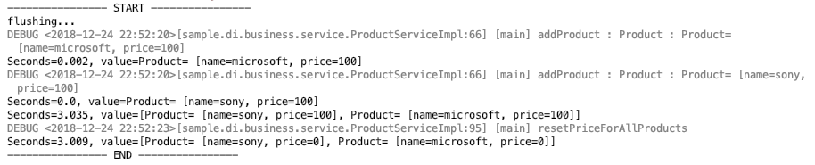
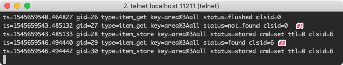

## 1. 들어가며

In-memory DB로 Memcached를 사용하면 자바에서는 [simple-spring-memcached](https://github.com/ragnor/simple-spring-memcached) (SSM) 라이브러리를 자주 사용됩니다. SSM 어노테이션으로 메서드에 선언하면 쉽게 관련 데이터가 캐시에서 관리됩니다. 스프링에서도 버전 3.1부터는 캐시 서비스 추상화 기능이 지원되어 비즈니스 로직 변경 없이 쉽게 다양한 캐시 구현체(ex. Ehcache, Redis)로 교체가 가능하게 되었습니다. 스프링에서 제공하는 캐시 기능은 다른 포스팅에서 더 자세히 다루도록 하겠습니다.

## 2. 개발 환경

- OS : Mac OS
- IDE: Intellij
- Java : JDK 11
- Source code : [github](https://github.com/kenshin579/tutorials-spring-examples/tree/master/simple-spring-memcached)
- Software management tool : Maven

## 3. Simple Spring Memcached(SSM) 설정 및 사용법

SSM 사용에 필요한 dependency와 스프링 빈 설정 파일을 추가해야 합니다.

### 3.1 Maven dependency 추가

라이브러리는 maven을 사용하였습니다. Simple-spring-memcached와 Memcache provider 중에 하나를 선택해서 pom.xml에 추가해줍니다. spymemcached와 xmemcached의 차이는 아래와 같습니다. 이 포스팅에서는 xmemcached로 위주로 설명합니다.

- spymemcached \* 단순 비동기, 단일 쓰레드 memcached 자바 라이브러리
- **xmemcached (이 라이브러리 위주로 설명함)** \* 고성능 멀티 쓰레드 memcached 자바 라이브러리

```xml
<dependency>
    <groupId>com.google.code.simple-spring-memcached</groupId>
    <artifactId>simple-spring-memcached</artifactId>
    <version>4.1.1</version>
</dependency>
```

#### **xmemcached**

```xml
<dependency>
  <groupId>com.google.code.simple-spring-memcached</groupId>
  <artifactId>xmemcached-provider</artifactId>
  <version>4.1.1</version>
</dependency>
```

#### **spymemcached**

```xml
<dependency>
  <groupId>com.google.code.simple-spring-memcached</groupId>
  <artifactId>spymemcached-provider</artifactId>
  <version>4.1.1</version>
</dependency>
```


### 3.2 스프링 설정 파일

스프링 빈 설정에 Memcached 관련 설정이 포함됩니다. Memcached의 서버 정보와 캐시 설정은 ConsistentHashing 방식으로 지정되어 있습니다.

> **추가 설명**
> ConsistentHashing 방식은 여러 서버가 변경되더라도 각 서버에 할당된 데이터를 재분배하지 않고 다운된 서버의 데이터만 다른 서버로 재분배하는 방식입니다. K(keys) = 10,000, N(memcache 서버 수 : 슬롯) = 5대 => 각 서버마다 2000 keys만큼을 hashing 할 수 있다. 서버 장애 (1 서버 다운 A)가 발생한 A 서버의 key만 다른 서버로 재분배하는 방식이다.
> 더 자세한 설명은 [Consistent Hashing](https://jistol.github.io/software%20engineering/2018/07/07/consistent-hashing-sample/) 를 참고해주세요.

```xml
파일 : resources/applicationContext-cached.xml

<context:annotation-config/>
<context:component-scan base-package="sample.di.business.*"/>
<context:component-scan base-package="sample.di.dataaccess"/>

<import resource="simplesm-context.xml"/>
<aop:aspectj-autoproxy/>

<bean name="defaultMemcachedClient" class="com.google.code.ssm.CacheFactory">
    <property name="cacheClientFactory">
        <bean class="com.google.code.ssm.providers.xmemcached.MemcacheClientFactoryImpl"/>
    </property>
    <property name="addressProvider">
        <bean class="com.google.code.ssm.config.DefaultAddressProvider">
            <property name="address" value="127.0.0.1:11211"/>
        </bean>
    </property>
    <property name="configuration">
        <bean class="com.google.code.ssm.providers.CacheConfiguration">
            <property name="consistentHashing" value="true"/>
        </bean>
    </property>
</bean>

```

simplesm-context.xml은 [SSM github](https://github.com/ragnor/simple-spring-memcached) 소스에 포함된 설정파일이고 SSM 사용 시 필요하므로 복사해서 사용하시면 됩니다.

### 3.3 SSM Cache 대표 어노테이션

아래는 대표적으로 많이 사용하는 어노테이션입이다. 이외에 사용해야 하는 어노테이션은 해당 [라이브러리의 Wiki](https://github.com/ragnor/simple-spring-memcached/wiki/Getting-Started) 를 참고해주세요.

- Read
    - @ReadThroughAssignCache
    - @ReadThroughSingleCache
    - @ReadThroughMultiCache
- Update
    - @UpdateAssignCache
    - @UpdateSingleCache
    - @UpdateMultiCache
- Invalidate
    - @InvalidateAssignCache
    - @InvalidateSingleCache
    - @InvalidateMultiCache
- Counter
    - @ReadCounterFromCache
    - @IncrementCounterInCache
    - @DecrementCounterInCache

대부분의 SSM 어노테이션은 Cache Action과 Cache Type으로 구분할 수 있습니다.

| **Cache Action** | **Description**                                 |
| ---------------- | ----------------------------------------------- |
| ReadThrough      | Cache에 저장된 key가 없는 경우 Cache에 저장한다 |
| Update           | Cache에 저장된 key의 값을 업데이트한다          |
| Invalidate       | Cache에 저장된 key를 삭제한다                   |

| **Cache Type** | **Description**                                              |
| -------------- | ------------------------------------------------------------ |
| AssignCache    | 캐시 키는 assignedKey 속성으로 지정한 값이고 메서드 인자가 없는 경우에 사용된다<br/>ex. List<Person> getAllUsers()와 같은 메서드에 사용된다 |
| SingleCache    | 캐시 키는 SSM 어노테이션으로 선언된 메서드 인자로 생성되며 인자가 하나인 경우에 사용된다.<br/>ㅁ. 인자가 List 타입인 경우에는 캐시 키로 생성해서 사용할 수 없다<br/>ex. Person getUser(int int) |
| MultiCache     | 캐시 키는 SSM 어노테이션으로 선언된 메서드 여러 인자로 생성된다. 인자중에 한개가 List 타입 형이여야하며 반환결과도 List 타입이여야 한다. 반환된 결과 List의 각 요소는 지정된 캐시 키로 저장된다.<br/>ex. List<Person> getUserFromData(List workInfo) |

SingleCache와 MultiCache인 경우 반드시 메서드 인자 중에 @ParameterValueKeyProvider 어노테이션을 지정해야 합니다.

기본 캐시 어노테이션 외에도 여러 어노테이션과 같이 사용하는 속성들이 존재하며 예제를 통해서 더 자세히 알아보도록 하겠습니다.

- 기타 어노테이션 및 속성
    - @CacheName(“QuoteApp”) : 관련 캐시를 하나로 묶을 수 있는 개념이고 클래스외에도 메서드에도 선언할 수 있다
    - @CacheKeyMethod : 캐시의 key 값으로 이용할 메서드를 선언한다
    - 캐시 key는 @CacheKeyMethod로 선언된 메서드가
    - @CacheKeyMethod가 지정되지 않은 경우에는 Object.toString() 메서드가 사용된다
    - @ParameterValueKeyProvider : 메서드 인자에 적용되며 @CacheKeyMethod로 선언된 메서드나 toString()을 이용해서 key 값을 구한다
    - @ParameterDataUpdateContent : 메서드 인자에 어노테이션이 적용되며 새로 저장할 값을 지정한다
    - @ReturnDataUpdateContent : 반환 값을 캐시에 저장한다
- 속성
    - namespace : 동일한 키 값의 이름이 있을 경우를 방지하기 위해서 사용된다
    - expiration : key값이 만료되는 시간 (초 단위)이다
    - assignedKey : 캐시 저장시 사용되는 키 값이다

#### 3.3.1 Read Cache

**@ReadThroughAssignCache 예제**

@ReadThroughAssignCache 어노테이션은 인자가 없는 메서드에 적용할 수 있습니다. 캐시 영역에서 네임스페이스 ‘area’ 이름으로 key : value (all : List<Product)가 저장이 됩니다.

@ReadThroughAssignCache(namespace = "area", assignedKey="all")

```java
@ReadThroughAssignCache(namespace = "area", assignedKey="all")
public List<Product> findAllProducts() {
    slowly(); // 고의로 지연시킴
    List<Product> productList = new ArrayList<>();
    return storage.values().stream().collect(Collectors.toList());
}
```

각 캐시 어노테이션마다 차이점을 쉽게 알기 위해서 유닛 테스트로 작성을 했습니다. 각 테스트마다 원하는 결과를 얻기 위해서 매 테스트마다 memcache를 flush 하도록 작성되어 있습니다. @ReadThroughAssignCache 어노테이션은 캐시에서 읽어 드릴때 없으면 저장하기 때문에 아래 코드에서는 Comment #1 때에 캐시에 저장하고 Comment #2 때는 캐시에서 데이터를 가져오는 것을 확인할 수 있습니다.

```java
@Test
public void testReadThroughAssignCache() {
    this.executeWithMemcachedFlush(productService, () -> {
        productService.addProduct(new Product("microsoft", 100));
        productService.addProduct(new Product("sony", 100));
        productService.findAllProducts(); //#1 - caching

        productService.findAllProducts(); //#2 - cache에서 가져옴

    });
}
```

**Unit Test 실행 결과**


**watch 모니터링 결과**


캐시에 저장하고 값을 확인하는 과정을 실시간으로 확인하려면 telnet으로 로그인하여 watch 명령어를 실행하면 됩니다. 더 자세한 사항은 #3.4 Memcached 유용한 명령어 모음을 참고해주세요.

**@ReadThroughSingleCache**

@ReadThroughSingleCache 어노테이션은 인자가 하나인 경우에만 사용합니다. 인자에 @ParameterValueKeyProvider 어노테이션을 선언하면 @CacheKeyMethod로 지정된 메서드는 캐시 키를 생성하는 데 사용되고 없는 경우에는 toString() 메서드가 사용됩니다.

```java
@ReadThroughSingleCache(namespace = "area")
public Product findProduct(@ParameterValueKeyProvider String name) {
    slowly(); // 고의로 지연시킴

    return storage.get(name);
}

@CacheKeyMethod
public String getName() {
    return name;
}
```

이 어노테이션도 읽어드릴 때 캐시에 없으면 캐시에 저장하기 때문에 코드상에서 Comment #1일 때 저장하고 Comment #2일 때 캐시에서 값을 얻어오는 것을 watch 명령어로 통해서 확인할 수 있습니다.

```java
@Test
public void testReadThroughSingleCache() {
    this.executeWithMemcachedFlush(productService, () -> {
        productService.addProduct(new Product("microsoft", 100));
        productService.addProduct(new Product("sony", 100));
        productService.findProduct("microsoft”); //#1 - caching

        productService.findProduct(("microsoft”); //#2 - cache에서 가져옴

    });
}}
```

**Unit Test 실행 결과**


**watch 모니터링 결과**


**@ReadThroughMultiCache**

MultiCache는 메서드 인자 중에 List 타입인 자가 있어야 합니다. 그리고 캐시 되는 key : value 값은 인자의 List 요소와 반환 결과 요소가 각각 key : value로 캐시에 저장됩니다.
stats cachedump 명령어로 key 값을 확인해보면 알 수 있습니다. cachedump 결과 포맷에 대한 설명은 **#3.4 Memcached 유용한 명령어 모음** 을 참고해주세요.


```java
@ReadThroughMultiCache(namespace = "area")
public List<Integer> getIncrementValue(@ParameterValueKeyProvider List<Integer> nums, int incrementValue) {
    slowly(); // 고의로 지연시킴
    return nums.stream().map(x -> x + incrementValue).collect(Collectors.toList());
}
```

getIncrementValue로 넘겨진 nums 리스트의 각 요소가 캐시에 저장이 안 되어 있어서 각 요소를 키로 저장하는 것을 watch 명령어로 확인할 수 있습니다. 두 번째로 getIncrementValue을 호출 할 때는 결과를 캐시에서 바로 가져옵니다. 눈치채신 분도 계시겠지만, 변환된 결과는 잘못되었습니다. 인자로 넘겨준 값이 1이기 때문에 [3, 4, 5, 6]이 반환되어야 하는데, 캐시에서 가져와서 [6, 7, 8, 9]이 반환되었습니다. 캐시 데이터와 실제 데이터 간의 동기화가 중요하면 개발할때는 이런 부분도 신경을 써서 작업을 해야 합니다.

```java
@Test
public void testReadThroughMultiCache() {
    this.executeWithMemcachedFlush(productService, () -> {
        List<Integer> nums = new ArrayList<Integer>(Arrays.asList(2, 3, 4, 5));
        productService.getIncrementValue(nums, 4); //#1 - caching 함

        productService.getIncrementValue(nums, 1); //#2 - caching된 값을 가져옴

    });
}
```

**Unit Test 실행 결과**


**watch 모니터링 결과**


#### 3.3.2 Update Cache

Update로 시작하는 어노테이션은 캐시에 저장된 값을 강제적으로 덮어쓰는 어노테이션입니다. Update에 대한 여러 어노테이션에 대해서 알아봅시다.

**@UpdateAssignCache**

AssignCache 어노테이션은 assignedKey로 지정된 값을 키로 사용합니다.

```java
@ReturnDataUpdateContent
@UpdateAssignCache(namespace = "area", assignedKey = "all")
public List<Product> resetPriceForAllProducts() {
    slowly(); // 고의로 지연시킴
    return storage.values().stream()
            .map(product -> {
                product.setPrice(0);
                return product;
            }).collect(Collectors.toList());
}
```

아래 watch 모니터링 결과를 보면 Comment #1에서는 캐시에 데이터가 없어서 저장을 했고 Comment #2에서는 캐시에 있는 것을 확인했지만, 다시 덮어쓴 것을 볼 수 있습니다.

```java
@Test
public void testUpdateAssignCache() {
    this.executeWithMemcachedFlush(productService, () -> {
        productService.addProduct(new Product("microsoft", 100));
        productService.addProduct(new Product("sony", 100));
        productService.findAllProducts(); //#1 - caching 됨

        productService.resetPriceForAllProducts(); //#2 - caching된 데이터를 다시 씀

    });
}
```

**Unit Test 실행 결과**



**watch 모니터링 결과**



**@UpdateSingleCache**

SingleCache이기 때문에 메서드 인자가 하나긴 경우에만 사용되며 Update로 시작하는 어노테이션이기 때문에 캐시에 있으면 덮어씁니다. @ParameterDataUpdateContent 어노테이션은 @Update\*Cache 어노테이션과 같이 사용되며 업데이트되는 값으로 메서드 인자에 선언합니다.

```java
@UpdateSingleCache(namespace = "area")
public void changeProduct(@ParameterValueKeyProvider String productName, @ParameterDataUpdateContent int overridePrice) {
    slowly(); // 고의로 지연시킴
    Product product = storage.get(productName);
    product.setPrice(overridePrice);
    storage.replace(productName, product);
}
```

@UpdateAssignCache와 동일하게 Comment #2에서도 캐시에 있는 데이터를 다시 쓰는 것을 확인할 수 있습니다.

```java
@Test
public void testUpdateSingleCache() {
    this.executeWithMemcachedFlush(productService, () -> {
        Product product = new Product("microsoft", 100);
        productService.addProduct(product);
        productService.changeProduct(product.getName(), 500); //#1 - caching

        productService.changeProduct(product.getName(), 1000); //#2 - caching에 있는 데이터를 다시 씀

    });
}
```

**Unit Test 실행 결과**


**watch 모니터링 결과**


**@UpdateMultiCache**

@ReturnDataUpdateContent 어노테이션은 @Update\*Cache 어노테이션과 같이 사용되며 업데이트되는 반환 값에 표시하는 데 사용합니다. 다른 MultiCache어노테이션과 같이 List 타임인 경우에만 사용됩니다.

```java
@ReturnDataUpdateContent
@UpdateMultiCache(namespace = "area")
public List<Product> updatePriceForGivenProductName(@ParameterValueKeyProvider List<String> nameList, @ParameterDataUpdateContent int overridePrice) {
    slowly(); // 고의로 지연시킴
    List<Product> result = new ArrayList<>();
    Product product;

    for (String name : nameList) {
        product = storage.get(name);
        product.setPrice(overridePrice);
        result.add(product);
    }

    return result;
}
```


```java
@Test
public void testUpdateMultiCache() {
    this.executeWithMemcachedFlush(productService, () -> {
        productService.addProduct(new Product("microsoft1", 100));
        productService.addProduct(new Product("microsoft2", 100));
        productService.addProduct(new Product("microsoft3", 100));
        List<String> names = new ArrayList<>(Arrays.asList("microsoft1", "microsoft3"));
        productService.updatePriceForGivenProductName(names, 1000); //#1 - caching 함

        productService.updatePriceForGivenProductName(names, 500); //#2 - caching된 데이터를 다시 씀

    });
}
```

**Unit Test 실행 결과**


**watch 모니터링 결과**


#### 3.3.3 Invalidate Cache

Invalidate로 시작하는 어노테이션은 캐시에 해당 키가 존재하면 캐시에서 삭제합니다.

**@InvalidateAssignCache**

@InvalidateAssignCache는 assignedKey로 지정한 키가 캐시에 있다면 해당 키를 삭제합니다. 강제로 캐시에서 삭제하는 기능으로 캐시에 최신 데이터를 가져오고 싶을 때 사용할 수 있습니다.

```java
@InvalidateAssignCache(namespace = "area", assignedKey = "all")
public List<Product> getAllProductsFromMemory() {
    slowly(); // 고의로 지연시킴
    return storage.values().stream().collect(Collectors.toList());
}
```

Comment #1에서 findAllProduct 메서드에 의해서 캐시에 저장되지만, 다음 라인에서 캐시에서 삭제되어 cachedump로 결과를 확인하면 저장된 키가 없는 것을 확인할 수 있습니다.

```java
@Test
public void testInvalidateAssignCache() {
    this.executeWithMemcachedFlush(productService, () -> {
        productService.addProduct(new Product("microsoft", 100));
        productService.findAllProducts(); //#1 - caching

        productService.getAllProductsFromMemory(); //#2 - cache에서 삭제함

    });
}
```

**stats cachedump 결과**
캐시에서 삭제되어 아무 결과가 없습니다.


**Unit Test 실행 결과**


**watch 모니터링 결과**


**@InvalidateSingleCache**

SingleCache 이기 때문에 하나의 인자인 경우에 사용되면 invalidate 어노테이션으로 캐시에 저장된 키가 있다면 삭제합니다.

```java
@InvalidateSingleCache(namespace = "area")
public Product getProductFromMemory(@ParameterValueKeyProvider String name) {
    slowly(); // 고의로 지연시킴
    return storage.get(name);
}
```

Comment #2에서 캐시에서 삭제된 결과를 stats cachedump 명령어로 확인할 수 있습니다.

```java
@Test
public void testInvalidateSingleCache() { //todo: 여기서부터 작업하면 됨
    this.executeWithMemcachedFlush(productService, () -> {
        productService.addProduct(new Product("microsoft", 100));
        productService.findProduct("microsoft"); //#1 - caching

        productService.getProductFromMemory("microsoft”); //#2 - cache에서 삭제함

    });
}}
```

**stats cachedump 결과**
캐시에서 삭제되어 아무 결과가 없습니다.


**Unit Test 실행 결과**


**watch 모니터링 결과**


**@InvalidateMultiCache**

MultiCache로 인자와 반환 값이 List 타입 이어야 하는 메서드에 적용되며 캐시에 저장된 키가 있다면 캐시에서 삭제됩니다.

```java
@InvalidateMultiCache(namespace = "area")
public List<Product> getProductGivenProductNameFromMemory(@ParameterValueKeyProvider List<String> nameList) {
    slowly();
    List<Product> result = new ArrayList<>();
    Product product;

    for (String name : nameList) {
        product = storage.get(name);
        result.add(product);
    }
    return result;
}

```

```java
@Test
public void testInvalidateMultiCache() {
    this.executeWithMemcachedFlush(productService, () -> {
        productService.addProduct(new Product("microsoft1", 100));
        productService.addProduct(new Product("microsoft2", 200));
        productService.addProduct(new Product("microsoft3", 300));
        productService.findProduct("microsoft1”); //#1 - caching

        List<Product> list = productService.getProductGivenProductNameFromMemory(Arrays.asList(("microsoft1", "microsoft2")); //#2 - cache에서 삭제됨

        assertEquals(2, list.size());
    });
}
```

**stats cachedump 결과**
캐시에서 삭제되어 아무 결과가 없습니다.


**Unit Test 실행 결과**


**watch 모니터링 결과**


### 3.4 Memcached 유용한 명령어 모음

#### 3.4.1 watch

Memcached는 watch 명령어을 제공해서 캐시에 저장되거나 값을 얻어올 때 실시간으로 이벤트를 확인할 수 있습니다.

명령어 : watch <options>

- options : fetchers, mutations, evictions 중에 원하는 이벤트를 하나 이상 선택할 수 있다

```bash
$ telnet localhost 11211
watch fetchers mutations evictions
```


#### 3.4.2 stats cachedump

이 명령어는 Memcached 팀에서 지원하지 않는 기능으로 추후 버전에서 삭제될 수 있지만, 현재 1.5.12 버전에서는 존재합니다.

명령어 : stats cachedump <slabs_id> <limit>
인자값 :

- slabs_id : key를 검색할 위치의 slab_id
- limit : 검색할 크기 (0 : 무한)


반환값 : ITEM <item_key> [<item_size> b; <expiration_timestamp> s]

- item_keys : key 이름
- item_size : key를 포함한 byte 크기
- expiration_timestamp : expiration timestamp 초 (0 —> 무한)

### 3.5 SSM 사용시 주의사항

#### 3.5.1 Expiration 지정시 30일 이내로 하자

expiration이 30일을 넘으면 무한 값으로 계산됩니다.

#### 3.5.2 toString()을 override 하자

캐시 key로 지정된 인자가 primitive 타입이 아닌 오브젝트타입인 경우에는 toString() 메서드를 이용해서 key를 생성합니다. toString()을 override 하지 않으면 Object.toString()을 사용하며 기본 구현은 아래와 같이 클래스 이름과 hashcode()를 사용해서 값을 반환합니다. hashCode는 메모리 주소를 의존하기 때문에 메모리 주소가 변경되면 캐시가 적용이 안 되는 경우가 발생할 수 있어 toString()을 어버라이드 하거나 @CacheKeyMethod을사용을 권장합니다.

return getClass().getName() + "@" + Integer.toHexString(hashCode())

#### 3.5.3 오브젝트가 캐싱되는 경우 반드시 Serializable로 직렬화 시킬 수 있어야 한다

캐시에 저장되는 값이 오브젝트인 경우에는 해당 오브젝트는 직렬화가 가능해야 하면 serialVersionUID도 생성하는 것을 잊지 말자.

> Tips
> Serializable로 구현한 오브젝트에 serialVersionUID 없는 경우에는 JVM에서 자동으로 생성합니다. 클래스 변경에 따라서 serialVersionUID가 자동으로 바뀌면 역직렬화시 문제가 발생할 수 있기 때문에 직업 명시하는 게 좋습니다. IntellijIDE에서도 자동으로 생성해주는 plugin(GeneateSerialVersionUID)이 존재합니다.

#### 3.5.4 Cache key 길이는 250자로 제한된다

key의 최대 길이는 250자이면 넘을 경우 IllegalArgumentException 이 발생합니다.

## 4. 참고

- 책
    - 
- SSM
    - [https://m.blog.naver.com/PostView.nhn?blogId=kbh3983&logNo=220934569378&proxyReferer=https%3A%2F%2Fwww.google.co.kr%2F](https://m.blog.naver.com/PostView.nhn?blogId=kbh3983&logNo=220934569378&proxyReferer=https%3A%2F%2Fwww.google.co.kr%2F)
    - [https://github.com/ragnor/simple-spring-memcached](https://github.com/ragnor/simple-spring-memcached)
    - [https://m.blog.naver.com/PostView.nhn?blogId=akaroice&logNo=220298608077&proxyReferer=https%3A%2F%2Fwww.google.co.kr%2F](https://m.blog.naver.com/PostView.nhn?blogId=akaroice&logNo=220298608077&proxyReferer=https%3A%2F%2Fwww.google.co.kr%2F)
    - [https://github.com/ragnor/simple-spring-memcached/wiki/Getting-Started#spring-31-cache-integration](https://github.com/ragnor/simple-spring-memcached/wiki/Getting-Started#spring-31-cache-integration)
    - [https://m.blog.naver.com/PostView.nhn?blogId=writer0713&logNo=220937148327&proxyReferer=https%3A%2F%2Fwww.google.co.kr%2F](https://m.blog.naver.com/PostView.nhn?blogId=writer0713&logNo=220937148327&proxyReferer=https%3A%2F%2Fwww.google.co.kr%2F)
    - [http://blog.naver.com/tmondev/220725135383](http://blog.naver.com/tmondev/220725135383)
    - [https://www.memcachier.com/documentation/spring-boot](https://www.memcachier.com/documentation/spring-boot)
    - [http://eclipse4j.tistory.com/254](http://eclipse4j.tistory.com/254)
    - [https://jistol.github.io/java/2018/11/27/ssm-annotation-multicache/](https://jistol.github.io/java/2018/11/27/ssm-annotation-multicache/)
    - [https://ragnor.github.io/simple-spring-memcached/index.html?com/google/code/ssm/api/InvalidateAssignCache.html](https://ragnor.github.io/simple-spring-memcached/index.html?com/google/code/ssm/api/InvalidateAssignCache.html)
        - [https://tmondev.blog.me/220725135383?Redirect=Log&from=postView](https://tmondev.blog.me/220725135383?Redirect=Log&from=postView)
- Consistent Hashing
    - [https://charsyam.wordpress.com/2011/11/25/memcached-%EC%97%90%EC%84%9C%EC%9D%98-consistent-hashing/](https://charsyam.wordpress.com/2011/11/25/memcached-%EC%97%90%EC%84%9C%EC%9D%98-consistent-hashing/)
    - [https://jistol.github.io/software%20engineering/2018/07/07/consistent-hashing-sample/](https://jistol.github.io/software%20engineering/2018/07/07/consistent-hashing-sample/)
        - [http://sarghis.com/blog/726/](http://sarghis.com/blog/726/)
- Memcached 명령어
    - [https://www.solanara.net/solanara/memcached](https://www.solanara.net/solanara/memcached)
    - [https://serverfault.com/questions/207356/view-content-of-memcached](https://serverfault.com/questions/207356/view-content-of-memcached)
        - [https://blog.elijaa.org/2010/12/24/understanding-memcached-stats-cachedump-command/](https://blog.elijaa.org/2010/12/24/understanding-memcached-stats-cachedump-command/)
- Spring Cache
    - [https://minwan1.github.io/2018/03/18/2018-03-18-Spring-Cache/](https://minwan1.github.io/2018/03/18/2018-03-18-Spring-Cache/)
- 주의사항
    - [https://charsyam.wordpress.com/2016/10/21/입-개발-아는-사람은-알지만-모르는-사람은-모르는-memcached/](https://charsyam.wordpress.com/2016/10/21/%EC%9E%85-%EA%B0%9C%EB%B0%9C-%EC%95%84%EB%8A%94-%EC%82%AC%EB%9E%8C%EC%9D%80-%EC%95%8C%EC%A7%80%EB%A7%8C-%EB%AA%A8%EB%A5%B4%EB%8A%94-%EC%82%AC%EB%9E%8C%EC%9D%80-%EB%AA%A8%EB%A5%B4%EB%8A%94-memcached/)
    - [https://stackoverflow.com/questions/1418324/memcache-maximum-key-expiration-time](https://stackoverflow.com/questions/1418324/memcache-maximum-key-expiration-time)

