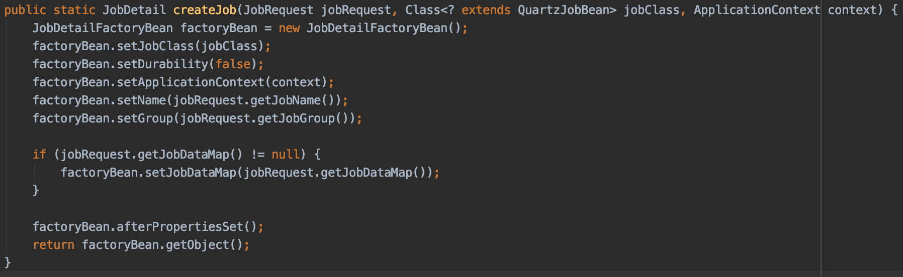
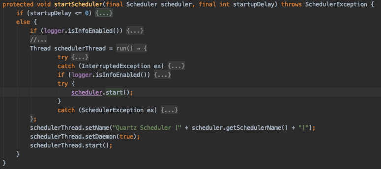
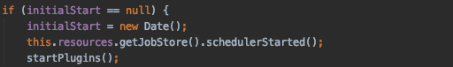

## 1. 들어가며

Quartz Job Scheduler에 대한 내용은 여러 시리즈 형식으로 작성을 하였습니다. Quartz에 대한 간단한 설명을 시작으로 스프링 부트 기반에서의 Quartz Job Scheduler 구현 그리고 이중화 환경에서 많이 사용하는 Quartz Cluster 구성도 아래 튜토리얼에서 같이 보도록 하겠습니다.

* 1부 : [Quartz Job Scheduler란?](https://blog.advenoh.pe.kr/quartz-job-scheduler란/)
* 2부 : [Spring Boot + Quartz을 이용한 Job Scheduler 구현 (In memory)](https://blog.advenoh.pe.kr/spring-boot-quartz을-이용한-job-scheduler-구현-In-memory/)
* 3부 : [Multi WAS 환경을 위한 Cluster 환경의 Quartz Job Scheduler 구현](https://blog.advenoh.pe.kr/multi-was-환경을-위한-cluster-환경의-quartz-job-scheduler-구현/)
* 4부 : [Quartz에서 실행중인 Job을 Interrupt하여 Job Scheduler를 정상종료 시키는 방법](https://blog.advenoh.pe.kr/quartz에서-실행중인-job을-interrupt하여-job-scheduler를-정상종료-시키는-방법/)

### 1.1 Quartz란?

Quartz는 [Terracotta](http://www.quartz-scheduler.org/) 라는 회사에 의해 개발된 Job Scheduling 라이브러리입니다. 완전히 자바로 개발되어 어느 자바 프로그램에서도 쉽게 통합해서 개발할 수 있습니다. Quartz는 수십에서 수천 개의 작업도 실행 가능하며 간단한 interval 형식이나 Cron 표현식으로 복잡한 스케줄링도 지원합니다. 예를 들면 매주 금요일 새벽 1시 30분에 매주 실행하는 작업이나 매월 마지막 날에 실행하는 작업도 지정할 수 있습니다.

### 1.2 장단점

스프링을 개발하면서 Quartz를 Job Scheduler로 자주 사용하는 이유도 있지만, 단점도 존재합니다.

장점

* DB 기반으로 스케줄러 간의 Clustering 기능을 제공한다
    * 시스템 Fail-over와 Round-robin 방식의 로드 분산처리를 지원한다
* In-memory Job Scheduler도 제공한다
* 여러 기본 Plug-in을 제공한다
    * ShutdownHookPlugin - JVM 종료 이벤트를 캐치해서 스케줄러에게 종료를 알려준다
    * LoggingJobHistoryPlugin - Job 실행에 대한 로그를 남겨 디버깅할 때 유용하게 사용할 수 있다

단점
* Clustering 기능을 제공하지만, 단순한 random 방식이라서 완벽한 Cluster 간의 로드 분산은 안된다
* 어드민 UI을 제공하지 않는다
* 스케줄링 실행에 대한 History는 보관하지 않는다
* Fixed Delay 타입을 보장하지 않으므로 추가 작업이 필요하다

## 2. Quartz 아키텍처와 구성요소

Quartz Scheduler에 익숙해지기 위해서 자주 사용하는 용어들을 알아보겠습니다.

### 2.1 용어 정리

* **Job**
    * Quartz API에서 단 하나의 메서드를 가진 execute(JobExecutionContext context) Job 인터페이스를 제공한다. Quartz를 사용하는 개발자는 수행해야 하는 실제 작업을 이 메서드에서 구현하면 된다.
    * Job의 Trigger가 발생하면 스케줄러는 JobExecutionContext 객체를 넘겨주고 execute 메서드를 호출한다.
        * JobExecutionContext는 Scheduler, Trigger, JobDetail 등을 포함하여 Job 인스턴스에 대한 정보를 제공하는 객체이다

* **JobDataMap**
    * JobDataMap은 Job 인스턴스가 실행할 때 사용할 수 있게 원하는 정보를 담을 수 있는 객체이다.
    * JobDetail을 생성할 때 JobDataMap도 같이 세팅해주면 된다
      
    * Job 실행시 스케줄러에 Job 추가시 넣었던 JobDataMap 객체를 아래와 같이 접근하여 사용할 수 있다
      

* **JobDetail**
    * Job을 실행시키기 위한 정보를 담고 있는 객체이다. Job의 이름, 그룹, JobDataMap 속성 등을 지정할 수 있다. Trigger가 Job을 수행할 때 이 정보를 기반으로 스케줄링을 한다
      

* **Trigger**
    * Trigger는 Job을 실행시킬 스케줄링 조건 (ex. 반복 횟수, 시작시간) 등을 담고 있고 Scheduler는 이 정보를 기반으로 Job을 수행시킨다.
    * Trigger와 Job의 관계 정리
        * 1 Trigger = 1 Job
            * 반드시 하나의 Trigger는 반드시 하나의 Job을 지정할 수 있다
        * N Trigger = 1 Job
            * 하나의 Job을 여러 시간때로 실행시킬 수 있다 (ex. 매주 토요일날, 매시간마다)
    * Trigger는 2가지 형태로 지정할 수 있다
        * SimpleTrigger
            * 특정 시간에 Job을 수행할 때 사용되며 반복 횟수와 실행 간격등을 지정할 수 있다
              
        * CronTrigger
            * CronTrigger는 cron 표현식으로 Trigger를 정의하는 방식이다 (ex.매일 12시 - '0 0 12 * * ?’)
            * Cron 표현식은 SimpleTrigger와 같이 단순 반복뿐만이 아니라 더 복잡한 스케줄링(ex. 매월 마지막 금요일에 오후 3시부터 3시까지 몇분마다 실행)도 지정할 수 있다
            * Cron 표현식은 [이곳](https://www.freeformatter.com/cron-expression-generator-quartz.html) 을 참고해주세요
              

* Misfire Instructions
    * Misfire는 Job이 실행되어야 하는 시간, fire time을 지키지 못한 실행 불발을 의미한다
    * 이런 Misfire는 Scheduler가 종료될 때나 쓰레드 풀에 사용 가능한 쓰레드가 없는 경우에 발생할 수 있다
    * Scheduler가 Misfire된 Trigger에 대해서 어떻게 처리할 지에 대한 다양한 policy를 지원한다.
        * 예를 들면..
            * MISFIRE_INSTRUCTION_FIRE_NOW - 바로 실행
            * MISFIRE_INSTRUCTION_DO_NOTHING - 아무것도 하지 않음
* Listener
    * Listener는 Scheduler의 이벤트을 받을 수 있도록 Quartz에서 제공하는 인터페이스이며 2가지를 제공한다
        * JobListener
            * Job 실행전후로 이벤트를 받을 수 있다

		* TriggerLIstener
			* Trigger가 발생하거나 불발이 일어날 때나 Trigger를 완료할 때 이벤트를 받을 수 있다

* JobStore
    * Job과 Trigger의 정보를 2가지 방식으로 저장할 수 있다
        * RAMJobStore
            * 기본 값으로 메모리에 스케줄 정보를 저장한다
            * 메모리에 저장하기 때문에 성능면에서는 제일 좋지만, 시스템 문제 발생시 스케줄 데이터를 유지하지 못하는 단점이 있다
        * JDBC JobStore
            * 스케줄 정보를 DB에 저장하다
            * 시스템이 셧다운되더라도 스케줄 정보는 유지되어 시스템 재시작시 다시 Job 실행을 할 수 있다
        * 다른 기타 JobStore
            * Quartz JobStore을 확장하여 다른 저장소(Redis, MongoDB)에도 저장할 수 있다. 실제 구현은 아래 링크를 참고해주세요
                * [RedisJobStore](https://github.com/RedisLabs/redis-quartz)
                * [MongoDBJobStore](https://github.com/michaelklishin/quartz-mongodb)

## 3. Quartz 구성요소

[Java Articles](https://www.javarticles.com/2016/03/quartz-scheduler-model.html) 블로그에서 가져온 다이어그램입니다. Quartz의 전체 구조와 흐름을 잘 보여주는 그림입니다. Quartz의 세밀한 설정을 이해하는데 공식 문서도 도움이 되지만, 실제 [소스코드](https://github.com/quartz-scheduler) 를 보면 Quartz의 동작과 전체 아키텍처 구조를 이해하는데 많은 도움이 됩니다.

Quartz 스케줄러가 언제 시작되고 등록된 Job들이 어떤 작업들에 의해서 실행되는지 다음 튜터리얼에서 사용할 코드를 보면서 간단하게 알아보도록 하겠습니다.

* 질문1 - Spring에서 Quartz Scheduler가 어떻게 시작되는지?
* 질문2 - 추가된 Job은 어떻게 시작되나?
* 질문3 - Job 실행시 호출되는 JobListener와 TriggerListener는 어떻게 호출되나?

스프링 부트 구동시 콘솔에 찍히는 화면입니다. Quartz Scheduler가 초기화되고 시작된 이후에 추가하는 SimpleJob이 실행되는 것을 볼 수 있습니다.

분석한 코드를 나름 정리한다고 했는데, 이해한 코드를 쉽게 글로 정리하기가 쉽지 않네요. 디버깅을 걸어서 따라가면서 정리된 내용을 보시면 좋을 듯합니다.

* SchedulerFactoryBean
    * Quartz 스케줄러는 스프링의 컨테이너의 빈 LifeCycle 관리에 의해서 scheduler관련 설정이 초기화, 시작, 종료가 된다
      
    * **1.1 ==> void afterPropertiesSet() : InitializingBean 인터페이스의 의해서 호출됨**
        * **prepareSchedulerFactory() 메서드는 SchedulerFactory 인스턴스인 StdSchedulerFactory를 반환해서 prepareScheduler() 인자로 넘겨주고** Scheduler instance를 초기화한다
          
        * **1.2 ==> Scheduler prepareScheduler(SchedulerFactory schedulerFactory) :**
            * **SchedulerFactory로 부터 Scheduler 인스턴스를 얻어온다**
              
            * **1.3 ==>** **Scheduler createScheduler(SchedulerFactory schedulerFactory, @Nullable String schedulerName)**
                * **StdSchedulerFactory.getScheduler()에서 여러 초기화 단계를 실행한 후 Scheduler 인스턴스를 반환한다**
                    * 관련 Quartz 클래스를 로드한다 (ex. JobFactory, SimpleThreadPool, JobStore)
                    * DataSource, SchedulerPlugins에 대한 설정을 한다
                    * JobListeners, TriggerListeners 객체 생성 및 설정
                    * QuartzSchedulerThread도 시작한다
                    * 등등 …..
                      
    * **2.1 ==> start() : SmartLifeCycle 인터페이스의 의해서 호출된다**
        * **초기화한 Scheduler 인스턴스와 startUpDelay을 startScheduler() 메서드 인자 값로 넘겨준다**
          
        * **질문2의 답변** **2.2 ==>** **void startScheduler(final Scheduler scheduler, final int startupDelay)**
            * **StdScheduler.start() 메서드에서 실제 QuartzScheduler 관련 쓰레드를 시작해서 등록된 Job들을 실행한다**
              
    * **2.2 ==> stop() : SmartLifeCycle 인터페이스의 의해서 호출된다**
        * 톰켓 shutdown할 때 stop() 메서드가 호출된다
          

* QuartzScheduler :
    * **3.1 ==> start() : Quartz 스케줄러가 시작된다**
        * **JobStore 설정에 따라서 조금씩 추가로 처리하는 작업이 다르다**
            * RAMJobStore : 추가 작업 없음
            * JobStoreSupport :
                * ClusterManager를 별도의 쓰레드로 실행함
                * MisfireHandler를 별도의 쓰레드로 실행함

* QuartzSchedulerThread extends Thread
    * **4.1 ==> QuartzScheduler 생성자에서 호출되고 QuartzScheduler 생성자는 StdSchedulerFactory.getScheduler() -> instantiate()에 의해서 호출된다**
        * StdSchedulerFactory.instantiate()
          
        * QuartzScheduler 생성자
          
    * **4.2 ==> run()**
        * **스케줄러가 halted된 상태가 아니면 계속 loop을 돌며 Job을 실행하는 메인 로직이 들어있다**
        * 실행할 Thread가 있는 경우에
            * Fire할 Trigger 목록을 DB에서 얻어온 이후
              
            * 인자로 넘겨준 TriggerFiredBundle 정보로 새로운 JobRunShell 쓰레드 객체를 생성하고 runInThread(shell)에서 쓰레드를 실행시킨다
              
                * **질문2의 답변 ==> 4.2.1 job.execute(jec)**
                    * **실제 저희가 정의한 (ex. SimpleJob, CronJob) Job을 실행하게 된다**
                      
        * 램덤한 idle waitTime을 계산 값만큼 잠시 WAITING 상태로 변경한다

* ClusterManager extends Thread
    * 노드중에 fail 노드를 찾아서 실패된 Trigger와 Job에 대한 정보를 업데이트하여 recover를 시킨다
    * DB에서 fail된 노드는 SCHEDULER_STATE에서 삭제한다
* MisfireHandler extends Thread
    * misFire된 Jobs을 스캔해서 DB의 상태를 STATE_WAITING으로 변경하여 스케줄링에 포함되도록 한다
    * miFire된 Job이 있는 경우 잠들어 있던 QuartzSchedulerThread 쓰레드를 모두 깨운다
* JobListener / TriggerListener
    * ==> JobRunShell.run()에서 job을 실행하는 과정에서 Job과 Trigger에 대한 listener 메서드들을 실행한다
        * ex. triggerFired() 메서드는 아래 메서드안에서 실행한다

## 4. 정리

Quartz에 대한 기본 개념과 용어 그리고 Quartz 스케줄러가 스프링에서 언제 어떻게 실행되고 추가된 Quartz Job도 어떻게 시작되는지 Quartz의 코드를 보면서 같이 알아봤습니다.
다음 튜터리얼에서는 실제 RAMJobStore을 사용해서 스케줄링하도록 구현해보겠습니다.

## 5. 참고

* Quartz 공식 사이트
    * [http://www.quartz-scheduler.org](http://www.quartz-scheduler.org/)
    * [https://github.com/quartz-scheduler](https://github.com/quartz-scheduler)
* Quartz란
    * [https://www.baeldung.com/quartz](https://www.baeldung.com/quartz)
    * [https://homoefficio.github.io/2018/08/12/Java-Quartz-Scheduler-Job-Chaining-구현/](https://homoefficio.github.io/2018/08/12/Java-Quartz-Scheduler-Job-Chaining-%EA%B5%AC%ED%98%84/)
    * [https://examples.javacodegeeks.com/enterprise-java/quartz/quartz-scheduler-tutorial/](https://examples.javacodegeeks.com/enterprise-java/quartz/quartz-scheduler-tutorial/)
    * [https://ymh0302.tistory.com/entry/Quartz-Scheduler](https://ymh0302.tistory.com/entry/Quartz-Scheduler)
    * [https://juliuskrah.com/tutorial/2017/10/06/persisting-dynamic-jobs-with-quartz-and-spring/](https://juliuskrah.com/tutorial/2017/10/06/persisting-dynamic-jobs-with-quartz-and-spring/)
    * [https://www.baeldung.com/spring-quartz-schedule](https://www.baeldung.com/spring-quartz-schedule)
* Quartz 장단점
    * [https://kingbbode.tistory.com/38](https://kingbbode.tistory.com/38) f
    * [https://github.com/HomoEfficio/dev-tips/blob/master/Quartz%20Advanced.md](https://github.com/HomoEfficio/dev-tips/blob/master/Quartz%20Advanced.md)
* Quartz Architecture
    * [https://www.javarticles.com/2016/03/quartz-scheduler-model.html](https://www.javarticles.com/2016/03/quartz-scheduler-model.html)
* Quartz Plugin
    * [https://medium.com/@himsmittal/quartz-plugins-a-must-have-for-all-quartz-implementations-7ca01e98e620](https://medium.com/@himsmittal/quartz-plugins-a-must-have-for-all-quartz-implementations-7ca01e98e620)
* Quartz Cron Generator
    * [https://www.freeformatter.com/cron-expression-generator-quartz.html](https://www.freeformatter.com/cron-expression-generator-quartz.html)
* Misfire Instruction
    * [https://www.nurkiewicz.com/2012/04/quartz-scheduler-misfire-instructions.html](https://www.nurkiewicz.com/2012/04/quartz-scheduler-misfire-instructions.html)
* JobStore 구현
    * [https://github.com/jlinn/quartz-redis-jobstore](https://github.com/jlinn/quartz-redis-jobstore)
    * [https://github.com/michaelklishin/quartz-mongodb](https://github.com/michaelklishin/quartz-mongodb)
* Fixed Delay
    * [https://reachmnadeem.wordpress.com/2017/01/18/fixed-delay-scheduling-with-quartz/](https://reachmnadeem.wordpress.com/2017/01/18/fixed-delay-scheduling-with-quartz/)
    * [https://gist.github.com/mnadeem/367f115cff54b704c91b4813b240b1fd](https://gist.github.com/mnadeem/367f115cff54b704c91b4813b240b1fd)

