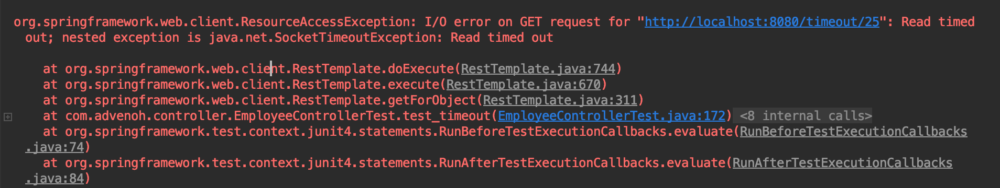

## 1. 들어가며

스프링 프레임워크에서는 REST 서비스의 Endpoint를 호출할 수 있도록 크게 **2가지 방식인 동기, 비동기 REST Client을 제** 공합니다. 이번 포스팅에서는 동기방식인 RestTemplate에 대해서 알아보겠습니다.

- **RestTemplate**
    - Spring 3부터 지원 되었고 REST API 호출이후 응답을 받을 때까지 기다리는 동기방식이다
- **AsyncRestTemplate**
    - Spring 4에 추가된 비동기 RestTemplate이다
    - Spring 5.0에서는 deprecated 되었다
- **WebClient**
    - Spring 5에 추가된 논블럭, 리엑티브 웹 클리이언트로 동기, 비동기 방식을 지원한다


RestTemplate은 스프링에서 제공하는 다른 여러 **Template 클래스 (ex. JdbcTemplate, RedisTemplate)와 동일한 원칙에 따라 설계되어 단순한 방식의 호출로 복잡한 작업을 쉽게 하도록 제공** 합니다. RestTemplate 클래스는 REST 서비스를 호출하도록 설계되어 HTTP 프로토콜의 메서드 (ex. GET, POST, DELETE, PUT)에 맞게 여러 메서드를 제공합니다.

| 메서드 | HTTP | 설명 |
| ------------- | ------------- | ------------- |
| getForObject  | GET | 주어진 URL 주소로 HTTP GET 메서드로 객체로 결과를 반환받는다 | 
| getForEntity | GET | 주어진 URL 주소로 HTTP GET 메서드로 결과는 ResponseEntity로 반환받는다 | 
| postForLocation | POST | POST 요청을 보내고 결과로 헤더에 저장된 URI를 결과로 반환받는다 | 
| postForObject | POST | POST 요청을 보내고 객체로 결과를 반환받는다 | 
| postForEntity | POST | POST 요청을 보내고 결과로 ResponseEntity로 반환받는다 | 
| delete | DELETE | 주어진 URL 주소로 HTTP DELETE 메서드를 실행한다 |
| headForHeaders | HEADER | 헤더의 모든 정보를 얻을 수 있으면 HTTP HEAD 메서드를 사용한다 |
| put | PUT | 주어진 URL 주소로 HTTP PUT 메서드를 실행한다 |
| patchForObject | PATCH | 주어진 URL 주소로 HTTP PATCH 메서드를 실행한다 |
| optionsForAllow | OPTIONS | 주어진 URL 주소에서 지원하는 HTTP 메서드를 조회한다 |
| exchange | any | HTTP 헤더를 새로 만들 수 있고 어떤 HTTP 메서드도 사용가능하다 |
| execute | any | Request/Response 콜백을 수정할 수 있다 |

## 2. 개발 환경

- OS : Mac OS
- IDE: Intellij
- Java : JDK 1.8
- Source code : [github](https://github.com/kenshin579/tutorials-java/tree/master/spring-resttemplate)
- Software management tool : Maven

예제 프로젝트는 스프링 부트로 작성되어 기본 스프링 부트 의존성을 추가하면 RestTemplate 관련 의존성은 자동으로 추가됩니다.

기본 스프링을 사용 중이라면 spring-webmvc 의존성만 추가하여 작업하시면 됩니다. 실제로 RestTemplate은 spring-web 의존성에 포함된 클래스이지만, **spring-webmvc 의존성에 spring-web이 포함되어 있어 같이 의존성이 포함** 됩니다.

```xml
<dependency>
    <groupId>org.springframework</groupId>
    <artifactId>spring-webmvc</artifactId>
    <version>4.3.7.RELEASE</version>
</dependency>
```


## 3. RestTemplate의 동작원리

RestTemplate의 동작원리에 대한 내용은 [빨간색코딩](https://sjh836.tistory.com/141) 블로그에 잘 정리가 되어 있어 별도로 정리는 하지 않았습니다. 해당 링크에 들어가서 더 자세한 설명을 참조해주세요.


## 4. RestTemplate 메서드 예제

RestTemplate에서 자주 사용하는 메서드 위주로 알아보겠습니다.

### 4.1 GET 메서드

#### 4.1.1 getForObject()

getForObject() 메서드는 GET을 수행하고 HTTP 응답을 객체 타입으로 변환해서 반환해주는 메서드입니다. 이 예제에서는 Employee 객체로 반환해줍니다.

**Client Code - Unit Test**

```java
@Test
public void test_getForObject() {
   Employee employee = restTemplate.getForObject(BASE_URL + "/{id}", Employee.class, 25);
   log.info("employee: {}", employee);
}
```

Controller에서는 getEmployee() 호출 시 응답으로 Employee 객체를 JSON 형태로 변환합니다. 예제를 실행해 보면 추가 설정 없이 자동으로 JSON 형태로 잘 받는 것을 알 수 있습니다.

스프링 부트에서는 Controller 단에 **@RestController 어노테이션을 추가하면 클래스패스에 Jackson2 (jackson-databind)가 있는 한 기본적으로 JSON 응답을 처리** 합니다. spring-boot-starter-web 의존성을 추가했다면 jackson-databind은 transitive 의존성에 의해서 같이 포함됩니다.

**Controller Code**

```java
@RequestMapping(method = RequestMethod.GET, value = "/{id}", produces = MediaType.APPLICATION_JSON_VALUE)
public Employee getEmployee(@PathVariable Long id) {
   log.info("id: {}", id);
 
   Employee employee = Employee.builder()
         .id(id)
         .name("Frank Oh")
         .gender(Gender.FEMALE)
         .address(Address.builder()
               .street("123동 135호 파란아마트")
               .city("Seoul")
               .postalCode("1234")
               .build())
         .build();
   log.info("employee: {}", employee);
   return employee;
}
```
**실행 화면**


#### 4.1.2 getForEntity()

getForEntity() 메서드의 경우에는 응답을 ResponseEntity 객체로 받게 됩니다. getForObject()와 달리 HTTP 응답에 대한 추가 정보를 담고 있어서 GET 요청에 대한 응답 코드, 실제 데이터를 확인할 수 있습니다. 또한 ResponseEntity<T> 제네릭 타입에 따라서 응답을 String이나 Object 객체로 받을 수 있습니다.

예제에서는 응답 값을 JSON 스트링 형태로 받고 있습니다.

**Client Code - Unit Test**

```java
@Test
public void test_getForEntity() {
   ResponseEntity<String> responseEntity = restTemplate.getForEntity(BASE_URL + "/{id}", String.class, 25);
   log.info("statusCode: {}", responseEntity.getStatusCode());
   log.info("getBody: {}", responseEntity.getBody());
}
```

**실행 화면**


#### 4.1.3 getForEntity()에 여러 값을 담은 params을 같이 넘겨주기

getForEntity() 메서드는 또한 여러 값을 담은 params를 인자로 받아서 GET 요청을 할 수 있습니다. 예제에서는 URL PATH에 필요한 name과 country 변수를 LinkedMultiValueMap 객체에 담아서 params로 넘겨주었습니다.

**Client Code - Unit Test**

```java
@Test
public void test_getForEntity_여러_path_variables을_넘겨주는_경우() {
   MultiValueMap<String, String> params = new LinkedMultiValueMap<>();
   params.add("name", "Frank Oh");
   params.add("country", "US");
 
   ResponseEntity<Employee> responseEntity = restTemplate.getForEntity(BASE_URL + "/{name}/{country}", Employee.class, params);
   log.info("statusCode: {}", responseEntity.getStatusCode());
   log.info("getBody: {}", responseEntity.getBody());
}
```

**실행 화면**


### 4.2 POST

다음은 POST 메서드에 대한 메서드들입니다.

#### 4.2.1 postForObject() 해더 포함하지 않고 보내기

postForObject()는 getForObject()와 같이 POST 요청에 대해서 반환 값을 해당 객체로 반환해주는 메서드입니다. Employee 객체를 POST의 body로 해서 보냅니다.

**Client Code - Unit Test**

```java
@Test
public void testPostForObject_해더_포함해서_보내지_않기() {
   Employee newEmployee = Employee.builder()
         .name("Frank")
         .address(Address.builder()
               .country("US")
               .build())
         .build();
 
   Employee employee = restTemplate.postForObject(BASE_URL + "/employee", newEmployee, Employee.class);
   log.info("employee: {}", employee);
}
```

Controller에서는 일반적으로 Employee 객체를 POST 메세드로 받아서 서비스 로직을 실행 하겠지만, 여기에서는 간단하게 로그로 출력을 했습니다. 응답 값으로는 받은 객체와 응답 코드 HTTP 201를 ResponseEntity로 반환합니다.

**Controller Code**

```java
@RequestMapping(value = "/employee", method = RequestMethod.POST)
public ResponseEntity<Employee> saveEmployee(
      @RequestHeader(value = "headerTest", required = false) String headerTest,
      @RequestBody Employee employee) {
   log.info("headerTest: {}", headerTest);
   log.info("employee: {}", employee);
   return new ResponseEntity<>(employee, HttpStatus.CREATED);
}
```

**실행 화면**


#### 4.2.2 postForObject() 해더 포함해서 보내기

이번에는 헤더에 데이터를 실어서 보내 보겠습니다. Employee 객체와 custom 헤더를 인자로 넘겨 HttpEntity를 생성합니다. 생성한 HttpEntity를 postForObject에 담아서 보내면 Controller에서 @RequestHeader 어노테이션으로 값을 얻어올 수 있습니다.

**Client Code - Unit Test**

```java
@Test
public void testPostForObject_해데_포함해서_보내기() {
   Employee newEmployee = Employee.builder()
         .name("Frank")
         .address(Address.builder()
               .country("US")
               .build())
         .build();
 
   HttpHeaders headers = new HttpHeaders();
   headers.set("headerTest", "headerValue");
 
   HttpEntity<Employee> request = new HttpEntity<>(newEmployee, headers);
 
   Employee employee = restTemplate.postForObject(BASE_URL + "/employee", request, Employee.class);
   log.info("employee: {}", employee);
}
```

**실행 화면**


#### 4.2.3 postForEntity()

postForEntity() 메서드는 ResponseEntity<T> 객체로 데이터를 받을 수 있습니다. 예제에서는 Employee 객체로 받는 대신 String으로 받는 예제여서 응답 body가 스트링 JSON 형태로 출력됩니다.

**Client Code - Unit Test**

```java
@Test
public void testPostForEntity_스트링값으로_받기() {
   Employee newEmployee = Employee.builder()
         .name("Frank")
         .address(Address.builder()
               .country("US")
               .build())
         .build();
 
   ResponseEntity<String> responseEntity = restTemplate.postForEntity(BASE_URL + "/employee", newEmployee, String.class);
   log.info("statusCode: {}", responseEntity.getStatusCode());
   log.info("getBody: {}", responseEntity.getBody());
}
```

**실행 화면**


#### 4.2.4 postFoLocation()

postForLocation() 메서드는 객체를 반환하는 대신 생성된 리소스의 URI 위치를 반환합니다.

**Client Code - Unit Test**

```java
@Test
public void testPostForLocation() {
   Employee newEmployee = Employee.builder()
         .name("Frank")
         .address(Address.builder()
               .country("US")
               .build())
         .build();
 
   HttpEntity<Employee> request = new HttpEntity<>(newEmployee);
 
   URI location = restTemplate.postForLocation(BASE_URL + "/employee/location", request);
   log.info("location: {}", location);
}
```

Controller에서는 헤더에 URI location 값을 저장하여 ResponseEntity로 반환합니다.

**Controller Code**

```java
@RequestMapping(value = "/employee/location", method = RequestMethod.POST)
public ResponseEntity<Void> locationURI(
      @RequestBody Employee employee,
      UriComponentsBuilder builder) {
 
   HttpHeaders headers = new HttpHeaders();
   headers.setLocation(builder.path("/location/{name}").buildAndExpand(employee.getName()).toUri());
 
   log.info("headers: {}", headers);
   return new ResponseEntity<>(headers, HttpStatus.CREATED);
}
```

**실행 화면**


### 4.3 DELETE

delete() 메서드는 HTTP DELETE을 수행하며 회원의 이름을 넘겨주면 매핑된 Controller의 deleteEmployeeByName 메서드가 실행됩니다.

**Client Code - Unit Test**

```java
@Test
public void testDelete() {
   Map<String, String> params = new HashMap<>();
   params.put("name", "Frank");
   restTemplate.delete(BASE_URL + "/employee/{name}", params);
}
```

**Controller Code**

```java
@RequestMapping(value = "/employee/{name}", method = RequestMethod.DELETE)
public void deleteEmployeeByName(@PathVariable(value = "name") String name) {
   log.info("deleting employee: {}", name);
}
```

**실행 화면**


### 4.4 PUT

put() 메서드도 다른 메서드(ex. postForObject)과 비슷합니다. PUT은 데이터를 업데이트하기 위해 요청을 보내기 때문에 body에 데이터를 실어서 보냅니다. 예제에서는 Address 객체를 실어서 보냅니다.

**Client Code - Unit Test**

```java
@Test
public void testPut() {
   Map<String, String> params = new HashMap<>();
   params.put("name", "Frank");
   Address address = Address.builder()
         .city("Columbus")
         .country("US")
         .build();
   restTemplate.put(BASE_URL + "/employee/{name}", address, params);
}
```

**Controller Code**

```java
@RequestMapping(value = "/employee/{name}", method = RequestMethod.PUT)
public void updateEmployee(@PathVariable(value = "name") String name, @RequestBody Address address) {
   log.info("name : {} address {}", name, address);
}
```

**실행 화면**


### 4.5 Exchange()
#### 4.5.1 Exchange()로 HTTP GET 메서드 실행하기

지금까지 HTTP 메서드 별로 RestTemplate에서 제공하는 API들을 같이 봤습니다. 별도의 메서드들도 제공하지만, 일반적으로 모두 처리가 가능한 하나의 메서드인 Exchange API도 제공합니다.
앞에서 사용했던 getForObject() 메서드 대신에 exchange() 메서드를 사용해서 값을 조회해보겠습니다. 헤더에 값을 포함해서 호출하는 예제입니다.

**Client Code - Unit Test**

HttpEntity 객체에 “Hello World” 스트링값과 헤더 설정값을 저장합니다. exchange() 메서드에 HttpMethod.GET 메서드를 지정하여 헤더 값도 같이 해당 URL로 보내고 결과를 화면에 출력합니다.

```java
@Test
public void test_exchange() {
   HttpHeaders headers = new HttpHeaders();
   headers.setContentType(MediaType.APPLICATION_JSON);
   HttpEntity<String> request = new HttpEntity<>("Hello World!", headers);
   log.info("request: {}", request);
 
   ResponseEntity<Employee> empEntity = restTemplate.exchange(BASE_URL + "/exchange/employee/{id}", HttpMethod.GET, request, Employee.class, 50);
   log.info("empEntity: {}", empEntity);
}
```

**Controller Code**

```java
@RequestMapping(method = RequestMethod.GET, value = "/exchange/employee/{id}", produces = MediaType.APPLICATION_JSON_VALUE)
public ResponseEntity<Employee> getEmployeeByExchangeMethod(
   @PathVariable Long id,
   @RequestHeader HttpHeaders headers) {
   log.info("id : {} headers: {}", id, headers);
 
   Employee employee = Employee.builder()
         .name("Frank")
         .address(Address.builder()
               .country("US")
               .build())
         .build();
 
   log.info("employee: {}", employee);
   return new ResponseEntity<>(employee, HttpStatus.OK);
}
```

**실행 화면**


#### 4.5.2 exchange()로 객체 컬렉션을 받아보기

단순히 하나의 객체(ex. 직원) 정보를 반환하는 메서드를 Controller에서 정의하지만, 전체 직원을 조회해서 List<Employee> 형태로 반환하는 EndPoint가 필요할 때가 있습니다.

**Controller Code**

모든 직원을 조회해서 반환하는 메서드입니다. 2명의 직원을 리스트에 넣어 List<Employee>를 반환합니다.

```java
@RequestMapping(method = RequestMethod.GET, value = "/employees", produces = MediaType.APPLICATION_JSON_VALUE)
public List<Employee> getAllEmployees() {
   List<Employee> lists = new ArrayList();
 
   lists.add(Employee.builder()
         .name("frank1")
         .address(Address.builder()
               .country("US")
               .build())
         .build());
 
   lists.add(Employee.builder()
         .name("frank2")
         .address(Address.builder()
               .country("US")
               .build())
         .build());
 
   log.info("lists: {}", lists);
   return lists;
}
```

**Client Code - Unit Test**

RestTemplate에서 리스트 형태의 객체 목록을 얻으려면 ResponseEntity와 ParameterizedTypeReference 객체를 사용하면 됩니다. ParameterizedTypeReference 객체를 사용하면 응답을 Class 대신 제네릭한 타입을 지정할 수 있습니다. 예제에서는 응답을 List<Employee> 타입으로 지정하였습니다. ParameterizedTypeReference 객체는 abstract 클래스이여서 바로 사용하기 위해 익명 인라인 클래스를 사용하였고 더 자세한 내용은 슈터 타입 토큰을 참조해주세요.

```java
@Test
public void test_get_lists_of_objects() {
   ResponseEntity<List<Employee>> responseEntity = restTemplate.exchange(BASE_URL + "/employees", HttpMethod.GET, null,  new ParameterizedTypeReference<List<Employee>>(){});
   log.info("responseEntity: {}", responseEntity);
}
```

**실행 화면**


### 4.6 optionsForAllow()

optionsForAllow()는 해당 URI에서 지원하는 HTTP 메서드를 조회하는 메서드입니다.

**Client Code - Unit Test**

```java
@Test
public void test_optionsForAllow() {
   final Set<HttpMethod> optionsForAllow = restTemplate.optionsForAllow(BASE_URL + "/employee");
 
   log.info("optionsForAllow: {}", optionsForAllow);
   log.info("optionsForAllow: {}", optionsForAllow);
}
```

**실행 화면**

[http://localhost:8080/employee](http://localhost:8080/employee) 에서 지원하는 HTTP 메서드는 POST와 OPTIONS을 지원합니다.


### 4.7 Timeout 설정하기

RestTemplate 사용시 timeout과 같은 connection에 대한 설정을 추가로 할 수가 있습니다. 간단한 설정은 SimpleClientHttpRequestFactory 객체를 사용하면 되지만, 많은 기능을 제공하지 않아 실제 환경에서는 더 많은 기능(ex. retry)을 제공하는 별도의 HTTP Client 라이브러리를 사용합니다. 이 예제에서는 아파치의 httpclient를 추가하여 Read timeout을 설정하여 사용하겠습니다.

pom.xml 파일에 라이브러리를 추가합니다.

```xml
<dependency>
    <groupId>org.apache.httpcomponents</groupId>
    <artifactId>httpclient</artifactId>
    <version>4.5.6</version>
</dependency>
```

**Client Code - Unit Test**

ClientHttpRequestFactory 객체에 connection과 read에 대한 timeout을 5초로 설정했습니다. 컨트롤러에서는 10초동안 sleep을 해서 결과를 5초안에 반환하지 않아서 ResourceAccessException이 발생하고 Read timed out을 출력하는 것을 확인할 수 있습니다.

```java
@Test
public void test_timeout() {
   final ClientHttpRequestFactory requestFactory = getRequestFactory();
   final RestTemplate restTemplateTimeout = new RestTemplate(requestFactory);
 
   assertThatThrownBy(() -> restTemplateTimeout.getForObject(BASE_URL + "/timeout/{id}", Employee.class, 25))
         .isInstanceOf(ResourceAccessException.class);
}
 
ClientHttpRequestFactory getRequestFactory() {
   final int timeoutInSecs = 5;
 
   final HttpComponentsClientHttpRequestFactory clientHttpRequestFactory = new HttpComponentsClientHttpRequestFactory();
   clientHttpRequestFactory.setConnectTimeout(timeoutInSecs * 1000);
   clientHttpRequestFactory.setReadTimeout(timeoutInSecs * 1000);
   return clientHttpRequestFactory;
}
```

**실행 화면**



### 4.8 patchForObject()

patchForObject()는 주어진 URL 주소로 HTTP Patch 메서드를 실행합니다. HTTP에서 리소스를 생성하는 메서드는 3가지가 있습니다. 간단하게 리뷰를 하고 Patch 예제 코드를 보겠습니다.

- POST
    - 리소스의 위치를 지정하지 않는 방식으로 리소스를 생성하는 연산이다
    - POST는 idempotent 하지 않다 (연산을 반복해도 같은 값이 나온다는 개념)
    - ex. POST /employee
    - 매번 실행할 때마다 다른 곳에 새로운 리소스가 생성됨 (ex. /employee/2, /employee/3)
- PUT
    - 명확한 리소스의 위치에 사용되며 리소스의 생성이나 업데이트를 위해 사용하는 연산이다
    - PUT는 idempotent하다
        - ex. PUT _employee_{id}
- PATCH
    - PUT와 같이 정해진 리소스의 위치에 사용되지만, 모든 퍼라미터를 업데이트하기보다는 부분적인 데이터만 업데이트한다
    - ex. PATCH _employee_{id}

JDK HttpURLConnection에서는 PATCH 메서드를 지원하지 않기 때문에 아래 오류가 발생합니다. 기본 HttpURLConnection 대신 Patch 메서드를 지원하는 아파치의 HttpComponents를 사용합니다.


**Client Code - Unit Test**

```java
@Test
public void test_patchForObject() {
   final RestTemplate patchRestTemplate = new RestTemplate(getRequestFactory());
 
   Address address = Address.builder()
         .city("Columbus")
         .country("US")
         .build();
 
   patchRestTemplate.patchForObject(BASE_URL + "/employee/{name}", address, Address.class,"frank");
}
```

### 4.9 Execute()

마지막으로 Execute() 메서드에 대해서 알아보겠습니다. Execute()는 콜백을 통해 요청 준비와 응답 추출을 완벽하게 제어하여 요청을 수행하는 가장 일반적인 메서드를 RestTemplate에서 제공합니다. 그래서 실제 지금까지 언급했던 메서드 getForObject(), put()등은 내부적으로 execute() 메서드를 호출하게 되어 있습니다.

아래 코드는 getForObject()와 put() 메서드의 구현 부분입니다. 인자로 넘겨진 파라미터로 execute()를 호출합니다.

```java
public void put(String url, @Nullable Object request, Map<String, ?> uriVariables) throws RestClientException {
    RequestCallback requestCallback = this.httpEntityCallback(request);
    this.execute(url, HttpMethod.PUT, requestCallback, (ResponseExtractor)null, (Map)uriVariables);
}
 
@Nullable
public <T> T getForObject(String url, Class<T> responseType, Object... uriVariables) throws RestClientException {
    RequestCallback requestCallback = this.acceptHeaderRequestCallback(responseType);
    HttpMessageConverterExtractor<T> responseExtractor = new HttpMessageConverterExtractor(responseType, this.getMessageConverters(), this.logger);
    return this.execute(url, HttpMethod.GET, requestCallback, responseExtractor, (Object[])uriVariables);
}
```

**Client Code - Unit Test**

URL 주소로 요청을 보내기전에 요청 콜백은 인자로 넘겨준 Address 객체를 body에 세팅하고 헤더 값들도 설정합니다.

```java
@Test
public void testExecute() {
   Address address = Address.builder()
         .city("Columbus")
         .country("US")
         .build();
   restTemplate.execute(BASE_URL + "/employee/{name}", HttpMethod.PUT, requestCallback(address), clientHttpResponse -> null, "frank");
}
 
RequestCallback requestCallback(final Address address) {
   return clientHttpRequest -> {
      log.info("address : {}", address);
      ObjectMapper mapper = new ObjectMapper();
      mapper.writeValue(clientHttpRequest.getBody(), address);
      clientHttpRequest.getHeaders().add(
            HttpHeaders.CONTENT_TYPE, MediaType.APPLICATION_JSON_VALUE);
      clientHttpRequest.getHeaders().add(
            HttpHeaders.AUTHORIZATION, "Basic " + "testpasswd");
   };
}
```

**실행 화면**


## 5. 참고

- RestTemplate
    - [https://www.baeldung.com/rest-template](https://www.baeldung.com/rest-template)
    - [https://howtodoinjava.com/spring-restful/spring-restful-client-resttemplate-example/](https://howtodoinjava.com/spring-restful/spring-restful-client-resttemplate-example/)
    - [https://vnthf.github.io/blog/Java-RestTemplate%EC%97%90-%EA%B4%80%ED%95%98%EC%97%AC/](https://vnthf.github.io/blog/Java-RestTemplate%EC%97%90-%EA%B4%80%ED%95%98%EC%97%AC/)
    - [https://docs.spring.io/spring/docs/current/spring-framework-reference/integration.html#rest-client-access](https://docs.spring.io/spring/docs/current/spring-framework-reference/integration.html#rest-client-access)
    - [https://www.concretepage.com/spring/spring-mvc/spring-rest-client-resttemplate-consume-restful-web-service-example-xml-json](https://www.concretepage.com/spring/spring-mvc/spring-rest-client-resttemplate-consume-restful-web-service-example-xml-json)
    - [https://howtodoinjava.com/spring-restful/spring-restful-client-resttemplate-example/](https://howtodoinjava.com/spring-restful/spring-restful-client-resttemplate-example/)
- RestTemplate 동작 원리
    - [https://sjh836.tistory.com/141](https://sjh836.tistory.com/141)
- Get Lists of Objects
    - [https://www.baeldung.com/spring-rest-template-list](https://www.baeldung.com/spring-rest-template-list)
- WebClient
    - [https://docs.spring.io/spring/docs/current/spring-framework-reference/integration.html#rest-client-access](https://docs.spring.io/spring/docs/current/spring-framework-reference/integration.html#rest-client-access)
    - [https://www.baeldung.com/spring-5-webclient](https://www.baeldung.com/spring-5-webclient)
- Super type tokens (ParameterizedTypeReference)
    - [https://homoefficio.github.io/2016/11/30/%ED%81%B4%EB%9E%98%EC%8A%A4-%EB%A6%AC%ED%84%B0%EB%9F%B4-%ED%83%80%EC%9E%85-%ED%86%A0%ED%81%B0-%EC%88%98%ED%8D%BC-%ED%83%80%EC%9E%85-%ED%86%A0%ED%81%B0/](https://homoefficio.github.io/2016/11/30/%ED%81%B4%EB%9E%98%EC%8A%A4-%EB%A6%AC%ED%84%B0%EB%9F%B4-%ED%83%80%EC%9E%85-%ED%86%A0%ED%81%B0-%EC%88%98%ED%8D%BC-%ED%83%80%EC%9E%85-%ED%86%A0%ED%81%B0/)
    - [https://www.bsidesoft.com/?p=2903](https://www.bsidesoft.com/?p=2903)
    - [https://docs.spring.io/spring-framework/docs/current/javadoc-api/org/springframework/core/ParameterizedTypeReference.html](https://docs.spring.io/spring-framework/docs/current/javadoc-api/org/springframework/core/ParameterizedTypeReference.html)
- Anonymous Inner Class
    - [https://www.geeksforgeeks.org/anonymous-inner-class-java/](https://www.geeksforgeeks.org/anonymous-inner-class-java/)
- Patch vs Put vs Post
    - [https://1ambda.github.io/javascripts/rest-api-put-vs-post/](https://1ambda.github.io/javascripts/rest-api-put-vs-post/)
    - [https://blog.fullstacktraining.com/restful-api-design-post-vs-put-vs-patch/](https://blog.fullstacktraining.com/restful-api-design-post-vs-put-vs-patch/)

