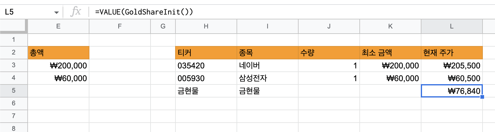

투자 스터디를 하면서 [주식 투자 매매일지](https://docs.google.com/spreadsheets/d/112wngK0qecpPl6R-Q-aytDQ-5PH36XC1d_wuT15H6HI/edit?usp=sharing)를 구글 시트로 작성하고 있는데 Google Apps Script를 유용하게 사용하게 되어 간단하게 정리합니다.

## Google Finance 함수란?

Apps Script에 언급하기 전에 먼저 Google Finance 함수를 알아보자. 이 함수는 구글 시트에서 사용할 수 있는 내장 함수 중에 하나로, 실시간 주식 시세 데이터를 가져올 수 있다.

셀에 `=GOOGLEFINANCE("AAPL")` 이렇게 입력하면 현재 애플 주식 시세를 가져와 셀로 표시해준다.

아래 그림처럼 현재 주가를 확인해서 매수/매도 할지 판단하는 데 사용하고 있다.


Google Finance 함수는 대부분의 주식 세시 데이터를 제공하고 있지만, 없는 경우도 있다. 예를 들면, 금현물 시세는 제공하고 있지 않다.

## 사용자 정의 함수를 구현하려면?

Google Finance 함수에서는 금현물 시세를 제공하지 않아 다른 API를 통해서 데이터를 가져와 셀에 입력할 수 있도록 사용자 정의 함수를 구현해야 한다.

금현물 시세 정보를 가져오는 API는 [RapidAPI Stock-API](https://rapidapi.com/kenshin579-dCJkBINoF/api/stock-api7/) 의 API를 사용한다.


### 1.Apps Script 작성하기

Google Apps Script는 Google 여러 서비스 (ex. Google Sheets, Docs, Gmail 등)를 자동화하고 확장 가능하도록 JavaScript 플랫폼을 제공하여 구글 서비스와 상호 작용이 가능하다.

구글 시트에서 Apps Script를 작성하려면, `확장 프로그램` > `Apps Script` 클릭해서 실행한다. 아래 코드를 작성하고 실행 버튼을 클릭하면 최소 한번은 인증 절차를 거쳐야 한다.

> '확인되지 않은 앱' 경고 창이 뜨면 "고급 설정" 클릭하고 "....로 이동(안전하지 않음")을 클릭해서 전급 허용을 해준다.


```javascript
function GoldShareInit() {
  var options = {
  'headers' : {
    'X-RapidAPI-Key': '이 값은 rapid api에서 확인해주시요',
    'X-RapidAPI-Host': 'stock-api7.p.rapidapi.com'
  }
};

 var res = UrlFetchApp.fetch('https://stock-api7.p.rapidapi.com/v1/latest/M04020000', options);
 var content = res.getContentText();
 var json = JSON.parse(content);
  
 var result = json['currentPrice'];
 return result;
}
```


### 2.사용자 정의 함수 사용

구글시트에서 아래와 같이 입력을 하면 금현물 시세 값이 표시되는 것을 확인할 수 있다.


```javascript
=VALUE(GoldShareInit())
```




## 참고

- https://developers.google.com/apps-script/reference/url-fetch/url-fetch-app?hl=ko
- https://www.youtube.com/watch?v=k0su6345KDI&t=828s
- https://support.google.com/docs/answer/3093281?hl=en
