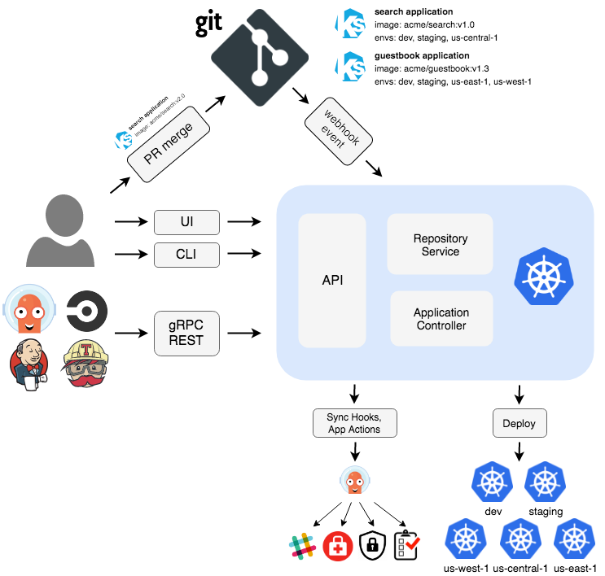

> 본 내용은 사내 CNCF 스터디 발표자료입니다. 발표형식은 아래 참고 형식에 따라서 5하원칙으로 정리하였습니다. 
> 참고 : https://medium.com/@goinhacker/nats-a63fba865d6f

Argo Projects 그전 발표내용은 [여기](https://blog.advenoh.pe.kr/cloud/Argo-Projects/)를 참고해주세요. 

# Argo CD?

## What?

Argo CD는 GitOps 기반의 CD 도구이고 다음과 같은 여러 기능을 제공하고 있다

## 기능

- 타겟 환경에 application 자동 배포 지원

- 쿠버네티스 manifest 파일을 생성해주는 여러 템플릿? 포맷을 지원

	- Kustomize, Helm charts, plain-YAML, Ksonnet, Jsonnet

- Pull deployment 방식를 지원

	- Argo CD는 k8s manifest의 변경을 pull하는 방식

- 여러 클러스터를 관리하고 배포하는 기능

- SSO 통합 인증 지원 (OIDC, OAuth2, LDAP, SAML 2.0, GitHub, GitLab, Microsoft, LinkedIn)

- Application 자원의 Health 상태 지원

- Web UI, CLI 지원

- 웹훅 통합 지원 (GitHub, BitBucket, GitLab)

- 복잡한 응용 프로그램 Rollout을 지원하기 위한 Presync, Sync, Postsync hook도 지원

## Architecture

Argo CD는 3가지 컨포넌트로 이루어져 있다. Argo CD가 하는 역할은 다음과 같다. 

- 실행 중인 애플리케이션을 지속적으로 모니터링

- 현재 라이브 상태를 원하는 대상 상태(Git 저장소에 지정된 대로)와 비교를 주기적으로 한다

- - 라이브 상태가 대상 상태와 다른 배포된 애플리케이션은 **OutOfSync**로 간주한다

- Argo CD는 이런 차이점을 보고 UI 시각화

- 라이브 상태를 원하는 대상 상태로 자동 또는 수동으로 다시 동기화 하는 기능을 제공

- API Server

- - API 서버는 Web UI, CLI 및 외부에서 사용할 수 있도록 gRPC와 REST API를 제공한다

- Repository Server

- - Application manifest 파일을 가지고 있는 Git 저장소의 로컬 캐시를 유지 관리한다
  - Git 저장소에 저장된 manifest 파일을 생성하는 역할을 한다

- Application Controller

- - 애플리케이션 컨트롤러는 실행중인 응용 프로그램을 지속적으로 모니터링

  - - live state와 target state를 비교해서 UI 상으로 알려준다 (OutOfSync)

참고

- https://argo-cd.readthedocs.io/en/stable/operator-manual/architecture/
- https://landscape.cncf.io/card-mode?project=incubating&selected=argo

# When?

- CD (Continuous Delivery) 도구로써 쿠너베티스 환경에 application을 자동 배포하는데 적합한 도구이다

# Why?

기존 Jenkins와 Argo CD를 비교해보면서 쿠버네티스 환경에서는 어떤 도구가 더 적합한지 각자 판단해보세요. 

- Jenkins

- - kubectl를 jenkins 서버에 직접 설치해야 한다
  - k8s cluster 접근하려면 credentials도 설정 필요하다
  - 한번 배포되면 배포된 상태 값에 대해서 알 수 없다 (모니터링 기능 없음)
  - Push deployment

- Argo CD

- - 대상 상태(Git 저장소)와 현재 라이브 상태를 주기적으로 모니터링하고 있어 배포가 필요한 application을 쉽게 알 수 있다
  - 배포이후에 잘 배포가 되었는 지도 확인이 가능하다
  - Pull deployment

# How?

Argo CD를 설치하고 사용하려면 아래와 같은 절차로 진행하면 된다

- k8s 클러스터에 Argo CD를 설치

- Argo CD Application 생성

- - Argo CLI
  - ArgoCD Web UI
  - kubernetes CRD

# FAQ

1. GitOps 기반의 다른 CD 도구는 뭐가 있나?

FluxCD, JenkinsX

참고

- https://harness.io/blog/argo-cd-alternatives/
- https://blog.container-solutions.com/fluxcd-argocd-jenkins-x-gitops-tools

2. Application 저장소에 Config 설정을 같이 관리하면 안되나?

App과 config는 용도와 생명 주기가 다르기 때문에 Git 저장소를 분리하여 저장하는 걸 Best Practices로 추천하고 있다

참고

- https://kangwoo.kr/tag/argocd/
- https://argo-cd.readthedocs.io/en/stable/user-guide/best_practices/

## Reference

- https://argo-cd.readthedocs.io/en/stable/
- https://ithub.tistory.com/345
- https://blog.wonizz.tk/2020/06/08/kubernetes-deploy-tool-argocd/

  

## Terms

- CI (Continous Integration)

- 개발자를 위한 자동화 프로세스인 지속적인 통합을 의미한다
  - 지속적인 통합은 모든 개발을 완료한 뒤에 품질 관리를 적용하는 고전적인 방법을 대체하는 방법으로서 소프트웨어의 질적 향상과 소프트웨어를 배포하는데 걸리는 시간을 줄이는데 초점이 맞추어져 있다.
  - ex. Jenkins, Github Action

- CD (Continous Deployment)

- - 개발자의 변경 사항을 리포지토리에서 고객이 사용 가능한 프로덕션 환경까지 자동으로 릴리스하는 것을 의미한다
  - ex. Jenkins, Argo CD

- CR (Custom Resource)

- - 쿠버네티스에서 기본으로 제공하는 Object (ex. Service, Secret) 종류외에 사용자가 원하는 리소스를 정의해 사용할 수 있다
  - 사용자가 정의한 CRD 기반으로 동작하는 custom controller 개발도 쉽게 할 수 있도록 쿠버네티스에서 인터페이스를 제공한다

- CRD (Custom Resource Definition)

- - CRD는 CR의 데이터에 어떠한 항목이 정의되어 있는지 등을 선언한 Metadata Object이다
  - 기존 쿠버네티스 manifest 파일처럼 YAML로 파일을 작성한다

- GitOps

- - GitOps라는 개념은 Weaveworks가 처음 만든 용어이다
  - Git을 통해 개발자에게 익숙한 방식으로 인프라 또는 어플리케이션의 선언적인 설정파일을 관리하고 배포하는 일련의 프로세스이다

### 참고

- CR/CRD

- - https://blog.naver.com/PostView.naver?blogId=alice_k106&logNo=221579974362&redirect=Dlog&widgetTypeCall=true&directAccess=false

- CI/CD

- - https://kangwoo.kr/tag/argocd/
  - https://www.redhat.com/ko/topics/devops/what-is-ci-cd

- GitOps

- - https://www.samsungsds.com/kr/insights/gitops.html
  - https://coffeewhale.com/kubernetes/gitops/argocd/2020/02/10/gitops-argocd/
  - https://www.youtube.com/watch?v=MeU5_k9ssrs&t=2s
  - https://gruuuuu.github.io/cloud/argocd-gitops/
  - https://kangwoo.kr/tag/argocd/
