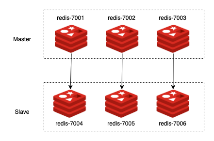

- 구성하려는 레디스 환경
  - ip:port
  - 그림
- 레디스 설정
  - redis-cluster-tmpl
  - redis-cluster-config.sh
- 실행?
- 클러스 확인하기

# 1.들어가며


도커로 레디스 클러스를 구성하는 방법에 대해서 알아보자. 



사전에 필요한 부분은 설치하고 

- 도커 설치
- 

# 2. 레디스 클러스터 구성하기


## 2.1 레디스 설정


```bash
#!/usr/bin/env bash

for port in `seq 7001 7006`; do \
  mkdir -p ./${port}/conf \
  && PORT=${port} envsubst < ./redis-cluster.tmpl > ./${port}/conf/redis.conf \
  && mkdir -p ./${port}/data; \
done

```

## 2.2 docker-compose 파일 생성하기

```yaml
version: '3.7'

services:
  redis7001:
    image: redis:6
    container_name: redis7001
    command:
      ["redis-server", "/usr/local/etc/redis/redis.conf"]
    volumes:
      - ./7001/conf/redis.conf:/usr/local/etc/redis/redis.conf
      - ./7001/script/:/usr/local/etc/redis/redis.conf
      - ./7001/data:/data
    ports:
      - "7001:7001"
      - "17001:17001"
    environment:
      # Set the time zone to Shanghai, otherwise the time will be problematic
      - TZ=Asia/Seoul
    logging:
      options:
        max-size: '100m'
        max-file: '10'

  redis7002:
    image: redis:6
    container_name: redis7002
    command:
      ["redis-server", "/usr/local/etc/redis/redis.conf"]
    volumes:
      - ./7002/conf/redis.conf:/usr/local/etc/redis/redis.conf
      - ./7002/data:/data
    ports:
      - "7002:7002"
      - "17002:17002"
    environment:
      # Set the time zone to Shanghai, otherwise the time will be problematic
      - TZ=Asia/Seoul
    logging:
      options:
        max-size: '100m'
        max-file: '10'

  redis7003:
    image: redis:6
    container_name: redis7003
    command:
      ["redis-server", "/usr/local/etc/redis/redis.conf"]
    volumes:
      - ./7003/conf/redis.conf:/usr/local/etc/redis/redis.conf
      - ./7003/data:/data
    ports:
      - "7003:7003"
      - "17003:17003"
    environment:
      # Set the time zone to Shanghai, otherwise the time will be problematic
      - TZ=Asia/Seoul
    logging:
      options:
        max-size: '100m'
        max-file: '10'

  redis7004:
    image: redis:6
    container_name: redis7004
    command:
      ["redis-server", "/usr/local/etc/redis/redis.conf"]
    volumes:
      - ./7004/conf/redis.conf:/usr/local/etc/redis/redis.conf
      - ./7004/data:/data
    ports:
      - "7004:7004"
      - "17004:17004"
    environment:
      # Set the time zone to Shanghai, otherwise the time will be problematic
      - TZ=Asia/Seoul
    logging:
      options:
        max-size: '100m'
        max-file: '10'

  redis7005:
    image: redis:6
    container_name: redis7005
    command:
      ["redis-server", "/usr/local/etc/redis/redis.conf"]
    volumes:
      - ./7005/conf/redis.conf:/usr/local/etc/redis/redis.conf
      - ./7005/data:/data
    ports:
      - "7005:7005"
      - "17005:17005"
    environment:
      # Set the time zone to Shanghai, otherwise the time will be problematic
      - TZ=Asia/Seoul
    logging:
      options:
        max-size: '100m'
        max-file: '10'

  redis7006:
    image: redis:6
    container_name: redis7006
    command:
      ["redis-server", "/usr/local/etc/redis/redis.conf"]
    volumes:
      - ./7006/conf/redis.conf:/usr/local/etc/redis/redis.conf
      - ./7006/data:/data
    ports:
      - "7006:7006"
      - "17006:17006"
    environment:
      # Set the time zone to Shanghai, otherwise the time will be problematic
      - TZ=Asia/Seoul
    logging:
      options:
        max-size: '100m'
        max-file: '10'

networks:
  app_net:
    external: true

```

## 2.3 레디스 클러스터 구동시키기

```bash
$ mkdir 7001 7002 
```


```bash
$ docker-compose -f docker-compose-cluster.yaml up
```

## 2.4 클러스터 구동 확인

- redis-cli 연결해서 set/get 확인
- Cluster stats
- cluster info
- 클러스터 shutdown 시켜도 구동 잘되는지 확인하기

 

# 4. 참고

- https://www.programmersought.com/article/78807629459/
- https://www.dltlabs.com/blog/how-to-setup-configure-a-redis-cluster-easily-573120
- https://hub.docker.com/r/bitnami/redis-cluster/
- https://www.dltlabs.com/blog/how-to-setup-configure-a-redis-cluster-easily-573120
- [https://rastalion.me/redis-8-docker%EB%A5%BC-%EC%9D%B4%EC%9A%A9%ED%95%9C-redis-cluster-%EA%B5%AC%EC%B6%95-ver-5-0-5-buster/](https://rastalion.me/redis-8-docker를-이용한-redis-cluster-구축-ver-5-0-5-buster/)
- https://github.com/Grokzen/docker-redis-cluster

