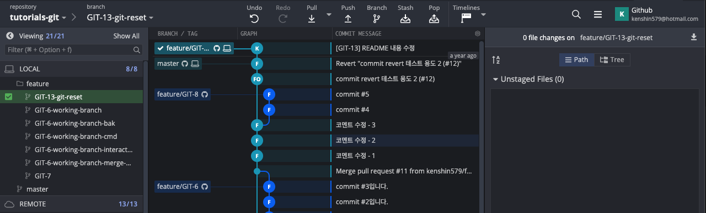
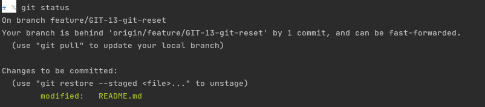
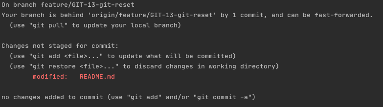
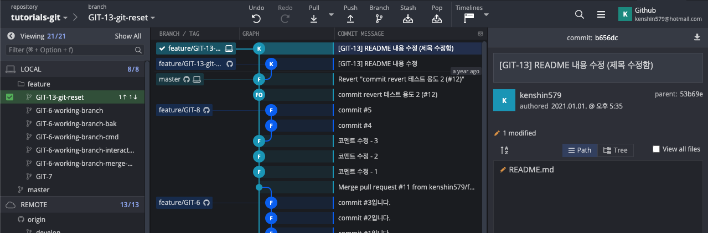
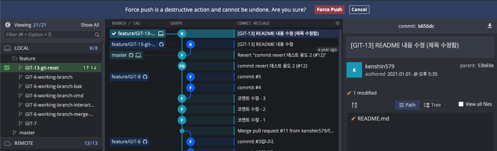
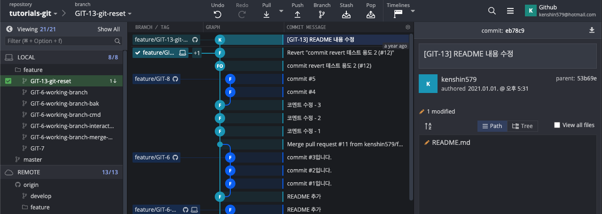
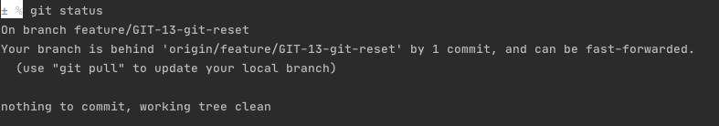

# 1.Git Reset

Git으로 작업하다보면 커밋된 이력을 다시 되돌려야 할 때가 종종 발생한다. Git Reset에서는 아래와 같이 3가지 옵션을 제공한다. 각 옵션의 차이점에 대해서 알아보자. 

## 1.1 Git Reset 종류

- soft
  - ㅗㄸㅁㅇ
  - 사용
  - 주로 branch
- mixed (기본 옵션)
  - 내가 수정한 건 남이 있음
  - staging area를 비우기까지 함
    - giit commit 뒤돌리고
    - git add 명령까지 되돌린다
- hard
  - 내가 수정한 데이터도 지워짐
  - mixed + working directory에서 작업한 내용도 다 되돌린다

### 1.1.1 용어 정리

| 용어                 | 설명                                                         |
| -------------------- | ------------------------------------------------------------ |
| HEAD                 | - 현재 브랜치를 가리키는 포인터<br />- 마지막 커밋을 가리킨다 |
| Index (Staging Area) | - Git directory에 있음<br />- 바로 커밋할 파일들이 있는 곳   |
| Working Directory    | - ??                                                         |


## 1.2 Git Reset 해보기

HEAD 기준으로 하는 방법, commit 값으로... 

```bash
$ git reset HEAD~1 # 
$ git reset c1c2239a #되돌리려는 commit 번호
```


3가지 옵션을 이해하기 위해서 간단한 시나리오

> README 파일에 "this is a test"를 입력한



### 1.2.1 Soft Reset




### 1.2.2 Mixed Reset (기본)




#### 1.2.2.1 제목 변경해서 다시 commit하기






### 1.2.3 Hard Reset





#2. 정리

본 포스팅에서 작업한 


본 포스팅에서 작성한 코드는 [github](https://github.com/kenshin579/tutorials-go/tree/master/go-enums-iota)에서 확인할 수 있다.

#3.  참고

- [https://www.devpools.kr/2017/02/05/%EC%B4%88%EB%B3%B4%EC%9A%A9-git-%EB%90%98%EB%8F%8C%EB%A6%AC%EA%B8%B0-reset-revert](https://www.devpools.kr/2017/02/05/초보용-git-되돌리기-reset-revert)/
- https://backlog.com/git-tutorial/kr/stepup/stepup6_3.html
- [https://git-scm.com/book/ko/v2/Git-%EB%8F%84%EA%B5%AC-Reset-%EB%AA%85%ED%99%95%ED%9E%88-%EC%95%8C%EA%B3%A0-%EA%B0%80%EA%B8%B0](https://git-scm.com/book/ko/v2/Git-도구-Reset-명확히-알고-가기)
- https://opentutorials.org/module/4032/24533
- https://c10106.tistory.com/3930
- https://antilog.tistory.com/33
- https://medium.com/@joongwon/git-git-%EC%9D%98-%EA%B8%B0%EC%B4%88-a7801f45091d

